# WikiGraph Path Visualizations - TRULY RANDOMIZED

Each connection between nodes uses a RANDOMLY chosen arrow position (1, 2, or 3).
Every single connection is independently randomized!

## Path 1

**5 hops**: African-American_Muslims → Ottoman_Empire → Andrea_Doria → Horizon-class_frigate → List_of_destroyers_of_Italy → Italian_destroyer_Ascaro

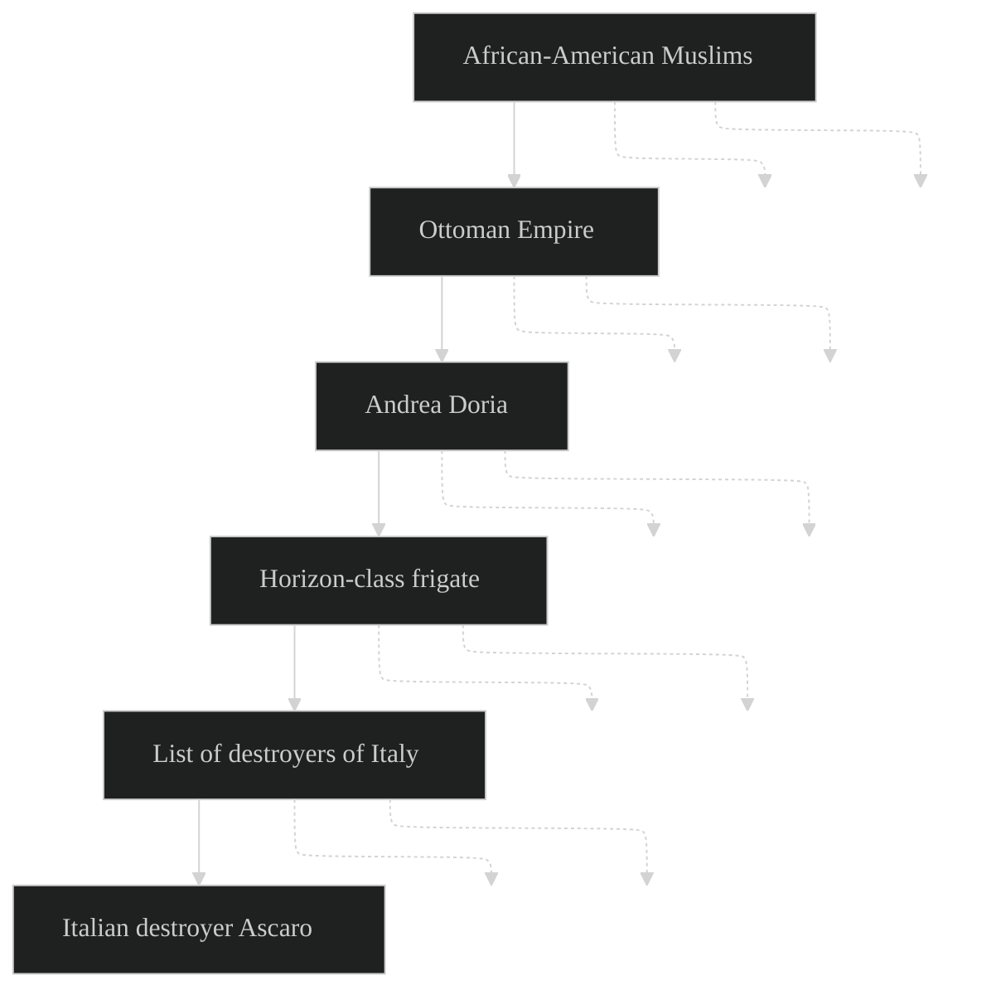
```mermaid
%%{init: {
  "theme": "dark",                             
  "flowchart": {
    "useMaxWidth": true,
    "defaultRenderer": "elk",
    "nodeSpacing": 30, "rankSpacing": 40
  },
  "themeVariables": { "fontFamily": "ui-monospace" }
}}%%
graph TD
    N0["African-American Muslims"]
    N1["Ottoman Empire"]
    N2["Andrea Doria"]
    N3["Horizon-class frigate"]
    N4["List of destroyers of Italy"]
    N5["Italian destroyer Ascaro"]
    N0 -.-> DUMMY_0_1
    N0 -.-> DUMMY_0_2
    N0 --> N1
    N1 -.-> DUMMY_1_1
    N1 --> N2
    N1 -.-> DUMMY_1_3
    N2 -.-> DUMMY_2_1
    N2 --> N3
    N2 -.-> DUMMY_2_3
    N3 -.-> DUMMY_3_1
    N3 --> N4
    N3 -.-> DUMMY_3_3
    N4 --> N5
    N4 -.-> DUMMY_4_2
    N4 -.-> DUMMY_4_3

    DUMMY_0_1[ ]
    DUMMY_0_2[ ]
    DUMMY_1_1[ ]
    DUMMY_1_3[ ]
    DUMMY_2_1[ ]
    DUMMY_2_3[ ]
    DUMMY_3_1[ ]
    DUMMY_3_3[ ]
    DUMMY_4_2[ ]
    DUMMY_4_3[ ]

    %% Make dummy nodes transparent
    style DUMMY_0_1 fill:transparent,stroke:transparent
    style DUMMY_0_2 fill:transparent,stroke:transparent
    style DUMMY_1_1 fill:transparent,stroke:transparent
    style DUMMY_1_3 fill:transparent,stroke:transparent
    style DUMMY_2_1 fill:transparent,stroke:transparent
    style DUMMY_2_3 fill:transparent,stroke:transparent
    style DUMMY_3_1 fill:transparent,stroke:transparent
    style DUMMY_3_3 fill:transparent,stroke:transparent
    style DUMMY_4_2 fill:transparent,stroke:transparent
    style DUMMY_4_3 fill:transparent,stroke:transparent
```

## Path 2

**3 hops**: T._M._Karthik → ISSN → ISO_15924 → Private_Use_Areas

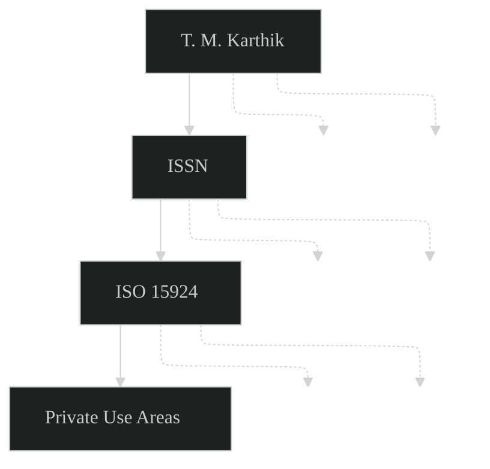
```mermaid
%%{init: {
  "theme": "dark",                             
  "flowchart": {
    "useMaxWidth": true,
    "defaultRenderer": "elk",
    "nodeSpacing": 30, "rankSpacing": 40
  },
  "themeVariables": { "fontFamily": "ui-monospace" }
}}%%
graph TD
    N0["T. M. Karthik"]
    N1["ISSN"]
    N2["ISO 15924"]
    N3["Private Use Areas"]
    N0 --> N1
    N0 -.-> DUMMY_0_2
    N0 -.-> DUMMY_0_3
    N1 -.-> DUMMY_1_1
    N1 -.-> DUMMY_1_2
    N1 --> N2
    N2 -.-> DUMMY_2_1
    N2 -.-> DUMMY_2_2
    N2 --> N3

    DUMMY_0_2[ ]
    DUMMY_0_3[ ]
    DUMMY_1_1[ ]
    DUMMY_1_2[ ]
    DUMMY_2_1[ ]
    DUMMY_2_2[ ]

    %% Make dummy nodes transparent
    style DUMMY_0_2 fill:transparent,stroke:transparent
    style DUMMY_0_3 fill:transparent,stroke:transparent
    style DUMMY_1_1 fill:transparent,stroke:transparent
    style DUMMY_1_2 fill:transparent,stroke:transparent
    style DUMMY_2_1 fill:transparent,stroke:transparent
    style DUMMY_2_2 fill:transparent,stroke:transparent
```

## Path 3

**5 hops**: Marcus_Cocceius_Anicius_Faustus_Flavianus → Roman_Empire → Argonautica → Romantic_fantasy → Catherine_Asaro_bibliography → Sunrise_Alley

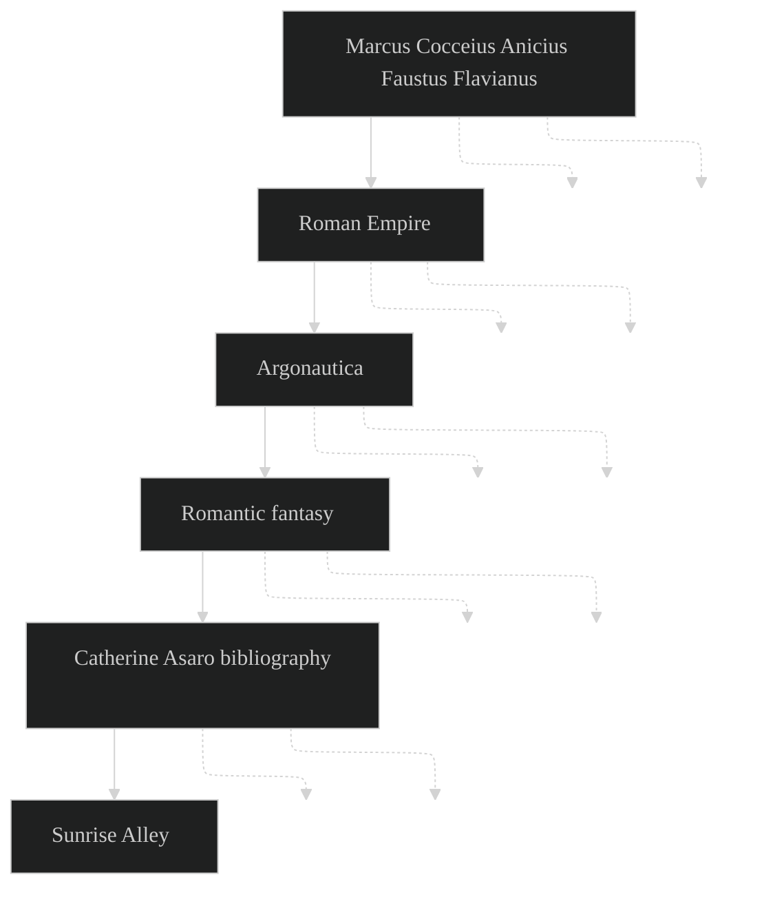
```mermaid
%%{init: {
  "theme": "dark",                             
  "flowchart": {
    "useMaxWidth": true,
    "defaultRenderer": "elk",
    "nodeSpacing": 30, "rankSpacing": 40
  },
  "themeVariables": { "fontFamily": "ui-monospace" }
}}%%
graph TD
    N0["Marcus Cocceius Anicius Faustus Flavianus"]
    N1["Roman Empire"]
    N2["Argonautica"]
    N3["Romantic fantasy"]
    N4["Catherine Asaro bibliography"]
    N5["Sunrise Alley"]
    N0 -.-> DUMMY_0_1
    N0 --> N1
    N0 -.-> DUMMY_0_3
    N1 -.-> DUMMY_1_1
    N1 --> N2
    N1 -.-> DUMMY_1_3
    N2 -.-> DUMMY_2_1
    N2 -.-> DUMMY_2_2
    N2 --> N3
    N3 --> N4
    N3 -.-> DUMMY_3_2
    N3 -.-> DUMMY_3_3
    N4 -.-> DUMMY_4_1
    N4 --> N5
    N4 -.-> DUMMY_4_3

    DUMMY_0_1[ ]
    DUMMY_0_3[ ]
    DUMMY_1_1[ ]
    DUMMY_1_3[ ]
    DUMMY_2_1[ ]
    DUMMY_2_2[ ]
    DUMMY_3_2[ ]
    DUMMY_3_3[ ]
    DUMMY_4_1[ ]
    DUMMY_4_3[ ]

    %% Make dummy nodes transparent
    style DUMMY_0_1 fill:transparent,stroke:transparent
    style DUMMY_0_3 fill:transparent,stroke:transparent
    style DUMMY_1_1 fill:transparent,stroke:transparent
    style DUMMY_1_3 fill:transparent,stroke:transparent
    style DUMMY_2_1 fill:transparent,stroke:transparent
    style DUMMY_2_2 fill:transparent,stroke:transparent
    style DUMMY_3_2 fill:transparent,stroke:transparent
    style DUMMY_3_3 fill:transparent,stroke:transparent
    style DUMMY_4_1 fill:transparent,stroke:transparent
    style DUMMY_4_3 fill:transparent,stroke:transparent
```

## Path 4

**6 hops**: Mycena_aetites → Fungus → Tropical_cyclone → List_of_historical_tropical_cyclone_names → List_of_named_storms → List_of_named_storms_(C) → List_of_storms_named_Colleen

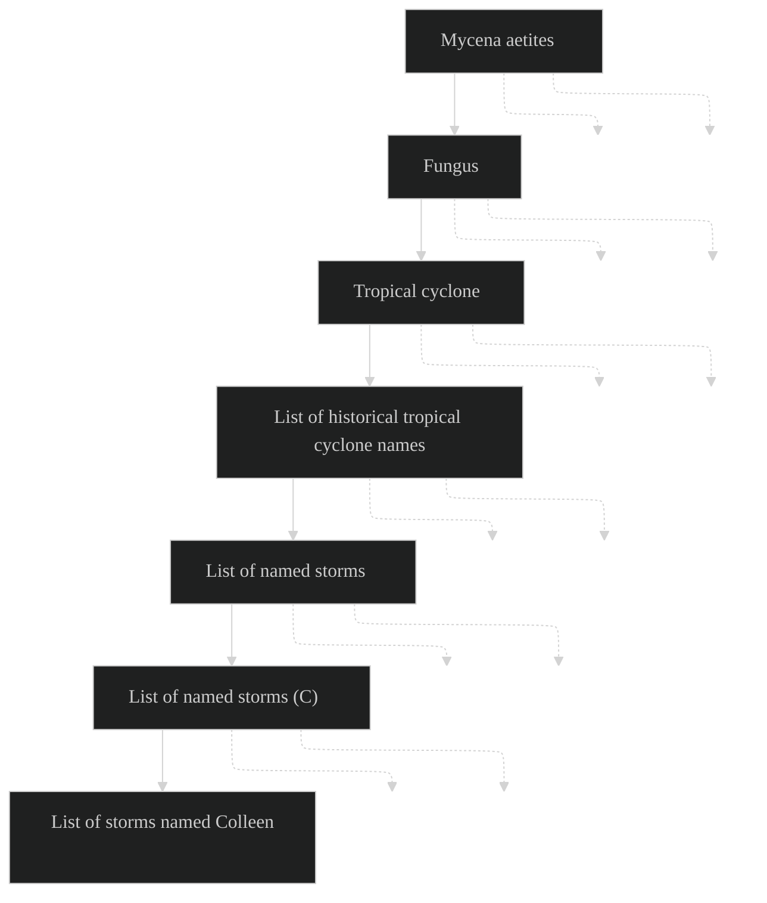
```mermaid
%%{init: {
  "theme": "dark",                             
  "flowchart": {
    "useMaxWidth": true,
    "defaultRenderer": "elk",
    "nodeSpacing": 30, "rankSpacing": 40
  },
  "themeVariables": { "fontFamily": "ui-monospace" }
}}%%
graph TD
    N0["Mycena aetites"]
    N1["Fungus"]
    N2["Tropical cyclone"]
    N3["List of historical tropical cyclone names"]
    N4["List of named storms"]
    N5["List of named storms (C)"]
    N6["List of storms named Colleen"]
    N0 -.-> DUMMY_0_1
    N0 -.-> DUMMY_0_2
    N0 --> N1
    N1 -.-> DUMMY_1_1
    N1 -.-> DUMMY_1_2
    N1 --> N2
    N2 --> N3
    N2 -.-> DUMMY_2_2
    N2 -.-> DUMMY_2_3
    N3 -.-> DUMMY_3_1
    N3 --> N4
    N3 -.-> DUMMY_3_3
    N4 -.-> DUMMY_4_1
    N4 --> N5
    N4 -.-> DUMMY_4_3
    N5 -.-> DUMMY_5_1
    N5 --> N6
    N5 -.-> DUMMY_5_3

    DUMMY_0_1[ ]
    DUMMY_0_2[ ]
    DUMMY_1_1[ ]
    DUMMY_1_2[ ]
    DUMMY_2_2[ ]
    DUMMY_2_3[ ]
    DUMMY_3_1[ ]
    DUMMY_3_3[ ]
    DUMMY_4_1[ ]
    DUMMY_4_3[ ]
    DUMMY_5_1[ ]
    DUMMY_5_3[ ]

    %% Make dummy nodes transparent
    style DUMMY_0_1 fill:transparent,stroke:transparent
    style DUMMY_0_2 fill:transparent,stroke:transparent
    style DUMMY_1_1 fill:transparent,stroke:transparent
    style DUMMY_1_2 fill:transparent,stroke:transparent
    style DUMMY_2_2 fill:transparent,stroke:transparent
    style DUMMY_2_3 fill:transparent,stroke:transparent
    style DUMMY_3_1 fill:transparent,stroke:transparent
    style DUMMY_3_3 fill:transparent,stroke:transparent
    style DUMMY_4_1 fill:transparent,stroke:transparent
    style DUMMY_4_3 fill:transparent,stroke:transparent
    style DUMMY_5_1 fill:transparent,stroke:transparent
    style DUMMY_5_3 fill:transparent,stroke:transparent
```

## Path 5

**3 hops**: Dissolution_of_the_Holy_Roman_Empire → Apocalyptic_literature → Books_of_Kings → Zedekiah

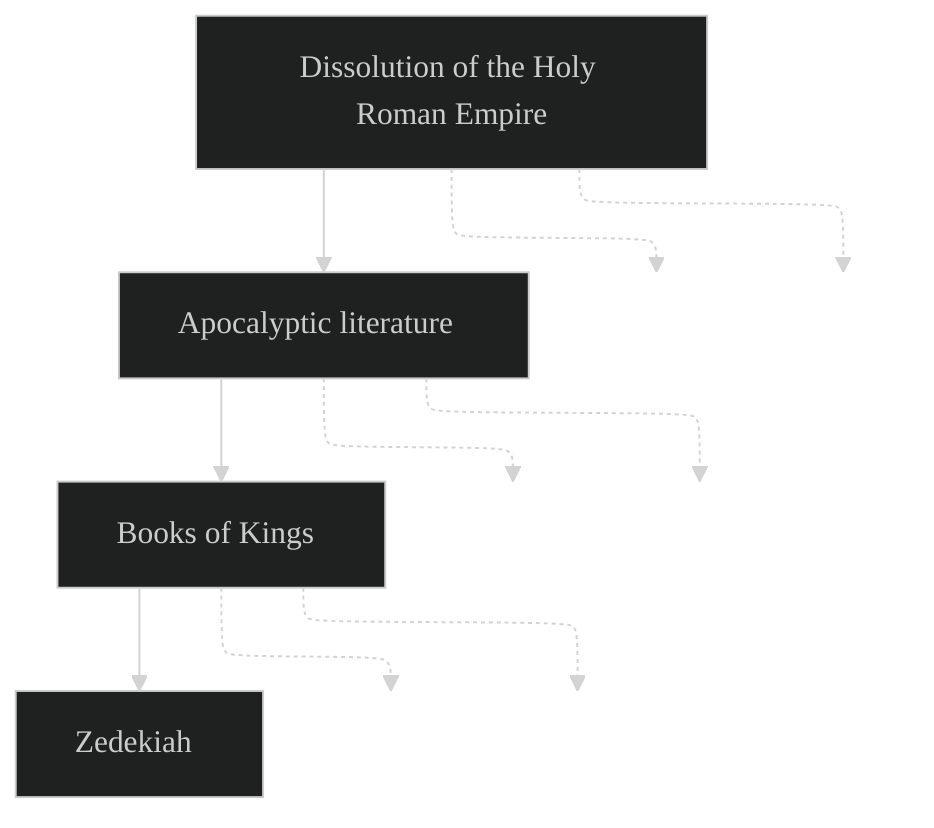
```mermaid
%%{init: {
  "theme": "dark",                             
  "flowchart": {
    "useMaxWidth": true,
    "defaultRenderer": "elk",
    "nodeSpacing": 30, "rankSpacing": 40
  },
  "themeVariables": { "fontFamily": "ui-monospace" }
}}%%
graph TD
    N0["Dissolution of the Holy Roman Empire"]
    N1["Apocalyptic literature"]
    N2["Books of Kings"]
    N3["Zedekiah"]
    N0 --> N1
    N0 -.-> DUMMY_0_2
    N0 -.-> DUMMY_0_3
    N1 -.-> DUMMY_1_1
    N1 --> N2
    N1 -.-> DUMMY_1_3
    N2 -.-> DUMMY_2_1
    N2 --> N3
    N2 -.-> DUMMY_2_3

    DUMMY_0_2[ ]
    DUMMY_0_3[ ]
    DUMMY_1_1[ ]
    DUMMY_1_3[ ]
    DUMMY_2_1[ ]
    DUMMY_2_3[ ]

    %% Make dummy nodes transparent
    style DUMMY_0_2 fill:transparent,stroke:transparent
    style DUMMY_0_3 fill:transparent,stroke:transparent
    style DUMMY_1_1 fill:transparent,stroke:transparent
    style DUMMY_1_3 fill:transparent,stroke:transparent
    style DUMMY_2_1 fill:transparent,stroke:transparent
    style DUMMY_2_3 fill:transparent,stroke:transparent
```

## Path 6

**3 hops**: Diane_Eshin_Rizzetto → Ensō → Lolita_fashion → Dark_wave

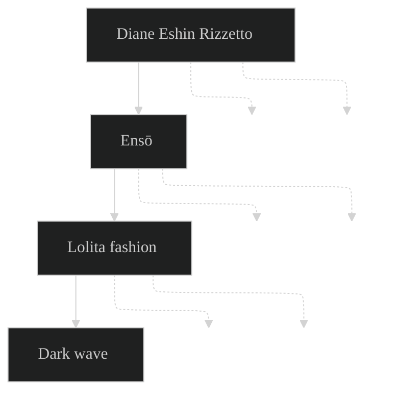
```mermaid
%%{init: {
  "theme": "dark",                             
  "flowchart": {
    "useMaxWidth": true,
    "defaultRenderer": "elk",
    "nodeSpacing": 30, "rankSpacing": 40
  },
  "themeVariables": { "fontFamily": "ui-monospace" }
}}%%
graph TD
    N0["Diane Eshin Rizzetto"]
    N1["Ensō"]
    N2["Lolita fashion"]
    N3["Dark wave"]
    N0 -.-> DUMMY_0_1
    N0 -.-> DUMMY_0_2
    N0 --> N1
    N1 -.-> DUMMY_1_1
    N1 -.-> DUMMY_1_2
    N1 --> N2
    N2 --> N3
    N2 -.-> DUMMY_2_2
    N2 -.-> DUMMY_2_3

    DUMMY_0_1[ ]
    DUMMY_0_2[ ]
    DUMMY_1_1[ ]
    DUMMY_1_2[ ]
    DUMMY_2_2[ ]
    DUMMY_2_3[ ]

    %% Make dummy nodes transparent
    style DUMMY_0_1 fill:transparent,stroke:transparent
    style DUMMY_0_2 fill:transparent,stroke:transparent
    style DUMMY_1_1 fill:transparent,stroke:transparent
    style DUMMY_1_2 fill:transparent,stroke:transparent
    style DUMMY_2_2 fill:transparent,stroke:transparent
    style DUMMY_2_3 fill:transparent,stroke:transparent
```

## Path 7

**3 hops**: Carlos_Varela_(wrestler) → Atlanta → Cartoon_Network → Primal_(TV_series)

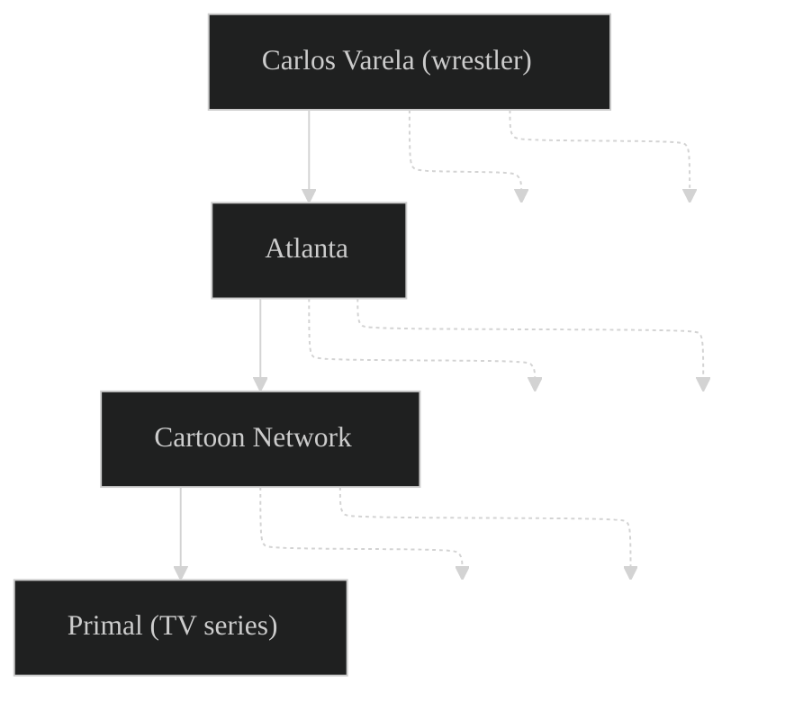
```mermaid
%%{init: {
  "theme": "dark",                             
  "flowchart": {
    "useMaxWidth": true,
    "defaultRenderer": "elk",
    "nodeSpacing": 30, "rankSpacing": 40
  },
  "themeVariables": { "fontFamily": "ui-monospace" }
}}%%
graph TD
    N0["Carlos Varela (wrestler)"]
    N1["Atlanta"]
    N2["Cartoon Network"]
    N3["Primal (TV series)"]
    N0 -.-> DUMMY_0_1
    N0 -.-> DUMMY_0_2
    N0 --> N1
    N1 -.-> DUMMY_1_1
    N1 -.-> DUMMY_1_2
    N1 --> N2
    N2 -.-> DUMMY_2_1
    N2 --> N3
    N2 -.-> DUMMY_2_3

    DUMMY_0_1[ ]
    DUMMY_0_2[ ]
    DUMMY_1_1[ ]
    DUMMY_1_2[ ]
    DUMMY_2_1[ ]
    DUMMY_2_3[ ]

    %% Make dummy nodes transparent
    style DUMMY_0_1 fill:transparent,stroke:transparent
    style DUMMY_0_2 fill:transparent,stroke:transparent
    style DUMMY_1_1 fill:transparent,stroke:transparent
    style DUMMY_1_2 fill:transparent,stroke:transparent
    style DUMMY_2_1 fill:transparent,stroke:transparent
    style DUMMY_2_3 fill:transparent,stroke:transparent
```

## Path 8

**4 hops**: Payment_Card_Industry_Data_Security_Standard → United_States → List_of_cities_by_GDP → Offenburg → Dirk_von_Lowtzow

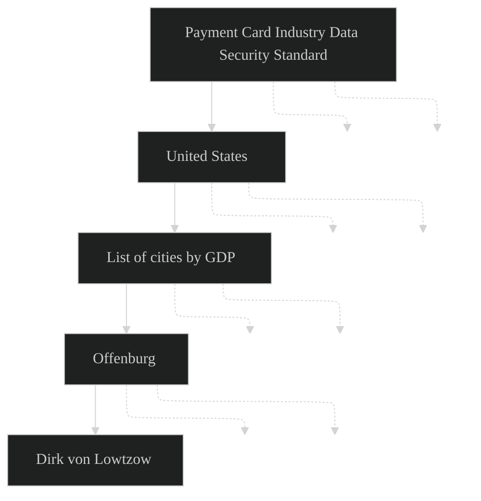
```mermaid
%%{init: {
  "theme": "dark",                             
  "flowchart": {
    "useMaxWidth": true,
    "defaultRenderer": "elk",
    "nodeSpacing": 30, "rankSpacing": 40
  },
  "themeVariables": { "fontFamily": "ui-monospace" }
}}%%
graph TD
    N0["Payment Card Industry Data Security Standard"]
    N1["United States"]
    N2["List of cities by GDP"]
    N3["Offenburg"]
    N4["Dirk von Lowtzow"]
    N0 -.-> DUMMY_0_1
    N0 --> N1
    N0 -.-> DUMMY_0_3
    N1 --> N2
    N1 -.-> DUMMY_1_2
    N1 -.-> DUMMY_1_3
    N2 --> N3
    N2 -.-> DUMMY_2_2
    N2 -.-> DUMMY_2_3
    N3 -.-> DUMMY_3_1
    N3 --> N4
    N3 -.-> DUMMY_3_3

    DUMMY_0_1[ ]
    DUMMY_0_3[ ]
    DUMMY_1_2[ ]
    DUMMY_1_3[ ]
    DUMMY_2_2[ ]
    DUMMY_2_3[ ]
    DUMMY_3_1[ ]
    DUMMY_3_3[ ]

    %% Make dummy nodes transparent
    style DUMMY_0_1 fill:transparent,stroke:transparent
    style DUMMY_0_3 fill:transparent,stroke:transparent
    style DUMMY_1_2 fill:transparent,stroke:transparent
    style DUMMY_1_3 fill:transparent,stroke:transparent
    style DUMMY_2_2 fill:transparent,stroke:transparent
    style DUMMY_2_3 fill:transparent,stroke:transparent
    style DUMMY_3_1 fill:transparent,stroke:transparent
    style DUMMY_3_3 fill:transparent,stroke:transparent
```

## Path 9

**4 hops**: Most_of_Me → 2011_in_literature → April_17 → Mazandaran_province → Mohammad_Salih_al-Mazandarani

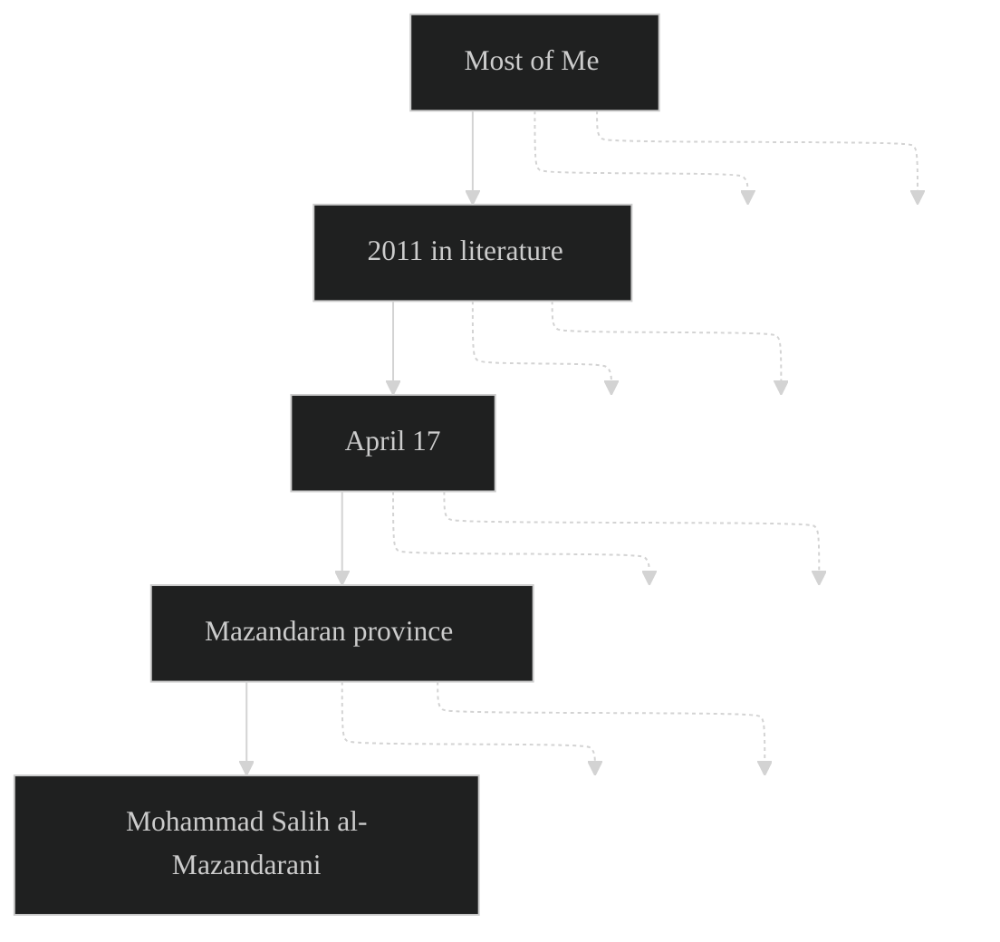
```mermaid
%%{init: {
  "theme": "dark",                             
  "flowchart": {
    "useMaxWidth": true,
    "defaultRenderer": "elk",
    "nodeSpacing": 30, "rankSpacing": 40
  },
  "themeVariables": { "fontFamily": "ui-monospace" }
}}%%
graph TD
    N0["Most of Me"]
    N1["2011 in literature"]
    N2["April 17"]
    N3["Mazandaran province"]
    N4["Mohammad Salih al-Mazandarani"]
    N0 -.-> DUMMY_0_1
    N0 -.-> DUMMY_0_2
    N0 --> N1
    N1 -.-> DUMMY_1_1
    N1 -.-> DUMMY_1_2
    N1 --> N2
    N2 -.-> DUMMY_2_1
    N2 --> N3
    N2 -.-> DUMMY_2_3
    N3 -.-> DUMMY_3_1
    N3 --> N4
    N3 -.-> DUMMY_3_3

    DUMMY_0_1[ ]
    DUMMY_0_2[ ]
    DUMMY_1_1[ ]
    DUMMY_1_2[ ]
    DUMMY_2_1[ ]
    DUMMY_2_3[ ]
    DUMMY_3_1[ ]
    DUMMY_3_3[ ]

    %% Make dummy nodes transparent
    style DUMMY_0_1 fill:transparent,stroke:transparent
    style DUMMY_0_2 fill:transparent,stroke:transparent
    style DUMMY_1_1 fill:transparent,stroke:transparent
    style DUMMY_1_2 fill:transparent,stroke:transparent
    style DUMMY_2_1 fill:transparent,stroke:transparent
    style DUMMY_2_3 fill:transparent,stroke:transparent
    style DUMMY_3_1 fill:transparent,stroke:transparent
    style DUMMY_3_3 fill:transparent,stroke:transparent
```

## Path 10

**5 hops**: People's_Planning_in_Kerala → Constitution_of_India → George_Robinson,_1st_Marquess_of_Ripon → North_Yorkshire → Embsay_and_Bolton_Abbey_Steam_Railway → Grassington_&_Threshfield_railway_station

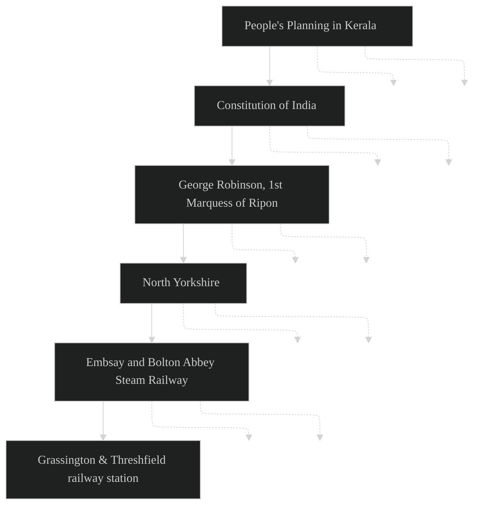
```mermaid
%%{init: {
  "theme": "dark",                             
  "flowchart": {
    "useMaxWidth": true,
    "defaultRenderer": "elk",
    "nodeSpacing": 30, "rankSpacing": 40
  },
  "themeVariables": { "fontFamily": "ui-monospace" }
}}%%
graph TD
    N0["People's Planning in Kerala"]
    N1["Constitution of India"]
    N2["George Robinson, 1st Marquess of Ripon"]
    N3["North Yorkshire"]
    N4["Embsay and Bolton Abbey Steam Railway"]
    N5["Grassington & Threshfield railway station"]
    N0 --> N1
    N0 -.-> DUMMY_0_2
    N0 -.-> DUMMY_0_3
    N1 --> N2
    N1 -.-> DUMMY_1_2
    N1 -.-> DUMMY_1_3
    N2 -.-> DUMMY_2_1
    N2 -.-> DUMMY_2_2
    N2 --> N3
    N3 -.-> DUMMY_3_1
    N3 -.-> DUMMY_3_2
    N3 --> N4
    N4 -.-> DUMMY_4_1
    N4 --> N5
    N4 -.-> DUMMY_4_3

    DUMMY_0_2[ ]
    DUMMY_0_3[ ]
    DUMMY_1_2[ ]
    DUMMY_1_3[ ]
    DUMMY_2_1[ ]
    DUMMY_2_2[ ]
    DUMMY_3_1[ ]
    DUMMY_3_2[ ]
    DUMMY_4_1[ ]
    DUMMY_4_3[ ]

    %% Make dummy nodes transparent
    style DUMMY_0_2 fill:transparent,stroke:transparent
    style DUMMY_0_3 fill:transparent,stroke:transparent
    style DUMMY_1_2 fill:transparent,stroke:transparent
    style DUMMY_1_3 fill:transparent,stroke:transparent
    style DUMMY_2_1 fill:transparent,stroke:transparent
    style DUMMY_2_2 fill:transparent,stroke:transparent
    style DUMMY_3_1 fill:transparent,stroke:transparent
    style DUMMY_3_2 fill:transparent,stroke:transparent
    style DUMMY_4_1 fill:transparent,stroke:transparent
    style DUMMY_4_3 fill:transparent,stroke:transparent
```

## Path 11

**4 hops**: Hardik_Abhinandan → Gujarati_language → Manchester → Burnley → Guy_Fawkes_Night

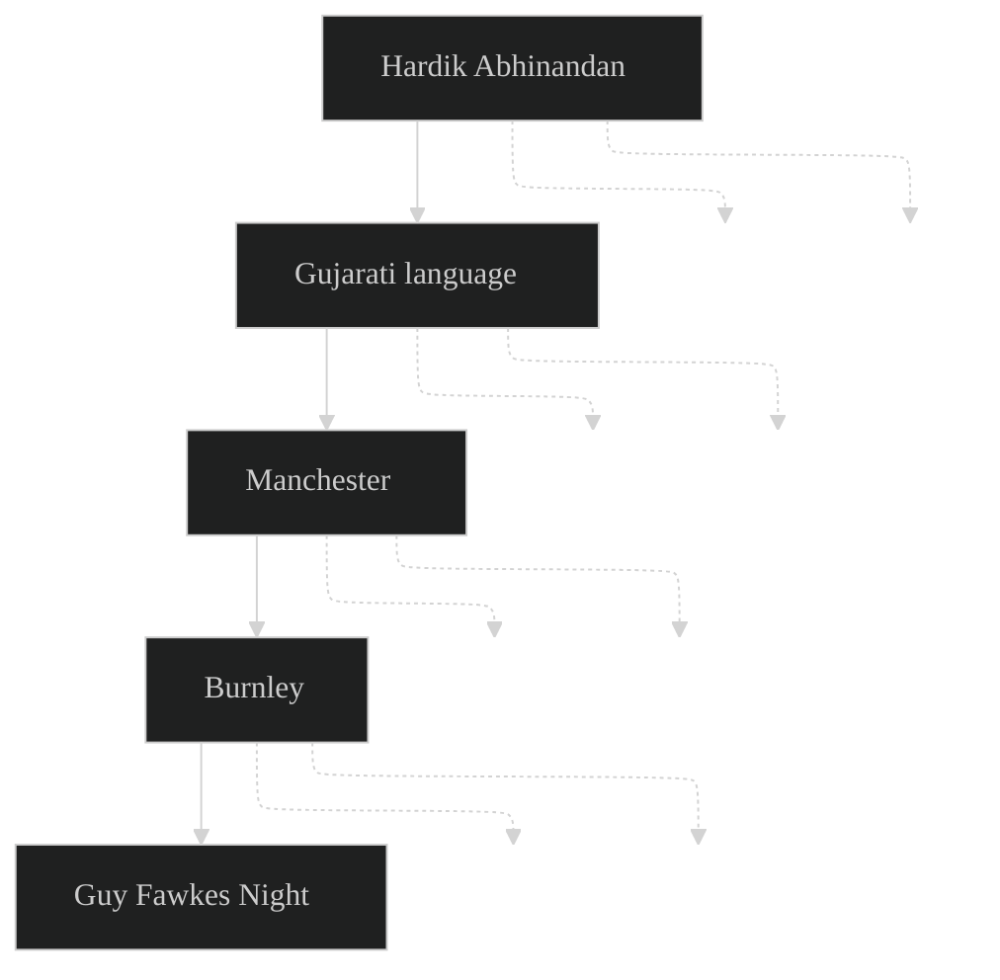
```mermaid
%%{init: {
  "theme": "dark",                             
  "flowchart": {
    "useMaxWidth": true,
    "defaultRenderer": "elk",
    "nodeSpacing": 30, "rankSpacing": 40
  },
  "themeVariables": { "fontFamily": "ui-monospace" }
}}%%
graph TD
    N0["Hardik Abhinandan"]
    N1["Gujarati language"]
    N2["Manchester"]
    N3["Burnley"]
    N4["Guy Fawkes Night"]
    N0 -.-> DUMMY_0_1
    N0 -.-> DUMMY_0_2
    N0 --> N1
    N1 -.-> DUMMY_1_1
    N1 -.-> DUMMY_1_2
    N1 --> N2
    N2 --> N3
    N2 -.-> DUMMY_2_2
    N2 -.-> DUMMY_2_3
    N3 -.-> DUMMY_3_1
    N3 --> N4
    N3 -.-> DUMMY_3_3

    DUMMY_0_1[ ]
    DUMMY_0_2[ ]
    DUMMY_1_1[ ]
    DUMMY_1_2[ ]
    DUMMY_2_2[ ]
    DUMMY_2_3[ ]
    DUMMY_3_1[ ]
    DUMMY_3_3[ ]

    %% Make dummy nodes transparent
    style DUMMY_0_1 fill:transparent,stroke:transparent
    style DUMMY_0_2 fill:transparent,stroke:transparent
    style DUMMY_1_1 fill:transparent,stroke:transparent
    style DUMMY_1_2 fill:transparent,stroke:transparent
    style DUMMY_2_2 fill:transparent,stroke:transparent
    style DUMMY_2_3 fill:transparent,stroke:transparent
    style DUMMY_3_1 fill:transparent,stroke:transparent
    style DUMMY_3_3 fill:transparent,stroke:transparent
```

## Path 12

**3 hops**: Masoud_Keshmiri → Iranian_peoples → Yazidism → Religion_in_the_Netherlands

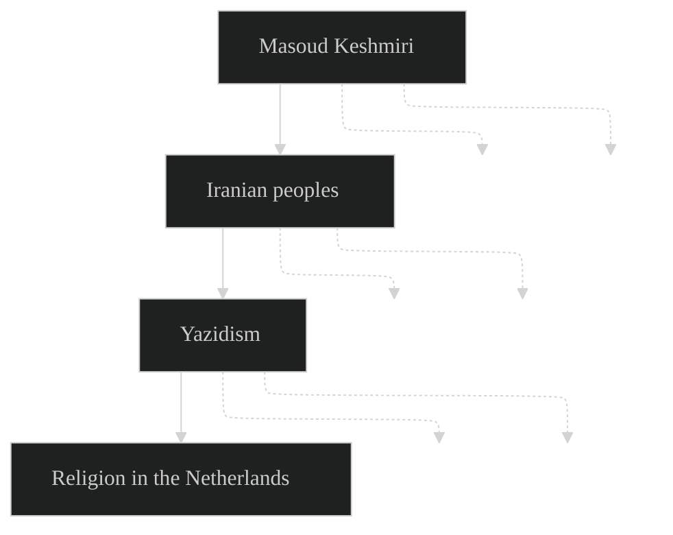
```mermaid
%%{init: {
  "theme": "dark",                             
  "flowchart": {
    "useMaxWidth": true,
    "defaultRenderer": "elk",
    "nodeSpacing": 30, "rankSpacing": 40
  },
  "themeVariables": { "fontFamily": "ui-monospace" }
}}%%
graph TD
    N0["Masoud Keshmiri"]
    N1["Iranian peoples"]
    N2["Yazidism"]
    N3["Religion in the Netherlands"]
    N0 -.-> DUMMY_0_1
    N0 -.-> DUMMY_0_2
    N0 --> N1
    N1 --> N2
    N1 -.-> DUMMY_1_2
    N1 -.-> DUMMY_1_3
    N2 --> N3
    N2 -.-> DUMMY_2_2
    N2 -.-> DUMMY_2_3

    DUMMY_0_1[ ]
    DUMMY_0_2[ ]
    DUMMY_1_2[ ]
    DUMMY_1_3[ ]
    DUMMY_2_2[ ]
    DUMMY_2_3[ ]

    %% Make dummy nodes transparent
    style DUMMY_0_1 fill:transparent,stroke:transparent
    style DUMMY_0_2 fill:transparent,stroke:transparent
    style DUMMY_1_2 fill:transparent,stroke:transparent
    style DUMMY_1_3 fill:transparent,stroke:transparent
    style DUMMY_2_2 fill:transparent,stroke:transparent
    style DUMMY_2_3 fill:transparent,stroke:transparent
```

## Path 13

**4 hops**: Mária_Gulácsy → Hungary → Unincorporated_area → Karlskrona → Juan_Flaco

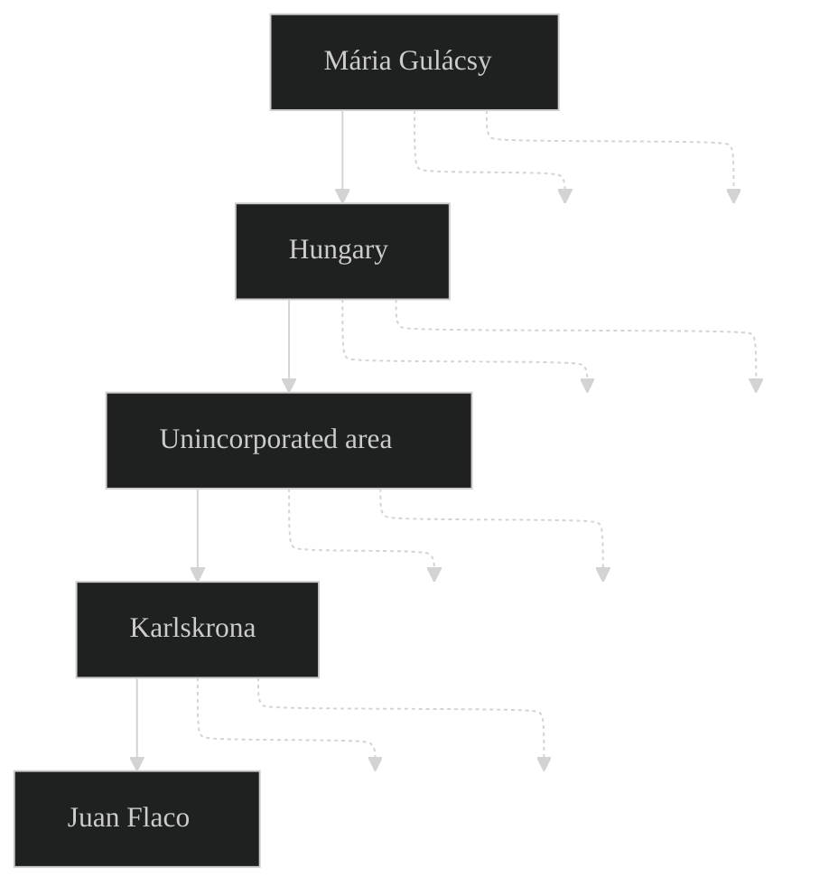
```mermaid
%%{init: {
  "theme": "dark",                             
  "flowchart": {
    "useMaxWidth": true,
    "defaultRenderer": "elk",
    "nodeSpacing": 30, "rankSpacing": 40
  },
  "themeVariables": { "fontFamily": "ui-monospace" }
}}%%
graph TD
    N0["Mária Gulácsy"]
    N1["Hungary"]
    N2["Unincorporated area"]
    N3["Karlskrona"]
    N4["Juan Flaco"]
    N0 --> N1
    N0 -.-> DUMMY_0_2
    N0 -.-> DUMMY_0_3
    N1 -.-> DUMMY_1_1
    N1 --> N2
    N1 -.-> DUMMY_1_3
    N2 -.-> DUMMY_2_1
    N2 -.-> DUMMY_2_2
    N2 --> N3
    N3 --> N4
    N3 -.-> DUMMY_3_2
    N3 -.-> DUMMY_3_3

    DUMMY_0_2[ ]
    DUMMY_0_3[ ]
    DUMMY_1_1[ ]
    DUMMY_1_3[ ]
    DUMMY_2_1[ ]
    DUMMY_2_2[ ]
    DUMMY_3_2[ ]
    DUMMY_3_3[ ]

    %% Make dummy nodes transparent
    style DUMMY_0_2 fill:transparent,stroke:transparent
    style DUMMY_0_3 fill:transparent,stroke:transparent
    style DUMMY_1_1 fill:transparent,stroke:transparent
    style DUMMY_1_3 fill:transparent,stroke:transparent
    style DUMMY_2_1 fill:transparent,stroke:transparent
    style DUMMY_2_2 fill:transparent,stroke:transparent
    style DUMMY_3_2 fill:transparent,stroke:transparent
    style DUMMY_3_3 fill:transparent,stroke:transparent
```

## Path 14

**5 hops**: Odense_Boldklub → Scotland → Manx_language → Patrick_(given_name) → Patrizio → Patrizio_Di_Renzo

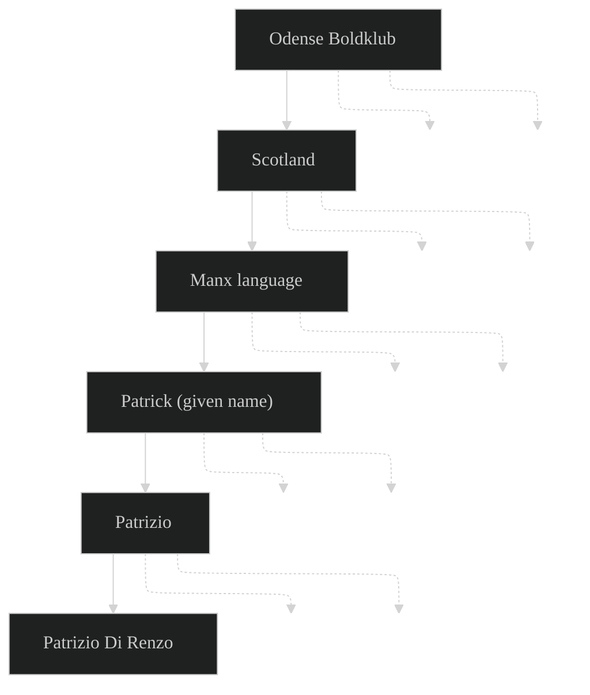
```mermaid
%%{init: {
  "theme": "dark",                             
  "flowchart": {
    "useMaxWidth": true,
    "defaultRenderer": "elk",
    "nodeSpacing": 30, "rankSpacing": 40
  },
  "themeVariables": { "fontFamily": "ui-monospace" }
}}%%
graph TD
    N0["Odense Boldklub"]
    N1["Scotland"]
    N2["Manx language"]
    N3["Patrick (given name)"]
    N4["Patrizio"]
    N5["Patrizio Di Renzo"]
    N0 -.-> DUMMY_0_1
    N0 --> N1
    N0 -.-> DUMMY_0_3
    N1 --> N2
    N1 -.-> DUMMY_1_2
    N1 -.-> DUMMY_1_3
    N2 -.-> DUMMY_2_1
    N2 -.-> DUMMY_2_2
    N2 --> N3
    N3 -.-> DUMMY_3_1
    N3 -.-> DUMMY_3_2
    N3 --> N4
    N4 --> N5
    N4 -.-> DUMMY_4_2
    N4 -.-> DUMMY_4_3

    DUMMY_0_1[ ]
    DUMMY_0_3[ ]
    DUMMY_1_2[ ]
    DUMMY_1_3[ ]
    DUMMY_2_1[ ]
    DUMMY_2_2[ ]
    DUMMY_3_1[ ]
    DUMMY_3_2[ ]
    DUMMY_4_2[ ]
    DUMMY_4_3[ ]

    %% Make dummy nodes transparent
    style DUMMY_0_1 fill:transparent,stroke:transparent
    style DUMMY_0_3 fill:transparent,stroke:transparent
    style DUMMY_1_2 fill:transparent,stroke:transparent
    style DUMMY_1_3 fill:transparent,stroke:transparent
    style DUMMY_2_1 fill:transparent,stroke:transparent
    style DUMMY_2_2 fill:transparent,stroke:transparent
    style DUMMY_3_1 fill:transparent,stroke:transparent
    style DUMMY_3_2 fill:transparent,stroke:transparent
    style DUMMY_4_2 fill:transparent,stroke:transparent
    style DUMMY_4_3 fill:transparent,stroke:transparent
```

## Path 15

**3 hops**: Avenue_Bar_shooting → Workers'_Party_(Ireland) → Eastern_Bloc → Great_Construction_Projects_of_Communism

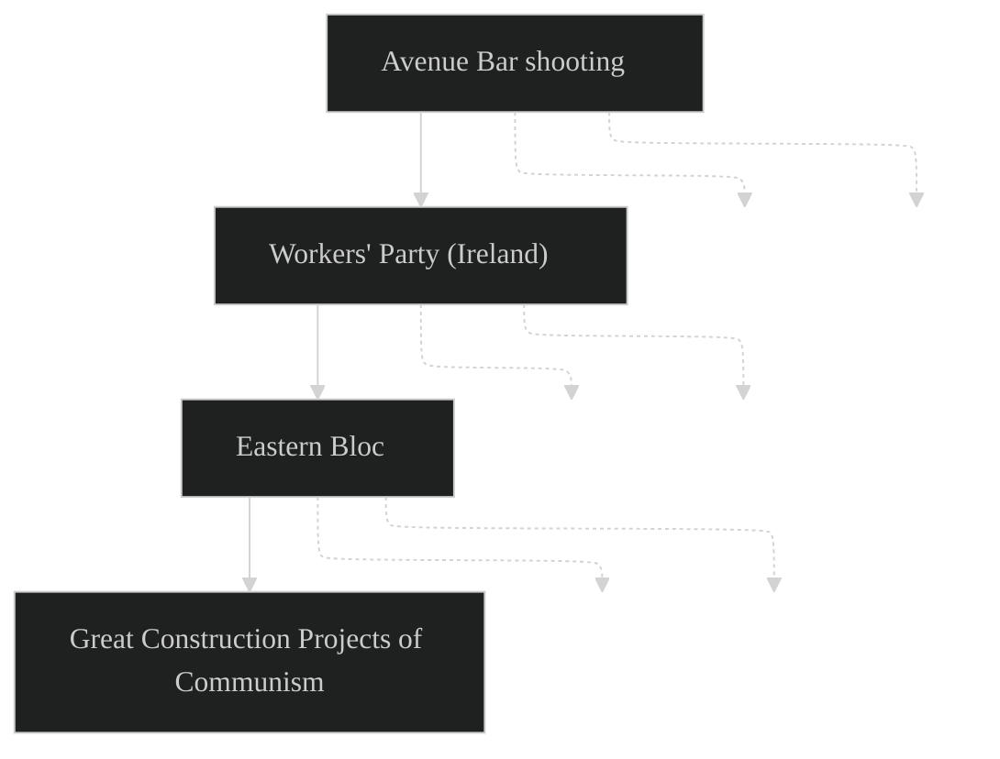
```mermaid
%%{init: {
  "theme": "dark",                             
  "flowchart": {
    "useMaxWidth": true,
    "defaultRenderer": "elk",
    "nodeSpacing": 30, "rankSpacing": 40
  },
  "themeVariables": { "fontFamily": "ui-monospace" }
}}%%
graph TD
    N0["Avenue Bar shooting"]
    N1["Workers' Party (Ireland)"]
    N2["Eastern Bloc"]
    N3["Great Construction Projects of Communism"]
    N0 --> N1
    N0 -.-> DUMMY_0_2
    N0 -.-> DUMMY_0_3
    N1 -.-> DUMMY_1_1
    N1 --> N2
    N1 -.-> DUMMY_1_3
    N2 -.-> DUMMY_2_1
    N2 -.-> DUMMY_2_2
    N2 --> N3

    DUMMY_0_2[ ]
    DUMMY_0_3[ ]
    DUMMY_1_1[ ]
    DUMMY_1_3[ ]
    DUMMY_2_1[ ]
    DUMMY_2_2[ ]

    %% Make dummy nodes transparent
    style DUMMY_0_2 fill:transparent,stroke:transparent
    style DUMMY_0_3 fill:transparent,stroke:transparent
    style DUMMY_1_1 fill:transparent,stroke:transparent
    style DUMMY_1_3 fill:transparent,stroke:transparent
    style DUMMY_2_1 fill:transparent,stroke:transparent
    style DUMMY_2_2 fill:transparent,stroke:transparent
```

## Path 16

**3 hops**: Turkish_lira → Sultanate_of_Rum → Uzbek_language → Khorazm_Region

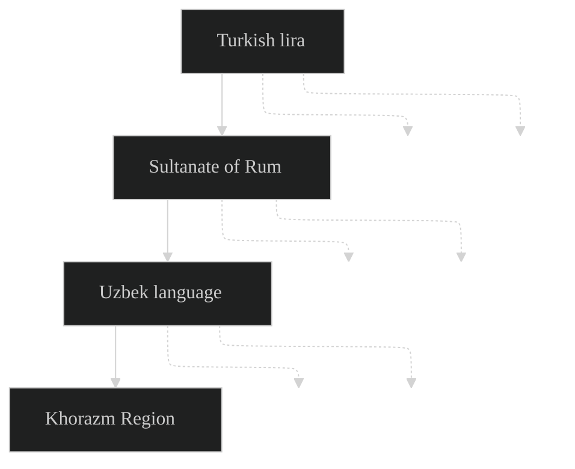
```mermaid
%%{init: {
  "theme": "dark",                             
  "flowchart": {
    "useMaxWidth": true,
    "defaultRenderer": "elk",
    "nodeSpacing": 30, "rankSpacing": 40
  },
  "themeVariables": { "fontFamily": "ui-monospace" }
}}%%
graph TD
    N0["Turkish lira"]
    N1["Sultanate of Rum"]
    N2["Uzbek language"]
    N3["Khorazm Region"]
    N0 -.-> DUMMY_0_1
    N0 -.-> DUMMY_0_2
    N0 --> N1
    N1 -.-> DUMMY_1_1
    N1 -.-> DUMMY_1_2
    N1 --> N2
    N2 -.-> DUMMY_2_1
    N2 -.-> DUMMY_2_2
    N2 --> N3

    DUMMY_0_1[ ]
    DUMMY_0_2[ ]
    DUMMY_1_1[ ]
    DUMMY_1_2[ ]
    DUMMY_2_1[ ]
    DUMMY_2_2[ ]

    %% Make dummy nodes transparent
    style DUMMY_0_1 fill:transparent,stroke:transparent
    style DUMMY_0_2 fill:transparent,stroke:transparent
    style DUMMY_1_1 fill:transparent,stroke:transparent
    style DUMMY_1_2 fill:transparent,stroke:transparent
    style DUMMY_2_1 fill:transparent,stroke:transparent
    style DUMMY_2_2 fill:transparent,stroke:transparent
```

## Path 17

**4 hops**: Visual_arts_in_Israel → Neo_Geo → Sega → Sports_Interactive → Football_Manager_2014

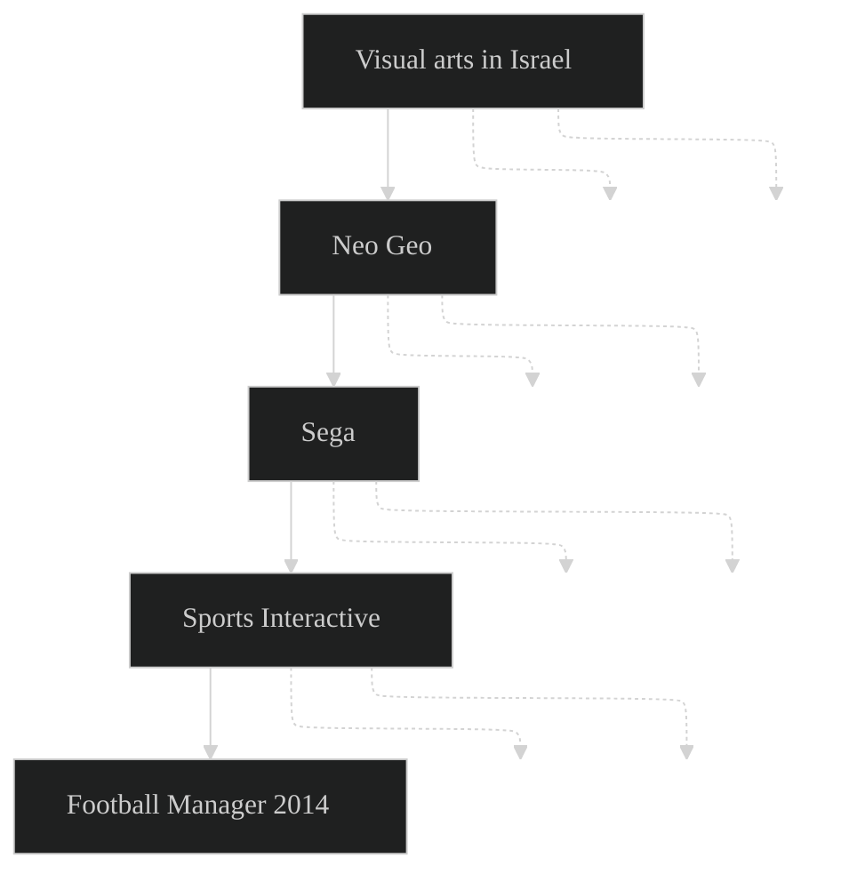
```mermaid
%%{init: {
  "theme": "dark",                             
  "flowchart": {
    "useMaxWidth": true,
    "defaultRenderer": "elk",
    "nodeSpacing": 30, "rankSpacing": 40
  },
  "themeVariables": { "fontFamily": "ui-monospace" }
}}%%
graph TD
    N0["Visual arts in Israel"]
    N1["Neo Geo"]
    N2["Sega"]
    N3["Sports Interactive"]
    N4["Football Manager 2014"]
    N0 -.-> DUMMY_0_1
    N0 --> N1
    N0 -.-> DUMMY_0_3
    N1 -.-> DUMMY_1_1
    N1 -.-> DUMMY_1_2
    N1 --> N2
    N2 --> N3
    N2 -.-> DUMMY_2_2
    N2 -.-> DUMMY_2_3
    N3 --> N4
    N3 -.-> DUMMY_3_2
    N3 -.-> DUMMY_3_3

    DUMMY_0_1[ ]
    DUMMY_0_3[ ]
    DUMMY_1_1[ ]
    DUMMY_1_2[ ]
    DUMMY_2_2[ ]
    DUMMY_2_3[ ]
    DUMMY_3_2[ ]
    DUMMY_3_3[ ]

    %% Make dummy nodes transparent
    style DUMMY_0_1 fill:transparent,stroke:transparent
    style DUMMY_0_3 fill:transparent,stroke:transparent
    style DUMMY_1_1 fill:transparent,stroke:transparent
    style DUMMY_1_2 fill:transparent,stroke:transparent
    style DUMMY_2_2 fill:transparent,stroke:transparent
    style DUMMY_2_3 fill:transparent,stroke:transparent
    style DUMMY_3_2 fill:transparent,stroke:transparent
    style DUMMY_3_3 fill:transparent,stroke:transparent
```

## Path 18

**4 hops**: Sorcerer_(Dungeons_&_Dragons) → Anarchism → Voltairine_de_Cleyre → Cooper_Union → Nader_Tehrani

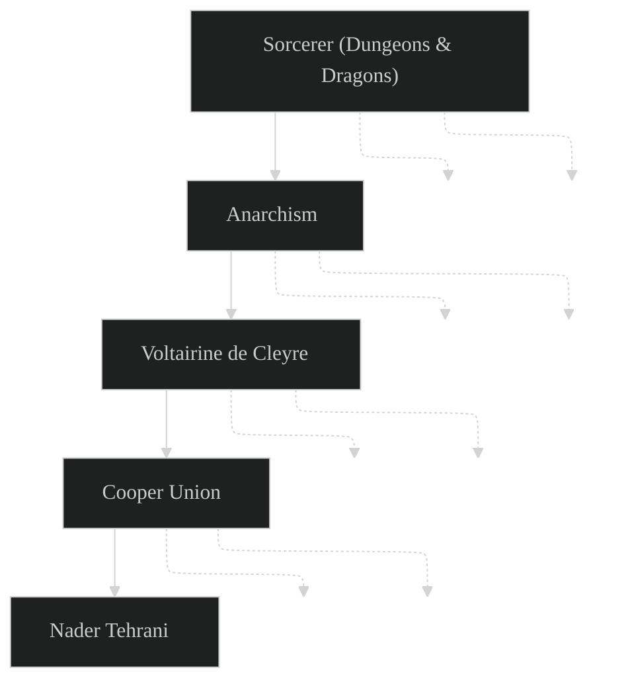
```mermaid
%%{init: {
  "theme": "dark",                             
  "flowchart": {
    "useMaxWidth": true,
    "defaultRenderer": "elk",
    "nodeSpacing": 30, "rankSpacing": 40
  },
  "themeVariables": { "fontFamily": "ui-monospace" }
}}%%
graph TD
    N0["Sorcerer (Dungeons & Dragons)"]
    N1["Anarchism"]
    N2["Voltairine de Cleyre"]
    N3["Cooper Union"]
    N4["Nader Tehrani"]
    N0 --> N1
    N0 -.-> DUMMY_0_2
    N0 -.-> DUMMY_0_3
    N1 -.-> DUMMY_1_1
    N1 --> N2
    N1 -.-> DUMMY_1_3
    N2 -.-> DUMMY_2_1
    N2 -.-> DUMMY_2_2
    N2 --> N3
    N3 -.-> DUMMY_3_1
    N3 -.-> DUMMY_3_2
    N3 --> N4

    DUMMY_0_2[ ]
    DUMMY_0_3[ ]
    DUMMY_1_1[ ]
    DUMMY_1_3[ ]
    DUMMY_2_1[ ]
    DUMMY_2_2[ ]
    DUMMY_3_1[ ]
    DUMMY_3_2[ ]

    %% Make dummy nodes transparent
    style DUMMY_0_2 fill:transparent,stroke:transparent
    style DUMMY_0_3 fill:transparent,stroke:transparent
    style DUMMY_1_1 fill:transparent,stroke:transparent
    style DUMMY_1_3 fill:transparent,stroke:transparent
    style DUMMY_2_1 fill:transparent,stroke:transparent
    style DUMMY_2_2 fill:transparent,stroke:transparent
    style DUMMY_3_1 fill:transparent,stroke:transparent
    style DUMMY_3_2 fill:transparent,stroke:transparent
```

## Path 19

**4 hops**: Krassimir_Ivandjiiski → Antisemitism → Mexico_City → Hyderabad → Dr._B.R._Ambedkar_Open_University

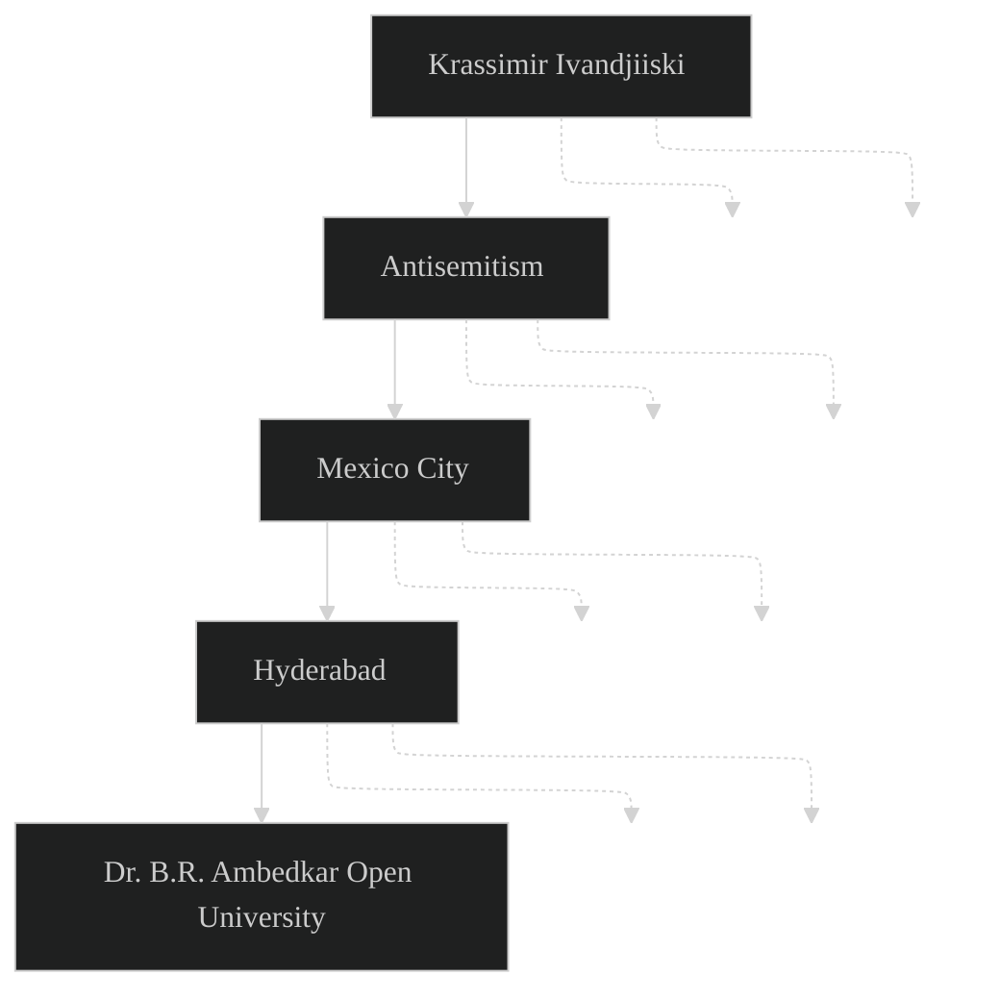
```mermaid
%%{init: {
  "theme": "dark",                             
  "flowchart": {
    "useMaxWidth": true,
    "defaultRenderer": "elk",
    "nodeSpacing": 30, "rankSpacing": 40
  },
  "themeVariables": { "fontFamily": "ui-monospace" }
}}%%
graph TD
    N0["Krassimir Ivandjiiski"]
    N1["Antisemitism"]
    N2["Mexico City"]
    N3["Hyderabad"]
    N4["Dr. B.R. Ambedkar Open University"]
    N0 --> N1
    N0 -.-> DUMMY_0_2
    N0 -.-> DUMMY_0_3
    N1 -.-> DUMMY_1_1
    N1 -.-> DUMMY_1_2
    N1 --> N2
    N2 --> N3
    N2 -.-> DUMMY_2_2
    N2 -.-> DUMMY_2_3
    N3 --> N4
    N3 -.-> DUMMY_3_2
    N3 -.-> DUMMY_3_3

    DUMMY_0_2[ ]
    DUMMY_0_3[ ]
    DUMMY_1_1[ ]
    DUMMY_1_2[ ]
    DUMMY_2_2[ ]
    DUMMY_2_3[ ]
    DUMMY_3_2[ ]
    DUMMY_3_3[ ]

    %% Make dummy nodes transparent
    style DUMMY_0_2 fill:transparent,stroke:transparent
    style DUMMY_0_3 fill:transparent,stroke:transparent
    style DUMMY_1_1 fill:transparent,stroke:transparent
    style DUMMY_1_2 fill:transparent,stroke:transparent
    style DUMMY_2_2 fill:transparent,stroke:transparent
    style DUMMY_2_3 fill:transparent,stroke:transparent
    style DUMMY_3_2 fill:transparent,stroke:transparent
    style DUMMY_3_3 fill:transparent,stroke:transparent
```

## Path 20

**4 hops**: Panzanella → Olivier_salad → French_language → Transport_in_France → Trams_in_France

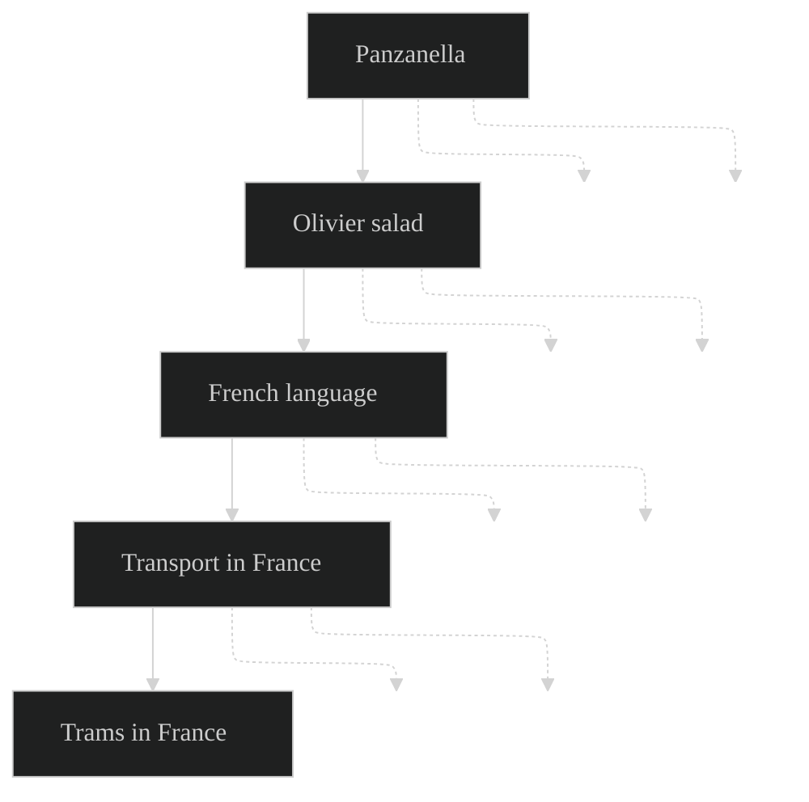
```mermaid
%%{init: {
  "theme": "dark",                             
  "flowchart": {
    "useMaxWidth": true,
    "defaultRenderer": "elk",
    "nodeSpacing": 30, "rankSpacing": 40
  },
  "themeVariables": { "fontFamily": "ui-monospace" }
}}%%
graph TD
    N0["Panzanella"]
    N1["Olivier salad"]
    N2["French language"]
    N3["Transport in France"]
    N4["Trams in France"]
    N0 -.-> DUMMY_0_1
    N0 -.-> DUMMY_0_2
    N0 --> N1
    N1 -.-> DUMMY_1_1
    N1 -.-> DUMMY_1_2
    N1 --> N2
    N2 --> N3
    N2 -.-> DUMMY_2_2
    N2 -.-> DUMMY_2_3
    N3 --> N4
    N3 -.-> DUMMY_3_2
    N3 -.-> DUMMY_3_3

    DUMMY_0_1[ ]
    DUMMY_0_2[ ]
    DUMMY_1_1[ ]
    DUMMY_1_2[ ]
    DUMMY_2_2[ ]
    DUMMY_2_3[ ]
    DUMMY_3_2[ ]
    DUMMY_3_3[ ]

    %% Make dummy nodes transparent
    style DUMMY_0_1 fill:transparent,stroke:transparent
    style DUMMY_0_2 fill:transparent,stroke:transparent
    style DUMMY_1_1 fill:transparent,stroke:transparent
    style DUMMY_1_2 fill:transparent,stroke:transparent
    style DUMMY_2_2 fill:transparent,stroke:transparent
    style DUMMY_2_3 fill:transparent,stroke:transparent
    style DUMMY_3_2 fill:transparent,stroke:transparent
    style DUMMY_3_3 fill:transparent,stroke:transparent
```

## Path 21

**4 hops**: Sakacin → ISBN → United_States → College_football → Touchdown

```mermaid
%%{init: {
  "theme": "dark",                             
  "flowchart": {
    "useMaxWidth": true,
    "defaultRenderer": "elk",
    "nodeSpacing": 30, "rankSpacing": 40
  },
  "themeVariables": { "fontFamily": "ui-monospace" }
}}%%
graph TD
    N0["Sakacin"]
    N1["ISBN"]
    N2["United States"]
    N3["College football"]
    N4["Touchdown"]
    N0 -.-> DUMMY_0_1
    N0 --> N1
    N0 -.-> DUMMY_0_3
    N1 -.-> DUMMY_1_1
    N1 -.-> DUMMY_1_2
    N1 --> N2
    N2 --> N3
    N2 -.-> DUMMY_2_2
    N2 -.-> DUMMY_2_3
    N3 -.-> DUMMY_3_1
    N3 -.-> DUMMY_3_2
    N3 --> N4

    DUMMY_0_1[ ]
    DUMMY_0_3[ ]
    DUMMY_1_1[ ]
    DUMMY_1_2[ ]
    DUMMY_2_2[ ]
    DUMMY_2_3[ ]
    DUMMY_3_1[ ]
    DUMMY_3_2[ ]

    %% Make dummy nodes transparent
    style DUMMY_0_1 fill:transparent,stroke:transparent
    style DUMMY_0_3 fill:transparent,stroke:transparent
    style DUMMY_1_1 fill:transparent,stroke:transparent
    style DUMMY_1_2 fill:transparent,stroke:transparent
    style DUMMY_2_2 fill:transparent,stroke:transparent
    style DUMMY_2_3 fill:transparent,stroke:transparent
    style DUMMY_3_1 fill:transparent,stroke:transparent
    style DUMMY_3_2 fill:transparent,stroke:transparent
```

## Path 22

**3 hops**: Gal_Mekel → COVID-19_lockdowns_in_Italy → Impact_of_the_COVID-19_pandemic_on_the_music_industry → Notes_on_a_Conditional_Form

```mermaid
%%{init: {
  "theme": "dark",                             
  "flowchart": {
    "useMaxWidth": true,
    "defaultRenderer": "elk",
    "nodeSpacing": 30, "rankSpacing": 40
  },
  "themeVariables": { "fontFamily": "ui-monospace" }
}}%%
graph TD
    N0["Gal Mekel"]
    N1["COVID-19 lockdowns in Italy"]
    N2["Impact of the COVID-19 pandemic on the music industry"]
    N3["Notes on a Conditional Form"]
    N0 -.-> DUMMY_0_1
    N0 --> N1
    N0 -.-> DUMMY_0_3
    N1 -.-> DUMMY_1_1
    N1 -.-> DUMMY_1_2
    N1 --> N2
    N2 --> N3
    N2 -.-> DUMMY_2_2
    N2 -.-> DUMMY_2_3

    DUMMY_0_1[ ]
    DUMMY_0_3[ ]
    DUMMY_1_1[ ]
    DUMMY_1_2[ ]
    DUMMY_2_2[ ]
    DUMMY_2_3[ ]

    %% Make dummy nodes transparent
    style DUMMY_0_1 fill:transparent,stroke:transparent
    style DUMMY_0_3 fill:transparent,stroke:transparent
    style DUMMY_1_1 fill:transparent,stroke:transparent
    style DUMMY_1_2 fill:transparent,stroke:transparent
    style DUMMY_2_2 fill:transparent,stroke:transparent
    style DUMMY_2_3 fill:transparent,stroke:transparent
```

## Path 23

**3 hops**: Leimbach,_Aargau → Rent-to-own → The_Buffalo_News → Statesville_Record_&_Landmark

```mermaid
%%{init: {
  "theme": "dark",                             
  "flowchart": {
    "useMaxWidth": true,
    "defaultRenderer": "elk",
    "nodeSpacing": 30, "rankSpacing": 40
  },
  "themeVariables": { "fontFamily": "ui-monospace" }
}}%%
graph TD
    N0["Leimbach, Aargau"]
    N1["Rent-to-own"]
    N2["The Buffalo News"]
    N3["Statesville Record & Landmark"]
    N0 --> N1
    N0 -.-> DUMMY_0_2
    N0 -.-> DUMMY_0_3
    N1 -.-> DUMMY_1_1
    N1 --> N2
    N1 -.-> DUMMY_1_3
    N2 -.-> DUMMY_2_1
    N2 -.-> DUMMY_2_2
    N2 --> N3

    DUMMY_0_2[ ]
    DUMMY_0_3[ ]
    DUMMY_1_1[ ]
    DUMMY_1_3[ ]
    DUMMY_2_1[ ]
    DUMMY_2_2[ ]

    %% Make dummy nodes transparent
    style DUMMY_0_2 fill:transparent,stroke:transparent
    style DUMMY_0_3 fill:transparent,stroke:transparent
    style DUMMY_1_1 fill:transparent,stroke:transparent
    style DUMMY_1_3 fill:transparent,stroke:transparent
    style DUMMY_2_1 fill:transparent,stroke:transparent
    style DUMMY_2_2 fill:transparent,stroke:transparent
```

## Path 24

**5 hops**: Diane_Eshin_Rizzetto → Nyanaponika_Thera → Berlin → List_of_twin_towns_and_sister_cities_in_Germany → Gmina_Gryfice → Rzęsin

```mermaid
%%{init: {
  "theme": "dark",                             
  "flowchart": {
    "useMaxWidth": true,
    "defaultRenderer": "elk",
    "nodeSpacing": 30, "rankSpacing": 40
  },
  "themeVariables": { "fontFamily": "ui-monospace" }
}}%%
graph TD
    N0["Diane Eshin Rizzetto"]
    N1["Nyanaponika Thera"]
    N2["Berlin"]
    N3["List of twin towns and sister cities in Germany"]
    N4["Gmina Gryfice"]
    N5["Rzęsin"]
    N0 -.-> DUMMY_0_1
    N0 --> N1
    N0 -.-> DUMMY_0_3
    N1 --> N2
    N1 -.-> DUMMY_1_2
    N1 -.-> DUMMY_1_3
    N2 -.-> DUMMY_2_1
    N2 --> N3
    N2 -.-> DUMMY_2_3
    N3 -.-> DUMMY_3_1
    N3 -.-> DUMMY_3_2
    N3 --> N4
    N4 -.-> DUMMY_4_1
    N4 --> N5
    N4 -.-> DUMMY_4_3

    DUMMY_0_1[ ]
    DUMMY_0_3[ ]
    DUMMY_1_2[ ]
    DUMMY_1_3[ ]
    DUMMY_2_1[ ]
    DUMMY_2_3[ ]
    DUMMY_3_1[ ]
    DUMMY_3_2[ ]
    DUMMY_4_1[ ]
    DUMMY_4_3[ ]

    %% Make dummy nodes transparent
    style DUMMY_0_1 fill:transparent,stroke:transparent
    style DUMMY_0_3 fill:transparent,stroke:transparent
    style DUMMY_1_2 fill:transparent,stroke:transparent
    style DUMMY_1_3 fill:transparent,stroke:transparent
    style DUMMY_2_1 fill:transparent,stroke:transparent
    style DUMMY_2_3 fill:transparent,stroke:transparent
    style DUMMY_3_1 fill:transparent,stroke:transparent
    style DUMMY_3_2 fill:transparent,stroke:transparent
    style DUMMY_4_1 fill:transparent,stroke:transparent
    style DUMMY_4_3 fill:transparent,stroke:transparent
```

## Path 25

**3 hops**: Joe_Davison_(footballer,_born_1897) → National_service → Norway → Chaldean_Catholic_Church

```mermaid
%%{init: {
  "theme": "dark",                             
  "flowchart": {
    "useMaxWidth": true,
    "defaultRenderer": "elk",
    "nodeSpacing": 30, "rankSpacing": 40
  },
  "themeVariables": { "fontFamily": "ui-monospace" }
}}%%
graph TD
    N0["Joe Davison (footballer, born 1897)"]
    N1["National service"]
    N2["Norway"]
    N3["Chaldean Catholic Church"]
    N0 -.-> DUMMY_0_1
    N0 --> N1
    N0 -.-> DUMMY_0_3
    N1 --> N2
    N1 -.-> DUMMY_1_2
    N1 -.-> DUMMY_1_3
    N2 -.-> DUMMY_2_1
    N2 -.-> DUMMY_2_2
    N2 --> N3

    DUMMY_0_1[ ]
    DUMMY_0_3[ ]
    DUMMY_1_2[ ]
    DUMMY_1_3[ ]
    DUMMY_2_1[ ]
    DUMMY_2_2[ ]

    %% Make dummy nodes transparent
    style DUMMY_0_1 fill:transparent,stroke:transparent
    style DUMMY_0_3 fill:transparent,stroke:transparent
    style DUMMY_1_2 fill:transparent,stroke:transparent
    style DUMMY_1_3 fill:transparent,stroke:transparent
    style DUMMY_2_1 fill:transparent,stroke:transparent
    style DUMMY_2_2 fill:transparent,stroke:transparent
```

## Path 26

**2 hops**: Tattoo → ISSN → MPEG-1

```mermaid
%%{init: {
  "theme": "dark",                             
  "flowchart": {
    "useMaxWidth": true,
    "defaultRenderer": "elk",
    "nodeSpacing": 30, "rankSpacing": 40
  },
  "themeVariables": { "fontFamily": "ui-monospace" }
}}%%
graph TD
    N0["Tattoo"]
    N1["ISSN"]
    N2["MPEG-1"]
    N0 --> N1
    N0 -.-> DUMMY_0_2
    N0 -.-> DUMMY_0_3
    N1 --> N2
    N1 -.-> DUMMY_1_2
    N1 -.-> DUMMY_1_3

    DUMMY_0_2[ ]
    DUMMY_0_3[ ]
    DUMMY_1_2[ ]
    DUMMY_1_3[ ]

    %% Make dummy nodes transparent
    style DUMMY_0_2 fill:transparent,stroke:transparent
    style DUMMY_0_3 fill:transparent,stroke:transparent
    style DUMMY_1_2 fill:transparent,stroke:transparent
    style DUMMY_1_3 fill:transparent,stroke:transparent
```

## Path 27

**4 hops**: 1,2-Butadiene → Occupational_safety_and_health → Social_class → French_Revolution → Affair_of_the_Diamond_Necklace

```mermaid
%%{init: {
  "theme": "dark",                             
  "flowchart": {
    "useMaxWidth": true,
    "defaultRenderer": "elk",
    "nodeSpacing": 30, "rankSpacing": 40
  },
  "themeVariables": { "fontFamily": "ui-monospace" }
}}%%
graph TD
    N0["1,2-Butadiene"]
    N1["Occupational safety and health"]
    N2["Social class"]
    N3["French Revolution"]
    N4["Affair of the Diamond Necklace"]
    N0 -.-> DUMMY_0_1
    N0 -.-> DUMMY_0_2
    N0 --> N1
    N1 --> N2
    N1 -.-> DUMMY_1_2
    N1 -.-> DUMMY_1_3
    N2 -.-> DUMMY_2_1
    N2 --> N3
    N2 -.-> DUMMY_2_3
    N3 --> N4
    N3 -.-> DUMMY_3_2
    N3 -.-> DUMMY_3_3

    DUMMY_0_1[ ]
    DUMMY_0_2[ ]
    DUMMY_1_2[ ]
    DUMMY_1_3[ ]
    DUMMY_2_1[ ]
    DUMMY_2_3[ ]
    DUMMY_3_2[ ]
    DUMMY_3_3[ ]

    %% Make dummy nodes transparent
    style DUMMY_0_1 fill:transparent,stroke:transparent
    style DUMMY_0_2 fill:transparent,stroke:transparent
    style DUMMY_1_2 fill:transparent,stroke:transparent
    style DUMMY_1_3 fill:transparent,stroke:transparent
    style DUMMY_2_1 fill:transparent,stroke:transparent
    style DUMMY_2_3 fill:transparent,stroke:transparent
    style DUMMY_3_2 fill:transparent,stroke:transparent
    style DUMMY_3_3 fill:transparent,stroke:transparent
```

## Path 28

**5 hops**: Jimmy_Reagan → Benny_Leonard → Joe_Louis → List_of_African-American_visual_artists → List_of_American_artists_before_1900 → Paul_R._Schumann

```mermaid
%%{init: {
  "theme": "dark",                             
  "flowchart": {
    "useMaxWidth": true,
    "defaultRenderer": "elk",
    "nodeSpacing": 30, "rankSpacing": 40
  },
  "themeVariables": { "fontFamily": "ui-monospace" }
}}%%
graph TD
    N0["Jimmy Reagan"]
    N1["Benny Leonard"]
    N2["Joe Louis"]
    N3["List of African-American visual artists"]
    N4["List of American artists before 1900"]
    N5["Paul R. Schumann"]
    N0 --> N1
    N0 -.-> DUMMY_0_2
    N0 -.-> DUMMY_0_3
    N1 -.-> DUMMY_1_1
    N1 --> N2
    N1 -.-> DUMMY_1_3
    N2 -.-> DUMMY_2_1
    N2 --> N3
    N2 -.-> DUMMY_2_3
    N3 -.-> DUMMY_3_1
    N3 --> N4
    N3 -.-> DUMMY_3_3
    N4 -.-> DUMMY_4_1
    N4 --> N5
    N4 -.-> DUMMY_4_3

    DUMMY_0_2[ ]
    DUMMY_0_3[ ]
    DUMMY_1_1[ ]
    DUMMY_1_3[ ]
    DUMMY_2_1[ ]
    DUMMY_2_3[ ]
    DUMMY_3_1[ ]
    DUMMY_3_3[ ]
    DUMMY_4_1[ ]
    DUMMY_4_3[ ]

    %% Make dummy nodes transparent
    style DUMMY_0_2 fill:transparent,stroke:transparent
    style DUMMY_0_3 fill:transparent,stroke:transparent
    style DUMMY_1_1 fill:transparent,stroke:transparent
    style DUMMY_1_3 fill:transparent,stroke:transparent
    style DUMMY_2_1 fill:transparent,stroke:transparent
    style DUMMY_2_3 fill:transparent,stroke:transparent
    style DUMMY_3_1 fill:transparent,stroke:transparent
    style DUMMY_3_3 fill:transparent,stroke:transparent
    style DUMMY_4_1 fill:transparent,stroke:transparent
    style DUMMY_4_3 fill:transparent,stroke:transparent
```

## Path 29

**5 hops**: Colin_Grzanna → Medicine → William_Osler → Galápagos_Islands → List_of_animals_in_the_Galápagos_Islands → Pseudalsophis_occidentalis

```mermaid
%%{init: {
  "theme": "dark",                             
  "flowchart": {
    "useMaxWidth": true,
    "defaultRenderer": "elk",
    "nodeSpacing": 30, "rankSpacing": 40
  },
  "themeVariables": { "fontFamily": "ui-monospace" }
}}%%
graph TD
    N0["Colin Grzanna"]
    N1["Medicine"]
    N2["William Osler"]
    N3["Galápagos Islands"]
    N4["List of animals in the Galápagos Islands"]
    N5["Pseudalsophis occidentalis"]
    N0 -.-> DUMMY_0_1
    N0 -.-> DUMMY_0_2
    N0 --> N1
    N1 -.-> DUMMY_1_1
    N1 -.-> DUMMY_1_2
    N1 --> N2
    N2 -.-> DUMMY_2_1
    N2 -.-> DUMMY_2_2
    N2 --> N3
    N3 -.-> DUMMY_3_1
    N3 -.-> DUMMY_3_2
    N3 --> N4
    N4 --> N5
    N4 -.-> DUMMY_4_2
    N4 -.-> DUMMY_4_3

    DUMMY_0_1[ ]
    DUMMY_0_2[ ]
    DUMMY_1_1[ ]
    DUMMY_1_2[ ]
    DUMMY_2_1[ ]
    DUMMY_2_2[ ]
    DUMMY_3_1[ ]
    DUMMY_3_2[ ]
    DUMMY_4_2[ ]
    DUMMY_4_3[ ]

    %% Make dummy nodes transparent
    style DUMMY_0_1 fill:transparent,stroke:transparent
    style DUMMY_0_2 fill:transparent,stroke:transparent
    style DUMMY_1_1 fill:transparent,stroke:transparent
    style DUMMY_1_2 fill:transparent,stroke:transparent
    style DUMMY_2_1 fill:transparent,stroke:transparent
    style DUMMY_2_2 fill:transparent,stroke:transparent
    style DUMMY_3_1 fill:transparent,stroke:transparent
    style DUMMY_3_2 fill:transparent,stroke:transparent
    style DUMMY_4_2 fill:transparent,stroke:transparent
    style DUMMY_4_3 fill:transparent,stroke:transparent
```

## Path 30

**4 hops**: Florence_Alice_Lubega → English_language → BBC → List_of_companies_based_in_London → Chesham_Amalgamations

```mermaid
%%{init: {
  "theme": "dark",                             
  "flowchart": {
    "useMaxWidth": true,
    "defaultRenderer": "elk",
    "nodeSpacing": 30, "rankSpacing": 40
  },
  "themeVariables": { "fontFamily": "ui-monospace" }
}}%%
graph TD
    N0["Florence Alice Lubega"]
    N1["English language"]
    N2["BBC"]
    N3["List of companies based in London"]
    N4["Chesham Amalgamations"]
    N0 -.-> DUMMY_0_1
    N0 --> N1
    N0 -.-> DUMMY_0_3
    N1 -.-> DUMMY_1_1
    N1 -.-> DUMMY_1_2
    N1 --> N2
    N2 -.-> DUMMY_2_1
    N2 --> N3
    N2 -.-> DUMMY_2_3
    N3 --> N4
    N3 -.-> DUMMY_3_2
    N3 -.-> DUMMY_3_3

    DUMMY_0_1[ ]
    DUMMY_0_3[ ]
    DUMMY_1_1[ ]
    DUMMY_1_2[ ]
    DUMMY_2_1[ ]
    DUMMY_2_3[ ]
    DUMMY_3_2[ ]
    DUMMY_3_3[ ]

    %% Make dummy nodes transparent
    style DUMMY_0_1 fill:transparent,stroke:transparent
    style DUMMY_0_3 fill:transparent,stroke:transparent
    style DUMMY_1_1 fill:transparent,stroke:transparent
    style DUMMY_1_2 fill:transparent,stroke:transparent
    style DUMMY_2_1 fill:transparent,stroke:transparent
    style DUMMY_2_3 fill:transparent,stroke:transparent
    style DUMMY_3_2 fill:transparent,stroke:transparent
    style DUMMY_3_3 fill:transparent,stroke:transparent
```

## Path 31

**3 hops**: Order-5_hexagonal_tiling_honeycomb → Regular_icosahedron → Absolute_difference → Relative_change

```mermaid
%%{init: {
  "theme": "dark",                             
  "flowchart": {
    "useMaxWidth": true,
    "defaultRenderer": "elk",
    "nodeSpacing": 30, "rankSpacing": 40
  },
  "themeVariables": { "fontFamily": "ui-monospace" }
}}%%
graph TD
    N0["Order-5 hexagonal tiling honeycomb"]
    N1["Regular icosahedron"]
    N2["Absolute difference"]
    N3["Relative change"]
    N0 -.-> DUMMY_0_1
    N0 --> N1
    N0 -.-> DUMMY_0_3
    N1 -.-> DUMMY_1_1
    N1 --> N2
    N1 -.-> DUMMY_1_3
    N2 --> N3
    N2 -.-> DUMMY_2_2
    N2 -.-> DUMMY_2_3

    DUMMY_0_1[ ]
    DUMMY_0_3[ ]
    DUMMY_1_1[ ]
    DUMMY_1_3[ ]
    DUMMY_2_2[ ]
    DUMMY_2_3[ ]

    %% Make dummy nodes transparent
    style DUMMY_0_1 fill:transparent,stroke:transparent
    style DUMMY_0_3 fill:transparent,stroke:transparent
    style DUMMY_1_1 fill:transparent,stroke:transparent
    style DUMMY_1_3 fill:transparent,stroke:transparent
    style DUMMY_2_2 fill:transparent,stroke:transparent
    style DUMMY_2_3 fill:transparent,stroke:transparent
```

## Path 32

**4 hops**: Little_Miss_Muffet → Chambers_Dictionary → Scrabble → IPod → Samsung_YEPP

```mermaid
%%{init: {
  "theme": "dark",                             
  "flowchart": {
    "useMaxWidth": true,
    "defaultRenderer": "elk",
    "nodeSpacing": 30, "rankSpacing": 40
  },
  "themeVariables": { "fontFamily": "ui-monospace" }
}}%%
graph TD
    N0["Little Miss Muffet"]
    N1["Chambers Dictionary"]
    N2["Scrabble"]
    N3["IPod"]
    N4["Samsung YEPP"]
    N0 --> N1
    N0 -.-> DUMMY_0_2
    N0 -.-> DUMMY_0_3
    N1 --> N2
    N1 -.-> DUMMY_1_2
    N1 -.-> DUMMY_1_3
    N2 --> N3
    N2 -.-> DUMMY_2_2
    N2 -.-> DUMMY_2_3
    N3 -.-> DUMMY_3_1
    N3 -.-> DUMMY_3_2
    N3 --> N4

    DUMMY_0_2[ ]
    DUMMY_0_3[ ]
    DUMMY_1_2[ ]
    DUMMY_1_3[ ]
    DUMMY_2_2[ ]
    DUMMY_2_3[ ]
    DUMMY_3_1[ ]
    DUMMY_3_2[ ]

    %% Make dummy nodes transparent
    style DUMMY_0_2 fill:transparent,stroke:transparent
    style DUMMY_0_3 fill:transparent,stroke:transparent
    style DUMMY_1_2 fill:transparent,stroke:transparent
    style DUMMY_1_3 fill:transparent,stroke:transparent
    style DUMMY_2_2 fill:transparent,stroke:transparent
    style DUMMY_2_3 fill:transparent,stroke:transparent
    style DUMMY_3_1 fill:transparent,stroke:transparent
    style DUMMY_3_2 fill:transparent,stroke:transparent
```

## Path 33

**3 hops**: Siener_van_Rensburg → Second_Boer_War → Ireland → Full_breakfast

```mermaid
%%{init: {
  "theme": "dark",                             
  "flowchart": {
    "useMaxWidth": true,
    "defaultRenderer": "elk",
    "nodeSpacing": 30, "rankSpacing": 40
  },
  "themeVariables": { "fontFamily": "ui-monospace" }
}}%%
graph TD
    N0["Siener van Rensburg"]
    N1["Second Boer War"]
    N2["Ireland"]
    N3["Full breakfast"]
    N0 -.-> DUMMY_0_1
    N0 -.-> DUMMY_0_2
    N0 --> N1
    N1 -.-> DUMMY_1_1
    N1 --> N2
    N1 -.-> DUMMY_1_3
    N2 -.-> DUMMY_2_1
    N2 -.-> DUMMY_2_2
    N2 --> N3

    DUMMY_0_1[ ]
    DUMMY_0_2[ ]
    DUMMY_1_1[ ]
    DUMMY_1_3[ ]
    DUMMY_2_1[ ]
    DUMMY_2_2[ ]

    %% Make dummy nodes transparent
    style DUMMY_0_1 fill:transparent,stroke:transparent
    style DUMMY_0_2 fill:transparent,stroke:transparent
    style DUMMY_1_1 fill:transparent,stroke:transparent
    style DUMMY_1_3 fill:transparent,stroke:transparent
    style DUMMY_2_1 fill:transparent,stroke:transparent
    style DUMMY_2_2 fill:transparent,stroke:transparent
```

## Path 34

**4 hops**: Astrocyte → Shanghai → Romania → FC_Dinamo_București → CS_Dinamo_București_(basketball)

```mermaid
%%{init: {
  "theme": "dark",                             
  "flowchart": {
    "useMaxWidth": true,
    "defaultRenderer": "elk",
    "nodeSpacing": 30, "rankSpacing": 40
  },
  "themeVariables": { "fontFamily": "ui-monospace" }
}}%%
graph TD
    N0["Astrocyte"]
    N1["Shanghai"]
    N2["Romania"]
    N3["FC Dinamo București"]
    N4["CS Dinamo București (basketball)"]
    N0 -.-> DUMMY_0_1
    N0 -.-> DUMMY_0_2
    N0 --> N1
    N1 --> N2
    N1 -.-> DUMMY_1_2
    N1 -.-> DUMMY_1_3
    N2 -.-> DUMMY_2_1
    N2 -.-> DUMMY_2_2
    N2 --> N3
    N3 --> N4
    N3 -.-> DUMMY_3_2
    N3 -.-> DUMMY_3_3

    DUMMY_0_1[ ]
    DUMMY_0_2[ ]
    DUMMY_1_2[ ]
    DUMMY_1_3[ ]
    DUMMY_2_1[ ]
    DUMMY_2_2[ ]
    DUMMY_3_2[ ]
    DUMMY_3_3[ ]

    %% Make dummy nodes transparent
    style DUMMY_0_1 fill:transparent,stroke:transparent
    style DUMMY_0_2 fill:transparent,stroke:transparent
    style DUMMY_1_2 fill:transparent,stroke:transparent
    style DUMMY_1_3 fill:transparent,stroke:transparent
    style DUMMY_2_1 fill:transparent,stroke:transparent
    style DUMMY_2_2 fill:transparent,stroke:transparent
    style DUMMY_3_2 fill:transparent,stroke:transparent
    style DUMMY_3_3 fill:transparent,stroke:transparent
```

## Path 35

**4 hops**: Berklee_College_of_Music → Sexual_harassment → Lynching → Western_Highlands_Province → Tambul-Nebilyer_District

```mermaid
%%{init: {
  "theme": "dark",                             
  "flowchart": {
    "useMaxWidth": true,
    "defaultRenderer": "elk",
    "nodeSpacing": 30, "rankSpacing": 40
  },
  "themeVariables": { "fontFamily": "ui-monospace" }
}}%%
graph TD
    N0["Berklee College of Music"]
    N1["Sexual harassment"]
    N2["Lynching"]
    N3["Western Highlands Province"]
    N4["Tambul-Nebilyer District"]
    N0 -.-> DUMMY_0_1
    N0 --> N1
    N0 -.-> DUMMY_0_3
    N1 -.-> DUMMY_1_1
    N1 -.-> DUMMY_1_2
    N1 --> N2
    N2 --> N3
    N2 -.-> DUMMY_2_2
    N2 -.-> DUMMY_2_3
    N3 -.-> DUMMY_3_1
    N3 -.-> DUMMY_3_2
    N3 --> N4

    DUMMY_0_1[ ]
    DUMMY_0_3[ ]
    DUMMY_1_1[ ]
    DUMMY_1_2[ ]
    DUMMY_2_2[ ]
    DUMMY_2_3[ ]
    DUMMY_3_1[ ]
    DUMMY_3_2[ ]

    %% Make dummy nodes transparent
    style DUMMY_0_1 fill:transparent,stroke:transparent
    style DUMMY_0_3 fill:transparent,stroke:transparent
    style DUMMY_1_1 fill:transparent,stroke:transparent
    style DUMMY_1_2 fill:transparent,stroke:transparent
    style DUMMY_2_2 fill:transparent,stroke:transparent
    style DUMMY_2_3 fill:transparent,stroke:transparent
    style DUMMY_3_1 fill:transparent,stroke:transparent
    style DUMMY_3_2 fill:transparent,stroke:transparent
```

## Path 36

**4 hops**: Kullu → Female → Legal_status_of_transgender_people → Adrenal_gland → Angiotensin_II_receptor

```mermaid
%%{init: {
  "theme": "dark",                             
  "flowchart": {
    "useMaxWidth": true,
    "defaultRenderer": "elk",
    "nodeSpacing": 30, "rankSpacing": 40
  },
  "themeVariables": { "fontFamily": "ui-monospace" }
}}%%
graph TD
    N0["Kullu"]
    N1["Female"]
    N2["Legal status of transgender people"]
    N3["Adrenal gland"]
    N4["Angiotensin II receptor"]
    N0 --> N1
    N0 -.-> DUMMY_0_2
    N0 -.-> DUMMY_0_3
    N1 -.-> DUMMY_1_1
    N1 --> N2
    N1 -.-> DUMMY_1_3
    N2 --> N3
    N2 -.-> DUMMY_2_2
    N2 -.-> DUMMY_2_3
    N3 --> N4
    N3 -.-> DUMMY_3_2
    N3 -.-> DUMMY_3_3

    DUMMY_0_2[ ]
    DUMMY_0_3[ ]
    DUMMY_1_1[ ]
    DUMMY_1_3[ ]
    DUMMY_2_2[ ]
    DUMMY_2_3[ ]
    DUMMY_3_2[ ]
    DUMMY_3_3[ ]

    %% Make dummy nodes transparent
    style DUMMY_0_2 fill:transparent,stroke:transparent
    style DUMMY_0_3 fill:transparent,stroke:transparent
    style DUMMY_1_1 fill:transparent,stroke:transparent
    style DUMMY_1_3 fill:transparent,stroke:transparent
    style DUMMY_2_2 fill:transparent,stroke:transparent
    style DUMMY_2_3 fill:transparent,stroke:transparent
    style DUMMY_3_2 fill:transparent,stroke:transparent
    style DUMMY_3_3 fill:transparent,stroke:transparent
```

## Path 37

**3 hops**: List_of_personal_coats_of_arms_of_presidents_of_the_United_States → Pelican → DDT → Oxymesterone

```mermaid
%%{init: {
  "theme": "dark",                             
  "flowchart": {
    "useMaxWidth": true,
    "defaultRenderer": "elk",
    "nodeSpacing": 30, "rankSpacing": 40
  },
  "themeVariables": { "fontFamily": "ui-monospace" }
}}%%
graph TD
    N0["List of personal coats of arms of presidents of the United States"]
    N1["Pelican"]
    N2["DDT"]
    N3["Oxymesterone"]
    N0 --> N1
    N0 -.-> DUMMY_0_2
    N0 -.-> DUMMY_0_3
    N1 --> N2
    N1 -.-> DUMMY_1_2
    N1 -.-> DUMMY_1_3
    N2 -.-> DUMMY_2_1
    N2 --> N3
    N2 -.-> DUMMY_2_3

    DUMMY_0_2[ ]
    DUMMY_0_3[ ]
    DUMMY_1_2[ ]
    DUMMY_1_3[ ]
    DUMMY_2_1[ ]
    DUMMY_2_3[ ]

    %% Make dummy nodes transparent
    style DUMMY_0_2 fill:transparent,stroke:transparent
    style DUMMY_0_3 fill:transparent,stroke:transparent
    style DUMMY_1_2 fill:transparent,stroke:transparent
    style DUMMY_1_3 fill:transparent,stroke:transparent
    style DUMMY_2_1 fill:transparent,stroke:transparent
    style DUMMY_2_3 fill:transparent,stroke:transparent
```

## Path 38

**5 hops**: Tatra_National_Park,_Slovakia → Stream → Pennsylvania → Heinz → Echuca → George_Bazeley

```mermaid
%%{init: {
  "theme": "dark",                             
  "flowchart": {
    "useMaxWidth": true,
    "defaultRenderer": "elk",
    "nodeSpacing": 30, "rankSpacing": 40
  },
  "themeVariables": { "fontFamily": "ui-monospace" }
}}%%
graph TD
    N0["Tatra National Park, Slovakia"]
    N1["Stream"]
    N2["Pennsylvania"]
    N3["Heinz"]
    N4["Echuca"]
    N5["George Bazeley"]
    N0 --> N1
    N0 -.-> DUMMY_0_2
    N0 -.-> DUMMY_0_3
    N1 --> N2
    N1 -.-> DUMMY_1_2
    N1 -.-> DUMMY_1_3
    N2 -.-> DUMMY_2_1
    N2 --> N3
    N2 -.-> DUMMY_2_3
    N3 --> N4
    N3 -.-> DUMMY_3_2
    N3 -.-> DUMMY_3_3
    N4 -.-> DUMMY_4_1
    N4 --> N5
    N4 -.-> DUMMY_4_3

    DUMMY_0_2[ ]
    DUMMY_0_3[ ]
    DUMMY_1_2[ ]
    DUMMY_1_3[ ]
    DUMMY_2_1[ ]
    DUMMY_2_3[ ]
    DUMMY_3_2[ ]
    DUMMY_3_3[ ]
    DUMMY_4_1[ ]
    DUMMY_4_3[ ]

    %% Make dummy nodes transparent
    style DUMMY_0_2 fill:transparent,stroke:transparent
    style DUMMY_0_3 fill:transparent,stroke:transparent
    style DUMMY_1_2 fill:transparent,stroke:transparent
    style DUMMY_1_3 fill:transparent,stroke:transparent
    style DUMMY_2_1 fill:transparent,stroke:transparent
    style DUMMY_2_3 fill:transparent,stroke:transparent
    style DUMMY_3_2 fill:transparent,stroke:transparent
    style DUMMY_3_3 fill:transparent,stroke:transparent
    style DUMMY_4_1 fill:transparent,stroke:transparent
    style DUMMY_4_3 fill:transparent,stroke:transparent
```

## Path 39

**3 hops**: List_of_University_of_Massachusetts_Amherst_residence_halls → John_F._Kennedy → Rosa_Parks → Duncan_Campbell_(journalist,_born_1944)

```mermaid
%%{init: {
  "theme": "dark",                             
  "flowchart": {
    "useMaxWidth": true,
    "defaultRenderer": "elk",
    "nodeSpacing": 30, "rankSpacing": 40
  },
  "themeVariables": { "fontFamily": "ui-monospace" }
}}%%
graph TD
    N0["List of University of Massachusetts Amherst residence halls"]
    N1["John F. Kennedy"]
    N2["Rosa Parks"]
    N3["Duncan Campbell (journalist, born 1944)"]
    N0 --> N1
    N0 -.-> DUMMY_0_2
    N0 -.-> DUMMY_0_3
    N1 -.-> DUMMY_1_1
    N1 --> N2
    N1 -.-> DUMMY_1_3
    N2 --> N3
    N2 -.-> DUMMY_2_2
    N2 -.-> DUMMY_2_3

    DUMMY_0_2[ ]
    DUMMY_0_3[ ]
    DUMMY_1_1[ ]
    DUMMY_1_3[ ]
    DUMMY_2_2[ ]
    DUMMY_2_3[ ]

    %% Make dummy nodes transparent
    style DUMMY_0_2 fill:transparent,stroke:transparent
    style DUMMY_0_3 fill:transparent,stroke:transparent
    style DUMMY_1_1 fill:transparent,stroke:transparent
    style DUMMY_1_3 fill:transparent,stroke:transparent
    style DUMMY_2_2 fill:transparent,stroke:transparent
    style DUMMY_2_3 fill:transparent,stroke:transparent
```

## Path 40

**4 hops**: Cloud_iridescence → Scientific_American → Alan_Alda → Kevin_Spacey → Keyser_Söze

```mermaid
%%{init: {
  "theme": "dark",                             
  "flowchart": {
    "useMaxWidth": true,
    "defaultRenderer": "elk",
    "nodeSpacing": 30, "rankSpacing": 40
  },
  "themeVariables": { "fontFamily": "ui-monospace" }
}}%%
graph TD
    N0["Cloud iridescence"]
    N1["Scientific American"]
    N2["Alan Alda"]
    N3["Kevin Spacey"]
    N4["Keyser Söze"]
    N0 -.-> DUMMY_0_1
    N0 --> N1
    N0 -.-> DUMMY_0_3
    N1 -.-> DUMMY_1_1
    N1 --> N2
    N1 -.-> DUMMY_1_3
    N2 -.-> DUMMY_2_1
    N2 -.-> DUMMY_2_2
    N2 --> N3
    N3 --> N4
    N3 -.-> DUMMY_3_2
    N3 -.-> DUMMY_3_3

    DUMMY_0_1[ ]
    DUMMY_0_3[ ]
    DUMMY_1_1[ ]
    DUMMY_1_3[ ]
    DUMMY_2_1[ ]
    DUMMY_2_2[ ]
    DUMMY_3_2[ ]
    DUMMY_3_3[ ]

    %% Make dummy nodes transparent
    style DUMMY_0_1 fill:transparent,stroke:transparent
    style DUMMY_0_3 fill:transparent,stroke:transparent
    style DUMMY_1_1 fill:transparent,stroke:transparent
    style DUMMY_1_3 fill:transparent,stroke:transparent
    style DUMMY_2_1 fill:transparent,stroke:transparent
    style DUMMY_2_2 fill:transparent,stroke:transparent
    style DUMMY_3_2 fill:transparent,stroke:transparent
    style DUMMY_3_3 fill:transparent,stroke:transparent
```

## Path 41

**4 hops**: Krigia_biflora → Taxonomy_(biology) → Rejection_of_evolution_by_religious_groups → C._S._Lewis → Mark_St._Germain

```mermaid
%%{init: {
  "theme": "dark",                             
  "flowchart": {
    "useMaxWidth": true,
    "defaultRenderer": "elk",
    "nodeSpacing": 30, "rankSpacing": 40
  },
  "themeVariables": { "fontFamily": "ui-monospace" }
}}%%
graph TD
    N0["Krigia biflora"]
    N1["Taxonomy (biology)"]
    N2["Rejection of evolution by religious groups"]
    N3["C. S. Lewis"]
    N4["Mark St. Germain"]
    N0 -.-> DUMMY_0_1
    N0 -.-> DUMMY_0_2
    N0 --> N1
    N1 -.-> DUMMY_1_1
    N1 --> N2
    N1 -.-> DUMMY_1_3
    N2 -.-> DUMMY_2_1
    N2 -.-> DUMMY_2_2
    N2 --> N3
    N3 -.-> DUMMY_3_1
    N3 --> N4
    N3 -.-> DUMMY_3_3

    DUMMY_0_1[ ]
    DUMMY_0_2[ ]
    DUMMY_1_1[ ]
    DUMMY_1_3[ ]
    DUMMY_2_1[ ]
    DUMMY_2_2[ ]
    DUMMY_3_1[ ]
    DUMMY_3_3[ ]

    %% Make dummy nodes transparent
    style DUMMY_0_1 fill:transparent,stroke:transparent
    style DUMMY_0_2 fill:transparent,stroke:transparent
    style DUMMY_1_1 fill:transparent,stroke:transparent
    style DUMMY_1_3 fill:transparent,stroke:transparent
    style DUMMY_2_1 fill:transparent,stroke:transparent
    style DUMMY_2_2 fill:transparent,stroke:transparent
    style DUMMY_3_1 fill:transparent,stroke:transparent
    style DUMMY_3_3 fill:transparent,stroke:transparent
```

## Path 42

**3 hops**: A-flat_clarinet → Italy → Culture_of_Europe → Panhellenic_sanctuary

```mermaid
%%{init: {
  "theme": "dark",                             
  "flowchart": {
    "useMaxWidth": true,
    "defaultRenderer": "elk",
    "nodeSpacing": 30, "rankSpacing": 40
  },
  "themeVariables": { "fontFamily": "ui-monospace" }
}}%%
graph TD
    N0["A-flat clarinet"]
    N1["Italy"]
    N2["Culture of Europe"]
    N3["Panhellenic sanctuary"]
    N0 -.-> DUMMY_0_1
    N0 --> N1
    N0 -.-> DUMMY_0_3
    N1 --> N2
    N1 -.-> DUMMY_1_2
    N1 -.-> DUMMY_1_3
    N2 -.-> DUMMY_2_1
    N2 --> N3
    N2 -.-> DUMMY_2_3

    DUMMY_0_1[ ]
    DUMMY_0_3[ ]
    DUMMY_1_2[ ]
    DUMMY_1_3[ ]
    DUMMY_2_1[ ]
    DUMMY_2_3[ ]

    %% Make dummy nodes transparent
    style DUMMY_0_1 fill:transparent,stroke:transparent
    style DUMMY_0_3 fill:transparent,stroke:transparent
    style DUMMY_1_2 fill:transparent,stroke:transparent
    style DUMMY_1_3 fill:transparent,stroke:transparent
    style DUMMY_2_1 fill:transparent,stroke:transparent
    style DUMMY_2_3 fill:transparent,stroke:transparent
```

## Path 43

**4 hops**: Mike_Sember → Hammond,_Indiana → Pontiac,_Michigan → Lenawee_County,_Michigan → Clinton,_Lenawee_County,_Michigan

```mermaid
%%{init: {
  "theme": "dark",                             
  "flowchart": {
    "useMaxWidth": true,
    "defaultRenderer": "elk",
    "nodeSpacing": 30, "rankSpacing": 40
  },
  "themeVariables": { "fontFamily": "ui-monospace" }
}}%%
graph TD
    N0["Mike Sember"]
    N1["Hammond, Indiana"]
    N2["Pontiac, Michigan"]
    N3["Lenawee County, Michigan"]
    N4["Clinton, Lenawee County, Michigan"]
    N0 -.-> DUMMY_0_1
    N0 -.-> DUMMY_0_2
    N0 --> N1
    N1 -.-> DUMMY_1_1
    N1 -.-> DUMMY_1_2
    N1 --> N2
    N2 --> N3
    N2 -.-> DUMMY_2_2
    N2 -.-> DUMMY_2_3
    N3 -.-> DUMMY_3_1
    N3 --> N4
    N3 -.-> DUMMY_3_3

    DUMMY_0_1[ ]
    DUMMY_0_2[ ]
    DUMMY_1_1[ ]
    DUMMY_1_2[ ]
    DUMMY_2_2[ ]
    DUMMY_2_3[ ]
    DUMMY_3_1[ ]
    DUMMY_3_3[ ]

    %% Make dummy nodes transparent
    style DUMMY_0_1 fill:transparent,stroke:transparent
    style DUMMY_0_2 fill:transparent,stroke:transparent
    style DUMMY_1_1 fill:transparent,stroke:transparent
    style DUMMY_1_2 fill:transparent,stroke:transparent
    style DUMMY_2_2 fill:transparent,stroke:transparent
    style DUMMY_2_3 fill:transparent,stroke:transparent
    style DUMMY_3_1 fill:transparent,stroke:transparent
    style DUMMY_3_3 fill:transparent,stroke:transparent
```

## Path 44

**4 hops**: Externado_San_José → Greek_alphabet → Pi → Hyperbolic_3-manifold → Hyperbolic_Dehn_surgery

```mermaid
%%{init: {
  "theme": "dark",                             
  "flowchart": {
    "useMaxWidth": true,
    "defaultRenderer": "elk",
    "nodeSpacing": 30, "rankSpacing": 40
  },
  "themeVariables": { "fontFamily": "ui-monospace" }
}}%%
graph TD
    N0["Externado San José"]
    N1["Greek alphabet"]
    N2["Pi"]
    N3["Hyperbolic 3-manifold"]
    N4["Hyperbolic Dehn surgery"]
    N0 --> N1
    N0 -.-> DUMMY_0_2
    N0 -.-> DUMMY_0_3
    N1 --> N2
    N1 -.-> DUMMY_1_2
    N1 -.-> DUMMY_1_3
    N2 --> N3
    N2 -.-> DUMMY_2_2
    N2 -.-> DUMMY_2_3
    N3 -.-> DUMMY_3_1
    N3 -.-> DUMMY_3_2
    N3 --> N4

    DUMMY_0_2[ ]
    DUMMY_0_3[ ]
    DUMMY_1_2[ ]
    DUMMY_1_3[ ]
    DUMMY_2_2[ ]
    DUMMY_2_3[ ]
    DUMMY_3_1[ ]
    DUMMY_3_2[ ]

    %% Make dummy nodes transparent
    style DUMMY_0_2 fill:transparent,stroke:transparent
    style DUMMY_0_3 fill:transparent,stroke:transparent
    style DUMMY_1_2 fill:transparent,stroke:transparent
    style DUMMY_1_3 fill:transparent,stroke:transparent
    style DUMMY_2_2 fill:transparent,stroke:transparent
    style DUMMY_2_3 fill:transparent,stroke:transparent
    style DUMMY_3_1 fill:transparent,stroke:transparent
    style DUMMY_3_2 fill:transparent,stroke:transparent
```

## Path 45

**4 hops**: In_It_to_Win_It_(Charlie_Wilson_album) → ITunes_Store → Russian_ruble → Volga_Federal_District → Volzhsky_District

```mermaid
%%{init: {
  "theme": "dark",                             
  "flowchart": {
    "useMaxWidth": true,
    "defaultRenderer": "elk",
    "nodeSpacing": 30, "rankSpacing": 40
  },
  "themeVariables": { "fontFamily": "ui-monospace" }
}}%%
graph TD
    N0["In It to Win It (Charlie Wilson album)"]
    N1["ITunes Store"]
    N2["Russian ruble"]
    N3["Volga Federal District"]
    N4["Volzhsky District"]
    N0 -.-> DUMMY_0_1
    N0 -.-> DUMMY_0_2
    N0 --> N1
    N1 -.-> DUMMY_1_1
    N1 -.-> DUMMY_1_2
    N1 --> N2
    N2 -.-> DUMMY_2_1
    N2 -.-> DUMMY_2_2
    N2 --> N3
    N3 -.-> DUMMY_3_1
    N3 -.-> DUMMY_3_2
    N3 --> N4

    DUMMY_0_1[ ]
    DUMMY_0_2[ ]
    DUMMY_1_1[ ]
    DUMMY_1_2[ ]
    DUMMY_2_1[ ]
    DUMMY_2_2[ ]
    DUMMY_3_1[ ]
    DUMMY_3_2[ ]

    %% Make dummy nodes transparent
    style DUMMY_0_1 fill:transparent,stroke:transparent
    style DUMMY_0_2 fill:transparent,stroke:transparent
    style DUMMY_1_1 fill:transparent,stroke:transparent
    style DUMMY_1_2 fill:transparent,stroke:transparent
    style DUMMY_2_1 fill:transparent,stroke:transparent
    style DUMMY_2_2 fill:transparent,stroke:transparent
    style DUMMY_3_1 fill:transparent,stroke:transparent
    style DUMMY_3_2 fill:transparent,stroke:transparent
```

## Path 46

**4 hops**: Tinne_Hoff_Kjeldsen → Denmark → Volbeat → Download_Festival → Makethisrelate

```mermaid
%%{init: {
  "theme": "dark",                             
  "flowchart": {
    "useMaxWidth": true,
    "defaultRenderer": "elk",
    "nodeSpacing": 30, "rankSpacing": 40
  },
  "themeVariables": { "fontFamily": "ui-monospace" }
}}%%
graph TD
    N0["Tinne Hoff Kjeldsen"]
    N1["Denmark"]
    N2["Volbeat"]
    N3["Download Festival"]
    N4["Makethisrelate"]
    N0 -.-> DUMMY_0_1
    N0 -.-> DUMMY_0_2
    N0 --> N1
    N1 --> N2
    N1 -.-> DUMMY_1_2
    N1 -.-> DUMMY_1_3
    N2 -.-> DUMMY_2_1
    N2 -.-> DUMMY_2_2
    N2 --> N3
    N3 -.-> DUMMY_3_1
    N3 -.-> DUMMY_3_2
    N3 --> N4

    DUMMY_0_1[ ]
    DUMMY_0_2[ ]
    DUMMY_1_2[ ]
    DUMMY_1_3[ ]
    DUMMY_2_1[ ]
    DUMMY_2_2[ ]
    DUMMY_3_1[ ]
    DUMMY_3_2[ ]

    %% Make dummy nodes transparent
    style DUMMY_0_1 fill:transparent,stroke:transparent
    style DUMMY_0_2 fill:transparent,stroke:transparent
    style DUMMY_1_2 fill:transparent,stroke:transparent
    style DUMMY_1_3 fill:transparent,stroke:transparent
    style DUMMY_2_1 fill:transparent,stroke:transparent
    style DUMMY_2_2 fill:transparent,stroke:transparent
    style DUMMY_3_1 fill:transparent,stroke:transparent
    style DUMMY_3_2 fill:transparent,stroke:transparent
```

## Path 47

**3 hops**: Freedom_of_religion_in_Jordan → Baptists → Windsor,_Ontario → Cleveland

```mermaid
%%{init: {
  "theme": "dark",                             
  "flowchart": {
    "useMaxWidth": true,
    "defaultRenderer": "elk",
    "nodeSpacing": 30, "rankSpacing": 40
  },
  "themeVariables": { "fontFamily": "ui-monospace" }
}}%%
graph TD
    N0["Freedom of religion in Jordan"]
    N1["Baptists"]
    N2["Windsor, Ontario"]
    N3["Cleveland"]
    N0 -.-> DUMMY_0_1
    N0 -.-> DUMMY_0_2
    N0 --> N1
    N1 -.-> DUMMY_1_1
    N1 -.-> DUMMY_1_2
    N1 --> N2
    N2 -.-> DUMMY_2_1
    N2 --> N3
    N2 -.-> DUMMY_2_3

    DUMMY_0_1[ ]
    DUMMY_0_2[ ]
    DUMMY_1_1[ ]
    DUMMY_1_2[ ]
    DUMMY_2_1[ ]
    DUMMY_2_3[ ]

    %% Make dummy nodes transparent
    style DUMMY_0_1 fill:transparent,stroke:transparent
    style DUMMY_0_2 fill:transparent,stroke:transparent
    style DUMMY_1_1 fill:transparent,stroke:transparent
    style DUMMY_1_2 fill:transparent,stroke:transparent
    style DUMMY_2_1 fill:transparent,stroke:transparent
    style DUMMY_2_3 fill:transparent,stroke:transparent
```

## Path 48

**4 hops**: Lingxia,_Jilin → Inner_Mongolia → Dragon → List_of_dragons_in_popular_culture → The_Legend_of_Dragoon

```mermaid
%%{init: {
  "theme": "dark",                             
  "flowchart": {
    "useMaxWidth": true,
    "defaultRenderer": "elk",
    "nodeSpacing": 30, "rankSpacing": 40
  },
  "themeVariables": { "fontFamily": "ui-monospace" }
}}%%
graph TD
    N0["Lingxia, Jilin"]
    N1["Inner Mongolia"]
    N2["Dragon"]
    N3["List of dragons in popular culture"]
    N4["The Legend of Dragoon"]
    N0 --> N1
    N0 -.-> DUMMY_0_2
    N0 -.-> DUMMY_0_3
    N1 -.-> DUMMY_1_1
    N1 --> N2
    N1 -.-> DUMMY_1_3
    N2 --> N3
    N2 -.-> DUMMY_2_2
    N2 -.-> DUMMY_2_3
    N3 --> N4
    N3 -.-> DUMMY_3_2
    N3 -.-> DUMMY_3_3

    DUMMY_0_2[ ]
    DUMMY_0_3[ ]
    DUMMY_1_1[ ]
    DUMMY_1_3[ ]
    DUMMY_2_2[ ]
    DUMMY_2_3[ ]
    DUMMY_3_2[ ]
    DUMMY_3_3[ ]

    %% Make dummy nodes transparent
    style DUMMY_0_2 fill:transparent,stroke:transparent
    style DUMMY_0_3 fill:transparent,stroke:transparent
    style DUMMY_1_1 fill:transparent,stroke:transparent
    style DUMMY_1_3 fill:transparent,stroke:transparent
    style DUMMY_2_2 fill:transparent,stroke:transparent
    style DUMMY_2_3 fill:transparent,stroke:transparent
    style DUMMY_3_2 fill:transparent,stroke:transparent
    style DUMMY_3_3 fill:transparent,stroke:transparent
```

## Path 49

**5 hops**: Salama_ibn_al-Akwa' → Islam → Vanderbilt_University → James_Madison_University → MasterChef → MasterChef_Thailand_season_2

```mermaid
%%{init: {
  "theme": "dark",                             
  "flowchart": {
    "useMaxWidth": true,
    "defaultRenderer": "elk",
    "nodeSpacing": 30, "rankSpacing": 40
  },
  "themeVariables": { "fontFamily": "ui-monospace" }
}}%%
graph TD
    N0["Salama ibn al-Akwa'"]
    N1["Islam"]
    N2["Vanderbilt University"]
    N3["James Madison University"]
    N4["MasterChef"]
    N5["MasterChef Thailand season 2"]
    N0 -.-> DUMMY_0_1
    N0 --> N1
    N0 -.-> DUMMY_0_3
    N1 -.-> DUMMY_1_1
    N1 --> N2
    N1 -.-> DUMMY_1_3
    N2 -.-> DUMMY_2_1
    N2 -.-> DUMMY_2_2
    N2 --> N3
    N3 -.-> DUMMY_3_1
    N3 --> N4
    N3 -.-> DUMMY_3_3
    N4 -.-> DUMMY_4_1
    N4 --> N5
    N4 -.-> DUMMY_4_3

    DUMMY_0_1[ ]
    DUMMY_0_3[ ]
    DUMMY_1_1[ ]
    DUMMY_1_3[ ]
    DUMMY_2_1[ ]
    DUMMY_2_2[ ]
    DUMMY_3_1[ ]
    DUMMY_3_3[ ]
    DUMMY_4_1[ ]
    DUMMY_4_3[ ]

    %% Make dummy nodes transparent
    style DUMMY_0_1 fill:transparent,stroke:transparent
    style DUMMY_0_3 fill:transparent,stroke:transparent
    style DUMMY_1_1 fill:transparent,stroke:transparent
    style DUMMY_1_3 fill:transparent,stroke:transparent
    style DUMMY_2_1 fill:transparent,stroke:transparent
    style DUMMY_2_2 fill:transparent,stroke:transparent
    style DUMMY_3_1 fill:transparent,stroke:transparent
    style DUMMY_3_3 fill:transparent,stroke:transparent
    style DUMMY_4_1 fill:transparent,stroke:transparent
    style DUMMY_4_3 fill:transparent,stroke:transparent
```

## Path 50

**4 hops**: Table_of_years_in_literature → 1767_in_literature → November_26 → Vreni_Schneider → Alpine_skiing_at_the_1992_Winter_Olympics_–_Women's_super-G

```mermaid
%%{init: {
  "theme": "dark",                             
  "flowchart": {
    "useMaxWidth": true,
    "defaultRenderer": "elk",
    "nodeSpacing": 30, "rankSpacing": 40
  },
  "themeVariables": { "fontFamily": "ui-monospace" }
}}%%
graph TD
    N0["Table of years in literature"]
    N1["1767 in literature"]
    N2["November 26"]
    N3["Vreni Schneider"]
    N4["Alpine skiing at the 1992 Winter Olympics – Women's super-G"]
    N0 -.-> DUMMY_0_1
    N0 --> N1
    N0 -.-> DUMMY_0_3
    N1 --> N2
    N1 -.-> DUMMY_1_2
    N1 -.-> DUMMY_1_3
    N2 -.-> DUMMY_2_1
    N2 -.-> DUMMY_2_2
    N2 --> N3
    N3 --> N4
    N3 -.-> DUMMY_3_2
    N3 -.-> DUMMY_3_3

    DUMMY_0_1[ ]
    DUMMY_0_3[ ]
    DUMMY_1_2[ ]
    DUMMY_1_3[ ]
    DUMMY_2_1[ ]
    DUMMY_2_2[ ]
    DUMMY_3_2[ ]
    DUMMY_3_3[ ]

    %% Make dummy nodes transparent
    style DUMMY_0_1 fill:transparent,stroke:transparent
    style DUMMY_0_3 fill:transparent,stroke:transparent
    style DUMMY_1_2 fill:transparent,stroke:transparent
    style DUMMY_1_3 fill:transparent,stroke:transparent
    style DUMMY_2_1 fill:transparent,stroke:transparent
    style DUMMY_2_2 fill:transparent,stroke:transparent
    style DUMMY_3_2 fill:transparent,stroke:transparent
    style DUMMY_3_3 fill:transparent,stroke:transparent
```

## Path 51

**5 hops**: Van_Buren_Township,_Brown_County,_Indiana → Brown_County,_Indiana → Presbyterianism → Otago → Lawrence,_New_Zealand → Isaac_Richards_(bishop)

```mermaid
%%{init: {
  "theme": "dark",                             
  "flowchart": {
    "useMaxWidth": true,
    "defaultRenderer": "elk",
    "nodeSpacing": 30, "rankSpacing": 40
  },
  "themeVariables": { "fontFamily": "ui-monospace" }
}}%%
graph TD
    N0["Van Buren Township, Brown County, Indiana"]
    N1["Brown County, Indiana"]
    N2["Presbyterianism"]
    N3["Otago"]
    N4["Lawrence, New Zealand"]
    N5["Isaac Richards (bishop)"]
    N0 -.-> DUMMY_0_1
    N0 -.-> DUMMY_0_2
    N0 --> N1
    N1 -.-> DUMMY_1_1
    N1 --> N2
    N1 -.-> DUMMY_1_3
    N2 -.-> DUMMY_2_1
    N2 --> N3
    N2 -.-> DUMMY_2_3
    N3 -.-> DUMMY_3_1
    N3 -.-> DUMMY_3_2
    N3 --> N4
    N4 --> N5
    N4 -.-> DUMMY_4_2
    N4 -.-> DUMMY_4_3

    DUMMY_0_1[ ]
    DUMMY_0_2[ ]
    DUMMY_1_1[ ]
    DUMMY_1_3[ ]
    DUMMY_2_1[ ]
    DUMMY_2_3[ ]
    DUMMY_3_1[ ]
    DUMMY_3_2[ ]
    DUMMY_4_2[ ]
    DUMMY_4_3[ ]

    %% Make dummy nodes transparent
    style DUMMY_0_1 fill:transparent,stroke:transparent
    style DUMMY_0_2 fill:transparent,stroke:transparent
    style DUMMY_1_1 fill:transparent,stroke:transparent
    style DUMMY_1_3 fill:transparent,stroke:transparent
    style DUMMY_2_1 fill:transparent,stroke:transparent
    style DUMMY_2_3 fill:transparent,stroke:transparent
    style DUMMY_3_1 fill:transparent,stroke:transparent
    style DUMMY_3_2 fill:transparent,stroke:transparent
    style DUMMY_4_2 fill:transparent,stroke:transparent
    style DUMMY_4_3 fill:transparent,stroke:transparent
```

## Path 52

**5 hops**: Parti_des_déshérités_de_Madagascar → Malagasy_Uprising → Death_flights → Lists_of_deaths_by_year → Deaths_in_June_1986 → Archie_Wood

```mermaid
%%{init: {
  "theme": "dark",                             
  "flowchart": {
    "useMaxWidth": true,
    "defaultRenderer": "elk",
    "nodeSpacing": 30, "rankSpacing": 40
  },
  "themeVariables": { "fontFamily": "ui-monospace" }
}}%%
graph TD
    N0["Parti des déshérités de Madagascar"]
    N1["Malagasy Uprising"]
    N2["Death flights"]
    N3["Lists of deaths by year"]
    N4["Deaths in June 1986"]
    N5["Archie Wood"]
    N0 -.-> DUMMY_0_1
    N0 --> N1
    N0 -.-> DUMMY_0_3
    N1 -.-> DUMMY_1_1
    N1 -.-> DUMMY_1_2
    N1 --> N2
    N2 -.-> DUMMY_2_1
    N2 --> N3
    N2 -.-> DUMMY_2_3
    N3 -.-> DUMMY_3_1
    N3 --> N4
    N3 -.-> DUMMY_3_3
    N4 -.-> DUMMY_4_1
    N4 -.-> DUMMY_4_2
    N4 --> N5

    DUMMY_0_1[ ]
    DUMMY_0_3[ ]
    DUMMY_1_1[ ]
    DUMMY_1_2[ ]
    DUMMY_2_1[ ]
    DUMMY_2_3[ ]
    DUMMY_3_1[ ]
    DUMMY_3_3[ ]
    DUMMY_4_1[ ]
    DUMMY_4_2[ ]

    %% Make dummy nodes transparent
    style DUMMY_0_1 fill:transparent,stroke:transparent
    style DUMMY_0_3 fill:transparent,stroke:transparent
    style DUMMY_1_1 fill:transparent,stroke:transparent
    style DUMMY_1_2 fill:transparent,stroke:transparent
    style DUMMY_2_1 fill:transparent,stroke:transparent
    style DUMMY_2_3 fill:transparent,stroke:transparent
    style DUMMY_3_1 fill:transparent,stroke:transparent
    style DUMMY_3_3 fill:transparent,stroke:transparent
    style DUMMY_4_1 fill:transparent,stroke:transparent
    style DUMMY_4_2 fill:transparent,stroke:transparent
```

## Path 53

**5 hops**: Fairchild_C-119_Flying_Boxcar → Norway → Baptism → List_of_most_popular_given_names → Vega_(name) → Veiga_(disambiguation)

```mermaid
%%{init: {
  "theme": "dark",                             
  "flowchart": {
    "useMaxWidth": true,
    "defaultRenderer": "elk",
    "nodeSpacing": 30, "rankSpacing": 40
  },
  "themeVariables": { "fontFamily": "ui-monospace" }
}}%%
graph TD
    N0["Fairchild C-119 Flying Boxcar"]
    N1["Norway"]
    N2["Baptism"]
    N3["List of most popular given names"]
    N4["Vega (name)"]
    N5["Veiga (disambiguation)"]
    N0 -.-> DUMMY_0_1
    N0 --> N1
    N0 -.-> DUMMY_0_3
    N1 -.-> DUMMY_1_1
    N1 -.-> DUMMY_1_2
    N1 --> N2
    N2 -.-> DUMMY_2_1
    N2 --> N3
    N2 -.-> DUMMY_2_3
    N3 --> N4
    N3 -.-> DUMMY_3_2
    N3 -.-> DUMMY_3_3
    N4 --> N5
    N4 -.-> DUMMY_4_2
    N4 -.-> DUMMY_4_3

    DUMMY_0_1[ ]
    DUMMY_0_3[ ]
    DUMMY_1_1[ ]
    DUMMY_1_2[ ]
    DUMMY_2_1[ ]
    DUMMY_2_3[ ]
    DUMMY_3_2[ ]
    DUMMY_3_3[ ]
    DUMMY_4_2[ ]
    DUMMY_4_3[ ]

    %% Make dummy nodes transparent
    style DUMMY_0_1 fill:transparent,stroke:transparent
    style DUMMY_0_3 fill:transparent,stroke:transparent
    style DUMMY_1_1 fill:transparent,stroke:transparent
    style DUMMY_1_2 fill:transparent,stroke:transparent
    style DUMMY_2_1 fill:transparent,stroke:transparent
    style DUMMY_2_3 fill:transparent,stroke:transparent
    style DUMMY_3_2 fill:transparent,stroke:transparent
    style DUMMY_3_3 fill:transparent,stroke:transparent
    style DUMMY_4_2 fill:transparent,stroke:transparent
    style DUMMY_4_3 fill:transparent,stroke:transparent
```

## Path 54

**5 hops**: Snowboard_(meteorology) → Rain_gauge → England → Runcorn → Jimmy_McNulty_(footballer) → Stephen_Roberts_(footballer,_born_1980)

```mermaid
%%{init: {
  "theme": "dark",                             
  "flowchart": {
    "useMaxWidth": true,
    "defaultRenderer": "elk",
    "nodeSpacing": 30, "rankSpacing": 40
  },
  "themeVariables": { "fontFamily": "ui-monospace" }
}}%%
graph TD
    N0["Snowboard (meteorology)"]
    N1["Rain gauge"]
    N2["England"]
    N3["Runcorn"]
    N4["Jimmy McNulty (footballer)"]
    N5["Stephen Roberts (footballer, born 1980)"]
    N0 -.-> DUMMY_0_1
    N0 --> N1
    N0 -.-> DUMMY_0_3
    N1 -.-> DUMMY_1_1
    N1 --> N2
    N1 -.-> DUMMY_1_3
    N2 -.-> DUMMY_2_1
    N2 --> N3
    N2 -.-> DUMMY_2_3
    N3 -.-> DUMMY_3_1
    N3 --> N4
    N3 -.-> DUMMY_3_3
    N4 -.-> DUMMY_4_1
    N4 -.-> DUMMY_4_2
    N4 --> N5

    DUMMY_0_1[ ]
    DUMMY_0_3[ ]
    DUMMY_1_1[ ]
    DUMMY_1_3[ ]
    DUMMY_2_1[ ]
    DUMMY_2_3[ ]
    DUMMY_3_1[ ]
    DUMMY_3_3[ ]
    DUMMY_4_1[ ]
    DUMMY_4_2[ ]

    %% Make dummy nodes transparent
    style DUMMY_0_1 fill:transparent,stroke:transparent
    style DUMMY_0_3 fill:transparent,stroke:transparent
    style DUMMY_1_1 fill:transparent,stroke:transparent
    style DUMMY_1_3 fill:transparent,stroke:transparent
    style DUMMY_2_1 fill:transparent,stroke:transparent
    style DUMMY_2_3 fill:transparent,stroke:transparent
    style DUMMY_3_1 fill:transparent,stroke:transparent
    style DUMMY_3_3 fill:transparent,stroke:transparent
    style DUMMY_4_1 fill:transparent,stroke:transparent
    style DUMMY_4_2 fill:transparent,stroke:transparent
```

## Path 55

**4 hops**: Mount_Roskill → Suburb → Milwaukee → Sheboygan_County,_Wisconsin → Cascade,_Wisconsin

```mermaid
%%{init: {
  "theme": "dark",                             
  "flowchart": {
    "useMaxWidth": true,
    "defaultRenderer": "elk",
    "nodeSpacing": 30, "rankSpacing": 40
  },
  "themeVariables": { "fontFamily": "ui-monospace" }
}}%%
graph TD
    N0["Mount Roskill"]
    N1["Suburb"]
    N2["Milwaukee"]
    N3["Sheboygan County, Wisconsin"]
    N4["Cascade, Wisconsin"]
    N0 -.-> DUMMY_0_1
    N0 --> N1
    N0 -.-> DUMMY_0_3
    N1 --> N2
    N1 -.-> DUMMY_1_2
    N1 -.-> DUMMY_1_3
    N2 -.-> DUMMY_2_1
    N2 --> N3
    N2 -.-> DUMMY_2_3
    N3 -.-> DUMMY_3_1
    N3 --> N4
    N3 -.-> DUMMY_3_3

    DUMMY_0_1[ ]
    DUMMY_0_3[ ]
    DUMMY_1_2[ ]
    DUMMY_1_3[ ]
    DUMMY_2_1[ ]
    DUMMY_2_3[ ]
    DUMMY_3_1[ ]
    DUMMY_3_3[ ]

    %% Make dummy nodes transparent
    style DUMMY_0_1 fill:transparent,stroke:transparent
    style DUMMY_0_3 fill:transparent,stroke:transparent
    style DUMMY_1_2 fill:transparent,stroke:transparent
    style DUMMY_1_3 fill:transparent,stroke:transparent
    style DUMMY_2_1 fill:transparent,stroke:transparent
    style DUMMY_2_3 fill:transparent,stroke:transparent
    style DUMMY_3_1 fill:transparent,stroke:transparent
    style DUMMY_3_3 fill:transparent,stroke:transparent
```

## Path 56

**4 hops**: Protected_areas_of_Quebec → Quebec → Cultural_assimilation → Islamic_culture → Mokkar_Boli_Khela

```mermaid
%%{init: {
  "theme": "dark",                             
  "flowchart": {
    "useMaxWidth": true,
    "defaultRenderer": "elk",
    "nodeSpacing": 30, "rankSpacing": 40
  },
  "themeVariables": { "fontFamily": "ui-monospace" }
}}%%
graph TD
    N0["Protected areas of Quebec"]
    N1["Quebec"]
    N2["Cultural assimilation"]
    N3["Islamic culture"]
    N4["Mokkar Boli Khela"]
    N0 --> N1
    N0 -.-> DUMMY_0_2
    N0 -.-> DUMMY_0_3
    N1 --> N2
    N1 -.-> DUMMY_1_2
    N1 -.-> DUMMY_1_3
    N2 --> N3
    N2 -.-> DUMMY_2_2
    N2 -.-> DUMMY_2_3
    N3 -.-> DUMMY_3_1
    N3 -.-> DUMMY_3_2
    N3 --> N4

    DUMMY_0_2[ ]
    DUMMY_0_3[ ]
    DUMMY_1_2[ ]
    DUMMY_1_3[ ]
    DUMMY_2_2[ ]
    DUMMY_2_3[ ]
    DUMMY_3_1[ ]
    DUMMY_3_2[ ]

    %% Make dummy nodes transparent
    style DUMMY_0_2 fill:transparent,stroke:transparent
    style DUMMY_0_3 fill:transparent,stroke:transparent
    style DUMMY_1_2 fill:transparent,stroke:transparent
    style DUMMY_1_3 fill:transparent,stroke:transparent
    style DUMMY_2_2 fill:transparent,stroke:transparent
    style DUMMY_2_3 fill:transparent,stroke:transparent
    style DUMMY_3_1 fill:transparent,stroke:transparent
    style DUMMY_3_2 fill:transparent,stroke:transparent
```

## Path 57

**4 hops**: Zachary_Taylor → List_of_unsolved_deaths → Milan → Olimpia_Milano → 1992–93_FIBA_Korać_Cup

```mermaid
%%{init: {
  "theme": "dark",                             
  "flowchart": {
    "useMaxWidth": true,
    "defaultRenderer": "elk",
    "nodeSpacing": 30, "rankSpacing": 40
  },
  "themeVariables": { "fontFamily": "ui-monospace" }
}}%%
graph TD
    N0["Zachary Taylor"]
    N1["List of unsolved deaths"]
    N2["Milan"]
    N3["Olimpia Milano"]
    N4["1992–93 FIBA Korać Cup"]
    N0 -.-> DUMMY_0_1
    N0 --> N1
    N0 -.-> DUMMY_0_3
    N1 -.-> DUMMY_1_1
    N1 --> N2
    N1 -.-> DUMMY_1_3
    N2 -.-> DUMMY_2_1
    N2 --> N3
    N2 -.-> DUMMY_2_3
    N3 -.-> DUMMY_3_1
    N3 --> N4
    N3 -.-> DUMMY_3_3

    DUMMY_0_1[ ]
    DUMMY_0_3[ ]
    DUMMY_1_1[ ]
    DUMMY_1_3[ ]
    DUMMY_2_1[ ]
    DUMMY_2_3[ ]
    DUMMY_3_1[ ]
    DUMMY_3_3[ ]

    %% Make dummy nodes transparent
    style DUMMY_0_1 fill:transparent,stroke:transparent
    style DUMMY_0_3 fill:transparent,stroke:transparent
    style DUMMY_1_1 fill:transparent,stroke:transparent
    style DUMMY_1_3 fill:transparent,stroke:transparent
    style DUMMY_2_1 fill:transparent,stroke:transparent
    style DUMMY_2_3 fill:transparent,stroke:transparent
    style DUMMY_3_1 fill:transparent,stroke:transparent
    style DUMMY_3_3 fill:transparent,stroke:transparent
```

## Path 58

**4 hops**: List_of_former_primary_state_highways_in_Virginia_(Culpeper_and_Northern_Virginia_Districts) → Byte → Romanian_language → Inna → Vocea_României_season_1

```mermaid
%%{init: {
  "theme": "dark",                             
  "flowchart": {
    "useMaxWidth": true,
    "defaultRenderer": "elk",
    "nodeSpacing": 30, "rankSpacing": 40
  },
  "themeVariables": { "fontFamily": "ui-monospace" }
}}%%
graph TD
    N0["List of former primary state highways in Virginia (Culpeper and Northern Virginia Districts)"]
    N1["Byte"]
    N2["Romanian language"]
    N3["Inna"]
    N4["Vocea României season 1"]
    N0 --> N1
    N0 -.-> DUMMY_0_2
    N0 -.-> DUMMY_0_3
    N1 -.-> DUMMY_1_1
    N1 -.-> DUMMY_1_2
    N1 --> N2
    N2 --> N3
    N2 -.-> DUMMY_2_2
    N2 -.-> DUMMY_2_3
    N3 -.-> DUMMY_3_1
    N3 -.-> DUMMY_3_2
    N3 --> N4

    DUMMY_0_2[ ]
    DUMMY_0_3[ ]
    DUMMY_1_1[ ]
    DUMMY_1_2[ ]
    DUMMY_2_2[ ]
    DUMMY_2_3[ ]
    DUMMY_3_1[ ]
    DUMMY_3_2[ ]

    %% Make dummy nodes transparent
    style DUMMY_0_2 fill:transparent,stroke:transparent
    style DUMMY_0_3 fill:transparent,stroke:transparent
    style DUMMY_1_1 fill:transparent,stroke:transparent
    style DUMMY_1_2 fill:transparent,stroke:transparent
    style DUMMY_2_2 fill:transparent,stroke:transparent
    style DUMMY_2_3 fill:transparent,stroke:transparent
    style DUMMY_3_1 fill:transparent,stroke:transparent
    style DUMMY_3_2 fill:transparent,stroke:transparent
```

## Path 59

**4 hops**: Lyoluminescence → Spice → Angelica_archangelica → 12th_century → List_of_state_leaders_in_the_11th_century

```mermaid
%%{init: {
  "theme": "dark",                             
  "flowchart": {
    "useMaxWidth": true,
    "defaultRenderer": "elk",
    "nodeSpacing": 30, "rankSpacing": 40
  },
  "themeVariables": { "fontFamily": "ui-monospace" }
}}%%
graph TD
    N0["Lyoluminescence"]
    N1["Spice"]
    N2["Angelica archangelica"]
    N3["12th century"]
    N4["List of state leaders in the 11th century"]
    N0 -.-> DUMMY_0_1
    N0 --> N1
    N0 -.-> DUMMY_0_3
    N1 -.-> DUMMY_1_1
    N1 -.-> DUMMY_1_2
    N1 --> N2
    N2 -.-> DUMMY_2_1
    N2 --> N3
    N2 -.-> DUMMY_2_3
    N3 -.-> DUMMY_3_1
    N3 --> N4
    N3 -.-> DUMMY_3_3

    DUMMY_0_1[ ]
    DUMMY_0_3[ ]
    DUMMY_1_1[ ]
    DUMMY_1_2[ ]
    DUMMY_2_1[ ]
    DUMMY_2_3[ ]
    DUMMY_3_1[ ]
    DUMMY_3_3[ ]

    %% Make dummy nodes transparent
    style DUMMY_0_1 fill:transparent,stroke:transparent
    style DUMMY_0_3 fill:transparent,stroke:transparent
    style DUMMY_1_1 fill:transparent,stroke:transparent
    style DUMMY_1_2 fill:transparent,stroke:transparent
    style DUMMY_2_1 fill:transparent,stroke:transparent
    style DUMMY_2_3 fill:transparent,stroke:transparent
    style DUMMY_3_1 fill:transparent,stroke:transparent
    style DUMMY_3_3 fill:transparent,stroke:transparent
```

## Path 60

**3 hops**: Bell,_Book_and_Candle → Christmas_Eve → Easter → Modern_award

```mermaid
%%{init: {
  "theme": "dark",                             
  "flowchart": {
    "useMaxWidth": true,
    "defaultRenderer": "elk",
    "nodeSpacing": 30, "rankSpacing": 40
  },
  "themeVariables": { "fontFamily": "ui-monospace" }
}}%%
graph TD
    N0["Bell, Book and Candle"]
    N1["Christmas Eve"]
    N2["Easter"]
    N3["Modern award"]
    N0 --> N1
    N0 -.-> DUMMY_0_2
    N0 -.-> DUMMY_0_3
    N1 -.-> DUMMY_1_1
    N1 --> N2
    N1 -.-> DUMMY_1_3
    N2 -.-> DUMMY_2_1
    N2 --> N3
    N2 -.-> DUMMY_2_3

    DUMMY_0_2[ ]
    DUMMY_0_3[ ]
    DUMMY_1_1[ ]
    DUMMY_1_3[ ]
    DUMMY_2_1[ ]
    DUMMY_2_3[ ]

    %% Make dummy nodes transparent
    style DUMMY_0_2 fill:transparent,stroke:transparent
    style DUMMY_0_3 fill:transparent,stroke:transparent
    style DUMMY_1_1 fill:transparent,stroke:transparent
    style DUMMY_1_3 fill:transparent,stroke:transparent
    style DUMMY_2_1 fill:transparent,stroke:transparent
    style DUMMY_2_3 fill:transparent,stroke:transparent
```

## Path 61

**4 hops**: David_Gay_(British_Army_officer) → Italian_campaign_(World_War_II) → Vienna → Neubau → Mariahilfer_Straße

```mermaid
%%{init: {
  "theme": "dark",                             
  "flowchart": {
    "useMaxWidth": true,
    "defaultRenderer": "elk",
    "nodeSpacing": 30, "rankSpacing": 40
  },
  "themeVariables": { "fontFamily": "ui-monospace" }
}}%%
graph TD
    N0["David Gay (British Army officer)"]
    N1["Italian campaign (World War II)"]
    N2["Vienna"]
    N3["Neubau"]
    N4["Mariahilfer Straße"]
    N0 -.-> DUMMY_0_1
    N0 -.-> DUMMY_0_2
    N0 --> N1
    N1 --> N2
    N1 -.-> DUMMY_1_2
    N1 -.-> DUMMY_1_3
    N2 -.-> DUMMY_2_1
    N2 -.-> DUMMY_2_2
    N2 --> N3
    N3 -.-> DUMMY_3_1
    N3 --> N4
    N3 -.-> DUMMY_3_3

    DUMMY_0_1[ ]
    DUMMY_0_2[ ]
    DUMMY_1_2[ ]
    DUMMY_1_3[ ]
    DUMMY_2_1[ ]
    DUMMY_2_2[ ]
    DUMMY_3_1[ ]
    DUMMY_3_3[ ]

    %% Make dummy nodes transparent
    style DUMMY_0_1 fill:transparent,stroke:transparent
    style DUMMY_0_2 fill:transparent,stroke:transparent
    style DUMMY_1_2 fill:transparent,stroke:transparent
    style DUMMY_1_3 fill:transparent,stroke:transparent
    style DUMMY_2_1 fill:transparent,stroke:transparent
    style DUMMY_2_2 fill:transparent,stroke:transparent
    style DUMMY_3_1 fill:transparent,stroke:transparent
    style DUMMY_3_3 fill:transparent,stroke:transparent
```

## Path 62

**4 hops**: H._Carl_Andersen → United_States_House_of_Representatives → History_of_the_United_States → History_of_Luxembourg → 1st_Panzer_Division_(Wehrmacht)

```mermaid
%%{init: {
  "theme": "dark",                             
  "flowchart": {
    "useMaxWidth": true,
    "defaultRenderer": "elk",
    "nodeSpacing": 30, "rankSpacing": 40
  },
  "themeVariables": { "fontFamily": "ui-monospace" }
}}%%
graph TD
    N0["H. Carl Andersen"]
    N1["United States House of Representatives"]
    N2["History of the United States"]
    N3["History of Luxembourg"]
    N4["1st Panzer Division (Wehrmacht)"]
    N0 -.-> DUMMY_0_1
    N0 --> N1
    N0 -.-> DUMMY_0_3
    N1 -.-> DUMMY_1_1
    N1 -.-> DUMMY_1_2
    N1 --> N2
    N2 --> N3
    N2 -.-> DUMMY_2_2
    N2 -.-> DUMMY_2_3
    N3 --> N4
    N3 -.-> DUMMY_3_2
    N3 -.-> DUMMY_3_3

    DUMMY_0_1[ ]
    DUMMY_0_3[ ]
    DUMMY_1_1[ ]
    DUMMY_1_2[ ]
    DUMMY_2_2[ ]
    DUMMY_2_3[ ]
    DUMMY_3_2[ ]
    DUMMY_3_3[ ]

    %% Make dummy nodes transparent
    style DUMMY_0_1 fill:transparent,stroke:transparent
    style DUMMY_0_3 fill:transparent,stroke:transparent
    style DUMMY_1_1 fill:transparent,stroke:transparent
    style DUMMY_1_2 fill:transparent,stroke:transparent
    style DUMMY_2_2 fill:transparent,stroke:transparent
    style DUMMY_2_3 fill:transparent,stroke:transparent
    style DUMMY_3_2 fill:transparent,stroke:transparent
    style DUMMY_3_3 fill:transparent,stroke:transparent
```

## Path 63

**4 hops**: Conway_chained_arrow_notation → Carl_Sagan → El_Paso,_Texas → Mobile,_Alabama → Hayneville,_Alabama

```mermaid
%%{init: {
  "theme": "dark",                             
  "flowchart": {
    "useMaxWidth": true,
    "defaultRenderer": "elk",
    "nodeSpacing": 30, "rankSpacing": 40
  },
  "themeVariables": { "fontFamily": "ui-monospace" }
}}%%
graph TD
    N0["Conway chained arrow notation"]
    N1["Carl Sagan"]
    N2["El Paso, Texas"]
    N3["Mobile, Alabama"]
    N4["Hayneville, Alabama"]
    N0 -.-> DUMMY_0_1
    N0 -.-> DUMMY_0_2
    N0 --> N1
    N1 --> N2
    N1 -.-> DUMMY_1_2
    N1 -.-> DUMMY_1_3
    N2 -.-> DUMMY_2_1
    N2 --> N3
    N2 -.-> DUMMY_2_3
    N3 -.-> DUMMY_3_1
    N3 --> N4
    N3 -.-> DUMMY_3_3

    DUMMY_0_1[ ]
    DUMMY_0_2[ ]
    DUMMY_1_2[ ]
    DUMMY_1_3[ ]
    DUMMY_2_1[ ]
    DUMMY_2_3[ ]
    DUMMY_3_1[ ]
    DUMMY_3_3[ ]

    %% Make dummy nodes transparent
    style DUMMY_0_1 fill:transparent,stroke:transparent
    style DUMMY_0_2 fill:transparent,stroke:transparent
    style DUMMY_1_2 fill:transparent,stroke:transparent
    style DUMMY_1_3 fill:transparent,stroke:transparent
    style DUMMY_2_1 fill:transparent,stroke:transparent
    style DUMMY_2_3 fill:transparent,stroke:transparent
    style DUMMY_3_1 fill:transparent,stroke:transparent
    style DUMMY_3_3 fill:transparent,stroke:transparent
```

## Path 64

**5 hops**: 25th_Luna_Awards → Eddie_Garcia → Shooting_sports → Drexel_University → Moravian_University → Edmund_Alexander_de_Schweinitz

```mermaid
%%{init: {
  "theme": "dark",                             
  "flowchart": {
    "useMaxWidth": true,
    "defaultRenderer": "elk",
    "nodeSpacing": 30, "rankSpacing": 40
  },
  "themeVariables": { "fontFamily": "ui-monospace" }
}}%%
graph TD
    N0["25th Luna Awards"]
    N1["Eddie Garcia"]
    N2["Shooting sports"]
    N3["Drexel University"]
    N4["Moravian University"]
    N5["Edmund Alexander de Schweinitz"]
    N0 -.-> DUMMY_0_1
    N0 --> N1
    N0 -.-> DUMMY_0_3
    N1 -.-> DUMMY_1_1
    N1 -.-> DUMMY_1_2
    N1 --> N2
    N2 --> N3
    N2 -.-> DUMMY_2_2
    N2 -.-> DUMMY_2_3
    N3 -.-> DUMMY_3_1
    N3 --> N4
    N3 -.-> DUMMY_3_3
    N4 --> N5
    N4 -.-> DUMMY_4_2
    N4 -.-> DUMMY_4_3

    DUMMY_0_1[ ]
    DUMMY_0_3[ ]
    DUMMY_1_1[ ]
    DUMMY_1_2[ ]
    DUMMY_2_2[ ]
    DUMMY_2_3[ ]
    DUMMY_3_1[ ]
    DUMMY_3_3[ ]
    DUMMY_4_2[ ]
    DUMMY_4_3[ ]

    %% Make dummy nodes transparent
    style DUMMY_0_1 fill:transparent,stroke:transparent
    style DUMMY_0_3 fill:transparent,stroke:transparent
    style DUMMY_1_1 fill:transparent,stroke:transparent
    style DUMMY_1_2 fill:transparent,stroke:transparent
    style DUMMY_2_2 fill:transparent,stroke:transparent
    style DUMMY_2_3 fill:transparent,stroke:transparent
    style DUMMY_3_1 fill:transparent,stroke:transparent
    style DUMMY_3_3 fill:transparent,stroke:transparent
    style DUMMY_4_2 fill:transparent,stroke:transparent
    style DUMMY_4_3 fill:transparent,stroke:transparent
```

## Path 65

**5 hops**: Sentinel_surveillance → Public_health → England → Guy_Fawkes → Robert_Keyes → Robert_Keyes_(disambiguation)

```mermaid
%%{init: {
  "theme": "dark",                             
  "flowchart": {
    "useMaxWidth": true,
    "defaultRenderer": "elk",
    "nodeSpacing": 30, "rankSpacing": 40
  },
  "themeVariables": { "fontFamily": "ui-monospace" }
}}%%
graph TD
    N0["Sentinel surveillance"]
    N1["Public health"]
    N2["England"]
    N3["Guy Fawkes"]
    N4["Robert Keyes"]
    N5["Robert Keyes (disambiguation)"]
    N0 -.-> DUMMY_0_1
    N0 -.-> DUMMY_0_2
    N0 --> N1
    N1 --> N2
    N1 -.-> DUMMY_1_2
    N1 -.-> DUMMY_1_3
    N2 -.-> DUMMY_2_1
    N2 --> N3
    N2 -.-> DUMMY_2_3
    N3 -.-> DUMMY_3_1
    N3 -.-> DUMMY_3_2
    N3 --> N4
    N4 --> N5
    N4 -.-> DUMMY_4_2
    N4 -.-> DUMMY_4_3

    DUMMY_0_1[ ]
    DUMMY_0_2[ ]
    DUMMY_1_2[ ]
    DUMMY_1_3[ ]
    DUMMY_2_1[ ]
    DUMMY_2_3[ ]
    DUMMY_3_1[ ]
    DUMMY_3_2[ ]
    DUMMY_4_2[ ]
    DUMMY_4_3[ ]

    %% Make dummy nodes transparent
    style DUMMY_0_1 fill:transparent,stroke:transparent
    style DUMMY_0_2 fill:transparent,stroke:transparent
    style DUMMY_1_2 fill:transparent,stroke:transparent
    style DUMMY_1_3 fill:transparent,stroke:transparent
    style DUMMY_2_1 fill:transparent,stroke:transparent
    style DUMMY_2_3 fill:transparent,stroke:transparent
    style DUMMY_3_1 fill:transparent,stroke:transparent
    style DUMMY_3_2 fill:transparent,stroke:transparent
    style DUMMY_4_2 fill:transparent,stroke:transparent
    style DUMMY_4_3 fill:transparent,stroke:transparent
```

## Path 66

**4 hops**: Municipality_of_Loška_Dolina → Slovenia → Minestrone → Ramen → Jjolmyeon

```mermaid
%%{init: {
  "theme": "dark",                             
  "flowchart": {
    "useMaxWidth": true,
    "defaultRenderer": "elk",
    "nodeSpacing": 30, "rankSpacing": 40
  },
  "themeVariables": { "fontFamily": "ui-monospace" }
}}%%
graph TD
    N0["Municipality of Loška Dolina"]
    N1["Slovenia"]
    N2["Minestrone"]
    N3["Ramen"]
    N4["Jjolmyeon"]
    N0 -.-> DUMMY_0_1
    N0 -.-> DUMMY_0_2
    N0 --> N1
    N1 -.-> DUMMY_1_1
    N1 --> N2
    N1 -.-> DUMMY_1_3
    N2 -.-> DUMMY_2_1
    N2 --> N3
    N2 -.-> DUMMY_2_3
    N3 --> N4
    N3 -.-> DUMMY_3_2
    N3 -.-> DUMMY_3_3

    DUMMY_0_1[ ]
    DUMMY_0_2[ ]
    DUMMY_1_1[ ]
    DUMMY_1_3[ ]
    DUMMY_2_1[ ]
    DUMMY_2_3[ ]
    DUMMY_3_2[ ]
    DUMMY_3_3[ ]

    %% Make dummy nodes transparent
    style DUMMY_0_1 fill:transparent,stroke:transparent
    style DUMMY_0_2 fill:transparent,stroke:transparent
    style DUMMY_1_1 fill:transparent,stroke:transparent
    style DUMMY_1_3 fill:transparent,stroke:transparent
    style DUMMY_2_1 fill:transparent,stroke:transparent
    style DUMMY_2_3 fill:transparent,stroke:transparent
    style DUMMY_3_2 fill:transparent,stroke:transparent
    style DUMMY_3_3 fill:transparent,stroke:transparent
```

## Path 67

**4 hops**: Department_of_Cajamarca → Geography → Glossary_of_botanical_terms → Eucomis → Eucomis_amaryllidifolia

```mermaid
%%{init: {
  "theme": "dark",                             
  "flowchart": {
    "useMaxWidth": true,
    "defaultRenderer": "elk",
    "nodeSpacing": 30, "rankSpacing": 40
  },
  "themeVariables": { "fontFamily": "ui-monospace" }
}}%%
graph TD
    N0["Department of Cajamarca"]
    N1["Geography"]
    N2["Glossary of botanical terms"]
    N3["Eucomis"]
    N4["Eucomis amaryllidifolia"]
    N0 --> N1
    N0 -.-> DUMMY_0_2
    N0 -.-> DUMMY_0_3
    N1 -.-> DUMMY_1_1
    N1 --> N2
    N1 -.-> DUMMY_1_3
    N2 -.-> DUMMY_2_1
    N2 -.-> DUMMY_2_2
    N2 --> N3
    N3 -.-> DUMMY_3_1
    N3 -.-> DUMMY_3_2
    N3 --> N4

    DUMMY_0_2[ ]
    DUMMY_0_3[ ]
    DUMMY_1_1[ ]
    DUMMY_1_3[ ]
    DUMMY_2_1[ ]
    DUMMY_2_2[ ]
    DUMMY_3_1[ ]
    DUMMY_3_2[ ]

    %% Make dummy nodes transparent
    style DUMMY_0_2 fill:transparent,stroke:transparent
    style DUMMY_0_3 fill:transparent,stroke:transparent
    style DUMMY_1_1 fill:transparent,stroke:transparent
    style DUMMY_1_3 fill:transparent,stroke:transparent
    style DUMMY_2_1 fill:transparent,stroke:transparent
    style DUMMY_2_2 fill:transparent,stroke:transparent
    style DUMMY_3_1 fill:transparent,stroke:transparent
    style DUMMY_3_2 fill:transparent,stroke:transparent
```

## Path 68

**3 hops**: Horror_(Garo) → Leatherface → Dissociative_identity_disorder → Obsessive–compulsive_disorder

```mermaid
%%{init: {
  "theme": "dark",                             
  "flowchart": {
    "useMaxWidth": true,
    "defaultRenderer": "elk",
    "nodeSpacing": 30, "rankSpacing": 40
  },
  "themeVariables": { "fontFamily": "ui-monospace" }
}}%%
graph TD
    N0["Horror (Garo)"]
    N1["Leatherface"]
    N2["Dissociative identity disorder"]
    N3["Obsessive–compulsive disorder"]
    N0 -.-> DUMMY_0_1
    N0 -.-> DUMMY_0_2
    N0 --> N1
    N1 -.-> DUMMY_1_1
    N1 --> N2
    N1 -.-> DUMMY_1_3
    N2 --> N3
    N2 -.-> DUMMY_2_2
    N2 -.-> DUMMY_2_3

    DUMMY_0_1[ ]
    DUMMY_0_2[ ]
    DUMMY_1_1[ ]
    DUMMY_1_3[ ]
    DUMMY_2_2[ ]
    DUMMY_2_3[ ]

    %% Make dummy nodes transparent
    style DUMMY_0_1 fill:transparent,stroke:transparent
    style DUMMY_0_2 fill:transparent,stroke:transparent
    style DUMMY_1_1 fill:transparent,stroke:transparent
    style DUMMY_1_3 fill:transparent,stroke:transparent
    style DUMMY_2_2 fill:transparent,stroke:transparent
    style DUMMY_2_3 fill:transparent,stroke:transparent
```

## Path 69

**5 hops**: José_Manuel_Yanguas → Spain → Spanish–American_War → Cruiser → Portuguese_ironclad_Vasco_da_Gama → NRP_Douro_(1913)

```mermaid
%%{init: {
  "theme": "dark",                             
  "flowchart": {
    "useMaxWidth": true,
    "defaultRenderer": "elk",
    "nodeSpacing": 30, "rankSpacing": 40
  },
  "themeVariables": { "fontFamily": "ui-monospace" }
}}%%
graph TD
    N0["José Manuel Yanguas"]
    N1["Spain"]
    N2["Spanish–American War"]
    N3["Cruiser"]
    N4["Portuguese ironclad Vasco da Gama"]
    N5["NRP Douro (1913)"]
    N0 -.-> DUMMY_0_1
    N0 -.-> DUMMY_0_2
    N0 --> N1
    N1 -.-> DUMMY_1_1
    N1 -.-> DUMMY_1_2
    N1 --> N2
    N2 -.-> DUMMY_2_1
    N2 -.-> DUMMY_2_2
    N2 --> N3
    N3 -.-> DUMMY_3_1
    N3 --> N4
    N3 -.-> DUMMY_3_3
    N4 --> N5
    N4 -.-> DUMMY_4_2
    N4 -.-> DUMMY_4_3

    DUMMY_0_1[ ]
    DUMMY_0_2[ ]
    DUMMY_1_1[ ]
    DUMMY_1_2[ ]
    DUMMY_2_1[ ]
    DUMMY_2_2[ ]
    DUMMY_3_1[ ]
    DUMMY_3_3[ ]
    DUMMY_4_2[ ]
    DUMMY_4_3[ ]

    %% Make dummy nodes transparent
    style DUMMY_0_1 fill:transparent,stroke:transparent
    style DUMMY_0_2 fill:transparent,stroke:transparent
    style DUMMY_1_1 fill:transparent,stroke:transparent
    style DUMMY_1_2 fill:transparent,stroke:transparent
    style DUMMY_2_1 fill:transparent,stroke:transparent
    style DUMMY_2_2 fill:transparent,stroke:transparent
    style DUMMY_3_1 fill:transparent,stroke:transparent
    style DUMMY_3_3 fill:transparent,stroke:transparent
    style DUMMY_4_2 fill:transparent,stroke:transparent
    style DUMMY_4_3 fill:transparent,stroke:transparent
```

## Path 70

**4 hops**: Lichens_(musician) → Sound_art → Art_Deco → Democratic_Republic_of_the_Congo → Nduma_Defense_of_Congo-Renovated

```mermaid
%%{init: {
  "theme": "dark",                             
  "flowchart": {
    "useMaxWidth": true,
    "defaultRenderer": "elk",
    "nodeSpacing": 30, "rankSpacing": 40
  },
  "themeVariables": { "fontFamily": "ui-monospace" }
}}%%
graph TD
    N0["Lichens (musician)"]
    N1["Sound art"]
    N2["Art Deco"]
    N3["Democratic Republic of the Congo"]
    N4["Nduma Defense of Congo-Renovated"]
    N0 -.-> DUMMY_0_1
    N0 -.-> DUMMY_0_2
    N0 --> N1
    N1 -.-> DUMMY_1_1
    N1 -.-> DUMMY_1_2
    N1 --> N2
    N2 -.-> DUMMY_2_1
    N2 -.-> DUMMY_2_2
    N2 --> N3
    N3 -.-> DUMMY_3_1
    N3 -.-> DUMMY_3_2
    N3 --> N4

    DUMMY_0_1[ ]
    DUMMY_0_2[ ]
    DUMMY_1_1[ ]
    DUMMY_1_2[ ]
    DUMMY_2_1[ ]
    DUMMY_2_2[ ]
    DUMMY_3_1[ ]
    DUMMY_3_2[ ]

    %% Make dummy nodes transparent
    style DUMMY_0_1 fill:transparent,stroke:transparent
    style DUMMY_0_2 fill:transparent,stroke:transparent
    style DUMMY_1_1 fill:transparent,stroke:transparent
    style DUMMY_1_2 fill:transparent,stroke:transparent
    style DUMMY_2_1 fill:transparent,stroke:transparent
    style DUMMY_2_2 fill:transparent,stroke:transparent
    style DUMMY_3_1 fill:transparent,stroke:transparent
    style DUMMY_3_2 fill:transparent,stroke:transparent
```

## Path 71

**5 hops**: Minister_for_Industrial_Relations_(Victoria) → Minister_for_Treaty_and_First_Peoples → Indigenous_rock → Brazilian_rock → Violeta_de_Outono → The_Early_Years_(Violeta_de_Outono_album)

```mermaid
%%{init: {
  "theme": "dark",                             
  "flowchart": {
    "useMaxWidth": true,
    "defaultRenderer": "elk",
    "nodeSpacing": 30, "rankSpacing": 40
  },
  "themeVariables": { "fontFamily": "ui-monospace" }
}}%%
graph TD
    N0["Minister for Industrial Relations (Victoria)"]
    N1["Minister for Treaty and First Peoples"]
    N2["Indigenous rock"]
    N3["Brazilian rock"]
    N4["Violeta de Outono"]
    N5["The Early Years (Violeta de Outono album)"]
    N0 -.-> DUMMY_0_1
    N0 -.-> DUMMY_0_2
    N0 --> N1
    N1 --> N2
    N1 -.-> DUMMY_1_2
    N1 -.-> DUMMY_1_3
    N2 -.-> DUMMY_2_1
    N2 --> N3
    N2 -.-> DUMMY_2_3
    N3 --> N4
    N3 -.-> DUMMY_3_2
    N3 -.-> DUMMY_3_3
    N4 -.-> DUMMY_4_1
    N4 -.-> DUMMY_4_2
    N4 --> N5

    DUMMY_0_1[ ]
    DUMMY_0_2[ ]
    DUMMY_1_2[ ]
    DUMMY_1_3[ ]
    DUMMY_2_1[ ]
    DUMMY_2_3[ ]
    DUMMY_3_2[ ]
    DUMMY_3_3[ ]
    DUMMY_4_1[ ]
    DUMMY_4_2[ ]

    %% Make dummy nodes transparent
    style DUMMY_0_1 fill:transparent,stroke:transparent
    style DUMMY_0_2 fill:transparent,stroke:transparent
    style DUMMY_1_2 fill:transparent,stroke:transparent
    style DUMMY_1_3 fill:transparent,stroke:transparent
    style DUMMY_2_1 fill:transparent,stroke:transparent
    style DUMMY_2_3 fill:transparent,stroke:transparent
    style DUMMY_3_2 fill:transparent,stroke:transparent
    style DUMMY_3_3 fill:transparent,stroke:transparent
    style DUMMY_4_1 fill:transparent,stroke:transparent
    style DUMMY_4_2 fill:transparent,stroke:transparent
```

## Path 72

**5 hops**: Forever_(Diddy_album) → Music_genre → Lyrics → Henry_Howard,_Earl_of_Surrey → Thetford_Priory → John_Bramis

```mermaid
%%{init: {
  "theme": "dark",                             
  "flowchart": {
    "useMaxWidth": true,
    "defaultRenderer": "elk",
    "nodeSpacing": 30, "rankSpacing": 40
  },
  "themeVariables": { "fontFamily": "ui-monospace" }
}}%%
graph TD
    N0["Forever (Diddy album)"]
    N1["Music genre"]
    N2["Lyrics"]
    N3["Henry Howard, Earl of Surrey"]
    N4["Thetford Priory"]
    N5["John Bramis"]
    N0 -.-> DUMMY_0_1
    N0 --> N1
    N0 -.-> DUMMY_0_3
    N1 -.-> DUMMY_1_1
    N1 -.-> DUMMY_1_2
    N1 --> N2
    N2 -.-> DUMMY_2_1
    N2 --> N3
    N2 -.-> DUMMY_2_3
    N3 --> N4
    N3 -.-> DUMMY_3_2
    N3 -.-> DUMMY_3_3
    N4 -.-> DUMMY_4_1
    N4 -.-> DUMMY_4_2
    N4 --> N5

    DUMMY_0_1[ ]
    DUMMY_0_3[ ]
    DUMMY_1_1[ ]
    DUMMY_1_2[ ]
    DUMMY_2_1[ ]
    DUMMY_2_3[ ]
    DUMMY_3_2[ ]
    DUMMY_3_3[ ]
    DUMMY_4_1[ ]
    DUMMY_4_2[ ]

    %% Make dummy nodes transparent
    style DUMMY_0_1 fill:transparent,stroke:transparent
    style DUMMY_0_3 fill:transparent,stroke:transparent
    style DUMMY_1_1 fill:transparent,stroke:transparent
    style DUMMY_1_2 fill:transparent,stroke:transparent
    style DUMMY_2_1 fill:transparent,stroke:transparent
    style DUMMY_2_3 fill:transparent,stroke:transparent
    style DUMMY_3_2 fill:transparent,stroke:transparent
    style DUMMY_3_3 fill:transparent,stroke:transparent
    style DUMMY_4_1 fill:transparent,stroke:transparent
    style DUMMY_4_2 fill:transparent,stroke:transparent
```

## Path 73

**5 hops**: Acad._Open_Appl._Environ._Sci._Res._J. → ISO_4 → ISO_20121 → Sebastian_Coe → Stanley_Park → Babine_Lake_Marine_Provincial_Park

```mermaid
%%{init: {
  "theme": "dark",                             
  "flowchart": {
    "useMaxWidth": true,
    "defaultRenderer": "elk",
    "nodeSpacing": 30, "rankSpacing": 40
  },
  "themeVariables": { "fontFamily": "ui-monospace" }
}}%%
graph TD
    N0["Acad. Open Appl. Environ. Sci. Res. J."]
    N1["ISO 4"]
    N2["ISO 20121"]
    N3["Sebastian Coe"]
    N4["Stanley Park"]
    N5["Babine Lake Marine Provincial Park"]
    N0 -.-> DUMMY_0_1
    N0 --> N1
    N0 -.-> DUMMY_0_3
    N1 --> N2
    N1 -.-> DUMMY_1_2
    N1 -.-> DUMMY_1_3
    N2 --> N3
    N2 -.-> DUMMY_2_2
    N2 -.-> DUMMY_2_3
    N3 -.-> DUMMY_3_1
    N3 -.-> DUMMY_3_2
    N3 --> N4
    N4 -.-> DUMMY_4_1
    N4 -.-> DUMMY_4_2
    N4 --> N5

    DUMMY_0_1[ ]
    DUMMY_0_3[ ]
    DUMMY_1_2[ ]
    DUMMY_1_3[ ]
    DUMMY_2_2[ ]
    DUMMY_2_3[ ]
    DUMMY_3_1[ ]
    DUMMY_3_2[ ]
    DUMMY_4_1[ ]
    DUMMY_4_2[ ]

    %% Make dummy nodes transparent
    style DUMMY_0_1 fill:transparent,stroke:transparent
    style DUMMY_0_3 fill:transparent,stroke:transparent
    style DUMMY_1_2 fill:transparent,stroke:transparent
    style DUMMY_1_3 fill:transparent,stroke:transparent
    style DUMMY_2_2 fill:transparent,stroke:transparent
    style DUMMY_2_3 fill:transparent,stroke:transparent
    style DUMMY_3_1 fill:transparent,stroke:transparent
    style DUMMY_3_2 fill:transparent,stroke:transparent
    style DUMMY_4_1 fill:transparent,stroke:transparent
    style DUMMY_4_2 fill:transparent,stroke:transparent
```

## Path 74

**4 hops**: Pakistan_People's_Party → Durrani_Empire → Herat → List_of_highways_numbered_1 → List_of_highways_numbered_757

```mermaid
%%{init: {
  "theme": "dark",                             
  "flowchart": {
    "useMaxWidth": true,
    "defaultRenderer": "elk",
    "nodeSpacing": 30, "rankSpacing": 40
  },
  "themeVariables": { "fontFamily": "ui-monospace" }
}}%%
graph TD
    N0["Pakistan People's Party"]
    N1["Durrani Empire"]
    N2["Herat"]
    N3["List of highways numbered 1"]
    N4["List of highways numbered 757"]
    N0 --> N1
    N0 -.-> DUMMY_0_2
    N0 -.-> DUMMY_0_3
    N1 -.-> DUMMY_1_1
    N1 -.-> DUMMY_1_2
    N1 --> N2
    N2 -.-> DUMMY_2_1
    N2 -.-> DUMMY_2_2
    N2 --> N3
    N3 -.-> DUMMY_3_1
    N3 -.-> DUMMY_3_2
    N3 --> N4

    DUMMY_0_2[ ]
    DUMMY_0_3[ ]
    DUMMY_1_1[ ]
    DUMMY_1_2[ ]
    DUMMY_2_1[ ]
    DUMMY_2_2[ ]
    DUMMY_3_1[ ]
    DUMMY_3_2[ ]

    %% Make dummy nodes transparent
    style DUMMY_0_2 fill:transparent,stroke:transparent
    style DUMMY_0_3 fill:transparent,stroke:transparent
    style DUMMY_1_1 fill:transparent,stroke:transparent
    style DUMMY_1_2 fill:transparent,stroke:transparent
    style DUMMY_2_1 fill:transparent,stroke:transparent
    style DUMMY_2_2 fill:transparent,stroke:transparent
    style DUMMY_3_1 fill:transparent,stroke:transparent
    style DUMMY_3_2 fill:transparent,stroke:transparent
```

## Path 75

**4 hops**: Dark_ambient → Brian_Eno → Neverwhere → Gardner_Dozois → Aliens_Among_Us

```mermaid
%%{init: {
  "theme": "dark",                             
  "flowchart": {
    "useMaxWidth": true,
    "defaultRenderer": "elk",
    "nodeSpacing": 30, "rankSpacing": 40
  },
  "themeVariables": { "fontFamily": "ui-monospace" }
}}%%
graph TD
    N0["Dark ambient"]
    N1["Brian Eno"]
    N2["Neverwhere"]
    N3["Gardner Dozois"]
    N4["Aliens Among Us"]
    N0 --> N1
    N0 -.-> DUMMY_0_2
    N0 -.-> DUMMY_0_3
    N1 --> N2
    N1 -.-> DUMMY_1_2
    N1 -.-> DUMMY_1_3
    N2 -.-> DUMMY_2_1
    N2 --> N3
    N2 -.-> DUMMY_2_3
    N3 -.-> DUMMY_3_1
    N3 --> N4
    N3 -.-> DUMMY_3_3

    DUMMY_0_2[ ]
    DUMMY_0_3[ ]
    DUMMY_1_2[ ]
    DUMMY_1_3[ ]
    DUMMY_2_1[ ]
    DUMMY_2_3[ ]
    DUMMY_3_1[ ]
    DUMMY_3_3[ ]

    %% Make dummy nodes transparent
    style DUMMY_0_2 fill:transparent,stroke:transparent
    style DUMMY_0_3 fill:transparent,stroke:transparent
    style DUMMY_1_2 fill:transparent,stroke:transparent
    style DUMMY_1_3 fill:transparent,stroke:transparent
    style DUMMY_2_1 fill:transparent,stroke:transparent
    style DUMMY_2_3 fill:transparent,stroke:transparent
    style DUMMY_3_1 fill:transparent,stroke:transparent
    style DUMMY_3_3 fill:transparent,stroke:transparent
```

## Path 76

**3 hops**: Joshua → Catholic_Total_Abstinence_Union_Fountain → John_Carroll_(archbishop_of_Baltimore) → Peter_Henry_Lemke

```mermaid
%%{init: {
  "theme": "dark",                             
  "flowchart": {
    "useMaxWidth": true,
    "defaultRenderer": "elk",
    "nodeSpacing": 30, "rankSpacing": 40
  },
  "themeVariables": { "fontFamily": "ui-monospace" }
}}%%
graph TD
    N0["Joshua"]
    N1["Catholic Total Abstinence Union Fountain"]
    N2["John Carroll (archbishop of Baltimore)"]
    N3["Peter Henry Lemke"]
    N0 -.-> DUMMY_0_1
    N0 --> N1
    N0 -.-> DUMMY_0_3
    N1 -.-> DUMMY_1_1
    N1 -.-> DUMMY_1_2
    N1 --> N2
    N2 --> N3
    N2 -.-> DUMMY_2_2
    N2 -.-> DUMMY_2_3

    DUMMY_0_1[ ]
    DUMMY_0_3[ ]
    DUMMY_1_1[ ]
    DUMMY_1_2[ ]
    DUMMY_2_2[ ]
    DUMMY_2_3[ ]

    %% Make dummy nodes transparent
    style DUMMY_0_1 fill:transparent,stroke:transparent
    style DUMMY_0_3 fill:transparent,stroke:transparent
    style DUMMY_1_1 fill:transparent,stroke:transparent
    style DUMMY_1_2 fill:transparent,stroke:transparent
    style DUMMY_2_2 fill:transparent,stroke:transparent
    style DUMMY_2_3 fill:transparent,stroke:transparent
```

## Path 77

**4 hops**: Cycling_at_the_1970_Asian_Games → Cycle_sport → Outline_of_bicycles → Frank_Zappa → Joe's_Garage

```mermaid
%%{init: {
  "theme": "dark",                             
  "flowchart": {
    "useMaxWidth": true,
    "defaultRenderer": "elk",
    "nodeSpacing": 30, "rankSpacing": 40
  },
  "themeVariables": { "fontFamily": "ui-monospace" }
}}%%
graph TD
    N0["Cycling at the 1970 Asian Games"]
    N1["Cycle sport"]
    N2["Outline of bicycles"]
    N3["Frank Zappa"]
    N4["Joe's Garage"]
    N0 -.-> DUMMY_0_1
    N0 -.-> DUMMY_0_2
    N0 --> N1
    N1 -.-> DUMMY_1_1
    N1 --> N2
    N1 -.-> DUMMY_1_3
    N2 -.-> DUMMY_2_1
    N2 -.-> DUMMY_2_2
    N2 --> N3
    N3 -.-> DUMMY_3_1
    N3 -.-> DUMMY_3_2
    N3 --> N4

    DUMMY_0_1[ ]
    DUMMY_0_2[ ]
    DUMMY_1_1[ ]
    DUMMY_1_3[ ]
    DUMMY_2_1[ ]
    DUMMY_2_2[ ]
    DUMMY_3_1[ ]
    DUMMY_3_2[ ]

    %% Make dummy nodes transparent
    style DUMMY_0_1 fill:transparent,stroke:transparent
    style DUMMY_0_2 fill:transparent,stroke:transparent
    style DUMMY_1_1 fill:transparent,stroke:transparent
    style DUMMY_1_3 fill:transparent,stroke:transparent
    style DUMMY_2_1 fill:transparent,stroke:transparent
    style DUMMY_2_2 fill:transparent,stroke:transparent
    style DUMMY_3_1 fill:transparent,stroke:transparent
    style DUMMY_3_2 fill:transparent,stroke:transparent
```

## Path 78

**5 hops**: John_Phiri_(politician) → Ministry_of_Local_Government_(Zambia) → Kenneth_Kaunda → Steve_Biko → Peter_Gabriel → List_of_minor_planets:_24001–25000

```mermaid
%%{init: {
  "theme": "dark",                             
  "flowchart": {
    "useMaxWidth": true,
    "defaultRenderer": "elk",
    "nodeSpacing": 30, "rankSpacing": 40
  },
  "themeVariables": { "fontFamily": "ui-monospace" }
}}%%
graph TD
    N0["John Phiri (politician)"]
    N1["Ministry of Local Government (Zambia)"]
    N2["Kenneth Kaunda"]
    N3["Steve Biko"]
    N4["Peter Gabriel"]
    N5["List of minor planets: 24001–25000"]
    N0 -.-> DUMMY_0_1
    N0 --> N1
    N0 -.-> DUMMY_0_3
    N1 --> N2
    N1 -.-> DUMMY_1_2
    N1 -.-> DUMMY_1_3
    N2 -.-> DUMMY_2_1
    N2 -.-> DUMMY_2_2
    N2 --> N3
    N3 --> N4
    N3 -.-> DUMMY_3_2
    N3 -.-> DUMMY_3_3
    N4 -.-> DUMMY_4_1
    N4 --> N5
    N4 -.-> DUMMY_4_3

    DUMMY_0_1[ ]
    DUMMY_0_3[ ]
    DUMMY_1_2[ ]
    DUMMY_1_3[ ]
    DUMMY_2_1[ ]
    DUMMY_2_2[ ]
    DUMMY_3_2[ ]
    DUMMY_3_3[ ]
    DUMMY_4_1[ ]
    DUMMY_4_3[ ]

    %% Make dummy nodes transparent
    style DUMMY_0_1 fill:transparent,stroke:transparent
    style DUMMY_0_3 fill:transparent,stroke:transparent
    style DUMMY_1_2 fill:transparent,stroke:transparent
    style DUMMY_1_3 fill:transparent,stroke:transparent
    style DUMMY_2_1 fill:transparent,stroke:transparent
    style DUMMY_2_2 fill:transparent,stroke:transparent
    style DUMMY_3_2 fill:transparent,stroke:transparent
    style DUMMY_3_3 fill:transparent,stroke:transparent
    style DUMMY_4_1 fill:transparent,stroke:transparent
    style DUMMY_4_3 fill:transparent,stroke:transparent
```

## Path 79

**5 hops**: Daeseongsan_(Gangwon) → Gangwon_Province,_South_Korea → Seaside_resort → Viña_del_Mar → Santiago_(commune) → Alejandra_Placencia

```mermaid
%%{init: {
  "theme": "dark",                             
  "flowchart": {
    "useMaxWidth": true,
    "defaultRenderer": "elk",
    "nodeSpacing": 30, "rankSpacing": 40
  },
  "themeVariables": { "fontFamily": "ui-monospace" }
}}%%
graph TD
    N0["Daeseongsan (Gangwon)"]
    N1["Gangwon Province, South Korea"]
    N2["Seaside resort"]
    N3["Viña del Mar"]
    N4["Santiago (commune)"]
    N5["Alejandra Placencia"]
    N0 -.-> DUMMY_0_1
    N0 --> N1
    N0 -.-> DUMMY_0_3
    N1 -.-> DUMMY_1_1
    N1 -.-> DUMMY_1_2
    N1 --> N2
    N2 -.-> DUMMY_2_1
    N2 --> N3
    N2 -.-> DUMMY_2_3
    N3 -.-> DUMMY_3_1
    N3 --> N4
    N3 -.-> DUMMY_3_3
    N4 -.-> DUMMY_4_1
    N4 -.-> DUMMY_4_2
    N4 --> N5

    DUMMY_0_1[ ]
    DUMMY_0_3[ ]
    DUMMY_1_1[ ]
    DUMMY_1_2[ ]
    DUMMY_2_1[ ]
    DUMMY_2_3[ ]
    DUMMY_3_1[ ]
    DUMMY_3_3[ ]
    DUMMY_4_1[ ]
    DUMMY_4_2[ ]

    %% Make dummy nodes transparent
    style DUMMY_0_1 fill:transparent,stroke:transparent
    style DUMMY_0_3 fill:transparent,stroke:transparent
    style DUMMY_1_1 fill:transparent,stroke:transparent
    style DUMMY_1_2 fill:transparent,stroke:transparent
    style DUMMY_2_1 fill:transparent,stroke:transparent
    style DUMMY_2_3 fill:transparent,stroke:transparent
    style DUMMY_3_1 fill:transparent,stroke:transparent
    style DUMMY_3_3 fill:transparent,stroke:transparent
    style DUMMY_4_1 fill:transparent,stroke:transparent
    style DUMMY_4_2 fill:transparent,stroke:transparent
```

## Path 80

**4 hops**: Thomas_Souverbie → Pau,_Pyrénées-Atlantiques → Washington,_D.C. → Article_One_of_the_United_States_Constitution → North_American_Co._v._SEC

```mermaid
%%{init: {
  "theme": "dark",                             
  "flowchart": {
    "useMaxWidth": true,
    "defaultRenderer": "elk",
    "nodeSpacing": 30, "rankSpacing": 40
  },
  "themeVariables": { "fontFamily": "ui-monospace" }
}}%%
graph TD
    N0["Thomas Souverbie"]
    N1["Pau, Pyrénées-Atlantiques"]
    N2["Washington, D.C."]
    N3["Article One of the United States Constitution"]
    N4["North American Co. v. SEC"]
    N0 --> N1
    N0 -.-> DUMMY_0_2
    N0 -.-> DUMMY_0_3
    N1 -.-> DUMMY_1_1
    N1 -.-> DUMMY_1_2
    N1 --> N2
    N2 --> N3
    N2 -.-> DUMMY_2_2
    N2 -.-> DUMMY_2_3
    N3 -.-> DUMMY_3_1
    N3 -.-> DUMMY_3_2
    N3 --> N4

    DUMMY_0_2[ ]
    DUMMY_0_3[ ]
    DUMMY_1_1[ ]
    DUMMY_1_2[ ]
    DUMMY_2_2[ ]
    DUMMY_2_3[ ]
    DUMMY_3_1[ ]
    DUMMY_3_2[ ]

    %% Make dummy nodes transparent
    style DUMMY_0_2 fill:transparent,stroke:transparent
    style DUMMY_0_3 fill:transparent,stroke:transparent
    style DUMMY_1_1 fill:transparent,stroke:transparent
    style DUMMY_1_2 fill:transparent,stroke:transparent
    style DUMMY_2_2 fill:transparent,stroke:transparent
    style DUMMY_2_3 fill:transparent,stroke:transparent
    style DUMMY_3_1 fill:transparent,stroke:transparent
    style DUMMY_3_2 fill:transparent,stroke:transparent
```

## Path 81

**4 hops**: Château_de_Rayne-Vigneau → Greek_alphabet → Crimea → Crimean_Karaites → Trakai_Kenesa

```mermaid
%%{init: {
  "theme": "dark",                             
  "flowchart": {
    "useMaxWidth": true,
    "defaultRenderer": "elk",
    "nodeSpacing": 30, "rankSpacing": 40
  },
  "themeVariables": { "fontFamily": "ui-monospace" }
}}%%
graph TD
    N0["Château de Rayne-Vigneau"]
    N1["Greek alphabet"]
    N2["Crimea"]
    N3["Crimean Karaites"]
    N4["Trakai Kenesa"]
    N0 -.-> DUMMY_0_1
    N0 -.-> DUMMY_0_2
    N0 --> N1
    N1 -.-> DUMMY_1_1
    N1 -.-> DUMMY_1_2
    N1 --> N2
    N2 --> N3
    N2 -.-> DUMMY_2_2
    N2 -.-> DUMMY_2_3
    N3 --> N4
    N3 -.-> DUMMY_3_2
    N3 -.-> DUMMY_3_3

    DUMMY_0_1[ ]
    DUMMY_0_2[ ]
    DUMMY_1_1[ ]
    DUMMY_1_2[ ]
    DUMMY_2_2[ ]
    DUMMY_2_3[ ]
    DUMMY_3_2[ ]
    DUMMY_3_3[ ]

    %% Make dummy nodes transparent
    style DUMMY_0_1 fill:transparent,stroke:transparent
    style DUMMY_0_2 fill:transparent,stroke:transparent
    style DUMMY_1_1 fill:transparent,stroke:transparent
    style DUMMY_1_2 fill:transparent,stroke:transparent
    style DUMMY_2_2 fill:transparent,stroke:transparent
    style DUMMY_2_3 fill:transparent,stroke:transparent
    style DUMMY_3_2 fill:transparent,stroke:transparent
    style DUMMY_3_3 fill:transparent,stroke:transparent
```

## Path 82

**4 hops**: Honesty_Day → Google → Tokyo → Junichiro_Koizumi → Chikage_Oogi

```mermaid
%%{init: {
  "theme": "dark",                             
  "flowchart": {
    "useMaxWidth": true,
    "defaultRenderer": "elk",
    "nodeSpacing": 30, "rankSpacing": 40
  },
  "themeVariables": { "fontFamily": "ui-monospace" }
}}%%
graph TD
    N0["Honesty Day"]
    N1["Google"]
    N2["Tokyo"]
    N3["Junichiro Koizumi"]
    N4["Chikage Oogi"]
    N0 --> N1
    N0 -.-> DUMMY_0_2
    N0 -.-> DUMMY_0_3
    N1 -.-> DUMMY_1_1
    N1 -.-> DUMMY_1_2
    N1 --> N2
    N2 --> N3
    N2 -.-> DUMMY_2_2
    N2 -.-> DUMMY_2_3
    N3 -.-> DUMMY_3_1
    N3 -.-> DUMMY_3_2
    N3 --> N4

    DUMMY_0_2[ ]
    DUMMY_0_3[ ]
    DUMMY_1_1[ ]
    DUMMY_1_2[ ]
    DUMMY_2_2[ ]
    DUMMY_2_3[ ]
    DUMMY_3_1[ ]
    DUMMY_3_2[ ]

    %% Make dummy nodes transparent
    style DUMMY_0_2 fill:transparent,stroke:transparent
    style DUMMY_0_3 fill:transparent,stroke:transparent
    style DUMMY_1_1 fill:transparent,stroke:transparent
    style DUMMY_1_2 fill:transparent,stroke:transparent
    style DUMMY_2_2 fill:transparent,stroke:transparent
    style DUMMY_2_3 fill:transparent,stroke:transparent
    style DUMMY_3_1 fill:transparent,stroke:transparent
    style DUMMY_3_2 fill:transparent,stroke:transparent
```

## Path 83

**3 hops**: Air_Tractor_AT-500_family → United_States → Hamburger → Processed_cheese

```mermaid
%%{init: {
  "theme": "dark",                             
  "flowchart": {
    "useMaxWidth": true,
    "defaultRenderer": "elk",
    "nodeSpacing": 30, "rankSpacing": 40
  },
  "themeVariables": { "fontFamily": "ui-monospace" }
}}%%
graph TD
    N0["Air Tractor AT-500 family"]
    N1["United States"]
    N2["Hamburger"]
    N3["Processed cheese"]
    N0 -.-> DUMMY_0_1
    N0 -.-> DUMMY_0_2
    N0 --> N1
    N1 -.-> DUMMY_1_1
    N1 -.-> DUMMY_1_2
    N1 --> N2
    N2 --> N3
    N2 -.-> DUMMY_2_2
    N2 -.-> DUMMY_2_3

    DUMMY_0_1[ ]
    DUMMY_0_2[ ]
    DUMMY_1_1[ ]
    DUMMY_1_2[ ]
    DUMMY_2_2[ ]
    DUMMY_2_3[ ]

    %% Make dummy nodes transparent
    style DUMMY_0_1 fill:transparent,stroke:transparent
    style DUMMY_0_2 fill:transparent,stroke:transparent
    style DUMMY_1_1 fill:transparent,stroke:transparent
    style DUMMY_1_2 fill:transparent,stroke:transparent
    style DUMMY_2_2 fill:transparent,stroke:transparent
    style DUMMY_2_3 fill:transparent,stroke:transparent
```

## Path 84

**4 hops**: History_of_the_Jews_in_Taiwan → History_of_the_Jews_in_Egypt → Egypt_in_World_War_II → Juno_Beach → Courseulles-sur-Mer

```mermaid
%%{init: {
  "theme": "dark",                             
  "flowchart": {
    "useMaxWidth": true,
    "defaultRenderer": "elk",
    "nodeSpacing": 30, "rankSpacing": 40
  },
  "themeVariables": { "fontFamily": "ui-monospace" }
}}%%
graph TD
    N0["History of the Jews in Taiwan"]
    N1["History of the Jews in Egypt"]
    N2["Egypt in World War II"]
    N3["Juno Beach"]
    N4["Courseulles-sur-Mer"]
    N0 -.-> DUMMY_0_1
    N0 -.-> DUMMY_0_2
    N0 --> N1
    N1 -.-> DUMMY_1_1
    N1 --> N2
    N1 -.-> DUMMY_1_3
    N2 --> N3
    N2 -.-> DUMMY_2_2
    N2 -.-> DUMMY_2_3
    N3 -.-> DUMMY_3_1
    N3 -.-> DUMMY_3_2
    N3 --> N4

    DUMMY_0_1[ ]
    DUMMY_0_2[ ]
    DUMMY_1_1[ ]
    DUMMY_1_3[ ]
    DUMMY_2_2[ ]
    DUMMY_2_3[ ]
    DUMMY_3_1[ ]
    DUMMY_3_2[ ]

    %% Make dummy nodes transparent
    style DUMMY_0_1 fill:transparent,stroke:transparent
    style DUMMY_0_2 fill:transparent,stroke:transparent
    style DUMMY_1_1 fill:transparent,stroke:transparent
    style DUMMY_1_3 fill:transparent,stroke:transparent
    style DUMMY_2_2 fill:transparent,stroke:transparent
    style DUMMY_2_3 fill:transparent,stroke:transparent
    style DUMMY_3_1 fill:transparent,stroke:transparent
    style DUMMY_3_2 fill:transparent,stroke:transparent
```

## Path 85

**5 hops**: Swimming_at_the_1990_Asian_Games → China → List_of_countries_by_total_fertility_rate → Demographics_of_Iran → Fereydunshahr → Poshtkuh-e_Mugui_Rural_District

```mermaid
%%{init: {
  "theme": "dark",                             
  "flowchart": {
    "useMaxWidth": true,
    "defaultRenderer": "elk",
    "nodeSpacing": 30, "rankSpacing": 40
  },
  "themeVariables": { "fontFamily": "ui-monospace" }
}}%%
graph TD
    N0["Swimming at the 1990 Asian Games"]
    N1["China"]
    N2["List of countries by total fertility rate"]
    N3["Demographics of Iran"]
    N4["Fereydunshahr"]
    N5["Poshtkuh-e Mugui Rural District"]
    N0 -.-> DUMMY_0_1
    N0 -.-> DUMMY_0_2
    N0 --> N1
    N1 -.-> DUMMY_1_1
    N1 -.-> DUMMY_1_2
    N1 --> N2
    N2 --> N3
    N2 -.-> DUMMY_2_2
    N2 -.-> DUMMY_2_3
    N3 -.-> DUMMY_3_1
    N3 --> N4
    N3 -.-> DUMMY_3_3
    N4 -.-> DUMMY_4_1
    N4 --> N5
    N4 -.-> DUMMY_4_3

    DUMMY_0_1[ ]
    DUMMY_0_2[ ]
    DUMMY_1_1[ ]
    DUMMY_1_2[ ]
    DUMMY_2_2[ ]
    DUMMY_2_3[ ]
    DUMMY_3_1[ ]
    DUMMY_3_3[ ]
    DUMMY_4_1[ ]
    DUMMY_4_3[ ]

    %% Make dummy nodes transparent
    style DUMMY_0_1 fill:transparent,stroke:transparent
    style DUMMY_0_2 fill:transparent,stroke:transparent
    style DUMMY_1_1 fill:transparent,stroke:transparent
    style DUMMY_1_2 fill:transparent,stroke:transparent
    style DUMMY_2_2 fill:transparent,stroke:transparent
    style DUMMY_2_3 fill:transparent,stroke:transparent
    style DUMMY_3_1 fill:transparent,stroke:transparent
    style DUMMY_3_3 fill:transparent,stroke:transparent
    style DUMMY_4_1 fill:transparent,stroke:transparent
    style DUMMY_4_3 fill:transparent,stroke:transparent
```

## Path 86

**5 hops**: Chhajjian → Urdu → Greek_language → Transport_in_Greece → Katakolo → Katakolo_railway_station

```mermaid
%%{init: {
  "theme": "dark",                             
  "flowchart": {
    "useMaxWidth": true,
    "defaultRenderer": "elk",
    "nodeSpacing": 30, "rankSpacing": 40
  },
  "themeVariables": { "fontFamily": "ui-monospace" }
}}%%
graph TD
    N0["Chhajjian"]
    N1["Urdu"]
    N2["Greek language"]
    N3["Transport in Greece"]
    N4["Katakolo"]
    N5["Katakolo railway station"]
    N0 --> N1
    N0 -.-> DUMMY_0_2
    N0 -.-> DUMMY_0_3
    N1 --> N2
    N1 -.-> DUMMY_1_2
    N1 -.-> DUMMY_1_3
    N2 --> N3
    N2 -.-> DUMMY_2_2
    N2 -.-> DUMMY_2_3
    N3 -.-> DUMMY_3_1
    N3 -.-> DUMMY_3_2
    N3 --> N4
    N4 --> N5
    N4 -.-> DUMMY_4_2
    N4 -.-> DUMMY_4_3

    DUMMY_0_2[ ]
    DUMMY_0_3[ ]
    DUMMY_1_2[ ]
    DUMMY_1_3[ ]
    DUMMY_2_2[ ]
    DUMMY_2_3[ ]
    DUMMY_3_1[ ]
    DUMMY_3_2[ ]
    DUMMY_4_2[ ]
    DUMMY_4_3[ ]

    %% Make dummy nodes transparent
    style DUMMY_0_2 fill:transparent,stroke:transparent
    style DUMMY_0_3 fill:transparent,stroke:transparent
    style DUMMY_1_2 fill:transparent,stroke:transparent
    style DUMMY_1_3 fill:transparent,stroke:transparent
    style DUMMY_2_2 fill:transparent,stroke:transparent
    style DUMMY_2_3 fill:transparent,stroke:transparent
    style DUMMY_3_1 fill:transparent,stroke:transparent
    style DUMMY_3_2 fill:transparent,stroke:transparent
    style DUMMY_4_2 fill:transparent,stroke:transparent
    style DUMMY_4_3 fill:transparent,stroke:transparent
```

## Path 87

**4 hops**: Dilshan_Vitharana → Cricket → World_War_II → Yazidism → Nasirdîn

```mermaid
%%{init: {
  "theme": "dark",                             
  "flowchart": {
    "useMaxWidth": true,
    "defaultRenderer": "elk",
    "nodeSpacing": 30, "rankSpacing": 40
  },
  "themeVariables": { "fontFamily": "ui-monospace" }
}}%%
graph TD
    N0["Dilshan Vitharana"]
    N1["Cricket"]
    N2["World War II"]
    N3["Yazidism"]
    N4["Nasirdîn"]
    N0 --> N1
    N0 -.-> DUMMY_0_2
    N0 -.-> DUMMY_0_3
    N1 -.-> DUMMY_1_1
    N1 -.-> DUMMY_1_2
    N1 --> N2
    N2 -.-> DUMMY_2_1
    N2 -.-> DUMMY_2_2
    N2 --> N3
    N3 -.-> DUMMY_3_1
    N3 -.-> DUMMY_3_2
    N3 --> N4

    DUMMY_0_2[ ]
    DUMMY_0_3[ ]
    DUMMY_1_1[ ]
    DUMMY_1_2[ ]
    DUMMY_2_1[ ]
    DUMMY_2_2[ ]
    DUMMY_3_1[ ]
    DUMMY_3_2[ ]

    %% Make dummy nodes transparent
    style DUMMY_0_2 fill:transparent,stroke:transparent
    style DUMMY_0_3 fill:transparent,stroke:transparent
    style DUMMY_1_1 fill:transparent,stroke:transparent
    style DUMMY_1_2 fill:transparent,stroke:transparent
    style DUMMY_2_1 fill:transparent,stroke:transparent
    style DUMMY_2_2 fill:transparent,stroke:transparent
    style DUMMY_3_1 fill:transparent,stroke:transparent
    style DUMMY_3_2 fill:transparent,stroke:transparent
```

## Path 88

**4 hops**: Fintan_of_Clonenagh → Monk → Kalaripayattu → Cinema_of_India → Krish_Jagarlamudi

```mermaid
%%{init: {
  "theme": "dark",                             
  "flowchart": {
    "useMaxWidth": true,
    "defaultRenderer": "elk",
    "nodeSpacing": 30, "rankSpacing": 40
  },
  "themeVariables": { "fontFamily": "ui-monospace" }
}}%%
graph TD
    N0["Fintan of Clonenagh"]
    N1["Monk"]
    N2["Kalaripayattu"]
    N3["Cinema of India"]
    N4["Krish Jagarlamudi"]
    N0 --> N1
    N0 -.-> DUMMY_0_2
    N0 -.-> DUMMY_0_3
    N1 -.-> DUMMY_1_1
    N1 -.-> DUMMY_1_2
    N1 --> N2
    N2 -.-> DUMMY_2_1
    N2 --> N3
    N2 -.-> DUMMY_2_3
    N3 -.-> DUMMY_3_1
    N3 --> N4
    N3 -.-> DUMMY_3_3

    DUMMY_0_2[ ]
    DUMMY_0_3[ ]
    DUMMY_1_1[ ]
    DUMMY_1_2[ ]
    DUMMY_2_1[ ]
    DUMMY_2_3[ ]
    DUMMY_3_1[ ]
    DUMMY_3_3[ ]

    %% Make dummy nodes transparent
    style DUMMY_0_2 fill:transparent,stroke:transparent
    style DUMMY_0_3 fill:transparent,stroke:transparent
    style DUMMY_1_1 fill:transparent,stroke:transparent
    style DUMMY_1_2 fill:transparent,stroke:transparent
    style DUMMY_2_1 fill:transparent,stroke:transparent
    style DUMMY_2_3 fill:transparent,stroke:transparent
    style DUMMY_3_1 fill:transparent,stroke:transparent
    style DUMMY_3_3 fill:transparent,stroke:transparent
```

## Path 89

**4 hops**: Nérée_Arsenault → Canadians → Catholic_Church → Pope_Agapetus_II → Roman_Catholic_Diocese_of_Termoli-Larino

```mermaid
%%{init: {
  "theme": "dark",                             
  "flowchart": {
    "useMaxWidth": true,
    "defaultRenderer": "elk",
    "nodeSpacing": 30, "rankSpacing": 40
  },
  "themeVariables": { "fontFamily": "ui-monospace" }
}}%%
graph TD
    N0["Nérée Arsenault"]
    N1["Canadians"]
    N2["Catholic Church"]
    N3["Pope Agapetus II"]
    N4["Roman Catholic Diocese of Termoli-Larino"]
    N0 -.-> DUMMY_0_1
    N0 --> N1
    N0 -.-> DUMMY_0_3
    N1 -.-> DUMMY_1_1
    N1 -.-> DUMMY_1_2
    N1 --> N2
    N2 -.-> DUMMY_2_1
    N2 --> N3
    N2 -.-> DUMMY_2_3
    N3 --> N4
    N3 -.-> DUMMY_3_2
    N3 -.-> DUMMY_3_3

    DUMMY_0_1[ ]
    DUMMY_0_3[ ]
    DUMMY_1_1[ ]
    DUMMY_1_2[ ]
    DUMMY_2_1[ ]
    DUMMY_2_3[ ]
    DUMMY_3_2[ ]
    DUMMY_3_3[ ]

    %% Make dummy nodes transparent
    style DUMMY_0_1 fill:transparent,stroke:transparent
    style DUMMY_0_3 fill:transparent,stroke:transparent
    style DUMMY_1_1 fill:transparent,stroke:transparent
    style DUMMY_1_2 fill:transparent,stroke:transparent
    style DUMMY_2_1 fill:transparent,stroke:transparent
    style DUMMY_2_3 fill:transparent,stroke:transparent
    style DUMMY_3_2 fill:transparent,stroke:transparent
    style DUMMY_3_3 fill:transparent,stroke:transparent
```

## Path 90

**5 hops**: Mayfield_(village),_New_York → Marriage → Baptism → De_Wit_(surname) → Blanchard → William_Isaac_Blanchard

```mermaid
%%{init: {
  "theme": "dark",                             
  "flowchart": {
    "useMaxWidth": true,
    "defaultRenderer": "elk",
    "nodeSpacing": 30, "rankSpacing": 40
  },
  "themeVariables": { "fontFamily": "ui-monospace" }
}}%%
graph TD
    N0["Mayfield (village), New York"]
    N1["Marriage"]
    N2["Baptism"]
    N3["De Wit (surname)"]
    N4["Blanchard"]
    N5["William Isaac Blanchard"]
    N0 -.-> DUMMY_0_1
    N0 -.-> DUMMY_0_2
    N0 --> N1
    N1 --> N2
    N1 -.-> DUMMY_1_2
    N1 -.-> DUMMY_1_3
    N2 -.-> DUMMY_2_1
    N2 -.-> DUMMY_2_2
    N2 --> N3
    N3 -.-> DUMMY_3_1
    N3 --> N4
    N3 -.-> DUMMY_3_3
    N4 -.-> DUMMY_4_1
    N4 --> N5
    N4 -.-> DUMMY_4_3

    DUMMY_0_1[ ]
    DUMMY_0_2[ ]
    DUMMY_1_2[ ]
    DUMMY_1_3[ ]
    DUMMY_2_1[ ]
    DUMMY_2_2[ ]
    DUMMY_3_1[ ]
    DUMMY_3_3[ ]
    DUMMY_4_1[ ]
    DUMMY_4_3[ ]

    %% Make dummy nodes transparent
    style DUMMY_0_1 fill:transparent,stroke:transparent
    style DUMMY_0_2 fill:transparent,stroke:transparent
    style DUMMY_1_2 fill:transparent,stroke:transparent
    style DUMMY_1_3 fill:transparent,stroke:transparent
    style DUMMY_2_1 fill:transparent,stroke:transparent
    style DUMMY_2_2 fill:transparent,stroke:transparent
    style DUMMY_3_1 fill:transparent,stroke:transparent
    style DUMMY_3_3 fill:transparent,stroke:transparent
    style DUMMY_4_1 fill:transparent,stroke:transparent
    style DUMMY_4_3 fill:transparent,stroke:transparent
```

## Path 91

**3 hops**: Prince_of_Persia:_The_Two_Thrones → Corey_May → Batman → List_of_Marvel_Comics_characters:_C

```mermaid
%%{init: {
  "theme": "dark",                             
  "flowchart": {
    "useMaxWidth": true,
    "defaultRenderer": "elk",
    "nodeSpacing": 30, "rankSpacing": 40
  },
  "themeVariables": { "fontFamily": "ui-monospace" }
}}%%
graph TD
    N0["Prince of Persia: The Two Thrones"]
    N1["Corey May"]
    N2["Batman"]
    N3["List of Marvel Comics characters: C"]
    N0 -.-> DUMMY_0_1
    N0 --> N1
    N0 -.-> DUMMY_0_3
    N1 -.-> DUMMY_1_1
    N1 -.-> DUMMY_1_2
    N1 --> N2
    N2 -.-> DUMMY_2_1
    N2 --> N3
    N2 -.-> DUMMY_2_3

    DUMMY_0_1[ ]
    DUMMY_0_3[ ]
    DUMMY_1_1[ ]
    DUMMY_1_2[ ]
    DUMMY_2_1[ ]
    DUMMY_2_3[ ]

    %% Make dummy nodes transparent
    style DUMMY_0_1 fill:transparent,stroke:transparent
    style DUMMY_0_3 fill:transparent,stroke:transparent
    style DUMMY_1_1 fill:transparent,stroke:transparent
    style DUMMY_1_2 fill:transparent,stroke:transparent
    style DUMMY_2_1 fill:transparent,stroke:transparent
    style DUMMY_2_3 fill:transparent,stroke:transparent
```

## Path 92

**5 hops**: List_of_Utah_State_Routes_deleted_in_1969 → Arizona → Native_Americans_in_the_United_States → House_of_Burgesses → List_of_members_of_the_Virginia_House_of_Burgesses → Roger_Delk

```mermaid
%%{init: {
  "theme": "dark",                             
  "flowchart": {
    "useMaxWidth": true,
    "defaultRenderer": "elk",
    "nodeSpacing": 30, "rankSpacing": 40
  },
  "themeVariables": { "fontFamily": "ui-monospace" }
}}%%
graph TD
    N0["List of Utah State Routes deleted in 1969"]
    N1["Arizona"]
    N2["Native Americans in the United States"]
    N3["House of Burgesses"]
    N4["List of members of the Virginia House of Burgesses"]
    N5["Roger Delk"]
    N0 -.-> DUMMY_0_1
    N0 --> N1
    N0 -.-> DUMMY_0_3
    N1 -.-> DUMMY_1_1
    N1 --> N2
    N1 -.-> DUMMY_1_3
    N2 -.-> DUMMY_2_1
    N2 -.-> DUMMY_2_2
    N2 --> N3
    N3 -.-> DUMMY_3_1
    N3 --> N4
    N3 -.-> DUMMY_3_3
    N4 --> N5
    N4 -.-> DUMMY_4_2
    N4 -.-> DUMMY_4_3

    DUMMY_0_1[ ]
    DUMMY_0_3[ ]
    DUMMY_1_1[ ]
    DUMMY_1_3[ ]
    DUMMY_2_1[ ]
    DUMMY_2_2[ ]
    DUMMY_3_1[ ]
    DUMMY_3_3[ ]
    DUMMY_4_2[ ]
    DUMMY_4_3[ ]

    %% Make dummy nodes transparent
    style DUMMY_0_1 fill:transparent,stroke:transparent
    style DUMMY_0_3 fill:transparent,stroke:transparent
    style DUMMY_1_1 fill:transparent,stroke:transparent
    style DUMMY_1_3 fill:transparent,stroke:transparent
    style DUMMY_2_1 fill:transparent,stroke:transparent
    style DUMMY_2_2 fill:transparent,stroke:transparent
    style DUMMY_3_1 fill:transparent,stroke:transparent
    style DUMMY_3_3 fill:transparent,stroke:transparent
    style DUMMY_4_2 fill:transparent,stroke:transparent
    style DUMMY_4_3 fill:transparent,stroke:transparent
```

## Path 93

**4 hops**: My_Six_Loves → Cliff_Robertson → World_Trade_Center_(1973–2001) → Suning_Plaza,_Zhenjiang → Kaitai_Bridge

```mermaid
%%{init: {
  "theme": "dark",                             
  "flowchart": {
    "useMaxWidth": true,
    "defaultRenderer": "elk",
    "nodeSpacing": 30, "rankSpacing": 40
  },
  "themeVariables": { "fontFamily": "ui-monospace" }
}}%%
graph TD
    N0["My Six Loves"]
    N1["Cliff Robertson"]
    N2["World Trade Center (1973–2001)"]
    N3["Suning Plaza, Zhenjiang"]
    N4["Kaitai Bridge"]
    N0 -.-> DUMMY_0_1
    N0 --> N1
    N0 -.-> DUMMY_0_3
    N1 --> N2
    N1 -.-> DUMMY_1_2
    N1 -.-> DUMMY_1_3
    N2 --> N3
    N2 -.-> DUMMY_2_2
    N2 -.-> DUMMY_2_3
    N3 --> N4
    N3 -.-> DUMMY_3_2
    N3 -.-> DUMMY_3_3

    DUMMY_0_1[ ]
    DUMMY_0_3[ ]
    DUMMY_1_2[ ]
    DUMMY_1_3[ ]
    DUMMY_2_2[ ]
    DUMMY_2_3[ ]
    DUMMY_3_2[ ]
    DUMMY_3_3[ ]

    %% Make dummy nodes transparent
    style DUMMY_0_1 fill:transparent,stroke:transparent
    style DUMMY_0_3 fill:transparent,stroke:transparent
    style DUMMY_1_2 fill:transparent,stroke:transparent
    style DUMMY_1_3 fill:transparent,stroke:transparent
    style DUMMY_2_2 fill:transparent,stroke:transparent
    style DUMMY_2_3 fill:transparent,stroke:transparent
    style DUMMY_3_2 fill:transparent,stroke:transparent
    style DUMMY_3_3 fill:transparent,stroke:transparent
```

## Path 94

**3 hops**: Tulsa_Riverside_Airport → United_States_Geological_Survey → United_States_Congress → 47th_United_States_Congress

```mermaid
%%{init: {
  "theme": "dark",                             
  "flowchart": {
    "useMaxWidth": true,
    "defaultRenderer": "elk",
    "nodeSpacing": 30, "rankSpacing": 40
  },
  "themeVariables": { "fontFamily": "ui-monospace" }
}}%%
graph TD
    N0["Tulsa Riverside Airport"]
    N1["United States Geological Survey"]
    N2["United States Congress"]
    N3["47th United States Congress"]
    N0 -.-> DUMMY_0_1
    N0 --> N1
    N0 -.-> DUMMY_0_3
    N1 -.-> DUMMY_1_1
    N1 --> N2
    N1 -.-> DUMMY_1_3
    N2 -.-> DUMMY_2_1
    N2 -.-> DUMMY_2_2
    N2 --> N3

    DUMMY_0_1[ ]
    DUMMY_0_3[ ]
    DUMMY_1_1[ ]
    DUMMY_1_3[ ]
    DUMMY_2_1[ ]
    DUMMY_2_2[ ]

    %% Make dummy nodes transparent
    style DUMMY_0_1 fill:transparent,stroke:transparent
    style DUMMY_0_3 fill:transparent,stroke:transparent
    style DUMMY_1_1 fill:transparent,stroke:transparent
    style DUMMY_1_3 fill:transparent,stroke:transparent
    style DUMMY_2_1 fill:transparent,stroke:transparent
    style DUMMY_2_2 fill:transparent,stroke:transparent
```

## Path 95

**5 hops**: Pierre_Jean_Robiquet → Egypt → 1964_Summer_Olympics → 1956_Summer_Olympics → Iran_at_the_1956_Summer_Olympics → Lee_Sang-gyun

```mermaid
%%{init: {
  "theme": "dark",                             
  "flowchart": {
    "useMaxWidth": true,
    "defaultRenderer": "elk",
    "nodeSpacing": 30, "rankSpacing": 40
  },
  "themeVariables": { "fontFamily": "ui-monospace" }
}}%%
graph TD
    N0["Pierre Jean Robiquet"]
    N1["Egypt"]
    N2["1964 Summer Olympics"]
    N3["1956 Summer Olympics"]
    N4["Iran at the 1956 Summer Olympics"]
    N5["Lee Sang-gyun"]
    N0 -.-> DUMMY_0_1
    N0 -.-> DUMMY_0_2
    N0 --> N1
    N1 -.-> DUMMY_1_1
    N1 -.-> DUMMY_1_2
    N1 --> N2
    N2 -.-> DUMMY_2_1
    N2 -.-> DUMMY_2_2
    N2 --> N3
    N3 -.-> DUMMY_3_1
    N3 -.-> DUMMY_3_2
    N3 --> N4
    N4 -.-> DUMMY_4_1
    N4 -.-> DUMMY_4_2
    N4 --> N5

    DUMMY_0_1[ ]
    DUMMY_0_2[ ]
    DUMMY_1_1[ ]
    DUMMY_1_2[ ]
    DUMMY_2_1[ ]
    DUMMY_2_2[ ]
    DUMMY_3_1[ ]
    DUMMY_3_2[ ]
    DUMMY_4_1[ ]
    DUMMY_4_2[ ]

    %% Make dummy nodes transparent
    style DUMMY_0_1 fill:transparent,stroke:transparent
    style DUMMY_0_2 fill:transparent,stroke:transparent
    style DUMMY_1_1 fill:transparent,stroke:transparent
    style DUMMY_1_2 fill:transparent,stroke:transparent
    style DUMMY_2_1 fill:transparent,stroke:transparent
    style DUMMY_2_2 fill:transparent,stroke:transparent
    style DUMMY_3_1 fill:transparent,stroke:transparent
    style DUMMY_3_2 fill:transparent,stroke:transparent
    style DUMMY_4_1 fill:transparent,stroke:transparent
    style DUMMY_4_2 fill:transparent,stroke:transparent
```

## Path 96

**4 hops**: Giant_guitarfish → Philippines → South_Ossetia → Foreign_relations_of_Georgia → Georgia–Netherlands_relations

```mermaid
%%{init: {
  "theme": "dark",                             
  "flowchart": {
    "useMaxWidth": true,
    "defaultRenderer": "elk",
    "nodeSpacing": 30, "rankSpacing": 40
  },
  "themeVariables": { "fontFamily": "ui-monospace" }
}}%%
graph TD
    N0["Giant guitarfish"]
    N1["Philippines"]
    N2["South Ossetia"]
    N3["Foreign relations of Georgia"]
    N4["Georgia–Netherlands relations"]
    N0 -.-> DUMMY_0_1
    N0 -.-> DUMMY_0_2
    N0 --> N1
    N1 -.-> DUMMY_1_1
    N1 --> N2
    N1 -.-> DUMMY_1_3
    N2 -.-> DUMMY_2_1
    N2 --> N3
    N2 -.-> DUMMY_2_3
    N3 -.-> DUMMY_3_1
    N3 -.-> DUMMY_3_2
    N3 --> N4

    DUMMY_0_1[ ]
    DUMMY_0_2[ ]
    DUMMY_1_1[ ]
    DUMMY_1_3[ ]
    DUMMY_2_1[ ]
    DUMMY_2_3[ ]
    DUMMY_3_1[ ]
    DUMMY_3_2[ ]

    %% Make dummy nodes transparent
    style DUMMY_0_1 fill:transparent,stroke:transparent
    style DUMMY_0_2 fill:transparent,stroke:transparent
    style DUMMY_1_1 fill:transparent,stroke:transparent
    style DUMMY_1_3 fill:transparent,stroke:transparent
    style DUMMY_2_1 fill:transparent,stroke:transparent
    style DUMMY_2_3 fill:transparent,stroke:transparent
    style DUMMY_3_1 fill:transparent,stroke:transparent
    style DUMMY_3_2 fill:transparent,stroke:transparent
```

## Path 97

**5 hops**: Missouri_Fur_Company → Indigenous_peoples_of_the_Americas → List_of_contemporary_ethnic_groups → Arunachal_Pradesh → Upper_Subansiri_district → Nacho_Assembly_constituency

```mermaid
%%{init: {
  "theme": "dark",                             
  "flowchart": {
    "useMaxWidth": true,
    "defaultRenderer": "elk",
    "nodeSpacing": 30, "rankSpacing": 40
  },
  "themeVariables": { "fontFamily": "ui-monospace" }
}}%%
graph TD
    N0["Missouri Fur Company"]
    N1["Indigenous peoples of the Americas"]
    N2["List of contemporary ethnic groups"]
    N3["Arunachal Pradesh"]
    N4["Upper Subansiri district"]
    N5["Nacho Assembly constituency"]
    N0 -.-> DUMMY_0_1
    N0 -.-> DUMMY_0_2
    N0 --> N1
    N1 -.-> DUMMY_1_1
    N1 --> N2
    N1 -.-> DUMMY_1_3
    N2 -.-> DUMMY_2_1
    N2 -.-> DUMMY_2_2
    N2 --> N3
    N3 -.-> DUMMY_3_1
    N3 -.-> DUMMY_3_2
    N3 --> N4
    N4 -.-> DUMMY_4_1
    N4 --> N5
    N4 -.-> DUMMY_4_3

    DUMMY_0_1[ ]
    DUMMY_0_2[ ]
    DUMMY_1_1[ ]
    DUMMY_1_3[ ]
    DUMMY_2_1[ ]
    DUMMY_2_2[ ]
    DUMMY_3_1[ ]
    DUMMY_3_2[ ]
    DUMMY_4_1[ ]
    DUMMY_4_3[ ]

    %% Make dummy nodes transparent
    style DUMMY_0_1 fill:transparent,stroke:transparent
    style DUMMY_0_2 fill:transparent,stroke:transparent
    style DUMMY_1_1 fill:transparent,stroke:transparent
    style DUMMY_1_3 fill:transparent,stroke:transparent
    style DUMMY_2_1 fill:transparent,stroke:transparent
    style DUMMY_2_2 fill:transparent,stroke:transparent
    style DUMMY_3_1 fill:transparent,stroke:transparent
    style DUMMY_3_2 fill:transparent,stroke:transparent
    style DUMMY_4_1 fill:transparent,stroke:transparent
    style DUMMY_4_3 fill:transparent,stroke:transparent
```

## Path 98

**4 hops**: Grote_(publisher) → Publishing → Star_Wars → The_X-Files_(franchise) → Siren_(Millennium)

```mermaid
%%{init: {
  "theme": "dark",                             
  "flowchart": {
    "useMaxWidth": true,
    "defaultRenderer": "elk",
    "nodeSpacing": 30, "rankSpacing": 40
  },
  "themeVariables": { "fontFamily": "ui-monospace" }
}}%%
graph TD
    N0["Grote (publisher)"]
    N1["Publishing"]
    N2["Star Wars"]
    N3["The X-Files (franchise)"]
    N4["Siren (Millennium)"]
    N0 --> N1
    N0 -.-> DUMMY_0_2
    N0 -.-> DUMMY_0_3
    N1 --> N2
    N1 -.-> DUMMY_1_2
    N1 -.-> DUMMY_1_3
    N2 --> N3
    N2 -.-> DUMMY_2_2
    N2 -.-> DUMMY_2_3
    N3 -.-> DUMMY_3_1
    N3 -.-> DUMMY_3_2
    N3 --> N4

    DUMMY_0_2[ ]
    DUMMY_0_3[ ]
    DUMMY_1_2[ ]
    DUMMY_1_3[ ]
    DUMMY_2_2[ ]
    DUMMY_2_3[ ]
    DUMMY_3_1[ ]
    DUMMY_3_2[ ]

    %% Make dummy nodes transparent
    style DUMMY_0_2 fill:transparent,stroke:transparent
    style DUMMY_0_3 fill:transparent,stroke:transparent
    style DUMMY_1_2 fill:transparent,stroke:transparent
    style DUMMY_1_3 fill:transparent,stroke:transparent
    style DUMMY_2_2 fill:transparent,stroke:transparent
    style DUMMY_2_3 fill:transparent,stroke:transparent
    style DUMMY_3_1 fill:transparent,stroke:transparent
    style DUMMY_3_2 fill:transparent,stroke:transparent
```

## Path 99

**4 hops**: 2016_Alaska_Senate_election → Independent_politician → Aston_Villa_F.C. → Olympique_Lyonnais → Lyon-La_Duchère

```mermaid
%%{init: {
  "theme": "dark",                             
  "flowchart": {
    "useMaxWidth": true,
    "defaultRenderer": "elk",
    "nodeSpacing": 30, "rankSpacing": 40
  },
  "themeVariables": { "fontFamily": "ui-monospace" }
}}%%
graph TD
    N0["2016 Alaska Senate election"]
    N1["Independent politician"]
    N2["Aston Villa F.C."]
    N3["Olympique Lyonnais"]
    N4["Lyon-La Duchère"]
    N0 --> N1
    N0 -.-> DUMMY_0_2
    N0 -.-> DUMMY_0_3
    N1 -.-> DUMMY_1_1
    N1 -.-> DUMMY_1_2
    N1 --> N2
    N2 -.-> DUMMY_2_1
    N2 -.-> DUMMY_2_2
    N2 --> N3
    N3 -.-> DUMMY_3_1
    N3 --> N4
    N3 -.-> DUMMY_3_3

    DUMMY_0_2[ ]
    DUMMY_0_3[ ]
    DUMMY_1_1[ ]
    DUMMY_1_2[ ]
    DUMMY_2_1[ ]
    DUMMY_2_2[ ]
    DUMMY_3_1[ ]
    DUMMY_3_3[ ]

    %% Make dummy nodes transparent
    style DUMMY_0_2 fill:transparent,stroke:transparent
    style DUMMY_0_3 fill:transparent,stroke:transparent
    style DUMMY_1_1 fill:transparent,stroke:transparent
    style DUMMY_1_2 fill:transparent,stroke:transparent
    style DUMMY_2_1 fill:transparent,stroke:transparent
    style DUMMY_2_2 fill:transparent,stroke:transparent
    style DUMMY_3_1 fill:transparent,stroke:transparent
    style DUMMY_3_3 fill:transparent,stroke:transparent
```

## Path 100

**5 hops**: List_of_United_States_Supreme_Court_cases,_volume_422 → Supreme_Court_of_the_United_States → American_English → Singapore_English → New_Ways_of_Analyzing_Variation → New_Ways_of_Analyzing_Variation_Asia-Pacific

```mermaid
%%{init: {
  "theme": "dark",                             
  "flowchart": {
    "useMaxWidth": true,
    "defaultRenderer": "elk",
    "nodeSpacing": 30, "rankSpacing": 40
  },
  "themeVariables": { "fontFamily": "ui-monospace" }
}}%%
graph TD
    N0["List of United States Supreme Court cases, volume 422"]
    N1["Supreme Court of the United States"]
    N2["American English"]
    N3["Singapore English"]
    N4["New Ways of Analyzing Variation"]
    N5["New Ways of Analyzing Variation Asia-Pacific"]
    N0 -.-> DUMMY_0_1
    N0 -.-> DUMMY_0_2
    N0 --> N1
    N1 --> N2
    N1 -.-> DUMMY_1_2
    N1 -.-> DUMMY_1_3
    N2 -.-> DUMMY_2_1
    N2 -.-> DUMMY_2_2
    N2 --> N3
    N3 -.-> DUMMY_3_1
    N3 --> N4
    N3 -.-> DUMMY_3_3
    N4 -.-> DUMMY_4_1
    N4 --> N5
    N4 -.-> DUMMY_4_3

    DUMMY_0_1[ ]
    DUMMY_0_2[ ]
    DUMMY_1_2[ ]
    DUMMY_1_3[ ]
    DUMMY_2_1[ ]
    DUMMY_2_2[ ]
    DUMMY_3_1[ ]
    DUMMY_3_3[ ]
    DUMMY_4_1[ ]
    DUMMY_4_3[ ]

    %% Make dummy nodes transparent
    style DUMMY_0_1 fill:transparent,stroke:transparent
    style DUMMY_0_2 fill:transparent,stroke:transparent
    style DUMMY_1_2 fill:transparent,stroke:transparent
    style DUMMY_1_3 fill:transparent,stroke:transparent
    style DUMMY_2_1 fill:transparent,stroke:transparent
    style DUMMY_2_2 fill:transparent,stroke:transparent
    style DUMMY_3_1 fill:transparent,stroke:transparent
    style DUMMY_3_3 fill:transparent,stroke:transparent
    style DUMMY_4_1 fill:transparent,stroke:transparent
    style DUMMY_4_3 fill:transparent,stroke:transparent
```

## Path 101

**4 hops**: High_Violet → BBC_Sport → 1988_Summer_Olympics → Kristin_Otto → Svetlana_Chimrova

```mermaid
%%{init: {
  "theme": "dark",                             
  "flowchart": {
    "useMaxWidth": true,
    "defaultRenderer": "elk",
    "nodeSpacing": 30, "rankSpacing": 40
  },
  "themeVariables": { "fontFamily": "ui-monospace" }
}}%%
graph TD
    N0["High Violet"]
    N1["BBC Sport"]
    N2["1988 Summer Olympics"]
    N3["Kristin Otto"]
    N4["Svetlana Chimrova"]
    N0 -.-> DUMMY_0_1
    N0 --> N1
    N0 -.-> DUMMY_0_3
    N1 -.-> DUMMY_1_1
    N1 -.-> DUMMY_1_2
    N1 --> N2
    N2 --> N3
    N2 -.-> DUMMY_2_2
    N2 -.-> DUMMY_2_3
    N3 -.-> DUMMY_3_1
    N3 -.-> DUMMY_3_2
    N3 --> N4

    DUMMY_0_1[ ]
    DUMMY_0_3[ ]
    DUMMY_1_1[ ]
    DUMMY_1_2[ ]
    DUMMY_2_2[ ]
    DUMMY_2_3[ ]
    DUMMY_3_1[ ]
    DUMMY_3_2[ ]

    %% Make dummy nodes transparent
    style DUMMY_0_1 fill:transparent,stroke:transparent
    style DUMMY_0_3 fill:transparent,stroke:transparent
    style DUMMY_1_1 fill:transparent,stroke:transparent
    style DUMMY_1_2 fill:transparent,stroke:transparent
    style DUMMY_2_2 fill:transparent,stroke:transparent
    style DUMMY_2_3 fill:transparent,stroke:transparent
    style DUMMY_3_1 fill:transparent,stroke:transparent
    style DUMMY_3_2 fill:transparent,stroke:transparent
```

## Path 102

**3 hops**: List_of_Lost_Tapes_episodes → Baltic_Sea → Viking_Line → Star_Pisces

```mermaid
%%{init: {
  "theme": "dark",                             
  "flowchart": {
    "useMaxWidth": true,
    "defaultRenderer": "elk",
    "nodeSpacing": 30, "rankSpacing": 40
  },
  "themeVariables": { "fontFamily": "ui-monospace" }
}}%%
graph TD
    N0["List of Lost Tapes episodes"]
    N1["Baltic Sea"]
    N2["Viking Line"]
    N3["Star Pisces"]
    N0 -.-> DUMMY_0_1
    N0 --> N1
    N0 -.-> DUMMY_0_3
    N1 -.-> DUMMY_1_1
    N1 -.-> DUMMY_1_2
    N1 --> N2
    N2 -.-> DUMMY_2_1
    N2 -.-> DUMMY_2_2
    N2 --> N3

    DUMMY_0_1[ ]
    DUMMY_0_3[ ]
    DUMMY_1_1[ ]
    DUMMY_1_2[ ]
    DUMMY_2_1[ ]
    DUMMY_2_2[ ]

    %% Make dummy nodes transparent
    style DUMMY_0_1 fill:transparent,stroke:transparent
    style DUMMY_0_3 fill:transparent,stroke:transparent
    style DUMMY_1_1 fill:transparent,stroke:transparent
    style DUMMY_1_2 fill:transparent,stroke:transparent
    style DUMMY_2_1 fill:transparent,stroke:transparent
    style DUMMY_2_2 fill:transparent,stroke:transparent
```

## Path 103

**5 hops**: Grushino → Time_zone → United_Kingdom → Paul_Oakenfold → Not_Over_Yet_(Grace_song) → Twin_Flames_(song)

```mermaid
%%{init: {
  "theme": "dark",                             
  "flowchart": {
    "useMaxWidth": true,
    "defaultRenderer": "elk",
    "nodeSpacing": 30, "rankSpacing": 40
  },
  "themeVariables": { "fontFamily": "ui-monospace" }
}}%%
graph TD
    N0["Grushino"]
    N1["Time zone"]
    N2["United Kingdom"]
    N3["Paul Oakenfold"]
    N4["Not Over Yet (Grace song)"]
    N5["Twin Flames (song)"]
    N0 -.-> DUMMY_0_1
    N0 --> N1
    N0 -.-> DUMMY_0_3
    N1 --> N2
    N1 -.-> DUMMY_1_2
    N1 -.-> DUMMY_1_3
    N2 -.-> DUMMY_2_1
    N2 --> N3
    N2 -.-> DUMMY_2_3
    N3 -.-> DUMMY_3_1
    N3 --> N4
    N3 -.-> DUMMY_3_3
    N4 -.-> DUMMY_4_1
    N4 --> N5
    N4 -.-> DUMMY_4_3

    DUMMY_0_1[ ]
    DUMMY_0_3[ ]
    DUMMY_1_2[ ]
    DUMMY_1_3[ ]
    DUMMY_2_1[ ]
    DUMMY_2_3[ ]
    DUMMY_3_1[ ]
    DUMMY_3_3[ ]
    DUMMY_4_1[ ]
    DUMMY_4_3[ ]

    %% Make dummy nodes transparent
    style DUMMY_0_1 fill:transparent,stroke:transparent
    style DUMMY_0_3 fill:transparent,stroke:transparent
    style DUMMY_1_2 fill:transparent,stroke:transparent
    style DUMMY_1_3 fill:transparent,stroke:transparent
    style DUMMY_2_1 fill:transparent,stroke:transparent
    style DUMMY_2_3 fill:transparent,stroke:transparent
    style DUMMY_3_1 fill:transparent,stroke:transparent
    style DUMMY_3_3 fill:transparent,stroke:transparent
    style DUMMY_4_1 fill:transparent,stroke:transparent
    style DUMMY_4_3 fill:transparent,stroke:transparent
```

## Path 104

**5 hops**: Terrence_Lanni → MGM_Resorts_International → Bristol → Bristol_City_F.C. → Women's_FA_Cup → Lynda_Hale

```mermaid
%%{init: {
  "theme": "dark",                             
  "flowchart": {
    "useMaxWidth": true,
    "defaultRenderer": "elk",
    "nodeSpacing": 30, "rankSpacing": 40
  },
  "themeVariables": { "fontFamily": "ui-monospace" }
}}%%
graph TD
    N0["Terrence Lanni"]
    N1["MGM Resorts International"]
    N2["Bristol"]
    N3["Bristol City F.C."]
    N4["Women's FA Cup"]
    N5["Lynda Hale"]
    N0 -.-> DUMMY_0_1
    N0 -.-> DUMMY_0_2
    N0 --> N1
    N1 -.-> DUMMY_1_1
    N1 --> N2
    N1 -.-> DUMMY_1_3
    N2 --> N3
    N2 -.-> DUMMY_2_2
    N2 -.-> DUMMY_2_3
    N3 --> N4
    N3 -.-> DUMMY_3_2
    N3 -.-> DUMMY_3_3
    N4 --> N5
    N4 -.-> DUMMY_4_2
    N4 -.-> DUMMY_4_3

    DUMMY_0_1[ ]
    DUMMY_0_2[ ]
    DUMMY_1_1[ ]
    DUMMY_1_3[ ]
    DUMMY_2_2[ ]
    DUMMY_2_3[ ]
    DUMMY_3_2[ ]
    DUMMY_3_3[ ]
    DUMMY_4_2[ ]
    DUMMY_4_3[ ]

    %% Make dummy nodes transparent
    style DUMMY_0_1 fill:transparent,stroke:transparent
    style DUMMY_0_2 fill:transparent,stroke:transparent
    style DUMMY_1_1 fill:transparent,stroke:transparent
    style DUMMY_1_3 fill:transparent,stroke:transparent
    style DUMMY_2_2 fill:transparent,stroke:transparent
    style DUMMY_2_3 fill:transparent,stroke:transparent
    style DUMMY_3_2 fill:transparent,stroke:transparent
    style DUMMY_3_3 fill:transparent,stroke:transparent
    style DUMMY_4_2 fill:transparent,stroke:transparent
    style DUMMY_4_3 fill:transparent,stroke:transparent
```

## Path 105

**4 hops**: Poleth_Méndes → 2024_Summer_Paralympics → Namibian_Broadcasting_Corporation → Barney_&_Friends → Bob_West

```mermaid
%%{init: {
  "theme": "dark",                             
  "flowchart": {
    "useMaxWidth": true,
    "defaultRenderer": "elk",
    "nodeSpacing": 30, "rankSpacing": 40
  },
  "themeVariables": { "fontFamily": "ui-monospace" }
}}%%
graph TD
    N0["Poleth Méndes"]
    N1["2024 Summer Paralympics"]
    N2["Namibian Broadcasting Corporation"]
    N3["Barney & Friends"]
    N4["Bob West"]
    N0 -.-> DUMMY_0_1
    N0 -.-> DUMMY_0_2
    N0 --> N1
    N1 -.-> DUMMY_1_1
    N1 --> N2
    N1 -.-> DUMMY_1_3
    N2 --> N3
    N2 -.-> DUMMY_2_2
    N2 -.-> DUMMY_2_3
    N3 -.-> DUMMY_3_1
    N3 --> N4
    N3 -.-> DUMMY_3_3

    DUMMY_0_1[ ]
    DUMMY_0_2[ ]
    DUMMY_1_1[ ]
    DUMMY_1_3[ ]
    DUMMY_2_2[ ]
    DUMMY_2_3[ ]
    DUMMY_3_1[ ]
    DUMMY_3_3[ ]

    %% Make dummy nodes transparent
    style DUMMY_0_1 fill:transparent,stroke:transparent
    style DUMMY_0_2 fill:transparent,stroke:transparent
    style DUMMY_1_1 fill:transparent,stroke:transparent
    style DUMMY_1_3 fill:transparent,stroke:transparent
    style DUMMY_2_2 fill:transparent,stroke:transparent
    style DUMMY_2_3 fill:transparent,stroke:transparent
    style DUMMY_3_1 fill:transparent,stroke:transparent
    style DUMMY_3_3 fill:transparent,stroke:transparent
```

## Path 106

**4 hops**: Robert_James_Lees → Etta_Wriedt → Glasgow → St_Mary's_Cathedral,_Glasgow → Algernon_Seymour_(priest)

```mermaid
%%{init: {
  "theme": "dark",                             
  "flowchart": {
    "useMaxWidth": true,
    "defaultRenderer": "elk",
    "nodeSpacing": 30, "rankSpacing": 40
  },
  "themeVariables": { "fontFamily": "ui-monospace" }
}}%%
graph TD
    N0["Robert James Lees"]
    N1["Etta Wriedt"]
    N2["Glasgow"]
    N3["St Mary's Cathedral, Glasgow"]
    N4["Algernon Seymour (priest)"]
    N0 --> N1
    N0 -.-> DUMMY_0_2
    N0 -.-> DUMMY_0_3
    N1 -.-> DUMMY_1_1
    N1 -.-> DUMMY_1_2
    N1 --> N2
    N2 -.-> DUMMY_2_1
    N2 -.-> DUMMY_2_2
    N2 --> N3
    N3 --> N4
    N3 -.-> DUMMY_3_2
    N3 -.-> DUMMY_3_3

    DUMMY_0_2[ ]
    DUMMY_0_3[ ]
    DUMMY_1_1[ ]
    DUMMY_1_2[ ]
    DUMMY_2_1[ ]
    DUMMY_2_2[ ]
    DUMMY_3_2[ ]
    DUMMY_3_3[ ]

    %% Make dummy nodes transparent
    style DUMMY_0_2 fill:transparent,stroke:transparent
    style DUMMY_0_3 fill:transparent,stroke:transparent
    style DUMMY_1_1 fill:transparent,stroke:transparent
    style DUMMY_1_2 fill:transparent,stroke:transparent
    style DUMMY_2_1 fill:transparent,stroke:transparent
    style DUMMY_2_2 fill:transparent,stroke:transparent
    style DUMMY_3_2 fill:transparent,stroke:transparent
    style DUMMY_3_3 fill:transparent,stroke:transparent
```

## Path 107

**4 hops**: List_of_postal_codes_of_Canada:_R → University_of_Manitoba → Theology → Paganism → Enji_(deity)

```mermaid
%%{init: {
  "theme": "dark",                             
  "flowchart": {
    "useMaxWidth": true,
    "defaultRenderer": "elk",
    "nodeSpacing": 30, "rankSpacing": 40
  },
  "themeVariables": { "fontFamily": "ui-monospace" }
}}%%
graph TD
    N0["List of postal codes of Canada: R"]
    N1["University of Manitoba"]
    N2["Theology"]
    N3["Paganism"]
    N4["Enji (deity)"]
    N0 -.-> DUMMY_0_1
    N0 -.-> DUMMY_0_2
    N0 --> N1
    N1 -.-> DUMMY_1_1
    N1 --> N2
    N1 -.-> DUMMY_1_3
    N2 -.-> DUMMY_2_1
    N2 --> N3
    N2 -.-> DUMMY_2_3
    N3 -.-> DUMMY_3_1
    N3 --> N4
    N3 -.-> DUMMY_3_3

    DUMMY_0_1[ ]
    DUMMY_0_2[ ]
    DUMMY_1_1[ ]
    DUMMY_1_3[ ]
    DUMMY_2_1[ ]
    DUMMY_2_3[ ]
    DUMMY_3_1[ ]
    DUMMY_3_3[ ]

    %% Make dummy nodes transparent
    style DUMMY_0_1 fill:transparent,stroke:transparent
    style DUMMY_0_2 fill:transparent,stroke:transparent
    style DUMMY_1_1 fill:transparent,stroke:transparent
    style DUMMY_1_3 fill:transparent,stroke:transparent
    style DUMMY_2_1 fill:transparent,stroke:transparent
    style DUMMY_2_3 fill:transparent,stroke:transparent
    style DUMMY_3_1 fill:transparent,stroke:transparent
    style DUMMY_3_3 fill:transparent,stroke:transparent
```

## Path 108

**4 hops**: Ga'aton_River → Beersheba → Wrestling → Mil_Máscaras → Mr._Wrestling_II

```mermaid
%%{init: {
  "theme": "dark",                             
  "flowchart": {
    "useMaxWidth": true,
    "defaultRenderer": "elk",
    "nodeSpacing": 30, "rankSpacing": 40
  },
  "themeVariables": { "fontFamily": "ui-monospace" }
}}%%
graph TD
    N0["Ga'aton River"]
    N1["Beersheba"]
    N2["Wrestling"]
    N3["Mil Máscaras"]
    N4["Mr. Wrestling II"]
    N0 -.-> DUMMY_0_1
    N0 -.-> DUMMY_0_2
    N0 --> N1
    N1 --> N2
    N1 -.-> DUMMY_1_2
    N1 -.-> DUMMY_1_3
    N2 -.-> DUMMY_2_1
    N2 --> N3
    N2 -.-> DUMMY_2_3
    N3 -.-> DUMMY_3_1
    N3 --> N4
    N3 -.-> DUMMY_3_3

    DUMMY_0_1[ ]
    DUMMY_0_2[ ]
    DUMMY_1_2[ ]
    DUMMY_1_3[ ]
    DUMMY_2_1[ ]
    DUMMY_2_3[ ]
    DUMMY_3_1[ ]
    DUMMY_3_3[ ]

    %% Make dummy nodes transparent
    style DUMMY_0_1 fill:transparent,stroke:transparent
    style DUMMY_0_2 fill:transparent,stroke:transparent
    style DUMMY_1_2 fill:transparent,stroke:transparent
    style DUMMY_1_3 fill:transparent,stroke:transparent
    style DUMMY_2_1 fill:transparent,stroke:transparent
    style DUMMY_2_3 fill:transparent,stroke:transparent
    style DUMMY_3_1 fill:transparent,stroke:transparent
    style DUMMY_3_3 fill:transparent,stroke:transparent
```

## Path 109

**6 hops**: Ella_Havelka → Swan_Lake → Loom_(video_game) → Virtual_machine → Comparison_of_platform_virtualization_software → SVISTA → TwoOStwo

```mermaid
%%{init: {
  "theme": "dark",                             
  "flowchart": {
    "useMaxWidth": true,
    "defaultRenderer": "elk",
    "nodeSpacing": 30, "rankSpacing": 40
  },
  "themeVariables": { "fontFamily": "ui-monospace" }
}}%%
graph TD
    N0["Ella Havelka"]
    N1["Swan Lake"]
    N2["Loom (video game)"]
    N3["Virtual machine"]
    N4["Comparison of platform virtualization software"]
    N5["SVISTA"]
    N6["TwoOStwo"]
    N0 -.-> DUMMY_0_1
    N0 --> N1
    N0 -.-> DUMMY_0_3
    N1 -.-> DUMMY_1_1
    N1 --> N2
    N1 -.-> DUMMY_1_3
    N2 -.-> DUMMY_2_1
    N2 --> N3
    N2 -.-> DUMMY_2_3
    N3 --> N4
    N3 -.-> DUMMY_3_2
    N3 -.-> DUMMY_3_3
    N4 -.-> DUMMY_4_1
    N4 -.-> DUMMY_4_2
    N4 --> N5
    N5 --> N6
    N5 -.-> DUMMY_5_2
    N5 -.-> DUMMY_5_3

    DUMMY_0_1[ ]
    DUMMY_0_3[ ]
    DUMMY_1_1[ ]
    DUMMY_1_3[ ]
    DUMMY_2_1[ ]
    DUMMY_2_3[ ]
    DUMMY_3_2[ ]
    DUMMY_3_3[ ]
    DUMMY_4_1[ ]
    DUMMY_4_2[ ]
    DUMMY_5_2[ ]
    DUMMY_5_3[ ]

    %% Make dummy nodes transparent
    style DUMMY_0_1 fill:transparent,stroke:transparent
    style DUMMY_0_3 fill:transparent,stroke:transparent
    style DUMMY_1_1 fill:transparent,stroke:transparent
    style DUMMY_1_3 fill:transparent,stroke:transparent
    style DUMMY_2_1 fill:transparent,stroke:transparent
    style DUMMY_2_3 fill:transparent,stroke:transparent
    style DUMMY_3_2 fill:transparent,stroke:transparent
    style DUMMY_3_3 fill:transparent,stroke:transparent
    style DUMMY_4_1 fill:transparent,stroke:transparent
    style DUMMY_4_2 fill:transparent,stroke:transparent
    style DUMMY_5_2 fill:transparent,stroke:transparent
    style DUMMY_5_3 fill:transparent,stroke:transparent
```

## Path 110

**7 hops**: The_Fear,_the_Fear,_the_Fear → Violin → Acoustic_resonance → Ultrasound → Arctiinae → List_of_arctiine_genera:_A–M → Eilema → Eilema_phaeocraspis

```mermaid
%%{init: {
  "theme": "dark",                             
  "flowchart": {
    "useMaxWidth": true,
    "defaultRenderer": "elk",
    "nodeSpacing": 30, "rankSpacing": 40
  },
  "themeVariables": { "fontFamily": "ui-monospace" }
}}%%
graph TD
    N0["The Fear, the Fear, the Fear"]
    N1["Violin"]
    N2["Acoustic resonance"]
    N3["Ultrasound"]
    N4["Arctiinae"]
    N5["List of arctiine genera: A–M"]
    N6["Eilema"]
    N7["Eilema phaeocraspis"]
    N0 -.-> DUMMY_0_1
    N0 --> N1
    N0 -.-> DUMMY_0_3
    N1 -.-> DUMMY_1_1
    N1 --> N2
    N1 -.-> DUMMY_1_3
    N2 -.-> DUMMY_2_1
    N2 -.-> DUMMY_2_2
    N2 --> N3
    N3 -.-> DUMMY_3_1
    N3 -.-> DUMMY_3_2
    N3 --> N4
    N4 -.-> DUMMY_4_1
    N4 -.-> DUMMY_4_2
    N4 --> N5
    N5 -.-> DUMMY_5_1
    N5 --> N6
    N5 -.-> DUMMY_5_3
    N6 -.-> DUMMY_6_1
    N6 --> N7
    N6 -.-> DUMMY_6_3

    DUMMY_0_1[ ]
    DUMMY_0_3[ ]
    DUMMY_1_1[ ]
    DUMMY_1_3[ ]
    DUMMY_2_1[ ]
    DUMMY_2_2[ ]
    DUMMY_3_1[ ]
    DUMMY_3_2[ ]
    DUMMY_4_1[ ]
    DUMMY_4_2[ ]
    DUMMY_5_1[ ]
    DUMMY_5_3[ ]
    DUMMY_6_1[ ]
    DUMMY_6_3[ ]

    %% Make dummy nodes transparent
    style DUMMY_0_1 fill:transparent,stroke:transparent
    style DUMMY_0_3 fill:transparent,stroke:transparent
    style DUMMY_1_1 fill:transparent,stroke:transparent
    style DUMMY_1_3 fill:transparent,stroke:transparent
    style DUMMY_2_1 fill:transparent,stroke:transparent
    style DUMMY_2_2 fill:transparent,stroke:transparent
    style DUMMY_3_1 fill:transparent,stroke:transparent
    style DUMMY_3_2 fill:transparent,stroke:transparent
    style DUMMY_4_1 fill:transparent,stroke:transparent
    style DUMMY_4_2 fill:transparent,stroke:transparent
    style DUMMY_5_1 fill:transparent,stroke:transparent
    style DUMMY_5_3 fill:transparent,stroke:transparent
    style DUMMY_6_1 fill:transparent,stroke:transparent
    style DUMMY_6_3 fill:transparent,stroke:transparent
```

## Path 111

**5 hops**: Sparx_(American_band) → United_States → Electoral_college → 1994_South_African_general_election → List_of_National_Assembly_members_of_the_22nd_Parliament_of_South_Africa → Nomasonto_Phakathi

```mermaid
%%{init: {
  "theme": "dark",                             
  "flowchart": {
    "useMaxWidth": true,
    "defaultRenderer": "elk",
    "nodeSpacing": 30, "rankSpacing": 40
  },
  "themeVariables": { "fontFamily": "ui-monospace" }
}}%%
graph TD
    N0["Sparx (American band)"]
    N1["United States"]
    N2["Electoral college"]
    N3["1994 South African general election"]
    N4["List of National Assembly members of the 22nd Parliament of South Africa"]
    N5["Nomasonto Phakathi"]
    N0 -.-> DUMMY_0_1
    N0 -.-> DUMMY_0_2
    N0 --> N1
    N1 -.-> DUMMY_1_1
    N1 --> N2
    N1 -.-> DUMMY_1_3
    N2 --> N3
    N2 -.-> DUMMY_2_2
    N2 -.-> DUMMY_2_3
    N3 -.-> DUMMY_3_1
    N3 --> N4
    N3 -.-> DUMMY_3_3
    N4 -.-> DUMMY_4_1
    N4 -.-> DUMMY_4_2
    N4 --> N5

    DUMMY_0_1[ ]
    DUMMY_0_2[ ]
    DUMMY_1_1[ ]
    DUMMY_1_3[ ]
    DUMMY_2_2[ ]
    DUMMY_2_3[ ]
    DUMMY_3_1[ ]
    DUMMY_3_3[ ]
    DUMMY_4_1[ ]
    DUMMY_4_2[ ]

    %% Make dummy nodes transparent
    style DUMMY_0_1 fill:transparent,stroke:transparent
    style DUMMY_0_2 fill:transparent,stroke:transparent
    style DUMMY_1_1 fill:transparent,stroke:transparent
    style DUMMY_1_3 fill:transparent,stroke:transparent
    style DUMMY_2_2 fill:transparent,stroke:transparent
    style DUMMY_2_3 fill:transparent,stroke:transparent
    style DUMMY_3_1 fill:transparent,stroke:transparent
    style DUMMY_3_3 fill:transparent,stroke:transparent
    style DUMMY_4_1 fill:transparent,stroke:transparent
    style DUMMY_4_2 fill:transparent,stroke:transparent
```

## Path 112

**4 hops**: Drum_Corps_Europe → United_Kingdom → Mauritius → Mass_media_in_Mauritius → List_of_magazines_in_Mauritius

```mermaid
%%{init: {
  "theme": "dark",                             
  "flowchart": {
    "useMaxWidth": true,
    "defaultRenderer": "elk",
    "nodeSpacing": 30, "rankSpacing": 40
  },
  "themeVariables": { "fontFamily": "ui-monospace" }
}}%%
graph TD
    N0["Drum Corps Europe"]
    N1["United Kingdom"]
    N2["Mauritius"]
    N3["Mass media in Mauritius"]
    N4["List of magazines in Mauritius"]
    N0 -.-> DUMMY_0_1
    N0 -.-> DUMMY_0_2
    N0 --> N1
    N1 -.-> DUMMY_1_1
    N1 --> N2
    N1 -.-> DUMMY_1_3
    N2 -.-> DUMMY_2_1
    N2 -.-> DUMMY_2_2
    N2 --> N3
    N3 -.-> DUMMY_3_1
    N3 --> N4
    N3 -.-> DUMMY_3_3

    DUMMY_0_1[ ]
    DUMMY_0_2[ ]
    DUMMY_1_1[ ]
    DUMMY_1_3[ ]
    DUMMY_2_1[ ]
    DUMMY_2_2[ ]
    DUMMY_3_1[ ]
    DUMMY_3_3[ ]

    %% Make dummy nodes transparent
    style DUMMY_0_1 fill:transparent,stroke:transparent
    style DUMMY_0_2 fill:transparent,stroke:transparent
    style DUMMY_1_1 fill:transparent,stroke:transparent
    style DUMMY_1_3 fill:transparent,stroke:transparent
    style DUMMY_2_1 fill:transparent,stroke:transparent
    style DUMMY_2_2 fill:transparent,stroke:transparent
    style DUMMY_3_1 fill:transparent,stroke:transparent
    style DUMMY_3_3 fill:transparent,stroke:transparent
```

## Path 113

**4 hops**: 1984_Alpine_Skiing_World_Cup_–_Women's_giant_slalom_and_super-G → Italy → 2006_Winter_Olympics → RAI → Fuoriclasse

```mermaid
%%{init: {
  "theme": "dark",                             
  "flowchart": {
    "useMaxWidth": true,
    "defaultRenderer": "elk",
    "nodeSpacing": 30, "rankSpacing": 40
  },
  "themeVariables": { "fontFamily": "ui-monospace" }
}}%%
graph TD
    N0["1984 Alpine Skiing World Cup – Women's giant slalom and super-G"]
    N1["Italy"]
    N2["2006 Winter Olympics"]
    N3["RAI"]
    N4["Fuoriclasse"]
    N0 --> N1
    N0 -.-> DUMMY_0_2
    N0 -.-> DUMMY_0_3
    N1 --> N2
    N1 -.-> DUMMY_1_2
    N1 -.-> DUMMY_1_3
    N2 --> N3
    N2 -.-> DUMMY_2_2
    N2 -.-> DUMMY_2_3
    N3 --> N4
    N3 -.-> DUMMY_3_2
    N3 -.-> DUMMY_3_3

    DUMMY_0_2[ ]
    DUMMY_0_3[ ]
    DUMMY_1_2[ ]
    DUMMY_1_3[ ]
    DUMMY_2_2[ ]
    DUMMY_2_3[ ]
    DUMMY_3_2[ ]
    DUMMY_3_3[ ]

    %% Make dummy nodes transparent
    style DUMMY_0_2 fill:transparent,stroke:transparent
    style DUMMY_0_3 fill:transparent,stroke:transparent
    style DUMMY_1_2 fill:transparent,stroke:transparent
    style DUMMY_1_3 fill:transparent,stroke:transparent
    style DUMMY_2_2 fill:transparent,stroke:transparent
    style DUMMY_2_3 fill:transparent,stroke:transparent
    style DUMMY_3_2 fill:transparent,stroke:transparent
    style DUMMY_3_3 fill:transparent,stroke:transparent
```

## Path 114

**4 hops**: Homestead_Records_(1920s) → United_States → Elvis_Presley → Patsy_Cline → Country_Music_(miniseries)

```mermaid
%%{init: {
  "theme": "dark",                             
  "flowchart": {
    "useMaxWidth": true,
    "defaultRenderer": "elk",
    "nodeSpacing": 30, "rankSpacing": 40
  },
  "themeVariables": { "fontFamily": "ui-monospace" }
}}%%
graph TD
    N0["Homestead Records (1920s)"]
    N1["United States"]
    N2["Elvis Presley"]
    N3["Patsy Cline"]
    N4["Country Music (miniseries)"]
    N0 --> N1
    N0 -.-> DUMMY_0_2
    N0 -.-> DUMMY_0_3
    N1 --> N2
    N1 -.-> DUMMY_1_2
    N1 -.-> DUMMY_1_3
    N2 --> N3
    N2 -.-> DUMMY_2_2
    N2 -.-> DUMMY_2_3
    N3 -.-> DUMMY_3_1
    N3 --> N4
    N3 -.-> DUMMY_3_3

    DUMMY_0_2[ ]
    DUMMY_0_3[ ]
    DUMMY_1_2[ ]
    DUMMY_1_3[ ]
    DUMMY_2_2[ ]
    DUMMY_2_3[ ]
    DUMMY_3_1[ ]
    DUMMY_3_3[ ]

    %% Make dummy nodes transparent
    style DUMMY_0_2 fill:transparent,stroke:transparent
    style DUMMY_0_3 fill:transparent,stroke:transparent
    style DUMMY_1_2 fill:transparent,stroke:transparent
    style DUMMY_1_3 fill:transparent,stroke:transparent
    style DUMMY_2_2 fill:transparent,stroke:transparent
    style DUMMY_2_3 fill:transparent,stroke:transparent
    style DUMMY_3_1 fill:transparent,stroke:transparent
    style DUMMY_3_3 fill:transparent,stroke:transparent
```

## Path 115

**4 hops**: Family_Herald → United_Kingdom → Estonia → Juri_Lotman → Mark_Azadovsky

```mermaid
%%{init: {
  "theme": "dark",                             
  "flowchart": {
    "useMaxWidth": true,
    "defaultRenderer": "elk",
    "nodeSpacing": 30, "rankSpacing": 40
  },
  "themeVariables": { "fontFamily": "ui-monospace" }
}}%%
graph TD
    N0["Family Herald"]
    N1["United Kingdom"]
    N2["Estonia"]
    N3["Juri Lotman"]
    N4["Mark Azadovsky"]
    N0 -.-> DUMMY_0_1
    N0 -.-> DUMMY_0_2
    N0 --> N1
    N1 -.-> DUMMY_1_1
    N1 -.-> DUMMY_1_2
    N1 --> N2
    N2 -.-> DUMMY_2_1
    N2 --> N3
    N2 -.-> DUMMY_2_3
    N3 --> N4
    N3 -.-> DUMMY_3_2
    N3 -.-> DUMMY_3_3

    DUMMY_0_1[ ]
    DUMMY_0_2[ ]
    DUMMY_1_1[ ]
    DUMMY_1_2[ ]
    DUMMY_2_1[ ]
    DUMMY_2_3[ ]
    DUMMY_3_2[ ]
    DUMMY_3_3[ ]

    %% Make dummy nodes transparent
    style DUMMY_0_1 fill:transparent,stroke:transparent
    style DUMMY_0_2 fill:transparent,stroke:transparent
    style DUMMY_1_1 fill:transparent,stroke:transparent
    style DUMMY_1_2 fill:transparent,stroke:transparent
    style DUMMY_2_1 fill:transparent,stroke:transparent
    style DUMMY_2_3 fill:transparent,stroke:transparent
    style DUMMY_3_2 fill:transparent,stroke:transparent
    style DUMMY_3_3 fill:transparent,stroke:transparent
```

## Path 116

**5 hops**: Arkansas_Highway_374 → United_States → Biodiversity → Cell_biology → Index_of_molecular_biology_articles → Fluorophore-assisted_carbohydrate_electrophoresis

```mermaid
%%{init: {
  "theme": "dark",                             
  "flowchart": {
    "useMaxWidth": true,
    "defaultRenderer": "elk",
    "nodeSpacing": 30, "rankSpacing": 40
  },
  "themeVariables": { "fontFamily": "ui-monospace" }
}}%%
graph TD
    N0["Arkansas Highway 374"]
    N1["United States"]
    N2["Biodiversity"]
    N3["Cell biology"]
    N4["Index of molecular biology articles"]
    N5["Fluorophore-assisted carbohydrate electrophoresis"]
    N0 --> N1
    N0 -.-> DUMMY_0_2
    N0 -.-> DUMMY_0_3
    N1 -.-> DUMMY_1_1
    N1 -.-> DUMMY_1_2
    N1 --> N2
    N2 -.-> DUMMY_2_1
    N2 -.-> DUMMY_2_2
    N2 --> N3
    N3 -.-> DUMMY_3_1
    N3 --> N4
    N3 -.-> DUMMY_3_3
    N4 --> N5
    N4 -.-> DUMMY_4_2
    N4 -.-> DUMMY_4_3

    DUMMY_0_2[ ]
    DUMMY_0_3[ ]
    DUMMY_1_1[ ]
    DUMMY_1_2[ ]
    DUMMY_2_1[ ]
    DUMMY_2_2[ ]
    DUMMY_3_1[ ]
    DUMMY_3_3[ ]
    DUMMY_4_2[ ]
    DUMMY_4_3[ ]

    %% Make dummy nodes transparent
    style DUMMY_0_2 fill:transparent,stroke:transparent
    style DUMMY_0_3 fill:transparent,stroke:transparent
    style DUMMY_1_1 fill:transparent,stroke:transparent
    style DUMMY_1_2 fill:transparent,stroke:transparent
    style DUMMY_2_1 fill:transparent,stroke:transparent
    style DUMMY_2_2 fill:transparent,stroke:transparent
    style DUMMY_3_1 fill:transparent,stroke:transparent
    style DUMMY_3_3 fill:transparent,stroke:transparent
    style DUMMY_4_2 fill:transparent,stroke:transparent
    style DUMMY_4_3 fill:transparent,stroke:transparent
```

## Path 117

**3 hops**: Southwest_Florida_International_Airport → Pan_Am → Blade_Runner → Dick_Morrissey

```mermaid
%%{init: {
  "theme": "dark",                             
  "flowchart": {
    "useMaxWidth": true,
    "defaultRenderer": "elk",
    "nodeSpacing": 30, "rankSpacing": 40
  },
  "themeVariables": { "fontFamily": "ui-monospace" }
}}%%
graph TD
    N0["Southwest Florida International Airport"]
    N1["Pan Am"]
    N2["Blade Runner"]
    N3["Dick Morrissey"]
    N0 --> N1
    N0 -.-> DUMMY_0_2
    N0 -.-> DUMMY_0_3
    N1 -.-> DUMMY_1_1
    N1 -.-> DUMMY_1_2
    N1 --> N2
    N2 -.-> DUMMY_2_1
    N2 -.-> DUMMY_2_2
    N2 --> N3

    DUMMY_0_2[ ]
    DUMMY_0_3[ ]
    DUMMY_1_1[ ]
    DUMMY_1_2[ ]
    DUMMY_2_1[ ]
    DUMMY_2_2[ ]

    %% Make dummy nodes transparent
    style DUMMY_0_2 fill:transparent,stroke:transparent
    style DUMMY_0_3 fill:transparent,stroke:transparent
    style DUMMY_1_1 fill:transparent,stroke:transparent
    style DUMMY_1_2 fill:transparent,stroke:transparent
    style DUMMY_2_1 fill:transparent,stroke:transparent
    style DUMMY_2_2 fill:transparent,stroke:transparent
```

## Path 118

**3 hops**: The_Price_Is_Right → The_Late_Late_Show_with_Craig_Ferguson → The_Late_Late_Show_(Irish_talk_show) → Spain_in_the_Eurovision_Song_Contest

```mermaid
%%{init: {
  "theme": "dark",                             
  "flowchart": {
    "useMaxWidth": true,
    "defaultRenderer": "elk",
    "nodeSpacing": 30, "rankSpacing": 40
  },
  "themeVariables": { "fontFamily": "ui-monospace" }
}}%%
graph TD
    N0["The Price Is Right"]
    N1["The Late Late Show with Craig Ferguson"]
    N2["The Late Late Show (Irish talk show)"]
    N3["Spain in the Eurovision Song Contest"]
    N0 -.-> DUMMY_0_1
    N0 --> N1
    N0 -.-> DUMMY_0_3
    N1 -.-> DUMMY_1_1
    N1 -.-> DUMMY_1_2
    N1 --> N2
    N2 -.-> DUMMY_2_1
    N2 --> N3
    N2 -.-> DUMMY_2_3

    DUMMY_0_1[ ]
    DUMMY_0_3[ ]
    DUMMY_1_1[ ]
    DUMMY_1_2[ ]
    DUMMY_2_1[ ]
    DUMMY_2_3[ ]

    %% Make dummy nodes transparent
    style DUMMY_0_1 fill:transparent,stroke:transparent
    style DUMMY_0_3 fill:transparent,stroke:transparent
    style DUMMY_1_1 fill:transparent,stroke:transparent
    style DUMMY_1_2 fill:transparent,stroke:transparent
    style DUMMY_2_1 fill:transparent,stroke:transparent
    style DUMMY_2_3 fill:transparent,stroke:transparent
```

## Path 119

**2 hops**: 1948 → January_10 → List_of_traffic_collisions_(2000–present)

```mermaid
%%{init: {
  "theme": "dark",                             
  "flowchart": {
    "useMaxWidth": true,
    "defaultRenderer": "elk",
    "nodeSpacing": 30, "rankSpacing": 40
  },
  "themeVariables": { "fontFamily": "ui-monospace" }
}}%%
graph TD
    N0["1948"]
    N1["January 10"]
    N2["List of traffic collisions (2000–present)"]
    N0 --> N1
    N0 -.-> DUMMY_0_2
    N0 -.-> DUMMY_0_3
    N1 -.-> DUMMY_1_1
    N1 --> N2
    N1 -.-> DUMMY_1_3

    DUMMY_0_2[ ]
    DUMMY_0_3[ ]
    DUMMY_1_1[ ]
    DUMMY_1_3[ ]

    %% Make dummy nodes transparent
    style DUMMY_0_2 fill:transparent,stroke:transparent
    style DUMMY_0_3 fill:transparent,stroke:transparent
    style DUMMY_1_1 fill:transparent,stroke:transparent
    style DUMMY_1_3 fill:transparent,stroke:transparent
```

## Path 120

**3 hops**: Kevin_Malone_(baseball) → Baseball → WGY_(AM) → Remote_broadcast

```mermaid
%%{init: {
  "theme": "dark",                             
  "flowchart": {
    "useMaxWidth": true,
    "defaultRenderer": "elk",
    "nodeSpacing": 30, "rankSpacing": 40
  },
  "themeVariables": { "fontFamily": "ui-monospace" }
}}%%
graph TD
    N0["Kevin Malone (baseball)"]
    N1["Baseball"]
    N2["WGY (AM)"]
    N3["Remote broadcast"]
    N0 -.-> DUMMY_0_1
    N0 --> N1
    N0 -.-> DUMMY_0_3
    N1 -.-> DUMMY_1_1
    N1 --> N2
    N1 -.-> DUMMY_1_3
    N2 --> N3
    N2 -.-> DUMMY_2_2
    N2 -.-> DUMMY_2_3

    DUMMY_0_1[ ]
    DUMMY_0_3[ ]
    DUMMY_1_1[ ]
    DUMMY_1_3[ ]
    DUMMY_2_2[ ]
    DUMMY_2_3[ ]

    %% Make dummy nodes transparent
    style DUMMY_0_1 fill:transparent,stroke:transparent
    style DUMMY_0_3 fill:transparent,stroke:transparent
    style DUMMY_1_1 fill:transparent,stroke:transparent
    style DUMMY_1_3 fill:transparent,stroke:transparent
    style DUMMY_2_2 fill:transparent,stroke:transparent
    style DUMMY_2_3 fill:transparent,stroke:transparent
```

## Path 121

**5 hops**: Hecto- → English_language → Namibia → World_Athletics_Championships → 2012_IAAF_World_Race_Walking_Cup → Kenny_Martín_Pérez

```mermaid
%%{init: {
  "theme": "dark",                             
  "flowchart": {
    "useMaxWidth": true,
    "defaultRenderer": "elk",
    "nodeSpacing": 30, "rankSpacing": 40
  },
  "themeVariables": { "fontFamily": "ui-monospace" }
}}%%
graph TD
    N0["Hecto-"]
    N1["English language"]
    N2["Namibia"]
    N3["World Athletics Championships"]
    N4["2012 IAAF World Race Walking Cup"]
    N5["Kenny Martín Pérez"]
    N0 --> N1
    N0 -.-> DUMMY_0_2
    N0 -.-> DUMMY_0_3
    N1 --> N2
    N1 -.-> DUMMY_1_2
    N1 -.-> DUMMY_1_3
    N2 -.-> DUMMY_2_1
    N2 --> N3
    N2 -.-> DUMMY_2_3
    N3 --> N4
    N3 -.-> DUMMY_3_2
    N3 -.-> DUMMY_3_3
    N4 -.-> DUMMY_4_1
    N4 -.-> DUMMY_4_2
    N4 --> N5

    DUMMY_0_2[ ]
    DUMMY_0_3[ ]
    DUMMY_1_2[ ]
    DUMMY_1_3[ ]
    DUMMY_2_1[ ]
    DUMMY_2_3[ ]
    DUMMY_3_2[ ]
    DUMMY_3_3[ ]
    DUMMY_4_1[ ]
    DUMMY_4_2[ ]

    %% Make dummy nodes transparent
    style DUMMY_0_2 fill:transparent,stroke:transparent
    style DUMMY_0_3 fill:transparent,stroke:transparent
    style DUMMY_1_2 fill:transparent,stroke:transparent
    style DUMMY_1_3 fill:transparent,stroke:transparent
    style DUMMY_2_1 fill:transparent,stroke:transparent
    style DUMMY_2_3 fill:transparent,stroke:transparent
    style DUMMY_3_2 fill:transparent,stroke:transparent
    style DUMMY_3_3 fill:transparent,stroke:transparent
    style DUMMY_4_1 fill:transparent,stroke:transparent
    style DUMMY_4_2 fill:transparent,stroke:transparent
```

## Path 122

**3 hops**: Democrazy → Virtual_band → VTuber → Kazunari_Ninomiya

```mermaid
%%{init: {
  "theme": "dark",                             
  "flowchart": {
    "useMaxWidth": true,
    "defaultRenderer": "elk",
    "nodeSpacing": 30, "rankSpacing": 40
  },
  "themeVariables": { "fontFamily": "ui-monospace" }
}}%%
graph TD
    N0["Democrazy"]
    N1["Virtual band"]
    N2["VTuber"]
    N3["Kazunari Ninomiya"]
    N0 -.-> DUMMY_0_1
    N0 --> N1
    N0 -.-> DUMMY_0_3
    N1 --> N2
    N1 -.-> DUMMY_1_2
    N1 -.-> DUMMY_1_3
    N2 -.-> DUMMY_2_1
    N2 -.-> DUMMY_2_2
    N2 --> N3

    DUMMY_0_1[ ]
    DUMMY_0_3[ ]
    DUMMY_1_2[ ]
    DUMMY_1_3[ ]
    DUMMY_2_1[ ]
    DUMMY_2_2[ ]

    %% Make dummy nodes transparent
    style DUMMY_0_1 fill:transparent,stroke:transparent
    style DUMMY_0_3 fill:transparent,stroke:transparent
    style DUMMY_1_2 fill:transparent,stroke:transparent
    style DUMMY_1_3 fill:transparent,stroke:transparent
    style DUMMY_2_1 fill:transparent,stroke:transparent
    style DUMMY_2_2 fill:transparent,stroke:transparent
```

## Path 123

**4 hops**: Tributylamine → ISBN → List_of_book-burning_incidents → Canadian_Broadcasting_Corporation → CBSI-FM

```mermaid
%%{init: {
  "theme": "dark",                             
  "flowchart": {
    "useMaxWidth": true,
    "defaultRenderer": "elk",
    "nodeSpacing": 30, "rankSpacing": 40
  },
  "themeVariables": { "fontFamily": "ui-monospace" }
}}%%
graph TD
    N0["Tributylamine"]
    N1["ISBN"]
    N2["List of book-burning incidents"]
    N3["Canadian Broadcasting Corporation"]
    N4["CBSI-FM"]
    N0 --> N1
    N0 -.-> DUMMY_0_2
    N0 -.-> DUMMY_0_3
    N1 -.-> DUMMY_1_1
    N1 -.-> DUMMY_1_2
    N1 --> N2
    N2 --> N3
    N2 -.-> DUMMY_2_2
    N2 -.-> DUMMY_2_3
    N3 -.-> DUMMY_3_1
    N3 --> N4
    N3 -.-> DUMMY_3_3

    DUMMY_0_2[ ]
    DUMMY_0_3[ ]
    DUMMY_1_1[ ]
    DUMMY_1_2[ ]
    DUMMY_2_2[ ]
    DUMMY_2_3[ ]
    DUMMY_3_1[ ]
    DUMMY_3_3[ ]

    %% Make dummy nodes transparent
    style DUMMY_0_2 fill:transparent,stroke:transparent
    style DUMMY_0_3 fill:transparent,stroke:transparent
    style DUMMY_1_1 fill:transparent,stroke:transparent
    style DUMMY_1_2 fill:transparent,stroke:transparent
    style DUMMY_2_2 fill:transparent,stroke:transparent
    style DUMMY_2_3 fill:transparent,stroke:transparent
    style DUMMY_3_1 fill:transparent,stroke:transparent
    style DUMMY_3_3 fill:transparent,stroke:transparent
```

## Path 124

**4 hops**: Hearts_of_Space_Records → Lightwave_(band) → Paris → Racing_92 → Benjamin_Noirot

```mermaid
%%{init: {
  "theme": "dark",                             
  "flowchart": {
    "useMaxWidth": true,
    "defaultRenderer": "elk",
    "nodeSpacing": 30, "rankSpacing": 40
  },
  "themeVariables": { "fontFamily": "ui-monospace" }
}}%%
graph TD
    N0["Hearts of Space Records"]
    N1["Lightwave (band)"]
    N2["Paris"]
    N3["Racing 92"]
    N4["Benjamin Noirot"]
    N0 -.-> DUMMY_0_1
    N0 --> N1
    N0 -.-> DUMMY_0_3
    N1 --> N2
    N1 -.-> DUMMY_1_2
    N1 -.-> DUMMY_1_3
    N2 -.-> DUMMY_2_1
    N2 --> N3
    N2 -.-> DUMMY_2_3
    N3 --> N4
    N3 -.-> DUMMY_3_2
    N3 -.-> DUMMY_3_3

    DUMMY_0_1[ ]
    DUMMY_0_3[ ]
    DUMMY_1_2[ ]
    DUMMY_1_3[ ]
    DUMMY_2_1[ ]
    DUMMY_2_3[ ]
    DUMMY_3_2[ ]
    DUMMY_3_3[ ]

    %% Make dummy nodes transparent
    style DUMMY_0_1 fill:transparent,stroke:transparent
    style DUMMY_0_3 fill:transparent,stroke:transparent
    style DUMMY_1_2 fill:transparent,stroke:transparent
    style DUMMY_1_3 fill:transparent,stroke:transparent
    style DUMMY_2_1 fill:transparent,stroke:transparent
    style DUMMY_2_3 fill:transparent,stroke:transparent
    style DUMMY_3_2 fill:transparent,stroke:transparent
    style DUMMY_3_3 fill:transparent,stroke:transparent
```

## Path 125

**4 hops**: List_of_highways_numbered_5 → Minnesota_State_Highway_5 → Prince_(musician) → Bad_(album) → Respect_(Jimmy_Smith_album)

```mermaid
%%{init: {
  "theme": "dark",                             
  "flowchart": {
    "useMaxWidth": true,
    "defaultRenderer": "elk",
    "nodeSpacing": 30, "rankSpacing": 40
  },
  "themeVariables": { "fontFamily": "ui-monospace" }
}}%%
graph TD
    N0["List of highways numbered 5"]
    N1["Minnesota State Highway 5"]
    N2["Prince (musician)"]
    N3["Bad (album)"]
    N4["Respect (Jimmy Smith album)"]
    N0 --> N1
    N0 -.-> DUMMY_0_2
    N0 -.-> DUMMY_0_3
    N1 -.-> DUMMY_1_1
    N1 -.-> DUMMY_1_2
    N1 --> N2
    N2 --> N3
    N2 -.-> DUMMY_2_2
    N2 -.-> DUMMY_2_3
    N3 -.-> DUMMY_3_1
    N3 -.-> DUMMY_3_2
    N3 --> N4

    DUMMY_0_2[ ]
    DUMMY_0_3[ ]
    DUMMY_1_1[ ]
    DUMMY_1_2[ ]
    DUMMY_2_2[ ]
    DUMMY_2_3[ ]
    DUMMY_3_1[ ]
    DUMMY_3_2[ ]

    %% Make dummy nodes transparent
    style DUMMY_0_2 fill:transparent,stroke:transparent
    style DUMMY_0_3 fill:transparent,stroke:transparent
    style DUMMY_1_1 fill:transparent,stroke:transparent
    style DUMMY_1_2 fill:transparent,stroke:transparent
    style DUMMY_2_2 fill:transparent,stroke:transparent
    style DUMMY_2_3 fill:transparent,stroke:transparent
    style DUMMY_3_1 fill:transparent,stroke:transparent
    style DUMMY_3_2 fill:transparent,stroke:transparent
```

## Path 126

**4 hops**: Terry_Farrell_(actress) → Symbiosis → Bean → Aegean_civilization → Minorities_in_Greece

```mermaid
%%{init: {
  "theme": "dark",                             
  "flowchart": {
    "useMaxWidth": true,
    "defaultRenderer": "elk",
    "nodeSpacing": 30, "rankSpacing": 40
  },
  "themeVariables": { "fontFamily": "ui-monospace" }
}}%%
graph TD
    N0["Terry Farrell (actress)"]
    N1["Symbiosis"]
    N2["Bean"]
    N3["Aegean civilization"]
    N4["Minorities in Greece"]
    N0 -.-> DUMMY_0_1
    N0 --> N1
    N0 -.-> DUMMY_0_3
    N1 -.-> DUMMY_1_1
    N1 -.-> DUMMY_1_2
    N1 --> N2
    N2 -.-> DUMMY_2_1
    N2 --> N3
    N2 -.-> DUMMY_2_3
    N3 --> N4
    N3 -.-> DUMMY_3_2
    N3 -.-> DUMMY_3_3

    DUMMY_0_1[ ]
    DUMMY_0_3[ ]
    DUMMY_1_1[ ]
    DUMMY_1_2[ ]
    DUMMY_2_1[ ]
    DUMMY_2_3[ ]
    DUMMY_3_2[ ]
    DUMMY_3_3[ ]

    %% Make dummy nodes transparent
    style DUMMY_0_1 fill:transparent,stroke:transparent
    style DUMMY_0_3 fill:transparent,stroke:transparent
    style DUMMY_1_1 fill:transparent,stroke:transparent
    style DUMMY_1_2 fill:transparent,stroke:transparent
    style DUMMY_2_1 fill:transparent,stroke:transparent
    style DUMMY_2_3 fill:transparent,stroke:transparent
    style DUMMY_3_2 fill:transparent,stroke:transparent
    style DUMMY_3_3 fill:transparent,stroke:transparent
```

## Path 127

**4 hops**: The_4-Hour_Workweek → Jacobin_(magazine) → Anarchism → Penal_colony → Penal_Colony_(band)

```mermaid
%%{init: {
  "theme": "dark",                             
  "flowchart": {
    "useMaxWidth": true,
    "defaultRenderer": "elk",
    "nodeSpacing": 30, "rankSpacing": 40
  },
  "themeVariables": { "fontFamily": "ui-monospace" }
}}%%
graph TD
    N0["The 4-Hour Workweek"]
    N1["Jacobin (magazine)"]
    N2["Anarchism"]
    N3["Penal colony"]
    N4["Penal Colony (band)"]
    N0 -.-> DUMMY_0_1
    N0 --> N1
    N0 -.-> DUMMY_0_3
    N1 -.-> DUMMY_1_1
    N1 --> N2
    N1 -.-> DUMMY_1_3
    N2 -.-> DUMMY_2_1
    N2 -.-> DUMMY_2_2
    N2 --> N3
    N3 -.-> DUMMY_3_1
    N3 -.-> DUMMY_3_2
    N3 --> N4

    DUMMY_0_1[ ]
    DUMMY_0_3[ ]
    DUMMY_1_1[ ]
    DUMMY_1_3[ ]
    DUMMY_2_1[ ]
    DUMMY_2_2[ ]
    DUMMY_3_1[ ]
    DUMMY_3_2[ ]

    %% Make dummy nodes transparent
    style DUMMY_0_1 fill:transparent,stroke:transparent
    style DUMMY_0_3 fill:transparent,stroke:transparent
    style DUMMY_1_1 fill:transparent,stroke:transparent
    style DUMMY_1_3 fill:transparent,stroke:transparent
    style DUMMY_2_1 fill:transparent,stroke:transparent
    style DUMMY_2_2 fill:transparent,stroke:transparent
    style DUMMY_3_1 fill:transparent,stroke:transparent
    style DUMMY_3_2 fill:transparent,stroke:transparent
```

## Path 128

**4 hops**: Centre_for_Recent_Drawing → Art_therapy → Cognitive_behavioral_therapy → Transcription_factor → STAT6

```mermaid
%%{init: {
  "theme": "dark",                             
  "flowchart": {
    "useMaxWidth": true,
    "defaultRenderer": "elk",
    "nodeSpacing": 30, "rankSpacing": 40
  },
  "themeVariables": { "fontFamily": "ui-monospace" }
}}%%
graph TD
    N0["Centre for Recent Drawing"]
    N1["Art therapy"]
    N2["Cognitive behavioral therapy"]
    N3["Transcription factor"]
    N4["STAT6"]
    N0 --> N1
    N0 -.-> DUMMY_0_2
    N0 -.-> DUMMY_0_3
    N1 -.-> DUMMY_1_1
    N1 -.-> DUMMY_1_2
    N1 --> N2
    N2 -.-> DUMMY_2_1
    N2 -.-> DUMMY_2_2
    N2 --> N3
    N3 --> N4
    N3 -.-> DUMMY_3_2
    N3 -.-> DUMMY_3_3

    DUMMY_0_2[ ]
    DUMMY_0_3[ ]
    DUMMY_1_1[ ]
    DUMMY_1_2[ ]
    DUMMY_2_1[ ]
    DUMMY_2_2[ ]
    DUMMY_3_2[ ]
    DUMMY_3_3[ ]

    %% Make dummy nodes transparent
    style DUMMY_0_2 fill:transparent,stroke:transparent
    style DUMMY_0_3 fill:transparent,stroke:transparent
    style DUMMY_1_1 fill:transparent,stroke:transparent
    style DUMMY_1_2 fill:transparent,stroke:transparent
    style DUMMY_2_1 fill:transparent,stroke:transparent
    style DUMMY_2_2 fill:transparent,stroke:transparent
    style DUMMY_3_2 fill:transparent,stroke:transparent
    style DUMMY_3_3 fill:transparent,stroke:transparent
```

## Path 129

**3 hops**: Onic_Esports → Burmese_Ghouls → Huawei → Patent_Cooperation_Treaty

```mermaid
%%{init: {
  "theme": "dark",                             
  "flowchart": {
    "useMaxWidth": true,
    "defaultRenderer": "elk",
    "nodeSpacing": 30, "rankSpacing": 40
  },
  "themeVariables": { "fontFamily": "ui-monospace" }
}}%%
graph TD
    N0["Onic Esports"]
    N1["Burmese Ghouls"]
    N2["Huawei"]
    N3["Patent Cooperation Treaty"]
    N0 -.-> DUMMY_0_1
    N0 -.-> DUMMY_0_2
    N0 --> N1
    N1 --> N2
    N1 -.-> DUMMY_1_2
    N1 -.-> DUMMY_1_3
    N2 -.-> DUMMY_2_1
    N2 -.-> DUMMY_2_2
    N2 --> N3

    DUMMY_0_1[ ]
    DUMMY_0_2[ ]
    DUMMY_1_2[ ]
    DUMMY_1_3[ ]
    DUMMY_2_1[ ]
    DUMMY_2_2[ ]

    %% Make dummy nodes transparent
    style DUMMY_0_1 fill:transparent,stroke:transparent
    style DUMMY_0_2 fill:transparent,stroke:transparent
    style DUMMY_1_2 fill:transparent,stroke:transparent
    style DUMMY_1_3 fill:transparent,stroke:transparent
    style DUMMY_2_1 fill:transparent,stroke:transparent
    style DUMMY_2_2 fill:transparent,stroke:transparent
```

## Path 130

**4 hops**: Metro_Center_station → Metro_station → Vancouver → The_X-Files → List_of_Murder,_She_Wrote_episodes

```mermaid
%%{init: {
  "theme": "dark",                             
  "flowchart": {
    "useMaxWidth": true,
    "defaultRenderer": "elk",
    "nodeSpacing": 30, "rankSpacing": 40
  },
  "themeVariables": { "fontFamily": "ui-monospace" }
}}%%
graph TD
    N0["Metro Center station"]
    N1["Metro station"]
    N2["Vancouver"]
    N3["The X-Files"]
    N4["List of Murder, She Wrote episodes"]
    N0 -.-> DUMMY_0_1
    N0 -.-> DUMMY_0_2
    N0 --> N1
    N1 -.-> DUMMY_1_1
    N1 -.-> DUMMY_1_2
    N1 --> N2
    N2 --> N3
    N2 -.-> DUMMY_2_2
    N2 -.-> DUMMY_2_3
    N3 -.-> DUMMY_3_1
    N3 -.-> DUMMY_3_2
    N3 --> N4

    DUMMY_0_1[ ]
    DUMMY_0_2[ ]
    DUMMY_1_1[ ]
    DUMMY_1_2[ ]
    DUMMY_2_2[ ]
    DUMMY_2_3[ ]
    DUMMY_3_1[ ]
    DUMMY_3_2[ ]

    %% Make dummy nodes transparent
    style DUMMY_0_1 fill:transparent,stroke:transparent
    style DUMMY_0_2 fill:transparent,stroke:transparent
    style DUMMY_1_1 fill:transparent,stroke:transparent
    style DUMMY_1_2 fill:transparent,stroke:transparent
    style DUMMY_2_2 fill:transparent,stroke:transparent
    style DUMMY_2_3 fill:transparent,stroke:transparent
    style DUMMY_3_1 fill:transparent,stroke:transparent
    style DUMMY_3_2 fill:transparent,stroke:transparent
```

## Path 131

**5 hops**: Tillandsia_flexuosa → Florida → Conquistador → Dragoon → 9th_Queen's_Royal_Lancers → Flower_Mocher

```mermaid
%%{init: {
  "theme": "dark",                             
  "flowchart": {
    "useMaxWidth": true,
    "defaultRenderer": "elk",
    "nodeSpacing": 30, "rankSpacing": 40
  },
  "themeVariables": { "fontFamily": "ui-monospace" }
}}%%
graph TD
    N0["Tillandsia flexuosa"]
    N1["Florida"]
    N2["Conquistador"]
    N3["Dragoon"]
    N4["9th Queen's Royal Lancers"]
    N5["Flower Mocher"]
    N0 -.-> DUMMY_0_1
    N0 --> N1
    N0 -.-> DUMMY_0_3
    N1 --> N2
    N1 -.-> DUMMY_1_2
    N1 -.-> DUMMY_1_3
    N2 --> N3
    N2 -.-> DUMMY_2_2
    N2 -.-> DUMMY_2_3
    N3 -.-> DUMMY_3_1
    N3 -.-> DUMMY_3_2
    N3 --> N4
    N4 -.-> DUMMY_4_1
    N4 -.-> DUMMY_4_2
    N4 --> N5

    DUMMY_0_1[ ]
    DUMMY_0_3[ ]
    DUMMY_1_2[ ]
    DUMMY_1_3[ ]
    DUMMY_2_2[ ]
    DUMMY_2_3[ ]
    DUMMY_3_1[ ]
    DUMMY_3_2[ ]
    DUMMY_4_1[ ]
    DUMMY_4_2[ ]

    %% Make dummy nodes transparent
    style DUMMY_0_1 fill:transparent,stroke:transparent
    style DUMMY_0_3 fill:transparent,stroke:transparent
    style DUMMY_1_2 fill:transparent,stroke:transparent
    style DUMMY_1_3 fill:transparent,stroke:transparent
    style DUMMY_2_2 fill:transparent,stroke:transparent
    style DUMMY_2_3 fill:transparent,stroke:transparent
    style DUMMY_3_1 fill:transparent,stroke:transparent
    style DUMMY_3_2 fill:transparent,stroke:transparent
    style DUMMY_4_1 fill:transparent,stroke:transparent
    style DUMMY_4_2 fill:transparent,stroke:transparent
```

## Path 132

**3 hops**: Congazcicul_de_Sus → City → Bank → Stockbroker

```mermaid
%%{init: {
  "theme": "dark",                             
  "flowchart": {
    "useMaxWidth": true,
    "defaultRenderer": "elk",
    "nodeSpacing": 30, "rankSpacing": 40
  },
  "themeVariables": { "fontFamily": "ui-monospace" }
}}%%
graph TD
    N0["Congazcicul de Sus"]
    N1["City"]
    N2["Bank"]
    N3["Stockbroker"]
    N0 -.-> DUMMY_0_1
    N0 --> N1
    N0 -.-> DUMMY_0_3
    N1 -.-> DUMMY_1_1
    N1 --> N2
    N1 -.-> DUMMY_1_3
    N2 -.-> DUMMY_2_1
    N2 -.-> DUMMY_2_2
    N2 --> N3

    DUMMY_0_1[ ]
    DUMMY_0_3[ ]
    DUMMY_1_1[ ]
    DUMMY_1_3[ ]
    DUMMY_2_1[ ]
    DUMMY_2_2[ ]

    %% Make dummy nodes transparent
    style DUMMY_0_1 fill:transparent,stroke:transparent
    style DUMMY_0_3 fill:transparent,stroke:transparent
    style DUMMY_1_1 fill:transparent,stroke:transparent
    style DUMMY_1_3 fill:transparent,stroke:transparent
    style DUMMY_2_1 fill:transparent,stroke:transparent
    style DUMMY_2_2 fill:transparent,stroke:transparent
```

## Path 133

**4 hops**: Sugarloaf_Mountain_(Massachusetts) → University_of_Massachusetts_Amherst → Gillette_Stadium → Luke_Bryan → Jeff_Stevens_(singer)

```mermaid
%%{init: {
  "theme": "dark",                             
  "flowchart": {
    "useMaxWidth": true,
    "defaultRenderer": "elk",
    "nodeSpacing": 30, "rankSpacing": 40
  },
  "themeVariables": { "fontFamily": "ui-monospace" }
}}%%
graph TD
    N0["Sugarloaf Mountain (Massachusetts)"]
    N1["University of Massachusetts Amherst"]
    N2["Gillette Stadium"]
    N3["Luke Bryan"]
    N4["Jeff Stevens (singer)"]
    N0 -.-> DUMMY_0_1
    N0 --> N1
    N0 -.-> DUMMY_0_3
    N1 -.-> DUMMY_1_1
    N1 --> N2
    N1 -.-> DUMMY_1_3
    N2 -.-> DUMMY_2_1
    N2 -.-> DUMMY_2_2
    N2 --> N3
    N3 --> N4
    N3 -.-> DUMMY_3_2
    N3 -.-> DUMMY_3_3

    DUMMY_0_1[ ]
    DUMMY_0_3[ ]
    DUMMY_1_1[ ]
    DUMMY_1_3[ ]
    DUMMY_2_1[ ]
    DUMMY_2_2[ ]
    DUMMY_3_2[ ]
    DUMMY_3_3[ ]

    %% Make dummy nodes transparent
    style DUMMY_0_1 fill:transparent,stroke:transparent
    style DUMMY_0_3 fill:transparent,stroke:transparent
    style DUMMY_1_1 fill:transparent,stroke:transparent
    style DUMMY_1_3 fill:transparent,stroke:transparent
    style DUMMY_2_1 fill:transparent,stroke:transparent
    style DUMMY_2_2 fill:transparent,stroke:transparent
    style DUMMY_3_2 fill:transparent,stroke:transparent
    style DUMMY_3_3 fill:transparent,stroke:transparent
```

## Path 134

**4 hops**: Ad_hoc → Ottawa → London,_Ontario → Varadero → Perico,_Cuba

```mermaid
%%{init: {
  "theme": "dark",                             
  "flowchart": {
    "useMaxWidth": true,
    "defaultRenderer": "elk",
    "nodeSpacing": 30, "rankSpacing": 40
  },
  "themeVariables": { "fontFamily": "ui-monospace" }
}}%%
graph TD
    N0["Ad hoc"]
    N1["Ottawa"]
    N2["London, Ontario"]
    N3["Varadero"]
    N4["Perico, Cuba"]
    N0 -.-> DUMMY_0_1
    N0 -.-> DUMMY_0_2
    N0 --> N1
    N1 --> N2
    N1 -.-> DUMMY_1_2
    N1 -.-> DUMMY_1_3
    N2 -.-> DUMMY_2_1
    N2 --> N3
    N2 -.-> DUMMY_2_3
    N3 -.-> DUMMY_3_1
    N3 -.-> DUMMY_3_2
    N3 --> N4

    DUMMY_0_1[ ]
    DUMMY_0_2[ ]
    DUMMY_1_2[ ]
    DUMMY_1_3[ ]
    DUMMY_2_1[ ]
    DUMMY_2_3[ ]
    DUMMY_3_1[ ]
    DUMMY_3_2[ ]

    %% Make dummy nodes transparent
    style DUMMY_0_1 fill:transparent,stroke:transparent
    style DUMMY_0_2 fill:transparent,stroke:transparent
    style DUMMY_1_2 fill:transparent,stroke:transparent
    style DUMMY_1_3 fill:transparent,stroke:transparent
    style DUMMY_2_1 fill:transparent,stroke:transparent
    style DUMMY_2_3 fill:transparent,stroke:transparent
    style DUMMY_3_1 fill:transparent,stroke:transparent
    style DUMMY_3_2 fill:transparent,stroke:transparent
```

## Path 135

**4 hops**: Fashalanj → Iran → Helicopter → Joystick → LHX_Attack_Chopper

```mermaid
%%{init: {
  "theme": "dark",                             
  "flowchart": {
    "useMaxWidth": true,
    "defaultRenderer": "elk",
    "nodeSpacing": 30, "rankSpacing": 40
  },
  "themeVariables": { "fontFamily": "ui-monospace" }
}}%%
graph TD
    N0["Fashalanj"]
    N1["Iran"]
    N2["Helicopter"]
    N3["Joystick"]
    N4["LHX Attack Chopper"]
    N0 -.-> DUMMY_0_1
    N0 -.-> DUMMY_0_2
    N0 --> N1
    N1 --> N2
    N1 -.-> DUMMY_1_2
    N1 -.-> DUMMY_1_3
    N2 -.-> DUMMY_2_1
    N2 -.-> DUMMY_2_2
    N2 --> N3
    N3 -.-> DUMMY_3_1
    N3 --> N4
    N3 -.-> DUMMY_3_3

    DUMMY_0_1[ ]
    DUMMY_0_2[ ]
    DUMMY_1_2[ ]
    DUMMY_1_3[ ]
    DUMMY_2_1[ ]
    DUMMY_2_2[ ]
    DUMMY_3_1[ ]
    DUMMY_3_3[ ]

    %% Make dummy nodes transparent
    style DUMMY_0_1 fill:transparent,stroke:transparent
    style DUMMY_0_2 fill:transparent,stroke:transparent
    style DUMMY_1_2 fill:transparent,stroke:transparent
    style DUMMY_1_3 fill:transparent,stroke:transparent
    style DUMMY_2_1 fill:transparent,stroke:transparent
    style DUMMY_2_2 fill:transparent,stroke:transparent
    style DUMMY_3_1 fill:transparent,stroke:transparent
    style DUMMY_3_3 fill:transparent,stroke:transparent
```

## Path 136

**3 hops**: Bookworm_Adventures → Fairy_tale → Silesia → Bielsko-Biała

```mermaid
%%{init: {
  "theme": "dark",                             
  "flowchart": {
    "useMaxWidth": true,
    "defaultRenderer": "elk",
    "nodeSpacing": 30, "rankSpacing": 40
  },
  "themeVariables": { "fontFamily": "ui-monospace" }
}}%%
graph TD
    N0["Bookworm Adventures"]
    N1["Fairy tale"]
    N2["Silesia"]
    N3["Bielsko-Biała"]
    N0 -.-> DUMMY_0_1
    N0 -.-> DUMMY_0_2
    N0 --> N1
    N1 --> N2
    N1 -.-> DUMMY_1_2
    N1 -.-> DUMMY_1_3
    N2 -.-> DUMMY_2_1
    N2 -.-> DUMMY_2_2
    N2 --> N3

    DUMMY_0_1[ ]
    DUMMY_0_2[ ]
    DUMMY_1_2[ ]
    DUMMY_1_3[ ]
    DUMMY_2_1[ ]
    DUMMY_2_2[ ]

    %% Make dummy nodes transparent
    style DUMMY_0_1 fill:transparent,stroke:transparent
    style DUMMY_0_2 fill:transparent,stroke:transparent
    style DUMMY_1_2 fill:transparent,stroke:transparent
    style DUMMY_1_3 fill:transparent,stroke:transparent
    style DUMMY_2_1 fill:transparent,stroke:transparent
    style DUMMY_2_2 fill:transparent,stroke:transparent
```

## Path 137

**5 hops**: Zeytinliova → Time_zone → Ecology → Termite → Ground_spider → Canariognapha

```mermaid
%%{init: {
  "theme": "dark",                             
  "flowchart": {
    "useMaxWidth": true,
    "defaultRenderer": "elk",
    "nodeSpacing": 30, "rankSpacing": 40
  },
  "themeVariables": { "fontFamily": "ui-monospace" }
}}%%
graph TD
    N0["Zeytinliova"]
    N1["Time zone"]
    N2["Ecology"]
    N3["Termite"]
    N4["Ground spider"]
    N5["Canariognapha"]
    N0 -.-> DUMMY_0_1
    N0 --> N1
    N0 -.-> DUMMY_0_3
    N1 -.-> DUMMY_1_1
    N1 --> N2
    N1 -.-> DUMMY_1_3
    N2 --> N3
    N2 -.-> DUMMY_2_2
    N2 -.-> DUMMY_2_3
    N3 -.-> DUMMY_3_1
    N3 --> N4
    N3 -.-> DUMMY_3_3
    N4 --> N5
    N4 -.-> DUMMY_4_2
    N4 -.-> DUMMY_4_3

    DUMMY_0_1[ ]
    DUMMY_0_3[ ]
    DUMMY_1_1[ ]
    DUMMY_1_3[ ]
    DUMMY_2_2[ ]
    DUMMY_2_3[ ]
    DUMMY_3_1[ ]
    DUMMY_3_3[ ]
    DUMMY_4_2[ ]
    DUMMY_4_3[ ]

    %% Make dummy nodes transparent
    style DUMMY_0_1 fill:transparent,stroke:transparent
    style DUMMY_0_3 fill:transparent,stroke:transparent
    style DUMMY_1_1 fill:transparent,stroke:transparent
    style DUMMY_1_3 fill:transparent,stroke:transparent
    style DUMMY_2_2 fill:transparent,stroke:transparent
    style DUMMY_2_3 fill:transparent,stroke:transparent
    style DUMMY_3_1 fill:transparent,stroke:transparent
    style DUMMY_3_3 fill:transparent,stroke:transparent
    style DUMMY_4_2 fill:transparent,stroke:transparent
    style DUMMY_4_3 fill:transparent,stroke:transparent
```

## Path 138

**4 hops**: Christian_Science_Today → Free_Exercise_Clause → Human_sacrifice → Manes → Delano_Ames

```mermaid
%%{init: {
  "theme": "dark",                             
  "flowchart": {
    "useMaxWidth": true,
    "defaultRenderer": "elk",
    "nodeSpacing": 30, "rankSpacing": 40
  },
  "themeVariables": { "fontFamily": "ui-monospace" }
}}%%
graph TD
    N0["Christian Science Today"]
    N1["Free Exercise Clause"]
    N2["Human sacrifice"]
    N3["Manes"]
    N4["Delano Ames"]
    N0 -.-> DUMMY_0_1
    N0 -.-> DUMMY_0_2
    N0 --> N1
    N1 -.-> DUMMY_1_1
    N1 --> N2
    N1 -.-> DUMMY_1_3
    N2 --> N3
    N2 -.-> DUMMY_2_2
    N2 -.-> DUMMY_2_3
    N3 -.-> DUMMY_3_1
    N3 --> N4
    N3 -.-> DUMMY_3_3

    DUMMY_0_1[ ]
    DUMMY_0_2[ ]
    DUMMY_1_1[ ]
    DUMMY_1_3[ ]
    DUMMY_2_2[ ]
    DUMMY_2_3[ ]
    DUMMY_3_1[ ]
    DUMMY_3_3[ ]

    %% Make dummy nodes transparent
    style DUMMY_0_1 fill:transparent,stroke:transparent
    style DUMMY_0_2 fill:transparent,stroke:transparent
    style DUMMY_1_1 fill:transparent,stroke:transparent
    style DUMMY_1_3 fill:transparent,stroke:transparent
    style DUMMY_2_2 fill:transparent,stroke:transparent
    style DUMMY_2_3 fill:transparent,stroke:transparent
    style DUMMY_3_1 fill:transparent,stroke:transparent
    style DUMMY_3_3 fill:transparent,stroke:transparent
```

## Path 139

**5 hops**: Pletený_Újezd → Market_town → Consolidated_city-county → Georgia_General_Assembly → 148th_Georgia_General_Assembly → Nikki_Randall_(politician)

```mermaid
%%{init: {
  "theme": "dark",                             
  "flowchart": {
    "useMaxWidth": true,
    "defaultRenderer": "elk",
    "nodeSpacing": 30, "rankSpacing": 40
  },
  "themeVariables": { "fontFamily": "ui-monospace" }
}}%%
graph TD
    N0["Pletený Újezd"]
    N1["Market town"]
    N2["Consolidated city-county"]
    N3["Georgia General Assembly"]
    N4["148th Georgia General Assembly"]
    N5["Nikki Randall (politician)"]
    N0 --> N1
    N0 -.-> DUMMY_0_2
    N0 -.-> DUMMY_0_3
    N1 --> N2
    N1 -.-> DUMMY_1_2
    N1 -.-> DUMMY_1_3
    N2 -.-> DUMMY_2_1
    N2 -.-> DUMMY_2_2
    N2 --> N3
    N3 -.-> DUMMY_3_1
    N3 -.-> DUMMY_3_2
    N3 --> N4
    N4 -.-> DUMMY_4_1
    N4 -.-> DUMMY_4_2
    N4 --> N5

    DUMMY_0_2[ ]
    DUMMY_0_3[ ]
    DUMMY_1_2[ ]
    DUMMY_1_3[ ]
    DUMMY_2_1[ ]
    DUMMY_2_2[ ]
    DUMMY_3_1[ ]
    DUMMY_3_2[ ]
    DUMMY_4_1[ ]
    DUMMY_4_2[ ]

    %% Make dummy nodes transparent
    style DUMMY_0_2 fill:transparent,stroke:transparent
    style DUMMY_0_3 fill:transparent,stroke:transparent
    style DUMMY_1_2 fill:transparent,stroke:transparent
    style DUMMY_1_3 fill:transparent,stroke:transparent
    style DUMMY_2_1 fill:transparent,stroke:transparent
    style DUMMY_2_2 fill:transparent,stroke:transparent
    style DUMMY_3_1 fill:transparent,stroke:transparent
    style DUMMY_3_2 fill:transparent,stroke:transparent
    style DUMMY_4_1 fill:transparent,stroke:transparent
    style DUMMY_4_2 fill:transparent,stroke:transparent
```

## Path 140

**3 hops**: Andy_Welinski → Duluth,_Minnesota → 2020_United_States_presidential_election → 2020_Nebraska_Legislature_election

```mermaid
%%{init: {
  "theme": "dark",                             
  "flowchart": {
    "useMaxWidth": true,
    "defaultRenderer": "elk",
    "nodeSpacing": 30, "rankSpacing": 40
  },
  "themeVariables": { "fontFamily": "ui-monospace" }
}}%%
graph TD
    N0["Andy Welinski"]
    N1["Duluth, Minnesota"]
    N2["2020 United States presidential election"]
    N3["2020 Nebraska Legislature election"]
    N0 -.-> DUMMY_0_1
    N0 --> N1
    N0 -.-> DUMMY_0_3
    N1 --> N2
    N1 -.-> DUMMY_1_2
    N1 -.-> DUMMY_1_3
    N2 --> N3
    N2 -.-> DUMMY_2_2
    N2 -.-> DUMMY_2_3

    DUMMY_0_1[ ]
    DUMMY_0_3[ ]
    DUMMY_1_2[ ]
    DUMMY_1_3[ ]
    DUMMY_2_2[ ]
    DUMMY_2_3[ ]

    %% Make dummy nodes transparent
    style DUMMY_0_1 fill:transparent,stroke:transparent
    style DUMMY_0_3 fill:transparent,stroke:transparent
    style DUMMY_1_2 fill:transparent,stroke:transparent
    style DUMMY_1_3 fill:transparent,stroke:transparent
    style DUMMY_2_2 fill:transparent,stroke:transparent
    style DUMMY_2_3 fill:transparent,stroke:transparent
```

## Path 141

**5 hops**: 1892_Marquette_Blue_and_Gold_football_team → Marquette_University → Latin → Romansh_language → List_of_prominent_mountains_of_Switzerland → Cima_di_Pinadee

```mermaid
%%{init: {
  "theme": "dark",                             
  "flowchart": {
    "useMaxWidth": true,
    "defaultRenderer": "elk",
    "nodeSpacing": 30, "rankSpacing": 40
  },
  "themeVariables": { "fontFamily": "ui-monospace" }
}}%%
graph TD
    N0["1892 Marquette Blue and Gold football team"]
    N1["Marquette University"]
    N2["Latin"]
    N3["Romansh language"]
    N4["List of prominent mountains of Switzerland"]
    N5["Cima di Pinadee"]
    N0 -.-> DUMMY_0_1
    N0 --> N1
    N0 -.-> DUMMY_0_3
    N1 --> N2
    N1 -.-> DUMMY_1_2
    N1 -.-> DUMMY_1_3
    N2 -.-> DUMMY_2_1
    N2 --> N3
    N2 -.-> DUMMY_2_3
    N3 -.-> DUMMY_3_1
    N3 --> N4
    N3 -.-> DUMMY_3_3
    N4 -.-> DUMMY_4_1
    N4 -.-> DUMMY_4_2
    N4 --> N5

    DUMMY_0_1[ ]
    DUMMY_0_3[ ]
    DUMMY_1_2[ ]
    DUMMY_1_3[ ]
    DUMMY_2_1[ ]
    DUMMY_2_3[ ]
    DUMMY_3_1[ ]
    DUMMY_3_3[ ]
    DUMMY_4_1[ ]
    DUMMY_4_2[ ]

    %% Make dummy nodes transparent
    style DUMMY_0_1 fill:transparent,stroke:transparent
    style DUMMY_0_3 fill:transparent,stroke:transparent
    style DUMMY_1_2 fill:transparent,stroke:transparent
    style DUMMY_1_3 fill:transparent,stroke:transparent
    style DUMMY_2_1 fill:transparent,stroke:transparent
    style DUMMY_2_3 fill:transparent,stroke:transparent
    style DUMMY_3_1 fill:transparent,stroke:transparent
    style DUMMY_3_3 fill:transparent,stroke:transparent
    style DUMMY_4_1 fill:transparent,stroke:transparent
    style DUMMY_4_2 fill:transparent,stroke:transparent
```

## Path 142

**4 hops**: Avi_Tikva → Israel → Pop_rock → Garage_rock → Little_Girl_(Syndicate_of_Sound_song)

```mermaid
%%{init: {
  "theme": "dark",                             
  "flowchart": {
    "useMaxWidth": true,
    "defaultRenderer": "elk",
    "nodeSpacing": 30, "rankSpacing": 40
  },
  "themeVariables": { "fontFamily": "ui-monospace" }
}}%%
graph TD
    N0["Avi Tikva"]
    N1["Israel"]
    N2["Pop rock"]
    N3["Garage rock"]
    N4["Little Girl (Syndicate of Sound song)"]
    N0 -.-> DUMMY_0_1
    N0 -.-> DUMMY_0_2
    N0 --> N1
    N1 --> N2
    N1 -.-> DUMMY_1_2
    N1 -.-> DUMMY_1_3
    N2 -.-> DUMMY_2_1
    N2 -.-> DUMMY_2_2
    N2 --> N3
    N3 -.-> DUMMY_3_1
    N3 --> N4
    N3 -.-> DUMMY_3_3

    DUMMY_0_1[ ]
    DUMMY_0_2[ ]
    DUMMY_1_2[ ]
    DUMMY_1_3[ ]
    DUMMY_2_1[ ]
    DUMMY_2_2[ ]
    DUMMY_3_1[ ]
    DUMMY_3_3[ ]

    %% Make dummy nodes transparent
    style DUMMY_0_1 fill:transparent,stroke:transparent
    style DUMMY_0_2 fill:transparent,stroke:transparent
    style DUMMY_1_2 fill:transparent,stroke:transparent
    style DUMMY_1_3 fill:transparent,stroke:transparent
    style DUMMY_2_1 fill:transparent,stroke:transparent
    style DUMMY_2_2 fill:transparent,stroke:transparent
    style DUMMY_3_1 fill:transparent,stroke:transparent
    style DUMMY_3_3 fill:transparent,stroke:transparent
```

## Path 143

**5 hops**: Merrifieldia_hedemanni → Canary_Islands → Turkish_people → Kirkuk → Younis_Mahmoud → 2001–02_Iraq_FA_Cup

```mermaid
%%{init: {
  "theme": "dark",                             
  "flowchart": {
    "useMaxWidth": true,
    "defaultRenderer": "elk",
    "nodeSpacing": 30, "rankSpacing": 40
  },
  "themeVariables": { "fontFamily": "ui-monospace" }
}}%%
graph TD
    N0["Merrifieldia hedemanni"]
    N1["Canary Islands"]
    N2["Turkish people"]
    N3["Kirkuk"]
    N4["Younis Mahmoud"]
    N5["2001–02 Iraq FA Cup"]
    N0 -.-> DUMMY_0_1
    N0 --> N1
    N0 -.-> DUMMY_0_3
    N1 --> N2
    N1 -.-> DUMMY_1_2
    N1 -.-> DUMMY_1_3
    N2 -.-> DUMMY_2_1
    N2 --> N3
    N2 -.-> DUMMY_2_3
    N3 -.-> DUMMY_3_1
    N3 -.-> DUMMY_3_2
    N3 --> N4
    N4 -.-> DUMMY_4_1
    N4 --> N5
    N4 -.-> DUMMY_4_3

    DUMMY_0_1[ ]
    DUMMY_0_3[ ]
    DUMMY_1_2[ ]
    DUMMY_1_3[ ]
    DUMMY_2_1[ ]
    DUMMY_2_3[ ]
    DUMMY_3_1[ ]
    DUMMY_3_2[ ]
    DUMMY_4_1[ ]
    DUMMY_4_3[ ]

    %% Make dummy nodes transparent
    style DUMMY_0_1 fill:transparent,stroke:transparent
    style DUMMY_0_3 fill:transparent,stroke:transparent
    style DUMMY_1_2 fill:transparent,stroke:transparent
    style DUMMY_1_3 fill:transparent,stroke:transparent
    style DUMMY_2_1 fill:transparent,stroke:transparent
    style DUMMY_2_3 fill:transparent,stroke:transparent
    style DUMMY_3_1 fill:transparent,stroke:transparent
    style DUMMY_3_2 fill:transparent,stroke:transparent
    style DUMMY_4_1 fill:transparent,stroke:transparent
    style DUMMY_4_3 fill:transparent,stroke:transparent
```

## Path 144

**4 hops**: Idu_Mishmi_language → ISO_639-3 → JPEG_2000 → Wolfram_(software) → Gecode

```mermaid
%%{init: {
  "theme": "dark",                             
  "flowchart": {
    "useMaxWidth": true,
    "defaultRenderer": "elk",
    "nodeSpacing": 30, "rankSpacing": 40
  },
  "themeVariables": { "fontFamily": "ui-monospace" }
}}%%
graph TD
    N0["Idu Mishmi language"]
    N1["ISO 639-3"]
    N2["JPEG 2000"]
    N3["Wolfram (software)"]
    N4["Gecode"]
    N0 -.-> DUMMY_0_1
    N0 --> N1
    N0 -.-> DUMMY_0_3
    N1 -.-> DUMMY_1_1
    N1 -.-> DUMMY_1_2
    N1 --> N2
    N2 --> N3
    N2 -.-> DUMMY_2_2
    N2 -.-> DUMMY_2_3
    N3 --> N4
    N3 -.-> DUMMY_3_2
    N3 -.-> DUMMY_3_3

    DUMMY_0_1[ ]
    DUMMY_0_3[ ]
    DUMMY_1_1[ ]
    DUMMY_1_2[ ]
    DUMMY_2_2[ ]
    DUMMY_2_3[ ]
    DUMMY_3_2[ ]
    DUMMY_3_3[ ]

    %% Make dummy nodes transparent
    style DUMMY_0_1 fill:transparent,stroke:transparent
    style DUMMY_0_3 fill:transparent,stroke:transparent
    style DUMMY_1_1 fill:transparent,stroke:transparent
    style DUMMY_1_2 fill:transparent,stroke:transparent
    style DUMMY_2_2 fill:transparent,stroke:transparent
    style DUMMY_2_3 fill:transparent,stroke:transparent
    style DUMMY_3_2 fill:transparent,stroke:transparent
    style DUMMY_3_3 fill:transparent,stroke:transparent
```

## Path 145

**5 hops**: Protests_against_conscription_of_yeshiva_students → Torah → Hoopoe → Ant → Blattodea → Therea_petiveriana

```mermaid
%%{init: {
  "theme": "dark",                             
  "flowchart": {
    "useMaxWidth": true,
    "defaultRenderer": "elk",
    "nodeSpacing": 30, "rankSpacing": 40
  },
  "themeVariables": { "fontFamily": "ui-monospace" }
}}%%
graph TD
    N0["Protests against conscription of yeshiva students"]
    N1["Torah"]
    N2["Hoopoe"]
    N3["Ant"]
    N4["Blattodea"]
    N5["Therea petiveriana"]
    N0 -.-> DUMMY_0_1
    N0 --> N1
    N0 -.-> DUMMY_0_3
    N1 --> N2
    N1 -.-> DUMMY_1_2
    N1 -.-> DUMMY_1_3
    N2 --> N3
    N2 -.-> DUMMY_2_2
    N2 -.-> DUMMY_2_3
    N3 --> N4
    N3 -.-> DUMMY_3_2
    N3 -.-> DUMMY_3_3
    N4 -.-> DUMMY_4_1
    N4 -.-> DUMMY_4_2
    N4 --> N5

    DUMMY_0_1[ ]
    DUMMY_0_3[ ]
    DUMMY_1_2[ ]
    DUMMY_1_3[ ]
    DUMMY_2_2[ ]
    DUMMY_2_3[ ]
    DUMMY_3_2[ ]
    DUMMY_3_3[ ]
    DUMMY_4_1[ ]
    DUMMY_4_2[ ]

    %% Make dummy nodes transparent
    style DUMMY_0_1 fill:transparent,stroke:transparent
    style DUMMY_0_3 fill:transparent,stroke:transparent
    style DUMMY_1_2 fill:transparent,stroke:transparent
    style DUMMY_1_3 fill:transparent,stroke:transparent
    style DUMMY_2_2 fill:transparent,stroke:transparent
    style DUMMY_2_3 fill:transparent,stroke:transparent
    style DUMMY_3_2 fill:transparent,stroke:transparent
    style DUMMY_3_3 fill:transparent,stroke:transparent
    style DUMMY_4_1 fill:transparent,stroke:transparent
    style DUMMY_4_2 fill:transparent,stroke:transparent
```

## Path 146

**4 hops**: N-Methyl-PPPA → Tramadol → Grenoble → Chaumont,_Haute-Marne → Châteauvillain

```mermaid
%%{init: {
  "theme": "dark",                             
  "flowchart": {
    "useMaxWidth": true,
    "defaultRenderer": "elk",
    "nodeSpacing": 30, "rankSpacing": 40
  },
  "themeVariables": { "fontFamily": "ui-monospace" }
}}%%
graph TD
    N0["N-Methyl-PPPA"]
    N1["Tramadol"]
    N2["Grenoble"]
    N3["Chaumont, Haute-Marne"]
    N4["Châteauvillain"]
    N0 -.-> DUMMY_0_1
    N0 -.-> DUMMY_0_2
    N0 --> N1
    N1 -.-> DUMMY_1_1
    N1 --> N2
    N1 -.-> DUMMY_1_3
    N2 --> N3
    N2 -.-> DUMMY_2_2
    N2 -.-> DUMMY_2_3
    N3 -.-> DUMMY_3_1
    N3 --> N4
    N3 -.-> DUMMY_3_3

    DUMMY_0_1[ ]
    DUMMY_0_2[ ]
    DUMMY_1_1[ ]
    DUMMY_1_3[ ]
    DUMMY_2_2[ ]
    DUMMY_2_3[ ]
    DUMMY_3_1[ ]
    DUMMY_3_3[ ]

    %% Make dummy nodes transparent
    style DUMMY_0_1 fill:transparent,stroke:transparent
    style DUMMY_0_2 fill:transparent,stroke:transparent
    style DUMMY_1_1 fill:transparent,stroke:transparent
    style DUMMY_1_3 fill:transparent,stroke:transparent
    style DUMMY_2_2 fill:transparent,stroke:transparent
    style DUMMY_2_3 fill:transparent,stroke:transparent
    style DUMMY_3_1 fill:transparent,stroke:transparent
    style DUMMY_3_3 fill:transparent,stroke:transparent
```

## Path 147

**4 hops**: Energy_in_California → Massachusetts → Ryder_Cup → List_of_male_golfers → Cam_Burke

```mermaid
%%{init: {
  "theme": "dark",                             
  "flowchart": {
    "useMaxWidth": true,
    "defaultRenderer": "elk",
    "nodeSpacing": 30, "rankSpacing": 40
  },
  "themeVariables": { "fontFamily": "ui-monospace" }
}}%%
graph TD
    N0["Energy in California"]
    N1["Massachusetts"]
    N2["Ryder Cup"]
    N3["List of male golfers"]
    N4["Cam Burke"]
    N0 --> N1
    N0 -.-> DUMMY_0_2
    N0 -.-> DUMMY_0_3
    N1 -.-> DUMMY_1_1
    N1 --> N2
    N1 -.-> DUMMY_1_3
    N2 -.-> DUMMY_2_1
    N2 -.-> DUMMY_2_2
    N2 --> N3
    N3 --> N4
    N3 -.-> DUMMY_3_2
    N3 -.-> DUMMY_3_3

    DUMMY_0_2[ ]
    DUMMY_0_3[ ]
    DUMMY_1_1[ ]
    DUMMY_1_3[ ]
    DUMMY_2_1[ ]
    DUMMY_2_2[ ]
    DUMMY_3_2[ ]
    DUMMY_3_3[ ]

    %% Make dummy nodes transparent
    style DUMMY_0_2 fill:transparent,stroke:transparent
    style DUMMY_0_3 fill:transparent,stroke:transparent
    style DUMMY_1_1 fill:transparent,stroke:transparent
    style DUMMY_1_3 fill:transparent,stroke:transparent
    style DUMMY_2_1 fill:transparent,stroke:transparent
    style DUMMY_2_2 fill:transparent,stroke:transparent
    style DUMMY_3_2 fill:transparent,stroke:transparent
    style DUMMY_3_3 fill:transparent,stroke:transparent
```

## Path 148

**3 hops**: HD_98219 → Year → Anthropology → Vascular_tissue

```mermaid
%%{init: {
  "theme": "dark",                             
  "flowchart": {
    "useMaxWidth": true,
    "defaultRenderer": "elk",
    "nodeSpacing": 30, "rankSpacing": 40
  },
  "themeVariables": { "fontFamily": "ui-monospace" }
}}%%
graph TD
    N0["HD 98219"]
    N1["Year"]
    N2["Anthropology"]
    N3["Vascular tissue"]
    N0 -.-> DUMMY_0_1
    N0 -.-> DUMMY_0_2
    N0 --> N1
    N1 -.-> DUMMY_1_1
    N1 -.-> DUMMY_1_2
    N1 --> N2
    N2 --> N3
    N2 -.-> DUMMY_2_2
    N2 -.-> DUMMY_2_3

    DUMMY_0_1[ ]
    DUMMY_0_2[ ]
    DUMMY_1_1[ ]
    DUMMY_1_2[ ]
    DUMMY_2_2[ ]
    DUMMY_2_3[ ]

    %% Make dummy nodes transparent
    style DUMMY_0_1 fill:transparent,stroke:transparent
    style DUMMY_0_2 fill:transparent,stroke:transparent
    style DUMMY_1_1 fill:transparent,stroke:transparent
    style DUMMY_1_2 fill:transparent,stroke:transparent
    style DUMMY_2_2 fill:transparent,stroke:transparent
    style DUMMY_2_3 fill:transparent,stroke:transparent
```

## Path 149

**5 hops**: Launch_Rock → Rothera_Research_Station → Capital_city → La_Plata → Julio_Velasco → Mehdi_Bazargard

```mermaid
%%{init: {
  "theme": "dark",                             
  "flowchart": {
    "useMaxWidth": true,
    "defaultRenderer": "elk",
    "nodeSpacing": 30, "rankSpacing": 40
  },
  "themeVariables": { "fontFamily": "ui-monospace" }
}}%%
graph TD
    N0["Launch Rock"]
    N1["Rothera Research Station"]
    N2["Capital city"]
    N3["La Plata"]
    N4["Julio Velasco"]
    N5["Mehdi Bazargard"]
    N0 -.-> DUMMY_0_1
    N0 -.-> DUMMY_0_2
    N0 --> N1
    N1 --> N2
    N1 -.-> DUMMY_1_2
    N1 -.-> DUMMY_1_3
    N2 -.-> DUMMY_2_1
    N2 --> N3
    N2 -.-> DUMMY_2_3
    N3 -.-> DUMMY_3_1
    N3 --> N4
    N3 -.-> DUMMY_3_3
    N4 -.-> DUMMY_4_1
    N4 -.-> DUMMY_4_2
    N4 --> N5

    DUMMY_0_1[ ]
    DUMMY_0_2[ ]
    DUMMY_1_2[ ]
    DUMMY_1_3[ ]
    DUMMY_2_1[ ]
    DUMMY_2_3[ ]
    DUMMY_3_1[ ]
    DUMMY_3_3[ ]
    DUMMY_4_1[ ]
    DUMMY_4_2[ ]

    %% Make dummy nodes transparent
    style DUMMY_0_1 fill:transparent,stroke:transparent
    style DUMMY_0_2 fill:transparent,stroke:transparent
    style DUMMY_1_2 fill:transparent,stroke:transparent
    style DUMMY_1_3 fill:transparent,stroke:transparent
    style DUMMY_2_1 fill:transparent,stroke:transparent
    style DUMMY_2_3 fill:transparent,stroke:transparent
    style DUMMY_3_1 fill:transparent,stroke:transparent
    style DUMMY_3_3 fill:transparent,stroke:transparent
    style DUMMY_4_1 fill:transparent,stroke:transparent
    style DUMMY_4_2 fill:transparent,stroke:transparent
```

## Path 150

**4 hops**: Girls_at_Arms_2 → Comedy_film → Bruceploitation → Nokia → International_Semi-Tech_Microsystems

```mermaid
%%{init: {
  "theme": "dark",                             
  "flowchart": {
    "useMaxWidth": true,
    "defaultRenderer": "elk",
    "nodeSpacing": 30, "rankSpacing": 40
  },
  "themeVariables": { "fontFamily": "ui-monospace" }
}}%%
graph TD
    N0["Girls at Arms 2"]
    N1["Comedy film"]
    N2["Bruceploitation"]
    N3["Nokia"]
    N4["International Semi-Tech Microsystems"]
    N0 -.-> DUMMY_0_1
    N0 --> N1
    N0 -.-> DUMMY_0_3
    N1 -.-> DUMMY_1_1
    N1 --> N2
    N1 -.-> DUMMY_1_3
    N2 -.-> DUMMY_2_1
    N2 --> N3
    N2 -.-> DUMMY_2_3
    N3 --> N4
    N3 -.-> DUMMY_3_2
    N3 -.-> DUMMY_3_3

    DUMMY_0_1[ ]
    DUMMY_0_3[ ]
    DUMMY_1_1[ ]
    DUMMY_1_3[ ]
    DUMMY_2_1[ ]
    DUMMY_2_3[ ]
    DUMMY_3_2[ ]
    DUMMY_3_3[ ]

    %% Make dummy nodes transparent
    style DUMMY_0_1 fill:transparent,stroke:transparent
    style DUMMY_0_3 fill:transparent,stroke:transparent
    style DUMMY_1_1 fill:transparent,stroke:transparent
    style DUMMY_1_3 fill:transparent,stroke:transparent
    style DUMMY_2_1 fill:transparent,stroke:transparent
    style DUMMY_2_3 fill:transparent,stroke:transparent
    style DUMMY_3_2 fill:transparent,stroke:transparent
    style DUMMY_3_3 fill:transparent,stroke:transparent
```

## Path 151

**4 hops**: Lost_Words:_Beyond_the_Page → Video_game_music → Sobre_las_olas → The_Beach_Boys → Summer_in_Paradise

```mermaid
%%{init: {
  "theme": "dark",                             
  "flowchart": {
    "useMaxWidth": true,
    "defaultRenderer": "elk",
    "nodeSpacing": 30, "rankSpacing": 40
  },
  "themeVariables": { "fontFamily": "ui-monospace" }
}}%%
graph TD
    N0["Lost Words: Beyond the Page"]
    N1["Video game music"]
    N2["Sobre las olas"]
    N3["The Beach Boys"]
    N4["Summer in Paradise"]
    N0 --> N1
    N0 -.-> DUMMY_0_2
    N0 -.-> DUMMY_0_3
    N1 -.-> DUMMY_1_1
    N1 -.-> DUMMY_1_2
    N1 --> N2
    N2 -.-> DUMMY_2_1
    N2 -.-> DUMMY_2_2
    N2 --> N3
    N3 -.-> DUMMY_3_1
    N3 --> N4
    N3 -.-> DUMMY_3_3

    DUMMY_0_2[ ]
    DUMMY_0_3[ ]
    DUMMY_1_1[ ]
    DUMMY_1_2[ ]
    DUMMY_2_1[ ]
    DUMMY_2_2[ ]
    DUMMY_3_1[ ]
    DUMMY_3_3[ ]

    %% Make dummy nodes transparent
    style DUMMY_0_2 fill:transparent,stroke:transparent
    style DUMMY_0_3 fill:transparent,stroke:transparent
    style DUMMY_1_1 fill:transparent,stroke:transparent
    style DUMMY_1_2 fill:transparent,stroke:transparent
    style DUMMY_2_1 fill:transparent,stroke:transparent
    style DUMMY_2_2 fill:transparent,stroke:transparent
    style DUMMY_3_1 fill:transparent,stroke:transparent
    style DUMMY_3_3 fill:transparent,stroke:transparent
```

## Path 152

**4 hops**: Order_of_Pope_Pius_IX → Sergio_Mattarella → Freemasonry → Myosotis → Robert_J._Shuttleworth

```mermaid
%%{init: {
  "theme": "dark",                             
  "flowchart": {
    "useMaxWidth": true,
    "defaultRenderer": "elk",
    "nodeSpacing": 30, "rankSpacing": 40
  },
  "themeVariables": { "fontFamily": "ui-monospace" }
}}%%
graph TD
    N0["Order of Pope Pius IX"]
    N1["Sergio Mattarella"]
    N2["Freemasonry"]
    N3["Myosotis"]
    N4["Robert J. Shuttleworth"]
    N0 --> N1
    N0 -.-> DUMMY_0_2
    N0 -.-> DUMMY_0_3
    N1 -.-> DUMMY_1_1
    N1 --> N2
    N1 -.-> DUMMY_1_3
    N2 --> N3
    N2 -.-> DUMMY_2_2
    N2 -.-> DUMMY_2_3
    N3 -.-> DUMMY_3_1
    N3 -.-> DUMMY_3_2
    N3 --> N4

    DUMMY_0_2[ ]
    DUMMY_0_3[ ]
    DUMMY_1_1[ ]
    DUMMY_1_3[ ]
    DUMMY_2_2[ ]
    DUMMY_2_3[ ]
    DUMMY_3_1[ ]
    DUMMY_3_2[ ]

    %% Make dummy nodes transparent
    style DUMMY_0_2 fill:transparent,stroke:transparent
    style DUMMY_0_3 fill:transparent,stroke:transparent
    style DUMMY_1_1 fill:transparent,stroke:transparent
    style DUMMY_1_3 fill:transparent,stroke:transparent
    style DUMMY_2_2 fill:transparent,stroke:transparent
    style DUMMY_2_3 fill:transparent,stroke:transparent
    style DUMMY_3_1 fill:transparent,stroke:transparent
    style DUMMY_3_2 fill:transparent,stroke:transparent
```

## Path 153

**4 hops**: Mike_Hart_(poker_player) → World_Series_of_Poker → Harrah's_Atlantic_City → The_Oak_Ridge_Boys → Seasons_(The_Oak_Ridge_Boys_album)

```mermaid
%%{init: {
  "theme": "dark",                             
  "flowchart": {
    "useMaxWidth": true,
    "defaultRenderer": "elk",
    "nodeSpacing": 30, "rankSpacing": 40
  },
  "themeVariables": { "fontFamily": "ui-monospace" }
}}%%
graph TD
    N0["Mike Hart (poker player)"]
    N1["World Series of Poker"]
    N2["Harrah's Atlantic City"]
    N3["The Oak Ridge Boys"]
    N4["Seasons (The Oak Ridge Boys album)"]
    N0 -.-> DUMMY_0_1
    N0 --> N1
    N0 -.-> DUMMY_0_3
    N1 --> N2
    N1 -.-> DUMMY_1_2
    N1 -.-> DUMMY_1_3
    N2 -.-> DUMMY_2_1
    N2 --> N3
    N2 -.-> DUMMY_2_3
    N3 --> N4
    N3 -.-> DUMMY_3_2
    N3 -.-> DUMMY_3_3

    DUMMY_0_1[ ]
    DUMMY_0_3[ ]
    DUMMY_1_2[ ]
    DUMMY_1_3[ ]
    DUMMY_2_1[ ]
    DUMMY_2_3[ ]
    DUMMY_3_2[ ]
    DUMMY_3_3[ ]

    %% Make dummy nodes transparent
    style DUMMY_0_1 fill:transparent,stroke:transparent
    style DUMMY_0_3 fill:transparent,stroke:transparent
    style DUMMY_1_2 fill:transparent,stroke:transparent
    style DUMMY_1_3 fill:transparent,stroke:transparent
    style DUMMY_2_1 fill:transparent,stroke:transparent
    style DUMMY_2_3 fill:transparent,stroke:transparent
    style DUMMY_3_2 fill:transparent,stroke:transparent
    style DUMMY_3_3 fill:transparent,stroke:transparent
```

## Path 154

**3 hops**: Eurasian_Anal_Sci_Eng_Res_J → ISO_4 → ISO/IEC_8859 → Hanunoo_script

```mermaid
%%{init: {
  "theme": "dark",                             
  "flowchart": {
    "useMaxWidth": true,
    "defaultRenderer": "elk",
    "nodeSpacing": 30, "rankSpacing": 40
  },
  "themeVariables": { "fontFamily": "ui-monospace" }
}}%%
graph TD
    N0["Eurasian Anal Sci Eng Res J"]
    N1["ISO 4"]
    N2["ISO/IEC 8859"]
    N3["Hanunoo script"]
    N0 -.-> DUMMY_0_1
    N0 --> N1
    N0 -.-> DUMMY_0_3
    N1 --> N2
    N1 -.-> DUMMY_1_2
    N1 -.-> DUMMY_1_3
    N2 -.-> DUMMY_2_1
    N2 --> N3
    N2 -.-> DUMMY_2_3

    DUMMY_0_1[ ]
    DUMMY_0_3[ ]
    DUMMY_1_2[ ]
    DUMMY_1_3[ ]
    DUMMY_2_1[ ]
    DUMMY_2_3[ ]

    %% Make dummy nodes transparent
    style DUMMY_0_1 fill:transparent,stroke:transparent
    style DUMMY_0_3 fill:transparent,stroke:transparent
    style DUMMY_1_2 fill:transparent,stroke:transparent
    style DUMMY_1_3 fill:transparent,stroke:transparent
    style DUMMY_2_1 fill:transparent,stroke:transparent
    style DUMMY_2_3 fill:transparent,stroke:transparent
```

## Path 155

**3 hops**: Heliocentrism → Circle_of_latitude → Wyoming → Boysen_Reservoir

```mermaid
%%{init: {
  "theme": "dark",                             
  "flowchart": {
    "useMaxWidth": true,
    "defaultRenderer": "elk",
    "nodeSpacing": 30, "rankSpacing": 40
  },
  "themeVariables": { "fontFamily": "ui-monospace" }
}}%%
graph TD
    N0["Heliocentrism"]
    N1["Circle of latitude"]
    N2["Wyoming"]
    N3["Boysen Reservoir"]
    N0 -.-> DUMMY_0_1
    N0 -.-> DUMMY_0_2
    N0 --> N1
    N1 --> N2
    N1 -.-> DUMMY_1_2
    N1 -.-> DUMMY_1_3
    N2 -.-> DUMMY_2_1
    N2 --> N3
    N2 -.-> DUMMY_2_3

    DUMMY_0_1[ ]
    DUMMY_0_2[ ]
    DUMMY_1_2[ ]
    DUMMY_1_3[ ]
    DUMMY_2_1[ ]
    DUMMY_2_3[ ]

    %% Make dummy nodes transparent
    style DUMMY_0_1 fill:transparent,stroke:transparent
    style DUMMY_0_2 fill:transparent,stroke:transparent
    style DUMMY_1_2 fill:transparent,stroke:transparent
    style DUMMY_1_3 fill:transparent,stroke:transparent
    style DUMMY_2_1 fill:transparent,stroke:transparent
    style DUMMY_2_3 fill:transparent,stroke:transparent
```

## Path 156

**4 hops**: House_of_Football → Ukraine → Isle_of_Man → Douglas_Bay_Horse_Tramway → Wemyss_and_District_Tramways_Company

```mermaid
%%{init: {
  "theme": "dark",                             
  "flowchart": {
    "useMaxWidth": true,
    "defaultRenderer": "elk",
    "nodeSpacing": 30, "rankSpacing": 40
  },
  "themeVariables": { "fontFamily": "ui-monospace" }
}}%%
graph TD
    N0["House of Football"]
    N1["Ukraine"]
    N2["Isle of Man"]
    N3["Douglas Bay Horse Tramway"]
    N4["Wemyss and District Tramways Company"]
    N0 -.-> DUMMY_0_1
    N0 -.-> DUMMY_0_2
    N0 --> N1
    N1 -.-> DUMMY_1_1
    N1 -.-> DUMMY_1_2
    N1 --> N2
    N2 --> N3
    N2 -.-> DUMMY_2_2
    N2 -.-> DUMMY_2_3
    N3 -.-> DUMMY_3_1
    N3 --> N4
    N3 -.-> DUMMY_3_3

    DUMMY_0_1[ ]
    DUMMY_0_2[ ]
    DUMMY_1_1[ ]
    DUMMY_1_2[ ]
    DUMMY_2_2[ ]
    DUMMY_2_3[ ]
    DUMMY_3_1[ ]
    DUMMY_3_3[ ]

    %% Make dummy nodes transparent
    style DUMMY_0_1 fill:transparent,stroke:transparent
    style DUMMY_0_2 fill:transparent,stroke:transparent
    style DUMMY_1_1 fill:transparent,stroke:transparent
    style DUMMY_1_2 fill:transparent,stroke:transparent
    style DUMMY_2_2 fill:transparent,stroke:transparent
    style DUMMY_2_3 fill:transparent,stroke:transparent
    style DUMMY_3_1 fill:transparent,stroke:transparent
    style DUMMY_3_3 fill:transparent,stroke:transparent
```

## Path 157

**5 hops**: Membrane_glycoproteins → Cell_junction → Latin → Ancient_Roman_architecture → List_of_Roman_sites_in_Spain → Muel_Dam

```mermaid
%%{init: {
  "theme": "dark",                             
  "flowchart": {
    "useMaxWidth": true,
    "defaultRenderer": "elk",
    "nodeSpacing": 30, "rankSpacing": 40
  },
  "themeVariables": { "fontFamily": "ui-monospace" }
}}%%
graph TD
    N0["Membrane glycoproteins"]
    N1["Cell junction"]
    N2["Latin"]
    N3["Ancient Roman architecture"]
    N4["List of Roman sites in Spain"]
    N5["Muel Dam"]
    N0 -.-> DUMMY_0_1
    N0 -.-> DUMMY_0_2
    N0 --> N1
    N1 -.-> DUMMY_1_1
    N1 -.-> DUMMY_1_2
    N1 --> N2
    N2 -.-> DUMMY_2_1
    N2 -.-> DUMMY_2_2
    N2 --> N3
    N3 --> N4
    N3 -.-> DUMMY_3_2
    N3 -.-> DUMMY_3_3
    N4 -.-> DUMMY_4_1
    N4 -.-> DUMMY_4_2
    N4 --> N5

    DUMMY_0_1[ ]
    DUMMY_0_2[ ]
    DUMMY_1_1[ ]
    DUMMY_1_2[ ]
    DUMMY_2_1[ ]
    DUMMY_2_2[ ]
    DUMMY_3_2[ ]
    DUMMY_3_3[ ]
    DUMMY_4_1[ ]
    DUMMY_4_2[ ]

    %% Make dummy nodes transparent
    style DUMMY_0_1 fill:transparent,stroke:transparent
    style DUMMY_0_2 fill:transparent,stroke:transparent
    style DUMMY_1_1 fill:transparent,stroke:transparent
    style DUMMY_1_2 fill:transparent,stroke:transparent
    style DUMMY_2_1 fill:transparent,stroke:transparent
    style DUMMY_2_2 fill:transparent,stroke:transparent
    style DUMMY_3_2 fill:transparent,stroke:transparent
    style DUMMY_3_3 fill:transparent,stroke:transparent
    style DUMMY_4_1 fill:transparent,stroke:transparent
    style DUMMY_4_2 fill:transparent,stroke:transparent
```

## Path 158

**4 hops**: 1987_Mid_Bedfordshire_District_Council_election → Labour_Party_(UK) → Marxism–Leninism → Haile_Selassie → United_Nations_Security_Council_Resolution_143

```mermaid
%%{init: {
  "theme": "dark",                             
  "flowchart": {
    "useMaxWidth": true,
    "defaultRenderer": "elk",
    "nodeSpacing": 30, "rankSpacing": 40
  },
  "themeVariables": { "fontFamily": "ui-monospace" }
}}%%
graph TD
    N0["1987 Mid Bedfordshire District Council election"]
    N1["Labour Party (UK)"]
    N2["Marxism–Leninism"]
    N3["Haile Selassie"]
    N4["United Nations Security Council Resolution 143"]
    N0 -.-> DUMMY_0_1
    N0 -.-> DUMMY_0_2
    N0 --> N1
    N1 --> N2
    N1 -.-> DUMMY_1_2
    N1 -.-> DUMMY_1_3
    N2 -.-> DUMMY_2_1
    N2 --> N3
    N2 -.-> DUMMY_2_3
    N3 -.-> DUMMY_3_1
    N3 --> N4
    N3 -.-> DUMMY_3_3

    DUMMY_0_1[ ]
    DUMMY_0_2[ ]
    DUMMY_1_2[ ]
    DUMMY_1_3[ ]
    DUMMY_2_1[ ]
    DUMMY_2_3[ ]
    DUMMY_3_1[ ]
    DUMMY_3_3[ ]

    %% Make dummy nodes transparent
    style DUMMY_0_1 fill:transparent,stroke:transparent
    style DUMMY_0_2 fill:transparent,stroke:transparent
    style DUMMY_1_2 fill:transparent,stroke:transparent
    style DUMMY_1_3 fill:transparent,stroke:transparent
    style DUMMY_2_1 fill:transparent,stroke:transparent
    style DUMMY_2_3 fill:transparent,stroke:transparent
    style DUMMY_3_1 fill:transparent,stroke:transparent
    style DUMMY_3_3 fill:transparent,stroke:transparent
```

## Path 159

**4 hops**: The_Timber → Klondike_Gold_Rush → Frostbite → Magnetic_resonance_imaging → Projectional_radiography

```mermaid
%%{init: {
  "theme": "dark",                             
  "flowchart": {
    "useMaxWidth": true,
    "defaultRenderer": "elk",
    "nodeSpacing": 30, "rankSpacing": 40
  },
  "themeVariables": { "fontFamily": "ui-monospace" }
}}%%
graph TD
    N0["The Timber"]
    N1["Klondike Gold Rush"]
    N2["Frostbite"]
    N3["Magnetic resonance imaging"]
    N4["Projectional radiography"]
    N0 --> N1
    N0 -.-> DUMMY_0_2
    N0 -.-> DUMMY_0_3
    N1 -.-> DUMMY_1_1
    N1 -.-> DUMMY_1_2
    N1 --> N2
    N2 --> N3
    N2 -.-> DUMMY_2_2
    N2 -.-> DUMMY_2_3
    N3 --> N4
    N3 -.-> DUMMY_3_2
    N3 -.-> DUMMY_3_3

    DUMMY_0_2[ ]
    DUMMY_0_3[ ]
    DUMMY_1_1[ ]
    DUMMY_1_2[ ]
    DUMMY_2_2[ ]
    DUMMY_2_3[ ]
    DUMMY_3_2[ ]
    DUMMY_3_3[ ]

    %% Make dummy nodes transparent
    style DUMMY_0_2 fill:transparent,stroke:transparent
    style DUMMY_0_3 fill:transparent,stroke:transparent
    style DUMMY_1_1 fill:transparent,stroke:transparent
    style DUMMY_1_2 fill:transparent,stroke:transparent
    style DUMMY_2_2 fill:transparent,stroke:transparent
    style DUMMY_2_3 fill:transparent,stroke:transparent
    style DUMMY_3_2 fill:transparent,stroke:transparent
    style DUMMY_3_3 fill:transparent,stroke:transparent
```

## Path 160

**4 hops**: Pillars_of_Ashoka → Pali → TeX → Troff → Mandoc

```mermaid
%%{init: {
  "theme": "dark",                             
  "flowchart": {
    "useMaxWidth": true,
    "defaultRenderer": "elk",
    "nodeSpacing": 30, "rankSpacing": 40
  },
  "themeVariables": { "fontFamily": "ui-monospace" }
}}%%
graph TD
    N0["Pillars of Ashoka"]
    N1["Pali"]
    N2["TeX"]
    N3["Troff"]
    N4["Mandoc"]
    N0 -.-> DUMMY_0_1
    N0 --> N1
    N0 -.-> DUMMY_0_3
    N1 -.-> DUMMY_1_1
    N1 --> N2
    N1 -.-> DUMMY_1_3
    N2 -.-> DUMMY_2_1
    N2 -.-> DUMMY_2_2
    N2 --> N3
    N3 -.-> DUMMY_3_1
    N3 -.-> DUMMY_3_2
    N3 --> N4

    DUMMY_0_1[ ]
    DUMMY_0_3[ ]
    DUMMY_1_1[ ]
    DUMMY_1_3[ ]
    DUMMY_2_1[ ]
    DUMMY_2_2[ ]
    DUMMY_3_1[ ]
    DUMMY_3_2[ ]

    %% Make dummy nodes transparent
    style DUMMY_0_1 fill:transparent,stroke:transparent
    style DUMMY_0_3 fill:transparent,stroke:transparent
    style DUMMY_1_1 fill:transparent,stroke:transparent
    style DUMMY_1_3 fill:transparent,stroke:transparent
    style DUMMY_2_1 fill:transparent,stroke:transparent
    style DUMMY_2_2 fill:transparent,stroke:transparent
    style DUMMY_3_1 fill:transparent,stroke:transparent
    style DUMMY_3_2 fill:transparent,stroke:transparent
```

## Path 161

**4 hops**: Coal_Point,_New_South_Wales → Parish_(administrative_division) → List_of_municipalities_of_Norway → Karlsøy_Municipality → Helgøya_(Troms)

```mermaid
%%{init: {
  "theme": "dark",                             
  "flowchart": {
    "useMaxWidth": true,
    "defaultRenderer": "elk",
    "nodeSpacing": 30, "rankSpacing": 40
  },
  "themeVariables": { "fontFamily": "ui-monospace" }
}}%%
graph TD
    N0["Coal Point, New South Wales"]
    N1["Parish (administrative division)"]
    N2["List of municipalities of Norway"]
    N3["Karlsøy Municipality"]
    N4["Helgøya (Troms)"]
    N0 -.-> DUMMY_0_1
    N0 -.-> DUMMY_0_2
    N0 --> N1
    N1 -.-> DUMMY_1_1
    N1 -.-> DUMMY_1_2
    N1 --> N2
    N2 --> N3
    N2 -.-> DUMMY_2_2
    N2 -.-> DUMMY_2_3
    N3 --> N4
    N3 -.-> DUMMY_3_2
    N3 -.-> DUMMY_3_3

    DUMMY_0_1[ ]
    DUMMY_0_2[ ]
    DUMMY_1_1[ ]
    DUMMY_1_2[ ]
    DUMMY_2_2[ ]
    DUMMY_2_3[ ]
    DUMMY_3_2[ ]
    DUMMY_3_3[ ]

    %% Make dummy nodes transparent
    style DUMMY_0_1 fill:transparent,stroke:transparent
    style DUMMY_0_2 fill:transparent,stroke:transparent
    style DUMMY_1_1 fill:transparent,stroke:transparent
    style DUMMY_1_2 fill:transparent,stroke:transparent
    style DUMMY_2_2 fill:transparent,stroke:transparent
    style DUMMY_2_3 fill:transparent,stroke:transparent
    style DUMMY_3_2 fill:transparent,stroke:transparent
    style DUMMY_3_3 fill:transparent,stroke:transparent
```

## Path 162

**4 hops**: Castle_Crag_(Tasmania) → Mount_Wellington_(Tasmania) → Robert_Brown_(botanist,_born_1773) → Thomas_Andrew_Knight → Charlotte_Knight

```mermaid
%%{init: {
  "theme": "dark",                             
  "flowchart": {
    "useMaxWidth": true,
    "defaultRenderer": "elk",
    "nodeSpacing": 30, "rankSpacing": 40
  },
  "themeVariables": { "fontFamily": "ui-monospace" }
}}%%
graph TD
    N0["Castle Crag (Tasmania)"]
    N1["Mount Wellington (Tasmania)"]
    N2["Robert Brown (botanist, born 1773)"]
    N3["Thomas Andrew Knight"]
    N4["Charlotte Knight"]
    N0 -.-> DUMMY_0_1
    N0 --> N1
    N0 -.-> DUMMY_0_3
    N1 --> N2
    N1 -.-> DUMMY_1_2
    N1 -.-> DUMMY_1_3
    N2 -.-> DUMMY_2_1
    N2 --> N3
    N2 -.-> DUMMY_2_3
    N3 -.-> DUMMY_3_1
    N3 -.-> DUMMY_3_2
    N3 --> N4

    DUMMY_0_1[ ]
    DUMMY_0_3[ ]
    DUMMY_1_2[ ]
    DUMMY_1_3[ ]
    DUMMY_2_1[ ]
    DUMMY_2_3[ ]
    DUMMY_3_1[ ]
    DUMMY_3_2[ ]

    %% Make dummy nodes transparent
    style DUMMY_0_1 fill:transparent,stroke:transparent
    style DUMMY_0_3 fill:transparent,stroke:transparent
    style DUMMY_1_2 fill:transparent,stroke:transparent
    style DUMMY_1_3 fill:transparent,stroke:transparent
    style DUMMY_2_1 fill:transparent,stroke:transparent
    style DUMMY_2_3 fill:transparent,stroke:transparent
    style DUMMY_3_1 fill:transparent,stroke:transparent
    style DUMMY_3_2 fill:transparent,stroke:transparent
```

## Path 163

**4 hops**: Crash_Bandicoot → Dinosaur → Nautilus → New_Caledonia → Open_Nouvelle-Calédonie

```mermaid
%%{init: {
  "theme": "dark",                             
  "flowchart": {
    "useMaxWidth": true,
    "defaultRenderer": "elk",
    "nodeSpacing": 30, "rankSpacing": 40
  },
  "themeVariables": { "fontFamily": "ui-monospace" }
}}%%
graph TD
    N0["Crash Bandicoot"]
    N1["Dinosaur"]
    N2["Nautilus"]
    N3["New Caledonia"]
    N4["Open Nouvelle-Calédonie"]
    N0 -.-> DUMMY_0_1
    N0 -.-> DUMMY_0_2
    N0 --> N1
    N1 --> N2
    N1 -.-> DUMMY_1_2
    N1 -.-> DUMMY_1_3
    N2 -.-> DUMMY_2_1
    N2 -.-> DUMMY_2_2
    N2 --> N3
    N3 -.-> DUMMY_3_1
    N3 --> N4
    N3 -.-> DUMMY_3_3

    DUMMY_0_1[ ]
    DUMMY_0_2[ ]
    DUMMY_1_2[ ]
    DUMMY_1_3[ ]
    DUMMY_2_1[ ]
    DUMMY_2_2[ ]
    DUMMY_3_1[ ]
    DUMMY_3_3[ ]

    %% Make dummy nodes transparent
    style DUMMY_0_1 fill:transparent,stroke:transparent
    style DUMMY_0_2 fill:transparent,stroke:transparent
    style DUMMY_1_2 fill:transparent,stroke:transparent
    style DUMMY_1_3 fill:transparent,stroke:transparent
    style DUMMY_2_1 fill:transparent,stroke:transparent
    style DUMMY_2_2 fill:transparent,stroke:transparent
    style DUMMY_3_1 fill:transparent,stroke:transparent
    style DUMMY_3_3 fill:transparent,stroke:transparent
```

## Path 164

**3 hops**: Māori_land_march → Auckland_Harbour_Bridge → Francis_Scott_Key_Bridge_collapse → Francis_Scott_Key_Bridge_(Baltimore)

```mermaid
%%{init: {
  "theme": "dark",                             
  "flowchart": {
    "useMaxWidth": true,
    "defaultRenderer": "elk",
    "nodeSpacing": 30, "rankSpacing": 40
  },
  "themeVariables": { "fontFamily": "ui-monospace" }
}}%%
graph TD
    N0["Māori land march"]
    N1["Auckland Harbour Bridge"]
    N2["Francis Scott Key Bridge collapse"]
    N3["Francis Scott Key Bridge (Baltimore)"]
    N0 --> N1
    N0 -.-> DUMMY_0_2
    N0 -.-> DUMMY_0_3
    N1 -.-> DUMMY_1_1
    N1 -.-> DUMMY_1_2
    N1 --> N2
    N2 -.-> DUMMY_2_1
    N2 --> N3
    N2 -.-> DUMMY_2_3

    DUMMY_0_2[ ]
    DUMMY_0_3[ ]
    DUMMY_1_1[ ]
    DUMMY_1_2[ ]
    DUMMY_2_1[ ]
    DUMMY_2_3[ ]

    %% Make dummy nodes transparent
    style DUMMY_0_2 fill:transparent,stroke:transparent
    style DUMMY_0_3 fill:transparent,stroke:transparent
    style DUMMY_1_1 fill:transparent,stroke:transparent
    style DUMMY_1_2 fill:transparent,stroke:transparent
    style DUMMY_2_1 fill:transparent,stroke:transparent
    style DUMMY_2_3 fill:transparent,stroke:transparent
```

## Path 165

**4 hops**: Nay_Lin_Aung → Myanmar → South_Africa → Uranium → Uranophane

```mermaid
%%{init: {
  "theme": "dark",                             
  "flowchart": {
    "useMaxWidth": true,
    "defaultRenderer": "elk",
    "nodeSpacing": 30, "rankSpacing": 40
  },
  "themeVariables": { "fontFamily": "ui-monospace" }
}}%%
graph TD
    N0["Nay Lin Aung"]
    N1["Myanmar"]
    N2["South Africa"]
    N3["Uranium"]
    N4["Uranophane"]
    N0 -.-> DUMMY_0_1
    N0 -.-> DUMMY_0_2
    N0 --> N1
    N1 -.-> DUMMY_1_1
    N1 -.-> DUMMY_1_2
    N1 --> N2
    N2 -.-> DUMMY_2_1
    N2 -.-> DUMMY_2_2
    N2 --> N3
    N3 -.-> DUMMY_3_1
    N3 -.-> DUMMY_3_2
    N3 --> N4

    DUMMY_0_1[ ]
    DUMMY_0_2[ ]
    DUMMY_1_1[ ]
    DUMMY_1_2[ ]
    DUMMY_2_1[ ]
    DUMMY_2_2[ ]
    DUMMY_3_1[ ]
    DUMMY_3_2[ ]

    %% Make dummy nodes transparent
    style DUMMY_0_1 fill:transparent,stroke:transparent
    style DUMMY_0_2 fill:transparent,stroke:transparent
    style DUMMY_1_1 fill:transparent,stroke:transparent
    style DUMMY_1_2 fill:transparent,stroke:transparent
    style DUMMY_2_1 fill:transparent,stroke:transparent
    style DUMMY_2_2 fill:transparent,stroke:transparent
    style DUMMY_3_1 fill:transparent,stroke:transparent
    style DUMMY_3_2 fill:transparent,stroke:transparent
```

## Path 166

**5 hops**: Domain.com → Public_key_certificate → Asterisk → Dungeons_&_Dragons → Where_Chaos_Reigns → Brian_Williams_(illustrator)

```mermaid
%%{init: {
  "theme": "dark",                             
  "flowchart": {
    "useMaxWidth": true,
    "defaultRenderer": "elk",
    "nodeSpacing": 30, "rankSpacing": 40
  },
  "themeVariables": { "fontFamily": "ui-monospace" }
}}%%
graph TD
    N0["Domain.com"]
    N1["Public key certificate"]
    N2["Asterisk"]
    N3["Dungeons & Dragons"]
    N4["Where Chaos Reigns"]
    N5["Brian Williams (illustrator)"]
    N0 --> N1
    N0 -.-> DUMMY_0_2
    N0 -.-> DUMMY_0_3
    N1 -.-> DUMMY_1_1
    N1 --> N2
    N1 -.-> DUMMY_1_3
    N2 --> N3
    N2 -.-> DUMMY_2_2
    N2 -.-> DUMMY_2_3
    N3 -.-> DUMMY_3_1
    N3 -.-> DUMMY_3_2
    N3 --> N4
    N4 --> N5
    N4 -.-> DUMMY_4_2
    N4 -.-> DUMMY_4_3

    DUMMY_0_2[ ]
    DUMMY_0_3[ ]
    DUMMY_1_1[ ]
    DUMMY_1_3[ ]
    DUMMY_2_2[ ]
    DUMMY_2_3[ ]
    DUMMY_3_1[ ]
    DUMMY_3_2[ ]
    DUMMY_4_2[ ]
    DUMMY_4_3[ ]

    %% Make dummy nodes transparent
    style DUMMY_0_2 fill:transparent,stroke:transparent
    style DUMMY_0_3 fill:transparent,stroke:transparent
    style DUMMY_1_1 fill:transparent,stroke:transparent
    style DUMMY_1_3 fill:transparent,stroke:transparent
    style DUMMY_2_2 fill:transparent,stroke:transparent
    style DUMMY_2_3 fill:transparent,stroke:transparent
    style DUMMY_3_1 fill:transparent,stroke:transparent
    style DUMMY_3_2 fill:transparent,stroke:transparent
    style DUMMY_4_2 fill:transparent,stroke:transparent
    style DUMMY_4_3 fill:transparent,stroke:transparent
```

## Path 167

**4 hops**: Advance_healthcare_directive → Consent → Misanthropy → Batman → Blue_Beetle

```mermaid
%%{init: {
  "theme": "dark",                             
  "flowchart": {
    "useMaxWidth": true,
    "defaultRenderer": "elk",
    "nodeSpacing": 30, "rankSpacing": 40
  },
  "themeVariables": { "fontFamily": "ui-monospace" }
}}%%
graph TD
    N0["Advance healthcare directive"]
    N1["Consent"]
    N2["Misanthropy"]
    N3["Batman"]
    N4["Blue Beetle"]
    N0 --> N1
    N0 -.-> DUMMY_0_2
    N0 -.-> DUMMY_0_3
    N1 -.-> DUMMY_1_1
    N1 -.-> DUMMY_1_2
    N1 --> N2
    N2 --> N3
    N2 -.-> DUMMY_2_2
    N2 -.-> DUMMY_2_3
    N3 -.-> DUMMY_3_1
    N3 -.-> DUMMY_3_2
    N3 --> N4

    DUMMY_0_2[ ]
    DUMMY_0_3[ ]
    DUMMY_1_1[ ]
    DUMMY_1_2[ ]
    DUMMY_2_2[ ]
    DUMMY_2_3[ ]
    DUMMY_3_1[ ]
    DUMMY_3_2[ ]

    %% Make dummy nodes transparent
    style DUMMY_0_2 fill:transparent,stroke:transparent
    style DUMMY_0_3 fill:transparent,stroke:transparent
    style DUMMY_1_1 fill:transparent,stroke:transparent
    style DUMMY_1_2 fill:transparent,stroke:transparent
    style DUMMY_2_2 fill:transparent,stroke:transparent
    style DUMMY_2_3 fill:transparent,stroke:transparent
    style DUMMY_3_1 fill:transparent,stroke:transparent
    style DUMMY_3_2 fill:transparent,stroke:transparent
```

## Path 168

**4 hops**: Kamensk-Uralsky → Confluence → Philadelphia → Franklin,_Pennsylvania → Philadelphia_Public_League

```mermaid
%%{init: {
  "theme": "dark",                             
  "flowchart": {
    "useMaxWidth": true,
    "defaultRenderer": "elk",
    "nodeSpacing": 30, "rankSpacing": 40
  },
  "themeVariables": { "fontFamily": "ui-monospace" }
}}%%
graph TD
    N0["Kamensk-Uralsky"]
    N1["Confluence"]
    N2["Philadelphia"]
    N3["Franklin, Pennsylvania"]
    N4["Philadelphia Public League"]
    N0 -.-> DUMMY_0_1
    N0 -.-> DUMMY_0_2
    N0 --> N1
    N1 -.-> DUMMY_1_1
    N1 -.-> DUMMY_1_2
    N1 --> N2
    N2 --> N3
    N2 -.-> DUMMY_2_2
    N2 -.-> DUMMY_2_3
    N3 --> N4
    N3 -.-> DUMMY_3_2
    N3 -.-> DUMMY_3_3

    DUMMY_0_1[ ]
    DUMMY_0_2[ ]
    DUMMY_1_1[ ]
    DUMMY_1_2[ ]
    DUMMY_2_2[ ]
    DUMMY_2_3[ ]
    DUMMY_3_2[ ]
    DUMMY_3_3[ ]

    %% Make dummy nodes transparent
    style DUMMY_0_1 fill:transparent,stroke:transparent
    style DUMMY_0_2 fill:transparent,stroke:transparent
    style DUMMY_1_1 fill:transparent,stroke:transparent
    style DUMMY_1_2 fill:transparent,stroke:transparent
    style DUMMY_2_2 fill:transparent,stroke:transparent
    style DUMMY_2_3 fill:transparent,stroke:transparent
    style DUMMY_3_2 fill:transparent,stroke:transparent
    style DUMMY_3_3 fill:transparent,stroke:transparent
```

## Path 169

**4 hops**: Semkhor → President_of_India → List_of_diplomatic_missions_of_India → Ankara → Elazığ

```mermaid
%%{init: {
  "theme": "dark",                             
  "flowchart": {
    "useMaxWidth": true,
    "defaultRenderer": "elk",
    "nodeSpacing": 30, "rankSpacing": 40
  },
  "themeVariables": { "fontFamily": "ui-monospace" }
}}%%
graph TD
    N0["Semkhor"]
    N1["President of India"]
    N2["List of diplomatic missions of India"]
    N3["Ankara"]
    N4["Elazığ"]
    N0 -.-> DUMMY_0_1
    N0 --> N1
    N0 -.-> DUMMY_0_3
    N1 -.-> DUMMY_1_1
    N1 -.-> DUMMY_1_2
    N1 --> N2
    N2 -.-> DUMMY_2_1
    N2 -.-> DUMMY_2_2
    N2 --> N3
    N3 --> N4
    N3 -.-> DUMMY_3_2
    N3 -.-> DUMMY_3_3

    DUMMY_0_1[ ]
    DUMMY_0_3[ ]
    DUMMY_1_1[ ]
    DUMMY_1_2[ ]
    DUMMY_2_1[ ]
    DUMMY_2_2[ ]
    DUMMY_3_2[ ]
    DUMMY_3_3[ ]

    %% Make dummy nodes transparent
    style DUMMY_0_1 fill:transparent,stroke:transparent
    style DUMMY_0_3 fill:transparent,stroke:transparent
    style DUMMY_1_1 fill:transparent,stroke:transparent
    style DUMMY_1_2 fill:transparent,stroke:transparent
    style DUMMY_2_1 fill:transparent,stroke:transparent
    style DUMMY_2_2 fill:transparent,stroke:transparent
    style DUMMY_3_2 fill:transparent,stroke:transparent
    style DUMMY_3_3 fill:transparent,stroke:transparent
```

## Path 170

**4 hops**: Back_(TV_series) → Fosterage → Teenage_pregnancy → Maya_Angelou → Just_Give_Me_a_Cool_Drink_of_Water_'fore_I_Diiie

```mermaid
%%{init: {
  "theme": "dark",                             
  "flowchart": {
    "useMaxWidth": true,
    "defaultRenderer": "elk",
    "nodeSpacing": 30, "rankSpacing": 40
  },
  "themeVariables": { "fontFamily": "ui-monospace" }
}}%%
graph TD
    N0["Back (TV series)"]
    N1["Fosterage"]
    N2["Teenage pregnancy"]
    N3["Maya Angelou"]
    N4["Just Give Me a Cool Drink of Water 'fore I Diiie"]
    N0 -.-> DUMMY_0_1
    N0 -.-> DUMMY_0_2
    N0 --> N1
    N1 -.-> DUMMY_1_1
    N1 -.-> DUMMY_1_2
    N1 --> N2
    N2 -.-> DUMMY_2_1
    N2 --> N3
    N2 -.-> DUMMY_2_3
    N3 --> N4
    N3 -.-> DUMMY_3_2
    N3 -.-> DUMMY_3_3

    DUMMY_0_1[ ]
    DUMMY_0_2[ ]
    DUMMY_1_1[ ]
    DUMMY_1_2[ ]
    DUMMY_2_1[ ]
    DUMMY_2_3[ ]
    DUMMY_3_2[ ]
    DUMMY_3_3[ ]

    %% Make dummy nodes transparent
    style DUMMY_0_1 fill:transparent,stroke:transparent
    style DUMMY_0_2 fill:transparent,stroke:transparent
    style DUMMY_1_1 fill:transparent,stroke:transparent
    style DUMMY_1_2 fill:transparent,stroke:transparent
    style DUMMY_2_1 fill:transparent,stroke:transparent
    style DUMMY_2_3 fill:transparent,stroke:transparent
    style DUMMY_3_2 fill:transparent,stroke:transparent
    style DUMMY_3_3 fill:transparent,stroke:transparent
```

## Path 171

**4 hops**: Carales_(moth) → Animal → Lists_of_animals → List_of_leptotyphlopid_species_and_subspecies → Drewes's_worm_snake

```mermaid
%%{init: {
  "theme": "dark",                             
  "flowchart": {
    "useMaxWidth": true,
    "defaultRenderer": "elk",
    "nodeSpacing": 30, "rankSpacing": 40
  },
  "themeVariables": { "fontFamily": "ui-monospace" }
}}%%
graph TD
    N0["Carales (moth)"]
    N1["Animal"]
    N2["Lists of animals"]
    N3["List of leptotyphlopid species and subspecies"]
    N4["Drewes's worm snake"]
    N0 -.-> DUMMY_0_1
    N0 -.-> DUMMY_0_2
    N0 --> N1
    N1 -.-> DUMMY_1_1
    N1 -.-> DUMMY_1_2
    N1 --> N2
    N2 --> N3
    N2 -.-> DUMMY_2_2
    N2 -.-> DUMMY_2_3
    N3 -.-> DUMMY_3_1
    N3 --> N4
    N3 -.-> DUMMY_3_3

    DUMMY_0_1[ ]
    DUMMY_0_2[ ]
    DUMMY_1_1[ ]
    DUMMY_1_2[ ]
    DUMMY_2_2[ ]
    DUMMY_2_3[ ]
    DUMMY_3_1[ ]
    DUMMY_3_3[ ]

    %% Make dummy nodes transparent
    style DUMMY_0_1 fill:transparent,stroke:transparent
    style DUMMY_0_2 fill:transparent,stroke:transparent
    style DUMMY_1_1 fill:transparent,stroke:transparent
    style DUMMY_1_2 fill:transparent,stroke:transparent
    style DUMMY_2_2 fill:transparent,stroke:transparent
    style DUMMY_2_3 fill:transparent,stroke:transparent
    style DUMMY_3_1 fill:transparent,stroke:transparent
    style DUMMY_3_3 fill:transparent,stroke:transparent
```

## Path 172

**5 hops**: Dennis_Schulp → Germany → Catholic_Church → Pope_Gregory_XII → Ragusa,_Sicily → Maria_Paternò_Arezzo

```mermaid
%%{init: {
  "theme": "dark",                             
  "flowchart": {
    "useMaxWidth": true,
    "defaultRenderer": "elk",
    "nodeSpacing": 30, "rankSpacing": 40
  },
  "themeVariables": { "fontFamily": "ui-monospace" }
}}%%
graph TD
    N0["Dennis Schulp"]
    N1["Germany"]
    N2["Catholic Church"]
    N3["Pope Gregory XII"]
    N4["Ragusa, Sicily"]
    N5["Maria Paternò Arezzo"]
    N0 -.-> DUMMY_0_1
    N0 -.-> DUMMY_0_2
    N0 --> N1
    N1 -.-> DUMMY_1_1
    N1 -.-> DUMMY_1_2
    N1 --> N2
    N2 -.-> DUMMY_2_1
    N2 -.-> DUMMY_2_2
    N2 --> N3
    N3 -.-> DUMMY_3_1
    N3 -.-> DUMMY_3_2
    N3 --> N4
    N4 --> N5
    N4 -.-> DUMMY_4_2
    N4 -.-> DUMMY_4_3

    DUMMY_0_1[ ]
    DUMMY_0_2[ ]
    DUMMY_1_1[ ]
    DUMMY_1_2[ ]
    DUMMY_2_1[ ]
    DUMMY_2_2[ ]
    DUMMY_3_1[ ]
    DUMMY_3_2[ ]
    DUMMY_4_2[ ]
    DUMMY_4_3[ ]

    %% Make dummy nodes transparent
    style DUMMY_0_1 fill:transparent,stroke:transparent
    style DUMMY_0_2 fill:transparent,stroke:transparent
    style DUMMY_1_1 fill:transparent,stroke:transparent
    style DUMMY_1_2 fill:transparent,stroke:transparent
    style DUMMY_2_1 fill:transparent,stroke:transparent
    style DUMMY_2_2 fill:transparent,stroke:transparent
    style DUMMY_3_1 fill:transparent,stroke:transparent
    style DUMMY_3_2 fill:transparent,stroke:transparent
    style DUMMY_4_2 fill:transparent,stroke:transparent
    style DUMMY_4_3 fill:transparent,stroke:transparent
```

## Path 173

**3 hops**: Bush_Field_(Yale) → Stadium → Emoji → Private_Use_Areas

```mermaid
%%{init: {
  "theme": "dark",                             
  "flowchart": {
    "useMaxWidth": true,
    "defaultRenderer": "elk",
    "nodeSpacing": 30, "rankSpacing": 40
  },
  "themeVariables": { "fontFamily": "ui-monospace" }
}}%%
graph TD
    N0["Bush Field (Yale)"]
    N1["Stadium"]
    N2["Emoji"]
    N3["Private Use Areas"]
    N0 --> N1
    N0 -.-> DUMMY_0_2
    N0 -.-> DUMMY_0_3
    N1 --> N2
    N1 -.-> DUMMY_1_2
    N1 -.-> DUMMY_1_3
    N2 -.-> DUMMY_2_1
    N2 -.-> DUMMY_2_2
    N2 --> N3

    DUMMY_0_2[ ]
    DUMMY_0_3[ ]
    DUMMY_1_2[ ]
    DUMMY_1_3[ ]
    DUMMY_2_1[ ]
    DUMMY_2_2[ ]

    %% Make dummy nodes transparent
    style DUMMY_0_2 fill:transparent,stroke:transparent
    style DUMMY_0_3 fill:transparent,stroke:transparent
    style DUMMY_1_2 fill:transparent,stroke:transparent
    style DUMMY_1_3 fill:transparent,stroke:transparent
    style DUMMY_2_1 fill:transparent,stroke:transparent
    style DUMMY_2_2 fill:transparent,stroke:transparent
```

## Path 174

**3 hops**: S._F._Brownrigg → IMDb → Jeff_Bezos → Elizabeth_II

```mermaid
%%{init: {
  "theme": "dark",                             
  "flowchart": {
    "useMaxWidth": true,
    "defaultRenderer": "elk",
    "nodeSpacing": 30, "rankSpacing": 40
  },
  "themeVariables": { "fontFamily": "ui-monospace" }
}}%%
graph TD
    N0["S. F. Brownrigg"]
    N1["IMDb"]
    N2["Jeff Bezos"]
    N3["Elizabeth II"]
    N0 -.-> DUMMY_0_1
    N0 -.-> DUMMY_0_2
    N0 --> N1
    N1 -.-> DUMMY_1_1
    N1 --> N2
    N1 -.-> DUMMY_1_3
    N2 -.-> DUMMY_2_1
    N2 -.-> DUMMY_2_2
    N2 --> N3

    DUMMY_0_1[ ]
    DUMMY_0_2[ ]
    DUMMY_1_1[ ]
    DUMMY_1_3[ ]
    DUMMY_2_1[ ]
    DUMMY_2_2[ ]

    %% Make dummy nodes transparent
    style DUMMY_0_1 fill:transparent,stroke:transparent
    style DUMMY_0_2 fill:transparent,stroke:transparent
    style DUMMY_1_1 fill:transparent,stroke:transparent
    style DUMMY_1_3 fill:transparent,stroke:transparent
    style DUMMY_2_1 fill:transparent,stroke:transparent
    style DUMMY_2_2 fill:transparent,stroke:transparent
```

## Path 175

**4 hops**: Partulina_dolei → United_States → NASCAR → League_of_Legends_EMEA_Championship → 2016_EU_LCS_season

```mermaid
%%{init: {
  "theme": "dark",                             
  "flowchart": {
    "useMaxWidth": true,
    "defaultRenderer": "elk",
    "nodeSpacing": 30, "rankSpacing": 40
  },
  "themeVariables": { "fontFamily": "ui-monospace" }
}}%%
graph TD
    N0["Partulina dolei"]
    N1["United States"]
    N2["NASCAR"]
    N3["League of Legends EMEA Championship"]
    N4["2016 EU LCS season"]
    N0 -.-> DUMMY_0_1
    N0 -.-> DUMMY_0_2
    N0 --> N1
    N1 --> N2
    N1 -.-> DUMMY_1_2
    N1 -.-> DUMMY_1_3
    N2 -.-> DUMMY_2_1
    N2 -.-> DUMMY_2_2
    N2 --> N3
    N3 -.-> DUMMY_3_1
    N3 --> N4
    N3 -.-> DUMMY_3_3

    DUMMY_0_1[ ]
    DUMMY_0_2[ ]
    DUMMY_1_2[ ]
    DUMMY_1_3[ ]
    DUMMY_2_1[ ]
    DUMMY_2_2[ ]
    DUMMY_3_1[ ]
    DUMMY_3_3[ ]

    %% Make dummy nodes transparent
    style DUMMY_0_1 fill:transparent,stroke:transparent
    style DUMMY_0_2 fill:transparent,stroke:transparent
    style DUMMY_1_2 fill:transparent,stroke:transparent
    style DUMMY_1_3 fill:transparent,stroke:transparent
    style DUMMY_2_1 fill:transparent,stroke:transparent
    style DUMMY_2_2 fill:transparent,stroke:transparent
    style DUMMY_3_1 fill:transparent,stroke:transparent
    style DUMMY_3_3 fill:transparent,stroke:transparent
```

## Path 176

**4 hops**: Toybox_(TV_series) → Beyond_International → Popstars → The_Cheeky_Girls → Malakai_Bayoh

```mermaid
%%{init: {
  "theme": "dark",                             
  "flowchart": {
    "useMaxWidth": true,
    "defaultRenderer": "elk",
    "nodeSpacing": 30, "rankSpacing": 40
  },
  "themeVariables": { "fontFamily": "ui-monospace" }
}}%%
graph TD
    N0["Toybox (TV series)"]
    N1["Beyond International"]
    N2["Popstars"]
    N3["The Cheeky Girls"]
    N4["Malakai Bayoh"]
    N0 -.-> DUMMY_0_1
    N0 -.-> DUMMY_0_2
    N0 --> N1
    N1 -.-> DUMMY_1_1
    N1 -.-> DUMMY_1_2
    N1 --> N2
    N2 --> N3
    N2 -.-> DUMMY_2_2
    N2 -.-> DUMMY_2_3
    N3 --> N4
    N3 -.-> DUMMY_3_2
    N3 -.-> DUMMY_3_3

    DUMMY_0_1[ ]
    DUMMY_0_2[ ]
    DUMMY_1_1[ ]
    DUMMY_1_2[ ]
    DUMMY_2_2[ ]
    DUMMY_2_3[ ]
    DUMMY_3_2[ ]
    DUMMY_3_3[ ]

    %% Make dummy nodes transparent
    style DUMMY_0_1 fill:transparent,stroke:transparent
    style DUMMY_0_2 fill:transparent,stroke:transparent
    style DUMMY_1_1 fill:transparent,stroke:transparent
    style DUMMY_1_2 fill:transparent,stroke:transparent
    style DUMMY_2_2 fill:transparent,stroke:transparent
    style DUMMY_2_3 fill:transparent,stroke:transparent
    style DUMMY_3_2 fill:transparent,stroke:transparent
    style DUMMY_3_3 fill:transparent,stroke:transparent
```

## Path 177

**3 hops**: Day_of_Silence → Sexual_and_gender_minorities → Tumblr → Automatic_content_recognition

```mermaid
%%{init: {
  "theme": "dark",                             
  "flowchart": {
    "useMaxWidth": true,
    "defaultRenderer": "elk",
    "nodeSpacing": 30, "rankSpacing": 40
  },
  "themeVariables": { "fontFamily": "ui-monospace" }
}}%%
graph TD
    N0["Day of Silence"]
    N1["Sexual and gender minorities"]
    N2["Tumblr"]
    N3["Automatic content recognition"]
    N0 -.-> DUMMY_0_1
    N0 --> N1
    N0 -.-> DUMMY_0_3
    N1 --> N2
    N1 -.-> DUMMY_1_2
    N1 -.-> DUMMY_1_3
    N2 -.-> DUMMY_2_1
    N2 -.-> DUMMY_2_2
    N2 --> N3

    DUMMY_0_1[ ]
    DUMMY_0_3[ ]
    DUMMY_1_2[ ]
    DUMMY_1_3[ ]
    DUMMY_2_1[ ]
    DUMMY_2_2[ ]

    %% Make dummy nodes transparent
    style DUMMY_0_1 fill:transparent,stroke:transparent
    style DUMMY_0_3 fill:transparent,stroke:transparent
    style DUMMY_1_2 fill:transparent,stroke:transparent
    style DUMMY_1_3 fill:transparent,stroke:transparent
    style DUMMY_2_1 fill:transparent,stroke:transparent
    style DUMMY_2_2 fill:transparent,stroke:transparent
```

## Path 178

**5 hops**: Varniai → English_language → Liverpool → Widnes_Vikings → David_Allen_(rugby_league) → Colton_Roche

```mermaid
%%{init: {
  "theme": "dark",                             
  "flowchart": {
    "useMaxWidth": true,
    "defaultRenderer": "elk",
    "nodeSpacing": 30, "rankSpacing": 40
  },
  "themeVariables": { "fontFamily": "ui-monospace" }
}}%%
graph TD
    N0["Varniai"]
    N1["English language"]
    N2["Liverpool"]
    N3["Widnes Vikings"]
    N4["David Allen (rugby league)"]
    N5["Colton Roche"]
    N0 --> N1
    N0 -.-> DUMMY_0_2
    N0 -.-> DUMMY_0_3
    N1 -.-> DUMMY_1_1
    N1 -.-> DUMMY_1_2
    N1 --> N2
    N2 --> N3
    N2 -.-> DUMMY_2_2
    N2 -.-> DUMMY_2_3
    N3 --> N4
    N3 -.-> DUMMY_3_2
    N3 -.-> DUMMY_3_3
    N4 --> N5
    N4 -.-> DUMMY_4_2
    N4 -.-> DUMMY_4_3

    DUMMY_0_2[ ]
    DUMMY_0_3[ ]
    DUMMY_1_1[ ]
    DUMMY_1_2[ ]
    DUMMY_2_2[ ]
    DUMMY_2_3[ ]
    DUMMY_3_2[ ]
    DUMMY_3_3[ ]
    DUMMY_4_2[ ]
    DUMMY_4_3[ ]

    %% Make dummy nodes transparent
    style DUMMY_0_2 fill:transparent,stroke:transparent
    style DUMMY_0_3 fill:transparent,stroke:transparent
    style DUMMY_1_1 fill:transparent,stroke:transparent
    style DUMMY_1_2 fill:transparent,stroke:transparent
    style DUMMY_2_2 fill:transparent,stroke:transparent
    style DUMMY_2_3 fill:transparent,stroke:transparent
    style DUMMY_3_2 fill:transparent,stroke:transparent
    style DUMMY_3_3 fill:transparent,stroke:transparent
    style DUMMY_4_2 fill:transparent,stroke:transparent
    style DUMMY_4_3 fill:transparent,stroke:transparent
```

## Path 179

**4 hops**: Limeyrat → Departments_of_France → Albi → Palace → Bishop_of_Limerick

```mermaid
%%{init: {
  "theme": "dark",                             
  "flowchart": {
    "useMaxWidth": true,
    "defaultRenderer": "elk",
    "nodeSpacing": 30, "rankSpacing": 40
  },
  "themeVariables": { "fontFamily": "ui-monospace" }
}}%%
graph TD
    N0["Limeyrat"]
    N1["Departments of France"]
    N2["Albi"]
    N3["Palace"]
    N4["Bishop of Limerick"]
    N0 -.-> DUMMY_0_1
    N0 -.-> DUMMY_0_2
    N0 --> N1
    N1 -.-> DUMMY_1_1
    N1 --> N2
    N1 -.-> DUMMY_1_3
    N2 -.-> DUMMY_2_1
    N2 -.-> DUMMY_2_2
    N2 --> N3
    N3 -.-> DUMMY_3_1
    N3 -.-> DUMMY_3_2
    N3 --> N4

    DUMMY_0_1[ ]
    DUMMY_0_2[ ]
    DUMMY_1_1[ ]
    DUMMY_1_3[ ]
    DUMMY_2_1[ ]
    DUMMY_2_2[ ]
    DUMMY_3_1[ ]
    DUMMY_3_2[ ]

    %% Make dummy nodes transparent
    style DUMMY_0_1 fill:transparent,stroke:transparent
    style DUMMY_0_2 fill:transparent,stroke:transparent
    style DUMMY_1_1 fill:transparent,stroke:transparent
    style DUMMY_1_3 fill:transparent,stroke:transparent
    style DUMMY_2_1 fill:transparent,stroke:transparent
    style DUMMY_2_2 fill:transparent,stroke:transparent
    style DUMMY_3_1 fill:transparent,stroke:transparent
    style DUMMY_3_2 fill:transparent,stroke:transparent
```

## Path 180

**4 hops**: Pennsylvania_Route_844 → West_Virginia → Bitumen → Carboxylic_acid → Undecylic_acid

```mermaid
%%{init: {
  "theme": "dark",                             
  "flowchart": {
    "useMaxWidth": true,
    "defaultRenderer": "elk",
    "nodeSpacing": 30, "rankSpacing": 40
  },
  "themeVariables": { "fontFamily": "ui-monospace" }
}}%%
graph TD
    N0["Pennsylvania Route 844"]
    N1["West Virginia"]
    N2["Bitumen"]
    N3["Carboxylic acid"]
    N4["Undecylic acid"]
    N0 -.-> DUMMY_0_1
    N0 -.-> DUMMY_0_2
    N0 --> N1
    N1 -.-> DUMMY_1_1
    N1 --> N2
    N1 -.-> DUMMY_1_3
    N2 --> N3
    N2 -.-> DUMMY_2_2
    N2 -.-> DUMMY_2_3
    N3 -.-> DUMMY_3_1
    N3 -.-> DUMMY_3_2
    N3 --> N4

    DUMMY_0_1[ ]
    DUMMY_0_2[ ]
    DUMMY_1_1[ ]
    DUMMY_1_3[ ]
    DUMMY_2_2[ ]
    DUMMY_2_3[ ]
    DUMMY_3_1[ ]
    DUMMY_3_2[ ]

    %% Make dummy nodes transparent
    style DUMMY_0_1 fill:transparent,stroke:transparent
    style DUMMY_0_2 fill:transparent,stroke:transparent
    style DUMMY_1_1 fill:transparent,stroke:transparent
    style DUMMY_1_3 fill:transparent,stroke:transparent
    style DUMMY_2_2 fill:transparent,stroke:transparent
    style DUMMY_2_3 fill:transparent,stroke:transparent
    style DUMMY_3_1 fill:transparent,stroke:transparent
    style DUMMY_3_2 fill:transparent,stroke:transparent
```

## Path 181

**4 hops**: Encantadia → DVD → Gamba_Osaka → Hapoel_Tel_Aviv_F.C. → Tal_Archel

```mermaid
%%{init: {
  "theme": "dark",                             
  "flowchart": {
    "useMaxWidth": true,
    "defaultRenderer": "elk",
    "nodeSpacing": 30, "rankSpacing": 40
  },
  "themeVariables": { "fontFamily": "ui-monospace" }
}}%%
graph TD
    N0["Encantadia"]
    N1["DVD"]
    N2["Gamba Osaka"]
    N3["Hapoel Tel Aviv F.C."]
    N4["Tal Archel"]
    N0 -.-> DUMMY_0_1
    N0 --> N1
    N0 -.-> DUMMY_0_3
    N1 --> N2
    N1 -.-> DUMMY_1_2
    N1 -.-> DUMMY_1_3
    N2 --> N3
    N2 -.-> DUMMY_2_2
    N2 -.-> DUMMY_2_3
    N3 -.-> DUMMY_3_1
    N3 -.-> DUMMY_3_2
    N3 --> N4

    DUMMY_0_1[ ]
    DUMMY_0_3[ ]
    DUMMY_1_2[ ]
    DUMMY_1_3[ ]
    DUMMY_2_2[ ]
    DUMMY_2_3[ ]
    DUMMY_3_1[ ]
    DUMMY_3_2[ ]

    %% Make dummy nodes transparent
    style DUMMY_0_1 fill:transparent,stroke:transparent
    style DUMMY_0_3 fill:transparent,stroke:transparent
    style DUMMY_1_2 fill:transparent,stroke:transparent
    style DUMMY_1_3 fill:transparent,stroke:transparent
    style DUMMY_2_2 fill:transparent,stroke:transparent
    style DUMMY_2_3 fill:transparent,stroke:transparent
    style DUMMY_3_1 fill:transparent,stroke:transparent
    style DUMMY_3_2 fill:transparent,stroke:transparent
```

## Path 182

**4 hops**: Sol_Tremelling → Association_football → English_language → Austrian_German → Prekmurje_Slovene

```mermaid
%%{init: {
  "theme": "dark",                             
  "flowchart": {
    "useMaxWidth": true,
    "defaultRenderer": "elk",
    "nodeSpacing": 30, "rankSpacing": 40
  },
  "themeVariables": { "fontFamily": "ui-monospace" }
}}%%
graph TD
    N0["Sol Tremelling"]
    N1["Association football"]
    N2["English language"]
    N3["Austrian German"]
    N4["Prekmurje Slovene"]
    N0 -.-> DUMMY_0_1
    N0 --> N1
    N0 -.-> DUMMY_0_3
    N1 -.-> DUMMY_1_1
    N1 -.-> DUMMY_1_2
    N1 --> N2
    N2 --> N3
    N2 -.-> DUMMY_2_2
    N2 -.-> DUMMY_2_3
    N3 -.-> DUMMY_3_1
    N3 -.-> DUMMY_3_2
    N3 --> N4

    DUMMY_0_1[ ]
    DUMMY_0_3[ ]
    DUMMY_1_1[ ]
    DUMMY_1_2[ ]
    DUMMY_2_2[ ]
    DUMMY_2_3[ ]
    DUMMY_3_1[ ]
    DUMMY_3_2[ ]

    %% Make dummy nodes transparent
    style DUMMY_0_1 fill:transparent,stroke:transparent
    style DUMMY_0_3 fill:transparent,stroke:transparent
    style DUMMY_1_1 fill:transparent,stroke:transparent
    style DUMMY_1_2 fill:transparent,stroke:transparent
    style DUMMY_2_2 fill:transparent,stroke:transparent
    style DUMMY_2_3 fill:transparent,stroke:transparent
    style DUMMY_3_1 fill:transparent,stroke:transparent
    style DUMMY_3_2 fill:transparent,stroke:transparent
```

## Path 183

**5 hops**: People's_Commissariat_for_Military_and_Naval_Affairs → Soviet_Union → Moldovan_Cyrillic_alphabet → July → Delphinium → HMS_Delphinium

```mermaid
%%{init: {
  "theme": "dark",                             
  "flowchart": {
    "useMaxWidth": true,
    "defaultRenderer": "elk",
    "nodeSpacing": 30, "rankSpacing": 40
  },
  "themeVariables": { "fontFamily": "ui-monospace" }
}}%%
graph TD
    N0["People's Commissariat for Military and Naval Affairs"]
    N1["Soviet Union"]
    N2["Moldovan Cyrillic alphabet"]
    N3["July"]
    N4["Delphinium"]
    N5["HMS Delphinium"]
    N0 --> N1
    N0 -.-> DUMMY_0_2
    N0 -.-> DUMMY_0_3
    N1 -.-> DUMMY_1_1
    N1 -.-> DUMMY_1_2
    N1 --> N2
    N2 -.-> DUMMY_2_1
    N2 --> N3
    N2 -.-> DUMMY_2_3
    N3 --> N4
    N3 -.-> DUMMY_3_2
    N3 -.-> DUMMY_3_3
    N4 --> N5
    N4 -.-> DUMMY_4_2
    N4 -.-> DUMMY_4_3

    DUMMY_0_2[ ]
    DUMMY_0_3[ ]
    DUMMY_1_1[ ]
    DUMMY_1_2[ ]
    DUMMY_2_1[ ]
    DUMMY_2_3[ ]
    DUMMY_3_2[ ]
    DUMMY_3_3[ ]
    DUMMY_4_2[ ]
    DUMMY_4_3[ ]

    %% Make dummy nodes transparent
    style DUMMY_0_2 fill:transparent,stroke:transparent
    style DUMMY_0_3 fill:transparent,stroke:transparent
    style DUMMY_1_1 fill:transparent,stroke:transparent
    style DUMMY_1_2 fill:transparent,stroke:transparent
    style DUMMY_2_1 fill:transparent,stroke:transparent
    style DUMMY_2_3 fill:transparent,stroke:transparent
    style DUMMY_3_2 fill:transparent,stroke:transparent
    style DUMMY_3_3 fill:transparent,stroke:transparent
    style DUMMY_4_2 fill:transparent,stroke:transparent
    style DUMMY_4_3 fill:transparent,stroke:transparent
```

## Path 184

**4 hops**: Daniel_Wightman → Cricket → Sitting_volleyball → Socialist_Federal_Republic_of_Yugoslavia → Oliver_Mandić

```mermaid
%%{init: {
  "theme": "dark",                             
  "flowchart": {
    "useMaxWidth": true,
    "defaultRenderer": "elk",
    "nodeSpacing": 30, "rankSpacing": 40
  },
  "themeVariables": { "fontFamily": "ui-monospace" }
}}%%
graph TD
    N0["Daniel Wightman"]
    N1["Cricket"]
    N2["Sitting volleyball"]
    N3["Socialist Federal Republic of Yugoslavia"]
    N4["Oliver Mandić"]
    N0 -.-> DUMMY_0_1
    N0 --> N1
    N0 -.-> DUMMY_0_3
    N1 --> N2
    N1 -.-> DUMMY_1_2
    N1 -.-> DUMMY_1_3
    N2 -.-> DUMMY_2_1
    N2 -.-> DUMMY_2_2
    N2 --> N3
    N3 --> N4
    N3 -.-> DUMMY_3_2
    N3 -.-> DUMMY_3_3

    DUMMY_0_1[ ]
    DUMMY_0_3[ ]
    DUMMY_1_2[ ]
    DUMMY_1_3[ ]
    DUMMY_2_1[ ]
    DUMMY_2_2[ ]
    DUMMY_3_2[ ]
    DUMMY_3_3[ ]

    %% Make dummy nodes transparent
    style DUMMY_0_1 fill:transparent,stroke:transparent
    style DUMMY_0_3 fill:transparent,stroke:transparent
    style DUMMY_1_2 fill:transparent,stroke:transparent
    style DUMMY_1_3 fill:transparent,stroke:transparent
    style DUMMY_2_1 fill:transparent,stroke:transparent
    style DUMMY_2_2 fill:transparent,stroke:transparent
    style DUMMY_3_2 fill:transparent,stroke:transparent
    style DUMMY_3_3 fill:transparent,stroke:transparent
```

## Path 185

**4 hops**: Johannes_Thesselius → Germany → German_Empire → List_of_Olympians_killed_in_World_War_I → Justin_Vialaret

```mermaid
%%{init: {
  "theme": "dark",                             
  "flowchart": {
    "useMaxWidth": true,
    "defaultRenderer": "elk",
    "nodeSpacing": 30, "rankSpacing": 40
  },
  "themeVariables": { "fontFamily": "ui-monospace" }
}}%%
graph TD
    N0["Johannes Thesselius"]
    N1["Germany"]
    N2["German Empire"]
    N3["List of Olympians killed in World War I"]
    N4["Justin Vialaret"]
    N0 -.-> DUMMY_0_1
    N0 --> N1
    N0 -.-> DUMMY_0_3
    N1 -.-> DUMMY_1_1
    N1 --> N2
    N1 -.-> DUMMY_1_3
    N2 -.-> DUMMY_2_1
    N2 -.-> DUMMY_2_2
    N2 --> N3
    N3 --> N4
    N3 -.-> DUMMY_3_2
    N3 -.-> DUMMY_3_3

    DUMMY_0_1[ ]
    DUMMY_0_3[ ]
    DUMMY_1_1[ ]
    DUMMY_1_3[ ]
    DUMMY_2_1[ ]
    DUMMY_2_2[ ]
    DUMMY_3_2[ ]
    DUMMY_3_3[ ]

    %% Make dummy nodes transparent
    style DUMMY_0_1 fill:transparent,stroke:transparent
    style DUMMY_0_3 fill:transparent,stroke:transparent
    style DUMMY_1_1 fill:transparent,stroke:transparent
    style DUMMY_1_3 fill:transparent,stroke:transparent
    style DUMMY_2_1 fill:transparent,stroke:transparent
    style DUMMY_2_2 fill:transparent,stroke:transparent
    style DUMMY_3_2 fill:transparent,stroke:transparent
    style DUMMY_3_3 fill:transparent,stroke:transparent
```

## Path 186

**3 hops**: C&A → Netherlands → Erasmus → Thérèse_of_Lisieux

```mermaid
%%{init: {
  "theme": "dark",                             
  "flowchart": {
    "useMaxWidth": true,
    "defaultRenderer": "elk",
    "nodeSpacing": 30, "rankSpacing": 40
  },
  "themeVariables": { "fontFamily": "ui-monospace" }
}}%%
graph TD
    N0["C&A"]
    N1["Netherlands"]
    N2["Erasmus"]
    N3["Thérèse of Lisieux"]
    N0 --> N1
    N0 -.-> DUMMY_0_2
    N0 -.-> DUMMY_0_3
    N1 --> N2
    N1 -.-> DUMMY_1_2
    N1 -.-> DUMMY_1_3
    N2 --> N3
    N2 -.-> DUMMY_2_2
    N2 -.-> DUMMY_2_3

    DUMMY_0_2[ ]
    DUMMY_0_3[ ]
    DUMMY_1_2[ ]
    DUMMY_1_3[ ]
    DUMMY_2_2[ ]
    DUMMY_2_3[ ]

    %% Make dummy nodes transparent
    style DUMMY_0_2 fill:transparent,stroke:transparent
    style DUMMY_0_3 fill:transparent,stroke:transparent
    style DUMMY_1_2 fill:transparent,stroke:transparent
    style DUMMY_1_3 fill:transparent,stroke:transparent
    style DUMMY_2_2 fill:transparent,stroke:transparent
    style DUMMY_2_3 fill:transparent,stroke:transparent
```

## Path 187

**3 hops**: List_of_Tom_and_Jerry_characters → Cougar → Nicaragua → Arawakan_languages

```mermaid
%%{init: {
  "theme": "dark",                             
  "flowchart": {
    "useMaxWidth": true,
    "defaultRenderer": "elk",
    "nodeSpacing": 30, "rankSpacing": 40
  },
  "themeVariables": { "fontFamily": "ui-monospace" }
}}%%
graph TD
    N0["List of Tom and Jerry characters"]
    N1["Cougar"]
    N2["Nicaragua"]
    N3["Arawakan languages"]
    N0 -.-> DUMMY_0_1
    N0 -.-> DUMMY_0_2
    N0 --> N1
    N1 -.-> DUMMY_1_1
    N1 -.-> DUMMY_1_2
    N1 --> N2
    N2 -.-> DUMMY_2_1
    N2 -.-> DUMMY_2_2
    N2 --> N3

    DUMMY_0_1[ ]
    DUMMY_0_2[ ]
    DUMMY_1_1[ ]
    DUMMY_1_2[ ]
    DUMMY_2_1[ ]
    DUMMY_2_2[ ]

    %% Make dummy nodes transparent
    style DUMMY_0_1 fill:transparent,stroke:transparent
    style DUMMY_0_2 fill:transparent,stroke:transparent
    style DUMMY_1_1 fill:transparent,stroke:transparent
    style DUMMY_1_2 fill:transparent,stroke:transparent
    style DUMMY_2_1 fill:transparent,stroke:transparent
    style DUMMY_2_2 fill:transparent,stroke:transparent
```

## Path 188

**5 hops**: 1953–54_NTFL_season → Southern_Districts_Football_Club → Notre_Dame_Victory_March → Atlantic_Coast_Conference → Liberty_Bowl → 2009_East_Carolina_Pirates_football_team

```mermaid
%%{init: {
  "theme": "dark",                             
  "flowchart": {
    "useMaxWidth": true,
    "defaultRenderer": "elk",
    "nodeSpacing": 30, "rankSpacing": 40
  },
  "themeVariables": { "fontFamily": "ui-monospace" }
}}%%
graph TD
    N0["1953–54 NTFL season"]
    N1["Southern Districts Football Club"]
    N2["Notre Dame Victory March"]
    N3["Atlantic Coast Conference"]
    N4["Liberty Bowl"]
    N5["2009 East Carolina Pirates football team"]
    N0 -.-> DUMMY_0_1
    N0 --> N1
    N0 -.-> DUMMY_0_3
    N1 -.-> DUMMY_1_1
    N1 -.-> DUMMY_1_2
    N1 --> N2
    N2 --> N3
    N2 -.-> DUMMY_2_2
    N2 -.-> DUMMY_2_3
    N3 -.-> DUMMY_3_1
    N3 --> N4
    N3 -.-> DUMMY_3_3
    N4 --> N5
    N4 -.-> DUMMY_4_2
    N4 -.-> DUMMY_4_3

    DUMMY_0_1[ ]
    DUMMY_0_3[ ]
    DUMMY_1_1[ ]
    DUMMY_1_2[ ]
    DUMMY_2_2[ ]
    DUMMY_2_3[ ]
    DUMMY_3_1[ ]
    DUMMY_3_3[ ]
    DUMMY_4_2[ ]
    DUMMY_4_3[ ]

    %% Make dummy nodes transparent
    style DUMMY_0_1 fill:transparent,stroke:transparent
    style DUMMY_0_3 fill:transparent,stroke:transparent
    style DUMMY_1_1 fill:transparent,stroke:transparent
    style DUMMY_1_2 fill:transparent,stroke:transparent
    style DUMMY_2_2 fill:transparent,stroke:transparent
    style DUMMY_2_3 fill:transparent,stroke:transparent
    style DUMMY_3_1 fill:transparent,stroke:transparent
    style DUMMY_3_3 fill:transparent,stroke:transparent
    style DUMMY_4_2 fill:transparent,stroke:transparent
    style DUMMY_4_3 fill:transparent,stroke:transparent
```

## Path 189

**4 hops**: 2001_ASB_Classic_–_Doubles → Japan → List_of_best-selling_manga → YuYu_Hakusho → Yu_Yu_Hakusho:_The_Movie_and_Yu_Yu_Hakusho_the_Movie:_Poltergeist_Report

```mermaid
%%{init: {
  "theme": "dark",                             
  "flowchart": {
    "useMaxWidth": true,
    "defaultRenderer": "elk",
    "nodeSpacing": 30, "rankSpacing": 40
  },
  "themeVariables": { "fontFamily": "ui-monospace" }
}}%%
graph TD
    N0["2001 ASB Classic – Doubles"]
    N1["Japan"]
    N2["List of best-selling manga"]
    N3["YuYu Hakusho"]
    N4["Yu Yu Hakusho: The Movie and Yu Yu Hakusho the Movie: Poltergeist Report"]
    N0 -.-> DUMMY_0_1
    N0 --> N1
    N0 -.-> DUMMY_0_3
    N1 -.-> DUMMY_1_1
    N1 -.-> DUMMY_1_2
    N1 --> N2
    N2 -.-> DUMMY_2_1
    N2 -.-> DUMMY_2_2
    N2 --> N3
    N3 --> N4
    N3 -.-> DUMMY_3_2
    N3 -.-> DUMMY_3_3

    DUMMY_0_1[ ]
    DUMMY_0_3[ ]
    DUMMY_1_1[ ]
    DUMMY_1_2[ ]
    DUMMY_2_1[ ]
    DUMMY_2_2[ ]
    DUMMY_3_2[ ]
    DUMMY_3_3[ ]

    %% Make dummy nodes transparent
    style DUMMY_0_1 fill:transparent,stroke:transparent
    style DUMMY_0_3 fill:transparent,stroke:transparent
    style DUMMY_1_1 fill:transparent,stroke:transparent
    style DUMMY_1_2 fill:transparent,stroke:transparent
    style DUMMY_2_1 fill:transparent,stroke:transparent
    style DUMMY_2_2 fill:transparent,stroke:transparent
    style DUMMY_3_2 fill:transparent,stroke:transparent
    style DUMMY_3_3 fill:transparent,stroke:transparent
```

## Path 190

**4 hops**: Rhomphaea_projiciens → Rhomphaea → Georgia_(country) → Lori_Province → Saramej

```mermaid
%%{init: {
  "theme": "dark",                             
  "flowchart": {
    "useMaxWidth": true,
    "defaultRenderer": "elk",
    "nodeSpacing": 30, "rankSpacing": 40
  },
  "themeVariables": { "fontFamily": "ui-monospace" }
}}%%
graph TD
    N0["Rhomphaea projiciens"]
    N1["Rhomphaea"]
    N2["Georgia (country)"]
    N3["Lori Province"]
    N4["Saramej"]
    N0 --> N1
    N0 -.-> DUMMY_0_2
    N0 -.-> DUMMY_0_3
    N1 -.-> DUMMY_1_1
    N1 -.-> DUMMY_1_2
    N1 --> N2
    N2 -.-> DUMMY_2_1
    N2 -.-> DUMMY_2_2
    N2 --> N3
    N3 -.-> DUMMY_3_1
    N3 --> N4
    N3 -.-> DUMMY_3_3

    DUMMY_0_2[ ]
    DUMMY_0_3[ ]
    DUMMY_1_1[ ]
    DUMMY_1_2[ ]
    DUMMY_2_1[ ]
    DUMMY_2_2[ ]
    DUMMY_3_1[ ]
    DUMMY_3_3[ ]

    %% Make dummy nodes transparent
    style DUMMY_0_2 fill:transparent,stroke:transparent
    style DUMMY_0_3 fill:transparent,stroke:transparent
    style DUMMY_1_1 fill:transparent,stroke:transparent
    style DUMMY_1_2 fill:transparent,stroke:transparent
    style DUMMY_2_1 fill:transparent,stroke:transparent
    style DUMMY_2_2 fill:transparent,stroke:transparent
    style DUMMY_3_1 fill:transparent,stroke:transparent
    style DUMMY_3_3 fill:transparent,stroke:transparent
```

## Path 191

**3 hops**: Hafrsfjord → Drainage_basin → Dam → Marghab_River

```mermaid
%%{init: {
  "theme": "dark",                             
  "flowchart": {
    "useMaxWidth": true,
    "defaultRenderer": "elk",
    "nodeSpacing": 30, "rankSpacing": 40
  },
  "themeVariables": { "fontFamily": "ui-monospace" }
}}%%
graph TD
    N0["Hafrsfjord"]
    N1["Drainage basin"]
    N2["Dam"]
    N3["Marghab River"]
    N0 -.-> DUMMY_0_1
    N0 -.-> DUMMY_0_2
    N0 --> N1
    N1 -.-> DUMMY_1_1
    N1 -.-> DUMMY_1_2
    N1 --> N2
    N2 -.-> DUMMY_2_1
    N2 --> N3
    N2 -.-> DUMMY_2_3

    DUMMY_0_1[ ]
    DUMMY_0_2[ ]
    DUMMY_1_1[ ]
    DUMMY_1_2[ ]
    DUMMY_2_1[ ]
    DUMMY_2_3[ ]

    %% Make dummy nodes transparent
    style DUMMY_0_1 fill:transparent,stroke:transparent
    style DUMMY_0_2 fill:transparent,stroke:transparent
    style DUMMY_1_1 fill:transparent,stroke:transparent
    style DUMMY_1_2 fill:transparent,stroke:transparent
    style DUMMY_2_1 fill:transparent,stroke:transparent
    style DUMMY_2_3 fill:transparent,stroke:transparent
```

## Path 192

**6 hops**: Bojan_Jambrošić → Josh_Groban → Siberia → Southwestern_United_States → Craugastor_augusti → Craugastor → Craugastor_berkenbuschii

```mermaid
%%{init: {
  "theme": "dark",                             
  "flowchart": {
    "useMaxWidth": true,
    "defaultRenderer": "elk",
    "nodeSpacing": 30, "rankSpacing": 40
  },
  "themeVariables": { "fontFamily": "ui-monospace" }
}}%%
graph TD
    N0["Bojan Jambrošić"]
    N1["Josh Groban"]
    N2["Siberia"]
    N3["Southwestern United States"]
    N4["Craugastor augusti"]
    N5["Craugastor"]
    N6["Craugastor berkenbuschii"]
    N0 -.-> DUMMY_0_1
    N0 --> N1
    N0 -.-> DUMMY_0_3
    N1 --> N2
    N1 -.-> DUMMY_1_2
    N1 -.-> DUMMY_1_3
    N2 --> N3
    N2 -.-> DUMMY_2_2
    N2 -.-> DUMMY_2_3
    N3 -.-> DUMMY_3_1
    N3 -.-> DUMMY_3_2
    N3 --> N4
    N4 -.-> DUMMY_4_1
    N4 --> N5
    N4 -.-> DUMMY_4_3
    N5 -.-> DUMMY_5_1
    N5 --> N6
    N5 -.-> DUMMY_5_3

    DUMMY_0_1[ ]
    DUMMY_0_3[ ]
    DUMMY_1_2[ ]
    DUMMY_1_3[ ]
    DUMMY_2_2[ ]
    DUMMY_2_3[ ]
    DUMMY_3_1[ ]
    DUMMY_3_2[ ]
    DUMMY_4_1[ ]
    DUMMY_4_3[ ]
    DUMMY_5_1[ ]
    DUMMY_5_3[ ]

    %% Make dummy nodes transparent
    style DUMMY_0_1 fill:transparent,stroke:transparent
    style DUMMY_0_3 fill:transparent,stroke:transparent
    style DUMMY_1_2 fill:transparent,stroke:transparent
    style DUMMY_1_3 fill:transparent,stroke:transparent
    style DUMMY_2_2 fill:transparent,stroke:transparent
    style DUMMY_2_3 fill:transparent,stroke:transparent
    style DUMMY_3_1 fill:transparent,stroke:transparent
    style DUMMY_3_2 fill:transparent,stroke:transparent
    style DUMMY_4_1 fill:transparent,stroke:transparent
    style DUMMY_4_3 fill:transparent,stroke:transparent
    style DUMMY_5_1 fill:transparent,stroke:transparent
    style DUMMY_5_3 fill:transparent,stroke:transparent
```

## Path 193

**6 hops**: Potomac-class_frigate → Original_six_frigates_of_the_United_States_Navy → Malaria → Apicomplexa → Orthonectida → Solariella → Calliotropis_hondoensis

```mermaid
%%{init: {
  "theme": "dark",                             
  "flowchart": {
    "useMaxWidth": true,
    "defaultRenderer": "elk",
    "nodeSpacing": 30, "rankSpacing": 40
  },
  "themeVariables": { "fontFamily": "ui-monospace" }
}}%%
graph TD
    N0["Potomac-class frigate"]
    N1["Original six frigates of the United States Navy"]
    N2["Malaria"]
    N3["Apicomplexa"]
    N4["Orthonectida"]
    N5["Solariella"]
    N6["Calliotropis hondoensis"]
    N0 -.-> DUMMY_0_1
    N0 --> N1
    N0 -.-> DUMMY_0_3
    N1 -.-> DUMMY_1_1
    N1 -.-> DUMMY_1_2
    N1 --> N2
    N2 --> N3
    N2 -.-> DUMMY_2_2
    N2 -.-> DUMMY_2_3
    N3 -.-> DUMMY_3_1
    N3 -.-> DUMMY_3_2
    N3 --> N4
    N4 -.-> DUMMY_4_1
    N4 --> N5
    N4 -.-> DUMMY_4_3
    N5 -.-> DUMMY_5_1
    N5 --> N6
    N5 -.-> DUMMY_5_3

    DUMMY_0_1[ ]
    DUMMY_0_3[ ]
    DUMMY_1_1[ ]
    DUMMY_1_2[ ]
    DUMMY_2_2[ ]
    DUMMY_2_3[ ]
    DUMMY_3_1[ ]
    DUMMY_3_2[ ]
    DUMMY_4_1[ ]
    DUMMY_4_3[ ]
    DUMMY_5_1[ ]
    DUMMY_5_3[ ]

    %% Make dummy nodes transparent
    style DUMMY_0_1 fill:transparent,stroke:transparent
    style DUMMY_0_3 fill:transparent,stroke:transparent
    style DUMMY_1_1 fill:transparent,stroke:transparent
    style DUMMY_1_2 fill:transparent,stroke:transparent
    style DUMMY_2_2 fill:transparent,stroke:transparent
    style DUMMY_2_3 fill:transparent,stroke:transparent
    style DUMMY_3_1 fill:transparent,stroke:transparent
    style DUMMY_3_2 fill:transparent,stroke:transparent
    style DUMMY_4_1 fill:transparent,stroke:transparent
    style DUMMY_4_3 fill:transparent,stroke:transparent
    style DUMMY_5_1 fill:transparent,stroke:transparent
    style DUMMY_5_3 fill:transparent,stroke:transparent
```

## Path 194

**4 hops**: Sir_Charles_Hamilton_Sound → Sir_Charles_Hamilton,_2nd_Baronet,_of_Marlborough_House → John_Murray_(publishing_house) → Yen_Press → Sound!_Euphonium

```mermaid
%%{init: {
  "theme": "dark",                             
  "flowchart": {
    "useMaxWidth": true,
    "defaultRenderer": "elk",
    "nodeSpacing": 30, "rankSpacing": 40
  },
  "themeVariables": { "fontFamily": "ui-monospace" }
}}%%
graph TD
    N0["Sir Charles Hamilton Sound"]
    N1["Sir Charles Hamilton, 2nd Baronet, of Marlborough House"]
    N2["John Murray (publishing house)"]
    N3["Yen Press"]
    N4["Sound! Euphonium"]
    N0 -.-> DUMMY_0_1
    N0 --> N1
    N0 -.-> DUMMY_0_3
    N1 --> N2
    N1 -.-> DUMMY_1_2
    N1 -.-> DUMMY_1_3
    N2 --> N3
    N2 -.-> DUMMY_2_2
    N2 -.-> DUMMY_2_3
    N3 --> N4
    N3 -.-> DUMMY_3_2
    N3 -.-> DUMMY_3_3

    DUMMY_0_1[ ]
    DUMMY_0_3[ ]
    DUMMY_1_2[ ]
    DUMMY_1_3[ ]
    DUMMY_2_2[ ]
    DUMMY_2_3[ ]
    DUMMY_3_2[ ]
    DUMMY_3_3[ ]

    %% Make dummy nodes transparent
    style DUMMY_0_1 fill:transparent,stroke:transparent
    style DUMMY_0_3 fill:transparent,stroke:transparent
    style DUMMY_1_2 fill:transparent,stroke:transparent
    style DUMMY_1_3 fill:transparent,stroke:transparent
    style DUMMY_2_2 fill:transparent,stroke:transparent
    style DUMMY_2_3 fill:transparent,stroke:transparent
    style DUMMY_3_2 fill:transparent,stroke:transparent
    style DUMMY_3_3 fill:transparent,stroke:transparent
```

## Path 195

**4 hops**: Samia_wangi → Insect → Uric_acid → Guanosine → Guanamine

```mermaid
%%{init: {
  "theme": "dark",                             
  "flowchart": {
    "useMaxWidth": true,
    "defaultRenderer": "elk",
    "nodeSpacing": 30, "rankSpacing": 40
  },
  "themeVariables": { "fontFamily": "ui-monospace" }
}}%%
graph TD
    N0["Samia wangi"]
    N1["Insect"]
    N2["Uric acid"]
    N3["Guanosine"]
    N4["Guanamine"]
    N0 -.-> DUMMY_0_1
    N0 -.-> DUMMY_0_2
    N0 --> N1
    N1 -.-> DUMMY_1_1
    N1 --> N2
    N1 -.-> DUMMY_1_3
    N2 --> N3
    N2 -.-> DUMMY_2_2
    N2 -.-> DUMMY_2_3
    N3 -.-> DUMMY_3_1
    N3 --> N4
    N3 -.-> DUMMY_3_3

    DUMMY_0_1[ ]
    DUMMY_0_2[ ]
    DUMMY_1_1[ ]
    DUMMY_1_3[ ]
    DUMMY_2_2[ ]
    DUMMY_2_3[ ]
    DUMMY_3_1[ ]
    DUMMY_3_3[ ]

    %% Make dummy nodes transparent
    style DUMMY_0_1 fill:transparent,stroke:transparent
    style DUMMY_0_2 fill:transparent,stroke:transparent
    style DUMMY_1_1 fill:transparent,stroke:transparent
    style DUMMY_1_3 fill:transparent,stroke:transparent
    style DUMMY_2_2 fill:transparent,stroke:transparent
    style DUMMY_2_3 fill:transparent,stroke:transparent
    style DUMMY_3_1 fill:transparent,stroke:transparent
    style DUMMY_3_3 fill:transparent,stroke:transparent
```

## Path 196

**4 hops**: Aleksandrs_Miezītis → Riga → Holography → Cathode-ray_tube → Traveling-wave_tube

```mermaid
%%{init: {
  "theme": "dark",                             
  "flowchart": {
    "useMaxWidth": true,
    "defaultRenderer": "elk",
    "nodeSpacing": 30, "rankSpacing": 40
  },
  "themeVariables": { "fontFamily": "ui-monospace" }
}}%%
graph TD
    N0["Aleksandrs Miezītis"]
    N1["Riga"]
    N2["Holography"]
    N3["Cathode-ray tube"]
    N4["Traveling-wave tube"]
    N0 -.-> DUMMY_0_1
    N0 -.-> DUMMY_0_2
    N0 --> N1
    N1 --> N2
    N1 -.-> DUMMY_1_2
    N1 -.-> DUMMY_1_3
    N2 -.-> DUMMY_2_1
    N2 -.-> DUMMY_2_2
    N2 --> N3
    N3 --> N4
    N3 -.-> DUMMY_3_2
    N3 -.-> DUMMY_3_3

    DUMMY_0_1[ ]
    DUMMY_0_2[ ]
    DUMMY_1_2[ ]
    DUMMY_1_3[ ]
    DUMMY_2_1[ ]
    DUMMY_2_2[ ]
    DUMMY_3_2[ ]
    DUMMY_3_3[ ]

    %% Make dummy nodes transparent
    style DUMMY_0_1 fill:transparent,stroke:transparent
    style DUMMY_0_2 fill:transparent,stroke:transparent
    style DUMMY_1_2 fill:transparent,stroke:transparent
    style DUMMY_1_3 fill:transparent,stroke:transparent
    style DUMMY_2_1 fill:transparent,stroke:transparent
    style DUMMY_2_2 fill:transparent,stroke:transparent
    style DUMMY_3_2 fill:transparent,stroke:transparent
    style DUMMY_3_3 fill:transparent,stroke:transparent
```

## Path 197

**5 hops**: 1999_Tour_de_France,_Stage_11_to_Stage_20 → Bordeaux → Umayyad_Caliphate → History_of_Poland → Thick_line → Krzyżowa,_Silesian_Voivodeship

```mermaid
%%{init: {
  "theme": "dark",                             
  "flowchart": {
    "useMaxWidth": true,
    "defaultRenderer": "elk",
    "nodeSpacing": 30, "rankSpacing": 40
  },
  "themeVariables": { "fontFamily": "ui-monospace" }
}}%%
graph TD
    N0["1999 Tour de France, Stage 11 to Stage 20"]
    N1["Bordeaux"]
    N2["Umayyad Caliphate"]
    N3["History of Poland"]
    N4["Thick line"]
    N5["Krzyżowa, Silesian Voivodeship"]
    N0 -.-> DUMMY_0_1
    N0 -.-> DUMMY_0_2
    N0 --> N1
    N1 --> N2
    N1 -.-> DUMMY_1_2
    N1 -.-> DUMMY_1_3
    N2 -.-> DUMMY_2_1
    N2 --> N3
    N2 -.-> DUMMY_2_3
    N3 -.-> DUMMY_3_1
    N3 -.-> DUMMY_3_2
    N3 --> N4
    N4 -.-> DUMMY_4_1
    N4 --> N5
    N4 -.-> DUMMY_4_3

    DUMMY_0_1[ ]
    DUMMY_0_2[ ]
    DUMMY_1_2[ ]
    DUMMY_1_3[ ]
    DUMMY_2_1[ ]
    DUMMY_2_3[ ]
    DUMMY_3_1[ ]
    DUMMY_3_2[ ]
    DUMMY_4_1[ ]
    DUMMY_4_3[ ]

    %% Make dummy nodes transparent
    style DUMMY_0_1 fill:transparent,stroke:transparent
    style DUMMY_0_2 fill:transparent,stroke:transparent
    style DUMMY_1_2 fill:transparent,stroke:transparent
    style DUMMY_1_3 fill:transparent,stroke:transparent
    style DUMMY_2_1 fill:transparent,stroke:transparent
    style DUMMY_2_3 fill:transparent,stroke:transparent
    style DUMMY_3_1 fill:transparent,stroke:transparent
    style DUMMY_3_2 fill:transparent,stroke:transparent
    style DUMMY_4_1 fill:transparent,stroke:transparent
    style DUMMY_4_3 fill:transparent,stroke:transparent
```

## Path 198

**4 hops**: Mitromorpha_keenae → INaturalist → Vietnam → Economy_of_Vietnam → Ninh_Thuận_1_Nuclear_Power_Plant

```mermaid
%%{init: {
  "theme": "dark",                             
  "flowchart": {
    "useMaxWidth": true,
    "defaultRenderer": "elk",
    "nodeSpacing": 30, "rankSpacing": 40
  },
  "themeVariables": { "fontFamily": "ui-monospace" }
}}%%
graph TD
    N0["Mitromorpha keenae"]
    N1["INaturalist"]
    N2["Vietnam"]
    N3["Economy of Vietnam"]
    N4["Ninh Thuận 1 Nuclear Power Plant"]
    N0 -.-> DUMMY_0_1
    N0 --> N1
    N0 -.-> DUMMY_0_3
    N1 -.-> DUMMY_1_1
    N1 --> N2
    N1 -.-> DUMMY_1_3
    N2 -.-> DUMMY_2_1
    N2 --> N3
    N2 -.-> DUMMY_2_3
    N3 --> N4
    N3 -.-> DUMMY_3_2
    N3 -.-> DUMMY_3_3

    DUMMY_0_1[ ]
    DUMMY_0_3[ ]
    DUMMY_1_1[ ]
    DUMMY_1_3[ ]
    DUMMY_2_1[ ]
    DUMMY_2_3[ ]
    DUMMY_3_2[ ]
    DUMMY_3_3[ ]

    %% Make dummy nodes transparent
    style DUMMY_0_1 fill:transparent,stroke:transparent
    style DUMMY_0_3 fill:transparent,stroke:transparent
    style DUMMY_1_1 fill:transparent,stroke:transparent
    style DUMMY_1_3 fill:transparent,stroke:transparent
    style DUMMY_2_1 fill:transparent,stroke:transparent
    style DUMMY_2_3 fill:transparent,stroke:transparent
    style DUMMY_3_2 fill:transparent,stroke:transparent
    style DUMMY_3_3 fill:transparent,stroke:transparent
```

## Path 199

**3 hops**: Jean-Paul_Bacquet → France → French_philosophy → Averroism

```mermaid
%%{init: {
  "theme": "dark",                             
  "flowchart": {
    "useMaxWidth": true,
    "defaultRenderer": "elk",
    "nodeSpacing": 30, "rankSpacing": 40
  },
  "themeVariables": { "fontFamily": "ui-monospace" }
}}%%
graph TD
    N0["Jean-Paul Bacquet"]
    N1["France"]
    N2["French philosophy"]
    N3["Averroism"]
    N0 -.-> DUMMY_0_1
    N0 -.-> DUMMY_0_2
    N0 --> N1
    N1 --> N2
    N1 -.-> DUMMY_1_2
    N1 -.-> DUMMY_1_3
    N2 -.-> DUMMY_2_1
    N2 -.-> DUMMY_2_2
    N2 --> N3

    DUMMY_0_1[ ]
    DUMMY_0_2[ ]
    DUMMY_1_2[ ]
    DUMMY_1_3[ ]
    DUMMY_2_1[ ]
    DUMMY_2_2[ ]

    %% Make dummy nodes transparent
    style DUMMY_0_1 fill:transparent,stroke:transparent
    style DUMMY_0_2 fill:transparent,stroke:transparent
    style DUMMY_1_2 fill:transparent,stroke:transparent
    style DUMMY_1_3 fill:transparent,stroke:transparent
    style DUMMY_2_1 fill:transparent,stroke:transparent
    style DUMMY_2_2 fill:transparent,stroke:transparent
```

## Path 200

**3 hops**: Human,_All_Too_Human → Theology → Sects_of_Sikhism → Talwandi_Sabo

```mermaid
%%{init: {
  "theme": "dark",                             
  "flowchart": {
    "useMaxWidth": true,
    "defaultRenderer": "elk",
    "nodeSpacing": 30, "rankSpacing": 40
  },
  "themeVariables": { "fontFamily": "ui-monospace" }
}}%%
graph TD
    N0["Human, All Too Human"]
    N1["Theology"]
    N2["Sects of Sikhism"]
    N3["Talwandi Sabo"]
    N0 -.-> DUMMY_0_1
    N0 -.-> DUMMY_0_2
    N0 --> N1
    N1 -.-> DUMMY_1_1
    N1 --> N2
    N1 -.-> DUMMY_1_3
    N2 --> N3
    N2 -.-> DUMMY_2_2
    N2 -.-> DUMMY_2_3

    DUMMY_0_1[ ]
    DUMMY_0_2[ ]
    DUMMY_1_1[ ]
    DUMMY_1_3[ ]
    DUMMY_2_2[ ]
    DUMMY_2_3[ ]

    %% Make dummy nodes transparent
    style DUMMY_0_1 fill:transparent,stroke:transparent
    style DUMMY_0_2 fill:transparent,stroke:transparent
    style DUMMY_1_1 fill:transparent,stroke:transparent
    style DUMMY_1_3 fill:transparent,stroke:transparent
    style DUMMY_2_2 fill:transparent,stroke:transparent
    style DUMMY_2_3 fill:transparent,stroke:transparent
```

## Path 201

**4 hops**: Malpur,_Mainpuri → Kaushambi_district → 1975_Asian_Amateur_Boxing_Championships → Iqbal_Muhammad → Boxing_at_the_1998_Asian_Games_–_Men's_81_kg

```mermaid
%%{init: {
  "theme": "dark",                             
  "flowchart": {
    "useMaxWidth": true,
    "defaultRenderer": "elk",
    "nodeSpacing": 30, "rankSpacing": 40
  },
  "themeVariables": { "fontFamily": "ui-monospace" }
}}%%
graph TD
    N0["Malpur, Mainpuri"]
    N1["Kaushambi district"]
    N2["1975 Asian Amateur Boxing Championships"]
    N3["Iqbal Muhammad"]
    N4["Boxing at the 1998 Asian Games – Men's 81 kg"]
    N0 -.-> DUMMY_0_1
    N0 --> N1
    N0 -.-> DUMMY_0_3
    N1 --> N2
    N1 -.-> DUMMY_1_2
    N1 -.-> DUMMY_1_3
    N2 -.-> DUMMY_2_1
    N2 -.-> DUMMY_2_2
    N2 --> N3
    N3 -.-> DUMMY_3_1
    N3 --> N4
    N3 -.-> DUMMY_3_3

    DUMMY_0_1[ ]
    DUMMY_0_3[ ]
    DUMMY_1_2[ ]
    DUMMY_1_3[ ]
    DUMMY_2_1[ ]
    DUMMY_2_2[ ]
    DUMMY_3_1[ ]
    DUMMY_3_3[ ]

    %% Make dummy nodes transparent
    style DUMMY_0_1 fill:transparent,stroke:transparent
    style DUMMY_0_3 fill:transparent,stroke:transparent
    style DUMMY_1_2 fill:transparent,stroke:transparent
    style DUMMY_1_3 fill:transparent,stroke:transparent
    style DUMMY_2_1 fill:transparent,stroke:transparent
    style DUMMY_2_2 fill:transparent,stroke:transparent
    style DUMMY_3_1 fill:transparent,stroke:transparent
    style DUMMY_3_3 fill:transparent,stroke:transparent
```

## Path 202

**5 hops**: The_Dark_Tree → Piano → Vienna → Albrecht_Dürer → Margaret_Wertheim → Jim_Carter_(pseudoscientist)

```mermaid
%%{init: {
  "theme": "dark",                             
  "flowchart": {
    "useMaxWidth": true,
    "defaultRenderer": "elk",
    "nodeSpacing": 30, "rankSpacing": 40
  },
  "themeVariables": { "fontFamily": "ui-monospace" }
}}%%
graph TD
    N0["The Dark Tree"]
    N1["Piano"]
    N2["Vienna"]
    N3["Albrecht Dürer"]
    N4["Margaret Wertheim"]
    N5["Jim Carter (pseudoscientist)"]
    N0 --> N1
    N0 -.-> DUMMY_0_2
    N0 -.-> DUMMY_0_3
    N1 --> N2
    N1 -.-> DUMMY_1_2
    N1 -.-> DUMMY_1_3
    N2 --> N3
    N2 -.-> DUMMY_2_2
    N2 -.-> DUMMY_2_3
    N3 -.-> DUMMY_3_1
    N3 --> N4
    N3 -.-> DUMMY_3_3
    N4 --> N5
    N4 -.-> DUMMY_4_2
    N4 -.-> DUMMY_4_3

    DUMMY_0_2[ ]
    DUMMY_0_3[ ]
    DUMMY_1_2[ ]
    DUMMY_1_3[ ]
    DUMMY_2_2[ ]
    DUMMY_2_3[ ]
    DUMMY_3_1[ ]
    DUMMY_3_3[ ]
    DUMMY_4_2[ ]
    DUMMY_4_3[ ]

    %% Make dummy nodes transparent
    style DUMMY_0_2 fill:transparent,stroke:transparent
    style DUMMY_0_3 fill:transparent,stroke:transparent
    style DUMMY_1_2 fill:transparent,stroke:transparent
    style DUMMY_1_3 fill:transparent,stroke:transparent
    style DUMMY_2_2 fill:transparent,stroke:transparent
    style DUMMY_2_3 fill:transparent,stroke:transparent
    style DUMMY_3_1 fill:transparent,stroke:transparent
    style DUMMY_3_3 fill:transparent,stroke:transparent
    style DUMMY_4_2 fill:transparent,stroke:transparent
    style DUMMY_4_3 fill:transparent,stroke:transparent
```

## Path 203

**3 hops**: Leonor_Acevedo_Suárez → Argentina → Melting_pot → Randolph_Bourne

```mermaid
%%{init: {
  "theme": "dark",                             
  "flowchart": {
    "useMaxWidth": true,
    "defaultRenderer": "elk",
    "nodeSpacing": 30, "rankSpacing": 40
  },
  "themeVariables": { "fontFamily": "ui-monospace" }
}}%%
graph TD
    N0["Leonor Acevedo Suárez"]
    N1["Argentina"]
    N2["Melting pot"]
    N3["Randolph Bourne"]
    N0 -.-> DUMMY_0_1
    N0 --> N1
    N0 -.-> DUMMY_0_3
    N1 -.-> DUMMY_1_1
    N1 --> N2
    N1 -.-> DUMMY_1_3
    N2 -.-> DUMMY_2_1
    N2 --> N3
    N2 -.-> DUMMY_2_3

    DUMMY_0_1[ ]
    DUMMY_0_3[ ]
    DUMMY_1_1[ ]
    DUMMY_1_3[ ]
    DUMMY_2_1[ ]
    DUMMY_2_3[ ]

    %% Make dummy nodes transparent
    style DUMMY_0_1 fill:transparent,stroke:transparent
    style DUMMY_0_3 fill:transparent,stroke:transparent
    style DUMMY_1_1 fill:transparent,stroke:transparent
    style DUMMY_1_3 fill:transparent,stroke:transparent
    style DUMMY_2_1 fill:transparent,stroke:transparent
    style DUMMY_2_3 fill:transparent,stroke:transparent
```

## Path 204

**4 hops**: Catherine_de'_Medici's_patronage_of_the_arts → Huguenots → Francis_of_Assisi → Malayalam_cinema → Sathyan_Anthikad

```mermaid
%%{init: {
  "theme": "dark",                             
  "flowchart": {
    "useMaxWidth": true,
    "defaultRenderer": "elk",
    "nodeSpacing": 30, "rankSpacing": 40
  },
  "themeVariables": { "fontFamily": "ui-monospace" }
}}%%
graph TD
    N0["Catherine de' Medici's patronage of the arts"]
    N1["Huguenots"]
    N2["Francis of Assisi"]
    N3["Malayalam cinema"]
    N4["Sathyan Anthikad"]
    N0 -.-> DUMMY_0_1
    N0 --> N1
    N0 -.-> DUMMY_0_3
    N1 -.-> DUMMY_1_1
    N1 --> N2
    N1 -.-> DUMMY_1_3
    N2 --> N3
    N2 -.-> DUMMY_2_2
    N2 -.-> DUMMY_2_3
    N3 --> N4
    N3 -.-> DUMMY_3_2
    N3 -.-> DUMMY_3_3

    DUMMY_0_1[ ]
    DUMMY_0_3[ ]
    DUMMY_1_1[ ]
    DUMMY_1_3[ ]
    DUMMY_2_2[ ]
    DUMMY_2_3[ ]
    DUMMY_3_2[ ]
    DUMMY_3_3[ ]

    %% Make dummy nodes transparent
    style DUMMY_0_1 fill:transparent,stroke:transparent
    style DUMMY_0_3 fill:transparent,stroke:transparent
    style DUMMY_1_1 fill:transparent,stroke:transparent
    style DUMMY_1_3 fill:transparent,stroke:transparent
    style DUMMY_2_2 fill:transparent,stroke:transparent
    style DUMMY_2_3 fill:transparent,stroke:transparent
    style DUMMY_3_2 fill:transparent,stroke:transparent
    style DUMMY_3_3 fill:transparent,stroke:transparent
```

## Path 205

**4 hops**: Joseph_Gomis → 2006_FIBA_World_Championship → UTC+09:00 → Primorsky_Krai → Lazovsky_District

```mermaid
%%{init: {
  "theme": "dark",                             
  "flowchart": {
    "useMaxWidth": true,
    "defaultRenderer": "elk",
    "nodeSpacing": 30, "rankSpacing": 40
  },
  "themeVariables": { "fontFamily": "ui-monospace" }
}}%%
graph TD
    N0["Joseph Gomis"]
    N1["2006 FIBA World Championship"]
    N2["UTC+09:00"]
    N3["Primorsky Krai"]
    N4["Lazovsky District"]
    N0 --> N1
    N0 -.-> DUMMY_0_2
    N0 -.-> DUMMY_0_3
    N1 --> N2
    N1 -.-> DUMMY_1_2
    N1 -.-> DUMMY_1_3
    N2 -.-> DUMMY_2_1
    N2 --> N3
    N2 -.-> DUMMY_2_3
    N3 -.-> DUMMY_3_1
    N3 -.-> DUMMY_3_2
    N3 --> N4

    DUMMY_0_2[ ]
    DUMMY_0_3[ ]
    DUMMY_1_2[ ]
    DUMMY_1_3[ ]
    DUMMY_2_1[ ]
    DUMMY_2_3[ ]
    DUMMY_3_1[ ]
    DUMMY_3_2[ ]

    %% Make dummy nodes transparent
    style DUMMY_0_2 fill:transparent,stroke:transparent
    style DUMMY_0_3 fill:transparent,stroke:transparent
    style DUMMY_1_2 fill:transparent,stroke:transparent
    style DUMMY_1_3 fill:transparent,stroke:transparent
    style DUMMY_2_1 fill:transparent,stroke:transparent
    style DUMMY_2_3 fill:transparent,stroke:transparent
    style DUMMY_3_1 fill:transparent,stroke:transparent
    style DUMMY_3_2 fill:transparent,stroke:transparent
```

## Path 206

**4 hops**: Le_Havre_(board_game) → Wharf → Norway → Fredrik_Carl_Størmer → Erling_Wicklund

```mermaid
%%{init: {
  "theme": "dark",                             
  "flowchart": {
    "useMaxWidth": true,
    "defaultRenderer": "elk",
    "nodeSpacing": 30, "rankSpacing": 40
  },
  "themeVariables": { "fontFamily": "ui-monospace" }
}}%%
graph TD
    N0["Le Havre (board game)"]
    N1["Wharf"]
    N2["Norway"]
    N3["Fredrik Carl Størmer"]
    N4["Erling Wicklund"]
    N0 --> N1
    N0 -.-> DUMMY_0_2
    N0 -.-> DUMMY_0_3
    N1 -.-> DUMMY_1_1
    N1 --> N2
    N1 -.-> DUMMY_1_3
    N2 -.-> DUMMY_2_1
    N2 -.-> DUMMY_2_2
    N2 --> N3
    N3 -.-> DUMMY_3_1
    N3 -.-> DUMMY_3_2
    N3 --> N4

    DUMMY_0_2[ ]
    DUMMY_0_3[ ]
    DUMMY_1_1[ ]
    DUMMY_1_3[ ]
    DUMMY_2_1[ ]
    DUMMY_2_2[ ]
    DUMMY_3_1[ ]
    DUMMY_3_2[ ]

    %% Make dummy nodes transparent
    style DUMMY_0_2 fill:transparent,stroke:transparent
    style DUMMY_0_3 fill:transparent,stroke:transparent
    style DUMMY_1_1 fill:transparent,stroke:transparent
    style DUMMY_1_3 fill:transparent,stroke:transparent
    style DUMMY_2_1 fill:transparent,stroke:transparent
    style DUMMY_2_2 fill:transparent,stroke:transparent
    style DUMMY_3_1 fill:transparent,stroke:transparent
    style DUMMY_3_2 fill:transparent,stroke:transparent
```

## Path 207

**4 hops**: List_of_Farm_to_Market_Roads_in_Texas_(200–299) → Texas → American_Baptist_Churches_USA → Generation_X → Kid_'n_Play

```mermaid
%%{init: {
  "theme": "dark",                             
  "flowchart": {
    "useMaxWidth": true,
    "defaultRenderer": "elk",
    "nodeSpacing": 30, "rankSpacing": 40
  },
  "themeVariables": { "fontFamily": "ui-monospace" }
}}%%
graph TD
    N0["List of Farm to Market Roads in Texas (200–299)"]
    N1["Texas"]
    N2["American Baptist Churches USA"]
    N3["Generation X"]
    N4["Kid 'n Play"]
    N0 -.-> DUMMY_0_1
    N0 -.-> DUMMY_0_2
    N0 --> N1
    N1 -.-> DUMMY_1_1
    N1 --> N2
    N1 -.-> DUMMY_1_3
    N2 --> N3
    N2 -.-> DUMMY_2_2
    N2 -.-> DUMMY_2_3
    N3 --> N4
    N3 -.-> DUMMY_3_2
    N3 -.-> DUMMY_3_3

    DUMMY_0_1[ ]
    DUMMY_0_2[ ]
    DUMMY_1_1[ ]
    DUMMY_1_3[ ]
    DUMMY_2_2[ ]
    DUMMY_2_3[ ]
    DUMMY_3_2[ ]
    DUMMY_3_3[ ]

    %% Make dummy nodes transparent
    style DUMMY_0_1 fill:transparent,stroke:transparent
    style DUMMY_0_2 fill:transparent,stroke:transparent
    style DUMMY_1_1 fill:transparent,stroke:transparent
    style DUMMY_1_3 fill:transparent,stroke:transparent
    style DUMMY_2_2 fill:transparent,stroke:transparent
    style DUMMY_2_3 fill:transparent,stroke:transparent
    style DUMMY_3_2 fill:transparent,stroke:transparent
    style DUMMY_3_3 fill:transparent,stroke:transparent
```

## Path 208

**4 hops**: King_Narai's_Palace → Districts_of_Thailand → List_of_administrative_divisions_by_country → List_of_municipalities_and_towns_in_Slovakia → Pečeňany

```mermaid
%%{init: {
  "theme": "dark",                             
  "flowchart": {
    "useMaxWidth": true,
    "defaultRenderer": "elk",
    "nodeSpacing": 30, "rankSpacing": 40
  },
  "themeVariables": { "fontFamily": "ui-monospace" }
}}%%
graph TD
    N0["King Narai's Palace"]
    N1["Districts of Thailand"]
    N2["List of administrative divisions by country"]
    N3["List of municipalities and towns in Slovakia"]
    N4["Pečeňany"]
    N0 --> N1
    N0 -.-> DUMMY_0_2
    N0 -.-> DUMMY_0_3
    N1 -.-> DUMMY_1_1
    N1 --> N2
    N1 -.-> DUMMY_1_3
    N2 --> N3
    N2 -.-> DUMMY_2_2
    N2 -.-> DUMMY_2_3
    N3 -.-> DUMMY_3_1
    N3 -.-> DUMMY_3_2
    N3 --> N4

    DUMMY_0_2[ ]
    DUMMY_0_3[ ]
    DUMMY_1_1[ ]
    DUMMY_1_3[ ]
    DUMMY_2_2[ ]
    DUMMY_2_3[ ]
    DUMMY_3_1[ ]
    DUMMY_3_2[ ]

    %% Make dummy nodes transparent
    style DUMMY_0_2 fill:transparent,stroke:transparent
    style DUMMY_0_3 fill:transparent,stroke:transparent
    style DUMMY_1_1 fill:transparent,stroke:transparent
    style DUMMY_1_3 fill:transparent,stroke:transparent
    style DUMMY_2_2 fill:transparent,stroke:transparent
    style DUMMY_2_3 fill:transparent,stroke:transparent
    style DUMMY_3_1 fill:transparent,stroke:transparent
    style DUMMY_3_2 fill:transparent,stroke:transparent
```

## Path 209

**3 hops**: 2006_Australian_motorcycle_Grand_Prix → Hungary → Tokaji → Traveller_(role-playing_game)

```mermaid
%%{init: {
  "theme": "dark",                             
  "flowchart": {
    "useMaxWidth": true,
    "defaultRenderer": "elk",
    "nodeSpacing": 30, "rankSpacing": 40
  },
  "themeVariables": { "fontFamily": "ui-monospace" }
}}%%
graph TD
    N0["2006 Australian motorcycle Grand Prix"]
    N1["Hungary"]
    N2["Tokaji"]
    N3["Traveller (role-playing game)"]
    N0 --> N1
    N0 -.-> DUMMY_0_2
    N0 -.-> DUMMY_0_3
    N1 -.-> DUMMY_1_1
    N1 -.-> DUMMY_1_2
    N1 --> N2
    N2 -.-> DUMMY_2_1
    N2 -.-> DUMMY_2_2
    N2 --> N3

    DUMMY_0_2[ ]
    DUMMY_0_3[ ]
    DUMMY_1_1[ ]
    DUMMY_1_2[ ]
    DUMMY_2_1[ ]
    DUMMY_2_2[ ]

    %% Make dummy nodes transparent
    style DUMMY_0_2 fill:transparent,stroke:transparent
    style DUMMY_0_3 fill:transparent,stroke:transparent
    style DUMMY_1_1 fill:transparent,stroke:transparent
    style DUMMY_1_2 fill:transparent,stroke:transparent
    style DUMMY_2_1 fill:transparent,stroke:transparent
    style DUMMY_2_2 fill:transparent,stroke:transparent
```

## Path 210

**3 hops**: Don_Cannon → SiriusXM → Tom_Morello → Chapter_and_Verse_(Bruce_Springsteen_album)

```mermaid
%%{init: {
  "theme": "dark",                             
  "flowchart": {
    "useMaxWidth": true,
    "defaultRenderer": "elk",
    "nodeSpacing": 30, "rankSpacing": 40
  },
  "themeVariables": { "fontFamily": "ui-monospace" }
}}%%
graph TD
    N0["Don Cannon"]
    N1["SiriusXM"]
    N2["Tom Morello"]
    N3["Chapter and Verse (Bruce Springsteen album)"]
    N0 --> N1
    N0 -.-> DUMMY_0_2
    N0 -.-> DUMMY_0_3
    N1 --> N2
    N1 -.-> DUMMY_1_2
    N1 -.-> DUMMY_1_3
    N2 --> N3
    N2 -.-> DUMMY_2_2
    N2 -.-> DUMMY_2_3

    DUMMY_0_2[ ]
    DUMMY_0_3[ ]
    DUMMY_1_2[ ]
    DUMMY_1_3[ ]
    DUMMY_2_2[ ]
    DUMMY_2_3[ ]

    %% Make dummy nodes transparent
    style DUMMY_0_2 fill:transparent,stroke:transparent
    style DUMMY_0_3 fill:transparent,stroke:transparent
    style DUMMY_1_2 fill:transparent,stroke:transparent
    style DUMMY_1_3 fill:transparent,stroke:transparent
    style DUMMY_2_2 fill:transparent,stroke:transparent
    style DUMMY_2_3 fill:transparent,stroke:transparent
```

## Path 211

**3 hops**: South-East_Asian_theatre_of_World_War_II → Death_of_Subhas_Chandra_Bose → 1923_Great_Kantō_earthquake → 1929_Grand_Banks_earthquake

```mermaid
%%{init: {
  "theme": "dark",                             
  "flowchart": {
    "useMaxWidth": true,
    "defaultRenderer": "elk",
    "nodeSpacing": 30, "rankSpacing": 40
  },
  "themeVariables": { "fontFamily": "ui-monospace" }
}}%%
graph TD
    N0["South-East Asian theatre of World War II"]
    N1["Death of Subhas Chandra Bose"]
    N2["1923 Great Kantō earthquake"]
    N3["1929 Grand Banks earthquake"]
    N0 -.-> DUMMY_0_1
    N0 -.-> DUMMY_0_2
    N0 --> N1
    N1 -.-> DUMMY_1_1
    N1 --> N2
    N1 -.-> DUMMY_1_3
    N2 -.-> DUMMY_2_1
    N2 --> N3
    N2 -.-> DUMMY_2_3

    DUMMY_0_1[ ]
    DUMMY_0_2[ ]
    DUMMY_1_1[ ]
    DUMMY_1_3[ ]
    DUMMY_2_1[ ]
    DUMMY_2_3[ ]

    %% Make dummy nodes transparent
    style DUMMY_0_1 fill:transparent,stroke:transparent
    style DUMMY_0_2 fill:transparent,stroke:transparent
    style DUMMY_1_1 fill:transparent,stroke:transparent
    style DUMMY_1_3 fill:transparent,stroke:transparent
    style DUMMY_2_1 fill:transparent,stroke:transparent
    style DUMMY_2_3 fill:transparent,stroke:transparent
```

## Path 212

**4 hops**: Coat_of_arms_of_the_Nguyễn_dynasty → Tonkin_(French_protectorate) → Indiana → Taylor_University → Ivanhoe's_Restaurant

```mermaid
%%{init: {
  "theme": "dark",                             
  "flowchart": {
    "useMaxWidth": true,
    "defaultRenderer": "elk",
    "nodeSpacing": 30, "rankSpacing": 40
  },
  "themeVariables": { "fontFamily": "ui-monospace" }
}}%%
graph TD
    N0["Coat of arms of the Nguyễn dynasty"]
    N1["Tonkin (French protectorate)"]
    N2["Indiana"]
    N3["Taylor University"]
    N4["Ivanhoe's Restaurant"]
    N0 -.-> DUMMY_0_1
    N0 --> N1
    N0 -.-> DUMMY_0_3
    N1 -.-> DUMMY_1_1
    N1 --> N2
    N1 -.-> DUMMY_1_3
    N2 -.-> DUMMY_2_1
    N2 --> N3
    N2 -.-> DUMMY_2_3
    N3 --> N4
    N3 -.-> DUMMY_3_2
    N3 -.-> DUMMY_3_3

    DUMMY_0_1[ ]
    DUMMY_0_3[ ]
    DUMMY_1_1[ ]
    DUMMY_1_3[ ]
    DUMMY_2_1[ ]
    DUMMY_2_3[ ]
    DUMMY_3_2[ ]
    DUMMY_3_3[ ]

    %% Make dummy nodes transparent
    style DUMMY_0_1 fill:transparent,stroke:transparent
    style DUMMY_0_3 fill:transparent,stroke:transparent
    style DUMMY_1_1 fill:transparent,stroke:transparent
    style DUMMY_1_3 fill:transparent,stroke:transparent
    style DUMMY_2_1 fill:transparent,stroke:transparent
    style DUMMY_2_3 fill:transparent,stroke:transparent
    style DUMMY_3_2 fill:transparent,stroke:transparent
    style DUMMY_3_3 fill:transparent,stroke:transparent
```

## Path 213

**5 hops**: Abu_Abdul_Rahman → Arabic → Red → Liverpool_F.C. → List_of_Liverpool_F.C._players_(1–24_appearances) → Alex_Smith_(footballer,_born_1915)

```mermaid
%%{init: {
  "theme": "dark",                             
  "flowchart": {
    "useMaxWidth": true,
    "defaultRenderer": "elk",
    "nodeSpacing": 30, "rankSpacing": 40
  },
  "themeVariables": { "fontFamily": "ui-monospace" }
}}%%
graph TD
    N0["Abu Abdul Rahman"]
    N1["Arabic"]
    N2["Red"]
    N3["Liverpool F.C."]
    N4["List of Liverpool F.C. players (1–24 appearances)"]
    N5["Alex Smith (footballer, born 1915)"]
    N0 -.-> DUMMY_0_1
    N0 --> N1
    N0 -.-> DUMMY_0_3
    N1 -.-> DUMMY_1_1
    N1 --> N2
    N1 -.-> DUMMY_1_3
    N2 -.-> DUMMY_2_1
    N2 -.-> DUMMY_2_2
    N2 --> N3
    N3 --> N4
    N3 -.-> DUMMY_3_2
    N3 -.-> DUMMY_3_3
    N4 -.-> DUMMY_4_1
    N4 -.-> DUMMY_4_2
    N4 --> N5

    DUMMY_0_1[ ]
    DUMMY_0_3[ ]
    DUMMY_1_1[ ]
    DUMMY_1_3[ ]
    DUMMY_2_1[ ]
    DUMMY_2_2[ ]
    DUMMY_3_2[ ]
    DUMMY_3_3[ ]
    DUMMY_4_1[ ]
    DUMMY_4_2[ ]

    %% Make dummy nodes transparent
    style DUMMY_0_1 fill:transparent,stroke:transparent
    style DUMMY_0_3 fill:transparent,stroke:transparent
    style DUMMY_1_1 fill:transparent,stroke:transparent
    style DUMMY_1_3 fill:transparent,stroke:transparent
    style DUMMY_2_1 fill:transparent,stroke:transparent
    style DUMMY_2_2 fill:transparent,stroke:transparent
    style DUMMY_3_2 fill:transparent,stroke:transparent
    style DUMMY_3_3 fill:transparent,stroke:transparent
    style DUMMY_4_1 fill:transparent,stroke:transparent
    style DUMMY_4_2 fill:transparent,stroke:transparent
```

## Path 214

**4 hops**: Scale-crested_pygmy_tyrant → Bird → Grumman_HU-16_Albatross → North_American_B-25_Mitchell → Supermarine_Walrus

```mermaid
%%{init: {
  "theme": "dark",                             
  "flowchart": {
    "useMaxWidth": true,
    "defaultRenderer": "elk",
    "nodeSpacing": 30, "rankSpacing": 40
  },
  "themeVariables": { "fontFamily": "ui-monospace" }
}}%%
graph TD
    N0["Scale-crested pygmy tyrant"]
    N1["Bird"]
    N2["Grumman HU-16 Albatross"]
    N3["North American B-25 Mitchell"]
    N4["Supermarine Walrus"]
    N0 -.-> DUMMY_0_1
    N0 --> N1
    N0 -.-> DUMMY_0_3
    N1 -.-> DUMMY_1_1
    N1 -.-> DUMMY_1_2
    N1 --> N2
    N2 -.-> DUMMY_2_1
    N2 --> N3
    N2 -.-> DUMMY_2_3
    N3 --> N4
    N3 -.-> DUMMY_3_2
    N3 -.-> DUMMY_3_3

    DUMMY_0_1[ ]
    DUMMY_0_3[ ]
    DUMMY_1_1[ ]
    DUMMY_1_2[ ]
    DUMMY_2_1[ ]
    DUMMY_2_3[ ]
    DUMMY_3_2[ ]
    DUMMY_3_3[ ]

    %% Make dummy nodes transparent
    style DUMMY_0_1 fill:transparent,stroke:transparent
    style DUMMY_0_3 fill:transparent,stroke:transparent
    style DUMMY_1_1 fill:transparent,stroke:transparent
    style DUMMY_1_2 fill:transparent,stroke:transparent
    style DUMMY_2_1 fill:transparent,stroke:transparent
    style DUMMY_2_3 fill:transparent,stroke:transparent
    style DUMMY_3_2 fill:transparent,stroke:transparent
    style DUMMY_3_3 fill:transparent,stroke:transparent
```
