# WikiGraph Path Visualizations

This file contains individual mermaid diagrams for each Wikipedia path from samples.txt.
Each path flows diagonally from top-left to bottom-right.
Each node has three arrows: one central arrow leading to the next node, and two side arrows leading to transparent endpoints.

## Path 1

**5 hops**: African-American_Muslims → Ottoman_Empire → Andrea_Doria → Horizon-class_frigate → List_of_destroyers_of_Italy → Italian_destroyer_Ascaro

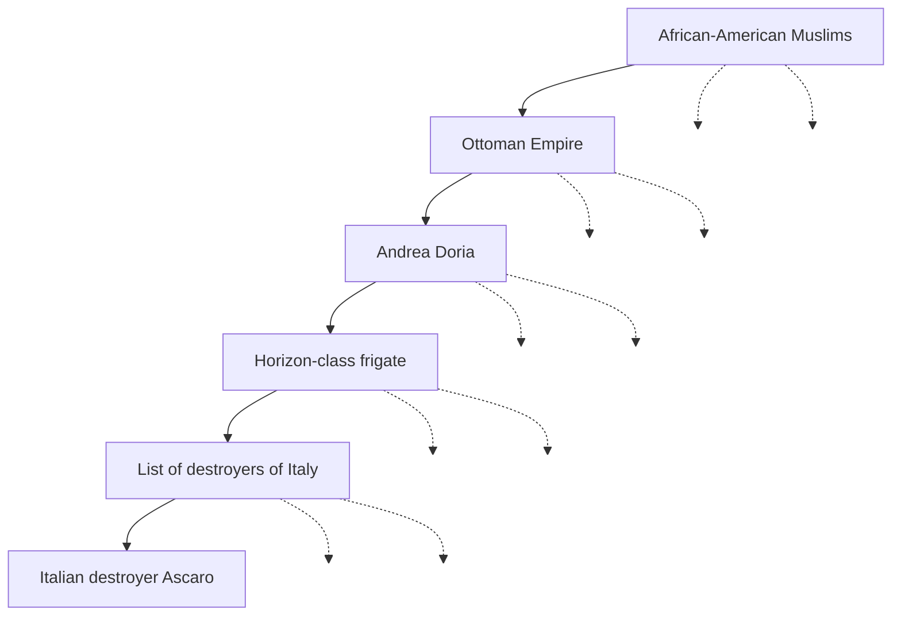
```mermaid
graph TD
    N0["African-American Muslims"]
    N1["Ottoman Empire"]
    N2["Andrea Doria"]
    N3["Horizon-class frigate"]
    N4["List of destroyers of Italy"]
    N5["Italian destroyer Ascaro"]
    N0 --> N1
    N0 -.-> D0L
    N0 -.-> D0R
    N1 --> N2
    N1 -.-> D1L
    N1 -.-> D1R
    N2 --> N3
    N2 -.-> D2L
    N2 -.-> D2R
    N3 --> N4
    N3 -.-> D3L
    N3 -.-> D3R
    N4 --> N5
    N4 -.-> D4L
    N4 -.-> D4R
    D0L[ ]
    D0R[ ]
    D1L[ ]
    D1R[ ]
    D2L[ ]
    D2R[ ]
    D3L[ ]
    D3R[ ]
    D4L[ ]
    D4R[ ]

    %% Style dummy nodes as transparent
    style D0L fill:transparent,stroke:transparent
    style D0R fill:transparent,stroke:transparent
    style D1L fill:transparent,stroke:transparent
    style D1R fill:transparent,stroke:transparent
    style D2L fill:transparent,stroke:transparent
    style D2R fill:transparent,stroke:transparent
    style D3L fill:transparent,stroke:transparent
    style D3R fill:transparent,stroke:transparent
    style D4L fill:transparent,stroke:transparent
    style D4R fill:transparent,stroke:transparent
```

## Path 2

**3 hops**: T._M._Karthik → ISSN → ISO_15924 → Private_Use_Areas

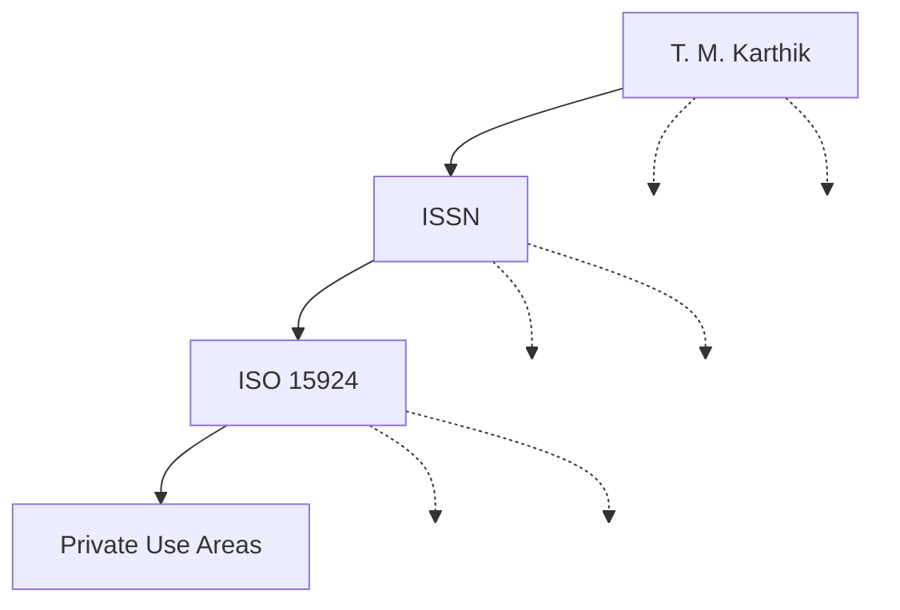
```mermaid
graph TD
    N0["T. M. Karthik"]
    N1["ISSN"]
    N2["ISO 15924"]
    N3["Private Use Areas"]
    N0 --> N1
    N0 -.-> D0L
    N0 -.-> D0R
    N1 --> N2
    N1 -.-> D1L
    N1 -.-> D1R
    N2 --> N3
    N2 -.-> D2L
    N2 -.-> D2R
    D0L[ ]
    D0R[ ]
    D1L[ ]
    D1R[ ]
    D2L[ ]
    D2R[ ]

    %% Style dummy nodes as transparent
    style D0L fill:transparent,stroke:transparent
    style D0R fill:transparent,stroke:transparent
    style D1L fill:transparent,stroke:transparent
    style D1R fill:transparent,stroke:transparent
    style D2L fill:transparent,stroke:transparent
    style D2R fill:transparent,stroke:transparent
```

## Path 3

**5 hops**: Marcus_Cocceius_Anicius_Faustus_Flavianus → Roman_Empire → Argonautica → Romantic_fantasy → Catherine_Asaro_bibliography → Sunrise_Alley

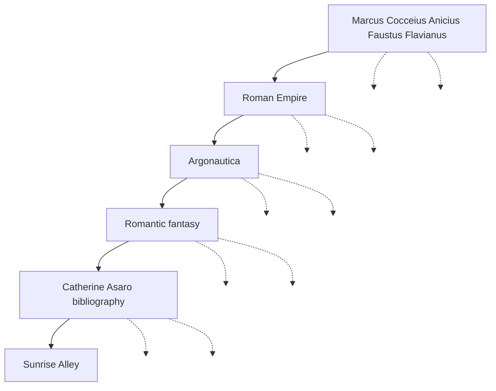
```mermaid
graph TD
    N0["Marcus Cocceius Anicius Faustus Flavianus"]
    N1["Roman Empire"]
    N2["Argonautica"]
    N3["Romantic fantasy"]
    N4["Catherine Asaro bibliography"]
    N5["Sunrise Alley"]
    N0 --> N1
    N0 -.-> D0L
    N0 -.-> D0R
    N1 --> N2
    N1 -.-> D1L
    N1 -.-> D1R
    N2 --> N3
    N2 -.-> D2L
    N2 -.-> D2R
    N3 --> N4
    N3 -.-> D3L
    N3 -.-> D3R
    N4 --> N5
    N4 -.-> D4L
    N4 -.-> D4R
    D0L[ ]
    D0R[ ]
    D1L[ ]
    D1R[ ]
    D2L[ ]
    D2R[ ]
    D3L[ ]
    D3R[ ]
    D4L[ ]
    D4R[ ]

    %% Style dummy nodes as transparent
    style D0L fill:transparent,stroke:transparent
    style D0R fill:transparent,stroke:transparent
    style D1L fill:transparent,stroke:transparent
    style D1R fill:transparent,stroke:transparent
    style D2L fill:transparent,stroke:transparent
    style D2R fill:transparent,stroke:transparent
    style D3L fill:transparent,stroke:transparent
    style D3R fill:transparent,stroke:transparent
    style D4L fill:transparent,stroke:transparent
    style D4R fill:transparent,stroke:transparent
```

## Path 4

**6 hops**: Mycena_aetites → Fungus → Tropical_cyclone → List_of_historical_tropical_cyclone_names → List_of_named_storms → List_of_named_storms_(C) → List_of_storms_named_Colleen

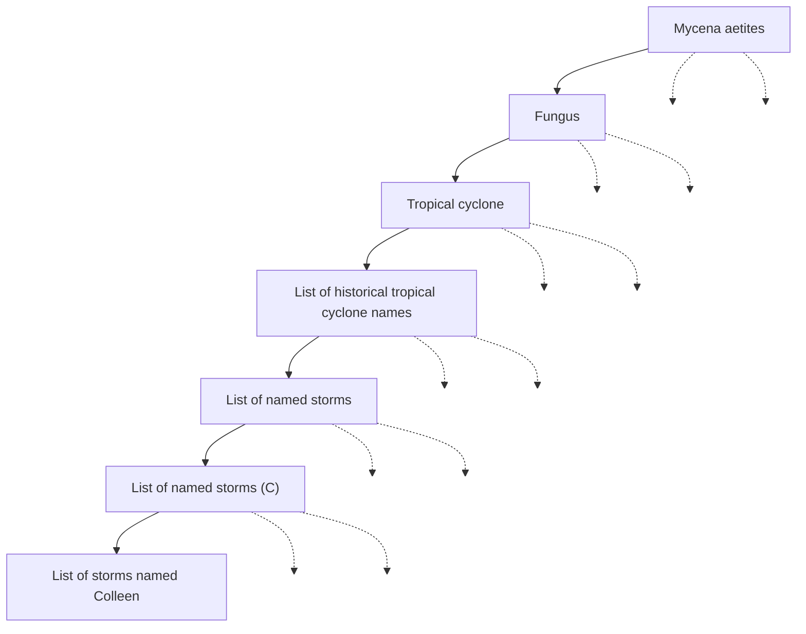
```mermaid
graph TD
    N0["Mycena aetites"]
    N1["Fungus"]
    N2["Tropical cyclone"]
    N3["List of historical tropical cyclone names"]
    N4["List of named storms"]
    N5["List of named storms (C)"]
    N6["List of storms named Colleen"]
    N0 --> N1
    N0 -.-> D0L
    N0 -.-> D0R
    N1 --> N2
    N1 -.-> D1L
    N1 -.-> D1R
    N2 --> N3
    N2 -.-> D2L
    N2 -.-> D2R
    N3 --> N4
    N3 -.-> D3L
    N3 -.-> D3R
    N4 --> N5
    N4 -.-> D4L
    N4 -.-> D4R
    N5 --> N6
    N5 -.-> D5L
    N5 -.-> D5R
    D0L[ ]
    D0R[ ]
    D1L[ ]
    D1R[ ]
    D2L[ ]
    D2R[ ]
    D3L[ ]
    D3R[ ]
    D4L[ ]
    D4R[ ]
    D5L[ ]
    D5R[ ]

    %% Style dummy nodes as transparent
    style D0L fill:transparent,stroke:transparent
    style D0R fill:transparent,stroke:transparent
    style D1L fill:transparent,stroke:transparent
    style D1R fill:transparent,stroke:transparent
    style D2L fill:transparent,stroke:transparent
    style D2R fill:transparent,stroke:transparent
    style D3L fill:transparent,stroke:transparent
    style D3R fill:transparent,stroke:transparent
    style D4L fill:transparent,stroke:transparent
    style D4R fill:transparent,stroke:transparent
    style D5L fill:transparent,stroke:transparent
    style D5R fill:transparent,stroke:transparent
```

## Path 5

**3 hops**: Dissolution_of_the_Holy_Roman_Empire → Apocalyptic_literature → Books_of_Kings → Zedekiah

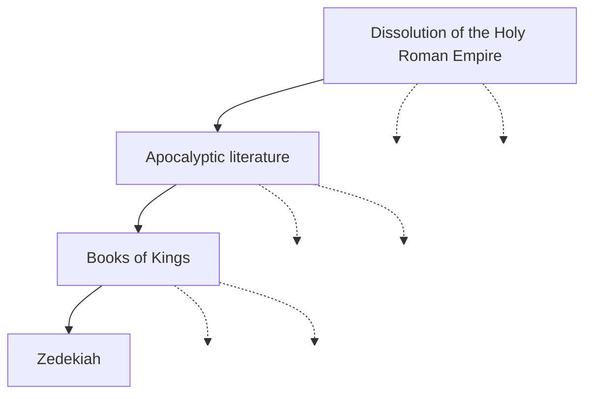
```mermaid
graph TD
    N0["Dissolution of the Holy Roman Empire"]
    N1["Apocalyptic literature"]
    N2["Books of Kings"]
    N3["Zedekiah"]
    N0 --> N1
    N0 -.-> D0L
    N0 -.-> D0R
    N1 --> N2
    N1 -.-> D1L
    N1 -.-> D1R
    N2 --> N3
    N2 -.-> D2L
    N2 -.-> D2R
    D0L[ ]
    D0R[ ]
    D1L[ ]
    D1R[ ]
    D2L[ ]
    D2R[ ]

    %% Style dummy nodes as transparent
    style D0L fill:transparent,stroke:transparent
    style D0R fill:transparent,stroke:transparent
    style D1L fill:transparent,stroke:transparent
    style D1R fill:transparent,stroke:transparent
    style D2L fill:transparent,stroke:transparent
    style D2R fill:transparent,stroke:transparent
```

## Path 6

**3 hops**: Diane_Eshin_Rizzetto → Ensō → Lolita_fashion → Dark_wave

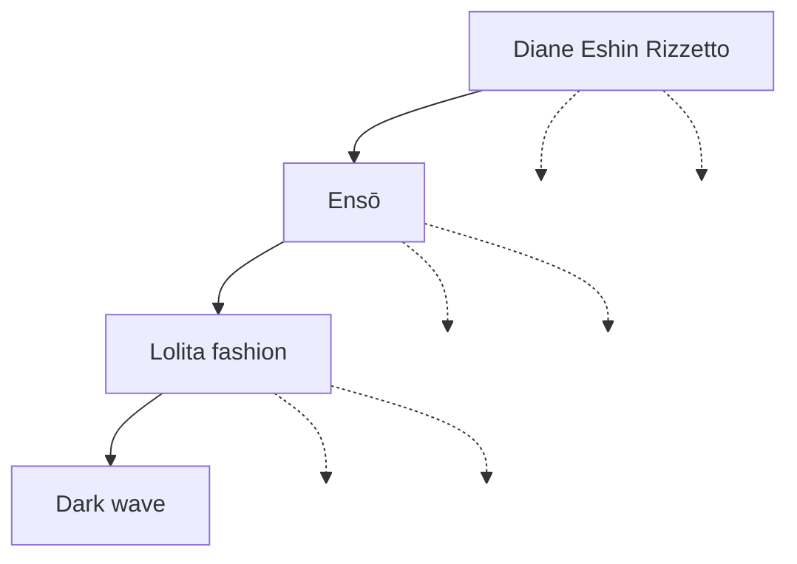
```mermaid
graph TD
    N0["Diane Eshin Rizzetto"]
    N1["Ensō"]
    N2["Lolita fashion"]
    N3["Dark wave"]
    N0 --> N1
    N0 -.-> D0L
    N0 -.-> D0R
    N1 --> N2
    N1 -.-> D1L
    N1 -.-> D1R
    N2 --> N3
    N2 -.-> D2L
    N2 -.-> D2R
    D0L[ ]
    D0R[ ]
    D1L[ ]
    D1R[ ]
    D2L[ ]
    D2R[ ]

    %% Style dummy nodes as transparent
    style D0L fill:transparent,stroke:transparent
    style D0R fill:transparent,stroke:transparent
    style D1L fill:transparent,stroke:transparent
    style D1R fill:transparent,stroke:transparent
    style D2L fill:transparent,stroke:transparent
    style D2R fill:transparent,stroke:transparent
```

## Path 7

**3 hops**: Carlos_Varela_(wrestler) → Atlanta → Cartoon_Network → Primal_(TV_series)

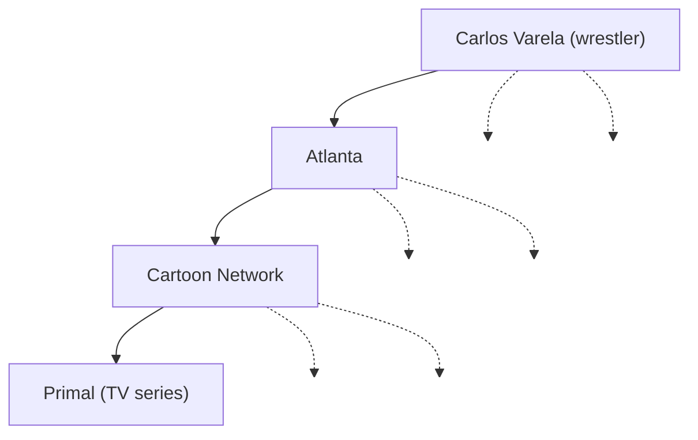
```mermaid
graph TD
    N0["Carlos Varela (wrestler)"]
    N1["Atlanta"]
    N2["Cartoon Network"]
    N3["Primal (TV series)"]
    N0 --> N1
    N0 -.-> D0L
    N0 -.-> D0R
    N1 --> N2
    N1 -.-> D1L
    N1 -.-> D1R
    N2 --> N3
    N2 -.-> D2L
    N2 -.-> D2R
    D0L[ ]
    D0R[ ]
    D1L[ ]
    D1R[ ]
    D2L[ ]
    D2R[ ]

    %% Style dummy nodes as transparent
    style D0L fill:transparent,stroke:transparent
    style D0R fill:transparent,stroke:transparent
    style D1L fill:transparent,stroke:transparent
    style D1R fill:transparent,stroke:transparent
    style D2L fill:transparent,stroke:transparent
    style D2R fill:transparent,stroke:transparent
```

## Path 8

**4 hops**: Payment_Card_Industry_Data_Security_Standard → United_States → List_of_cities_by_GDP → Offenburg → Dirk_von_Lowtzow

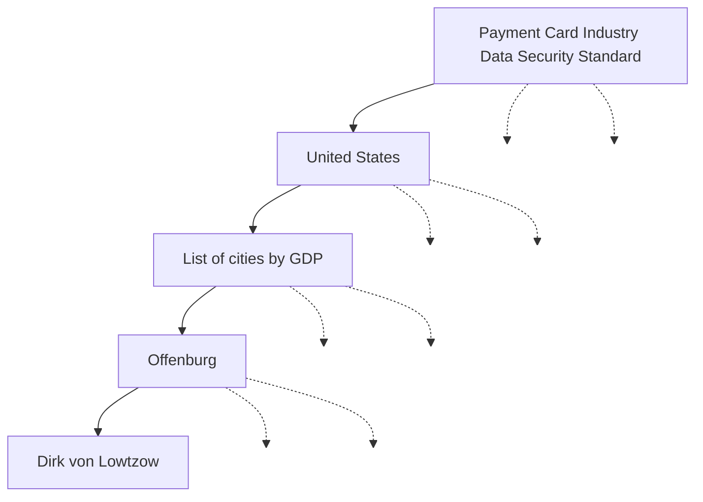
```mermaid
graph TD
    N0["Payment Card Industry Data Security Standard"]
    N1["United States"]
    N2["List of cities by GDP"]
    N3["Offenburg"]
    N4["Dirk von Lowtzow"]
    N0 --> N1
    N0 -.-> D0L
    N0 -.-> D0R
    N1 --> N2
    N1 -.-> D1L
    N1 -.-> D1R
    N2 --> N3
    N2 -.-> D2L
    N2 -.-> D2R
    N3 --> N4
    N3 -.-> D3L
    N3 -.-> D3R
    D0L[ ]
    D0R[ ]
    D1L[ ]
    D1R[ ]
    D2L[ ]
    D2R[ ]
    D3L[ ]
    D3R[ ]

    %% Style dummy nodes as transparent
    style D0L fill:transparent,stroke:transparent
    style D0R fill:transparent,stroke:transparent
    style D1L fill:transparent,stroke:transparent
    style D1R fill:transparent,stroke:transparent
    style D2L fill:transparent,stroke:transparent
    style D2R fill:transparent,stroke:transparent
    style D3L fill:transparent,stroke:transparent
    style D3R fill:transparent,stroke:transparent
```

## Path 9

**4 hops**: Most_of_Me → 2011_in_literature → April_17 → Mazandaran_province → Mohammad_Salih_al-Mazandarani

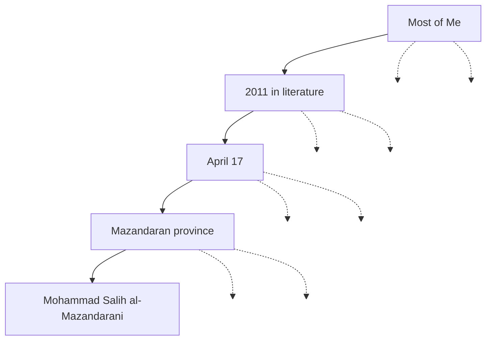
```mermaid
graph TD
    N0["Most of Me"]
    N1["2011 in literature"]
    N2["April 17"]
    N3["Mazandaran province"]
    N4["Mohammad Salih al-Mazandarani"]
    N0 --> N1
    N0 -.-> D0L
    N0 -.-> D0R
    N1 --> N2
    N1 -.-> D1L
    N1 -.-> D1R
    N2 --> N3
    N2 -.-> D2L
    N2 -.-> D2R
    N3 --> N4
    N3 -.-> D3L
    N3 -.-> D3R
    D0L[ ]
    D0R[ ]
    D1L[ ]
    D1R[ ]
    D2L[ ]
    D2R[ ]
    D3L[ ]
    D3R[ ]

    %% Style dummy nodes as transparent
    style D0L fill:transparent,stroke:transparent
    style D0R fill:transparent,stroke:transparent
    style D1L fill:transparent,stroke:transparent
    style D1R fill:transparent,stroke:transparent
    style D2L fill:transparent,stroke:transparent
    style D2R fill:transparent,stroke:transparent
    style D3L fill:transparent,stroke:transparent
    style D3R fill:transparent,stroke:transparent
```

## Path 10

**5 hops**: People's_Planning_in_Kerala → Constitution_of_India → George_Robinson,_1st_Marquess_of_Ripon → North_Yorkshire → Embsay_and_Bolton_Abbey_Steam_Railway → Grassington_&_Threshfield_railway_station

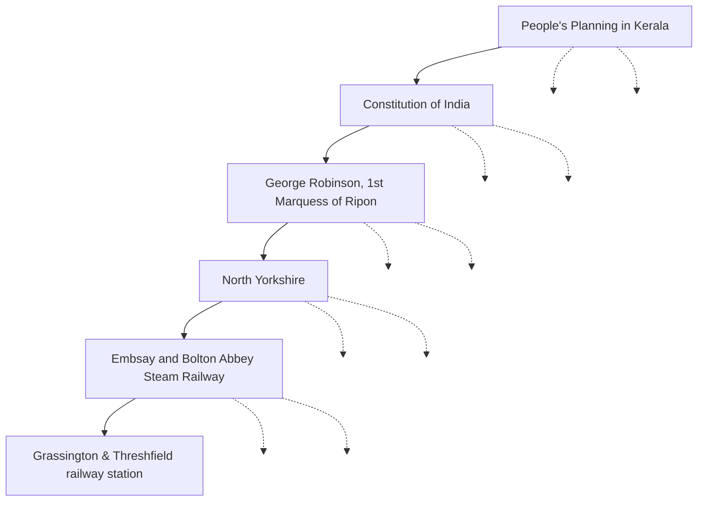
```mermaid
graph TD
    N0["People's Planning in Kerala"]
    N1["Constitution of India"]
    N2["George Robinson, 1st Marquess of Ripon"]
    N3["North Yorkshire"]
    N4["Embsay and Bolton Abbey Steam Railway"]
    N5["Grassington & Threshfield railway station"]
    N0 --> N1
    N0 -.-> D0L
    N0 -.-> D0R
    N1 --> N2
    N1 -.-> D1L
    N1 -.-> D1R
    N2 --> N3
    N2 -.-> D2L
    N2 -.-> D2R
    N3 --> N4
    N3 -.-> D3L
    N3 -.-> D3R
    N4 --> N5
    N4 -.-> D4L
    N4 -.-> D4R
    D0L[ ]
    D0R[ ]
    D1L[ ]
    D1R[ ]
    D2L[ ]
    D2R[ ]
    D3L[ ]
    D3R[ ]
    D4L[ ]
    D4R[ ]

    %% Style dummy nodes as transparent
    style D0L fill:transparent,stroke:transparent
    style D0R fill:transparent,stroke:transparent
    style D1L fill:transparent,stroke:transparent
    style D1R fill:transparent,stroke:transparent
    style D2L fill:transparent,stroke:transparent
    style D2R fill:transparent,stroke:transparent
    style D3L fill:transparent,stroke:transparent
    style D3R fill:transparent,stroke:transparent
    style D4L fill:transparent,stroke:transparent
    style D4R fill:transparent,stroke:transparent
```

## Path 11

**4 hops**: Hardik_Abhinandan → Gujarati_language → Manchester → Burnley → Guy_Fawkes_Night

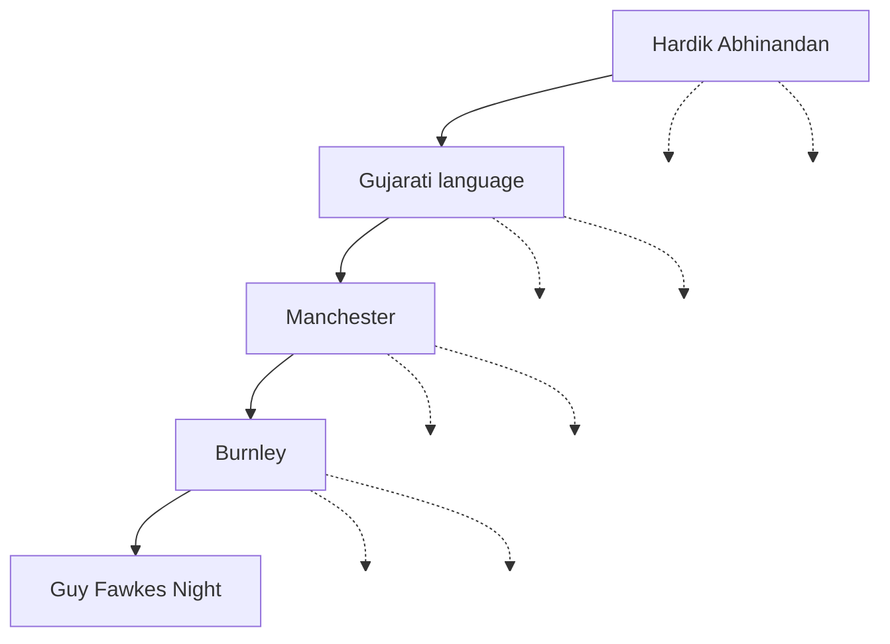
```mermaid
graph TD
    N0["Hardik Abhinandan"]
    N1["Gujarati language"]
    N2["Manchester"]
    N3["Burnley"]
    N4["Guy Fawkes Night"]
    N0 --> N1
    N0 -.-> D0L
    N0 -.-> D0R
    N1 --> N2
    N1 -.-> D1L
    N1 -.-> D1R
    N2 --> N3
    N2 -.-> D2L
    N2 -.-> D2R
    N3 --> N4
    N3 -.-> D3L
    N3 -.-> D3R
    D0L[ ]
    D0R[ ]
    D1L[ ]
    D1R[ ]
    D2L[ ]
    D2R[ ]
    D3L[ ]
    D3R[ ]

    %% Style dummy nodes as transparent
    style D0L fill:transparent,stroke:transparent
    style D0R fill:transparent,stroke:transparent
    style D1L fill:transparent,stroke:transparent
    style D1R fill:transparent,stroke:transparent
    style D2L fill:transparent,stroke:transparent
    style D2R fill:transparent,stroke:transparent
    style D3L fill:transparent,stroke:transparent
    style D3R fill:transparent,stroke:transparent
```

## Path 12

**3 hops**: Masoud_Keshmiri → Iranian_peoples → Yazidism → Religion_in_the_Netherlands

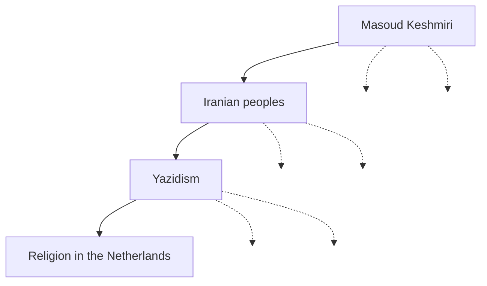
```mermaid
graph TD
    N0["Masoud Keshmiri"]
    N1["Iranian peoples"]
    N2["Yazidism"]
    N3["Religion in the Netherlands"]
    N0 --> N1
    N0 -.-> D0L
    N0 -.-> D0R
    N1 --> N2
    N1 -.-> D1L
    N1 -.-> D1R
    N2 --> N3
    N2 -.-> D2L
    N2 -.-> D2R
    D0L[ ]
    D0R[ ]
    D1L[ ]
    D1R[ ]
    D2L[ ]
    D2R[ ]

    %% Style dummy nodes as transparent
    style D0L fill:transparent,stroke:transparent
    style D0R fill:transparent,stroke:transparent
    style D1L fill:transparent,stroke:transparent
    style D1R fill:transparent,stroke:transparent
    style D2L fill:transparent,stroke:transparent
    style D2R fill:transparent,stroke:transparent
```

## Path 13

**4 hops**: Mária_Gulácsy → Hungary → Unincorporated_area → Karlskrona → Juan_Flaco

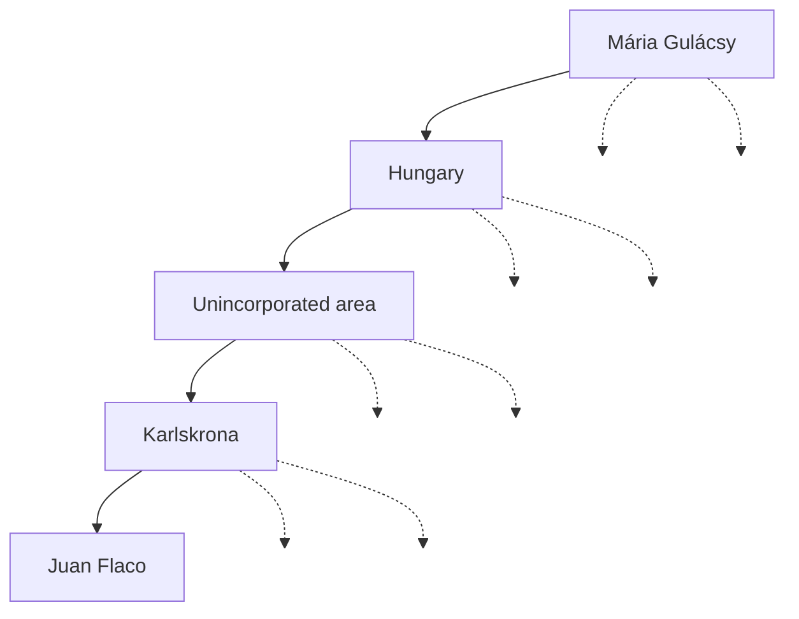
```mermaid
graph TD
    N0["Mária Gulácsy"]
    N1["Hungary"]
    N2["Unincorporated area"]
    N3["Karlskrona"]
    N4["Juan Flaco"]
    N0 --> N1
    N0 -.-> D0L
    N0 -.-> D0R
    N1 --> N2
    N1 -.-> D1L
    N1 -.-> D1R
    N2 --> N3
    N2 -.-> D2L
    N2 -.-> D2R
    N3 --> N4
    N3 -.-> D3L
    N3 -.-> D3R
    D0L[ ]
    D0R[ ]
    D1L[ ]
    D1R[ ]
    D2L[ ]
    D2R[ ]
    D3L[ ]
    D3R[ ]

    %% Style dummy nodes as transparent
    style D0L fill:transparent,stroke:transparent
    style D0R fill:transparent,stroke:transparent
    style D1L fill:transparent,stroke:transparent
    style D1R fill:transparent,stroke:transparent
    style D2L fill:transparent,stroke:transparent
    style D2R fill:transparent,stroke:transparent
    style D3L fill:transparent,stroke:transparent
    style D3R fill:transparent,stroke:transparent
```

## Path 14

**5 hops**: Odense_Boldklub → Scotland → Manx_language → Patrick_(given_name) → Patrizio → Patrizio_Di_Renzo

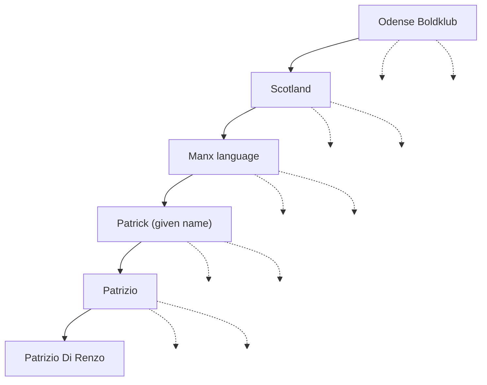
```mermaid
graph TD
    N0["Odense Boldklub"]
    N1["Scotland"]
    N2["Manx language"]
    N3["Patrick (given name)"]
    N4["Patrizio"]
    N5["Patrizio Di Renzo"]
    N0 --> N1
    N0 -.-> D0L
    N0 -.-> D0R
    N1 --> N2
    N1 -.-> D1L
    N1 -.-> D1R
    N2 --> N3
    N2 -.-> D2L
    N2 -.-> D2R
    N3 --> N4
    N3 -.-> D3L
    N3 -.-> D3R
    N4 --> N5
    N4 -.-> D4L
    N4 -.-> D4R
    D0L[ ]
    D0R[ ]
    D1L[ ]
    D1R[ ]
    D2L[ ]
    D2R[ ]
    D3L[ ]
    D3R[ ]
    D4L[ ]
    D4R[ ]

    %% Style dummy nodes as transparent
    style D0L fill:transparent,stroke:transparent
    style D0R fill:transparent,stroke:transparent
    style D1L fill:transparent,stroke:transparent
    style D1R fill:transparent,stroke:transparent
    style D2L fill:transparent,stroke:transparent
    style D2R fill:transparent,stroke:transparent
    style D3L fill:transparent,stroke:transparent
    style D3R fill:transparent,stroke:transparent
    style D4L fill:transparent,stroke:transparent
    style D4R fill:transparent,stroke:transparent
```

## Path 15

**3 hops**: Avenue_Bar_shooting → Workers'_Party_(Ireland) → Eastern_Bloc → Great_Construction_Projects_of_Communism

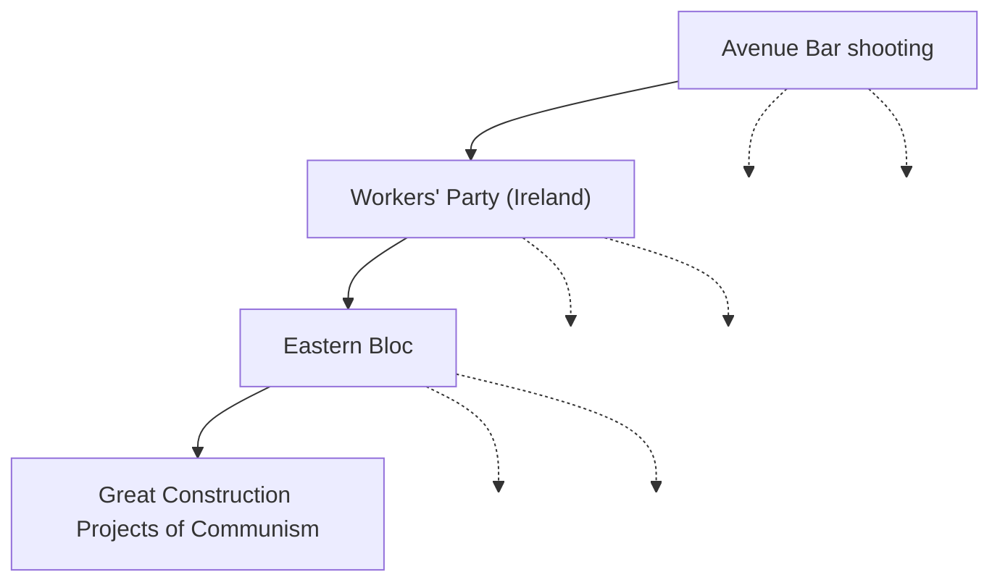
```mermaid
graph TD
    N0["Avenue Bar shooting"]
    N1["Workers' Party (Ireland)"]
    N2["Eastern Bloc"]
    N3["Great Construction Projects of Communism"]
    N0 --> N1
    N0 -.-> D0L
    N0 -.-> D0R
    N1 --> N2
    N1 -.-> D1L
    N1 -.-> D1R
    N2 --> N3
    N2 -.-> D2L
    N2 -.-> D2R
    D0L[ ]
    D0R[ ]
    D1L[ ]
    D1R[ ]
    D2L[ ]
    D2R[ ]

    %% Style dummy nodes as transparent
    style D0L fill:transparent,stroke:transparent
    style D0R fill:transparent,stroke:transparent
    style D1L fill:transparent,stroke:transparent
    style D1R fill:transparent,stroke:transparent
    style D2L fill:transparent,stroke:transparent
    style D2R fill:transparent,stroke:transparent
```

## Path 16

**3 hops**: Turkish_lira → Sultanate_of_Rum → Uzbek_language → Khorazm_Region

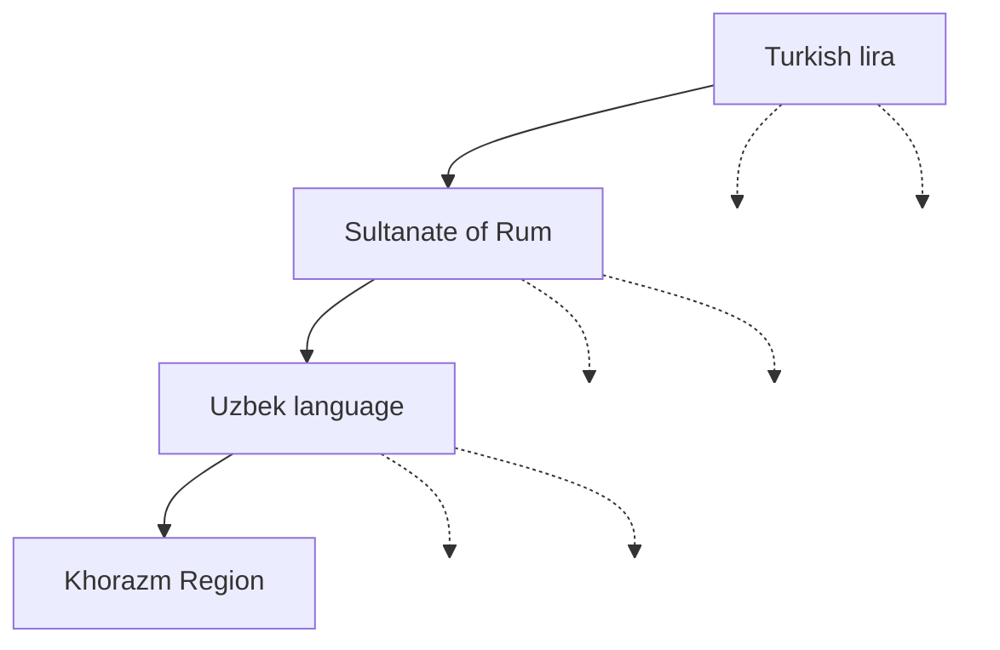
```mermaid
graph TD
    N0["Turkish lira"]
    N1["Sultanate of Rum"]
    N2["Uzbek language"]
    N3["Khorazm Region"]
    N0 --> N1
    N0 -.-> D0L
    N0 -.-> D0R
    N1 --> N2
    N1 -.-> D1L
    N1 -.-> D1R
    N2 --> N3
    N2 -.-> D2L
    N2 -.-> D2R
    D0L[ ]
    D0R[ ]
    D1L[ ]
    D1R[ ]
    D2L[ ]
    D2R[ ]

    %% Style dummy nodes as transparent
    style D0L fill:transparent,stroke:transparent
    style D0R fill:transparent,stroke:transparent
    style D1L fill:transparent,stroke:transparent
    style D1R fill:transparent,stroke:transparent
    style D2L fill:transparent,stroke:transparent
    style D2R fill:transparent,stroke:transparent
```

## Path 17

**4 hops**: Visual_arts_in_Israel → Neo_Geo → Sega → Sports_Interactive → Football_Manager_2014

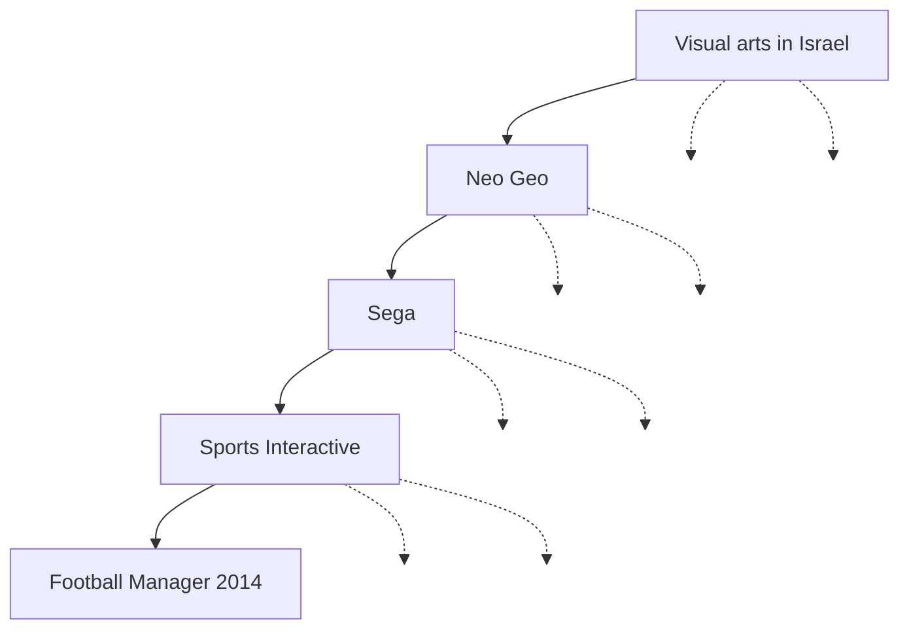
```mermaid
graph TD
    N0["Visual arts in Israel"]
    N1["Neo Geo"]
    N2["Sega"]
    N3["Sports Interactive"]
    N4["Football Manager 2014"]
    N0 --> N1
    N0 -.-> D0L
    N0 -.-> D0R
    N1 --> N2
    N1 -.-> D1L
    N1 -.-> D1R
    N2 --> N3
    N2 -.-> D2L
    N2 -.-> D2R
    N3 --> N4
    N3 -.-> D3L
    N3 -.-> D3R
    D0L[ ]
    D0R[ ]
    D1L[ ]
    D1R[ ]
    D2L[ ]
    D2R[ ]
    D3L[ ]
    D3R[ ]

    %% Style dummy nodes as transparent
    style D0L fill:transparent,stroke:transparent
    style D0R fill:transparent,stroke:transparent
    style D1L fill:transparent,stroke:transparent
    style D1R fill:transparent,stroke:transparent
    style D2L fill:transparent,stroke:transparent
    style D2R fill:transparent,stroke:transparent
    style D3L fill:transparent,stroke:transparent
    style D3R fill:transparent,stroke:transparent
```

## Path 18

**4 hops**: Sorcerer_(Dungeons_&_Dragons) → Anarchism → Voltairine_de_Cleyre → Cooper_Union → Nader_Tehrani

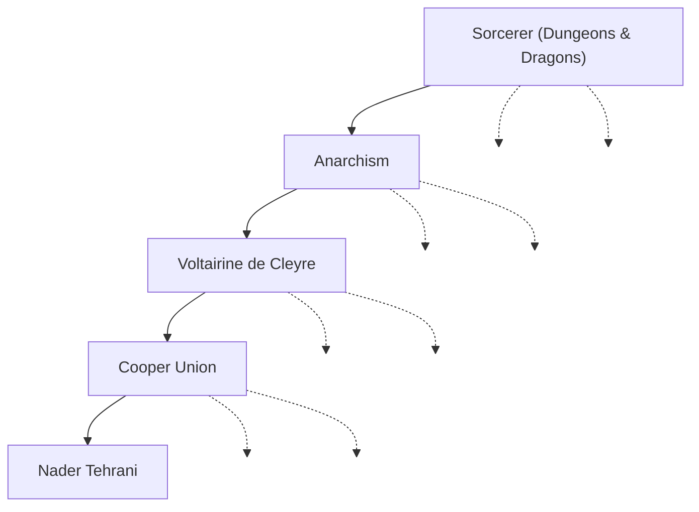
```mermaid
graph TD
    N0["Sorcerer (Dungeons & Dragons)"]
    N1["Anarchism"]
    N2["Voltairine de Cleyre"]
    N3["Cooper Union"]
    N4["Nader Tehrani"]
    N0 --> N1
    N0 -.-> D0L
    N0 -.-> D0R
    N1 --> N2
    N1 -.-> D1L
    N1 -.-> D1R
    N2 --> N3
    N2 -.-> D2L
    N2 -.-> D2R
    N3 --> N4
    N3 -.-> D3L
    N3 -.-> D3R
    D0L[ ]
    D0R[ ]
    D1L[ ]
    D1R[ ]
    D2L[ ]
    D2R[ ]
    D3L[ ]
    D3R[ ]

    %% Style dummy nodes as transparent
    style D0L fill:transparent,stroke:transparent
    style D0R fill:transparent,stroke:transparent
    style D1L fill:transparent,stroke:transparent
    style D1R fill:transparent,stroke:transparent
    style D2L fill:transparent,stroke:transparent
    style D2R fill:transparent,stroke:transparent
    style D3L fill:transparent,stroke:transparent
    style D3R fill:transparent,stroke:transparent
```

## Path 19

**4 hops**: Krassimir_Ivandjiiski → Antisemitism → Mexico_City → Hyderabad → Dr._B.R._Ambedkar_Open_University

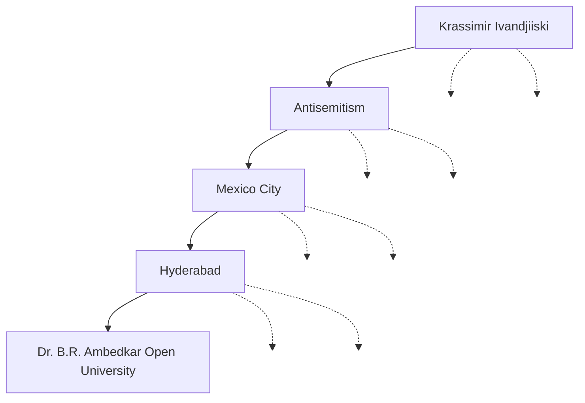
```mermaid
graph TD
    N0["Krassimir Ivandjiiski"]
    N1["Antisemitism"]
    N2["Mexico City"]
    N3["Hyderabad"]
    N4["Dr. B.R. Ambedkar Open University"]
    N0 --> N1
    N0 -.-> D0L
    N0 -.-> D0R
    N1 --> N2
    N1 -.-> D1L
    N1 -.-> D1R
    N2 --> N3
    N2 -.-> D2L
    N2 -.-> D2R
    N3 --> N4
    N3 -.-> D3L
    N3 -.-> D3R
    D0L[ ]
    D0R[ ]
    D1L[ ]
    D1R[ ]
    D2L[ ]
    D2R[ ]
    D3L[ ]
    D3R[ ]

    %% Style dummy nodes as transparent
    style D0L fill:transparent,stroke:transparent
    style D0R fill:transparent,stroke:transparent
    style D1L fill:transparent,stroke:transparent
    style D1R fill:transparent,stroke:transparent
    style D2L fill:transparent,stroke:transparent
    style D2R fill:transparent,stroke:transparent
    style D3L fill:transparent,stroke:transparent
    style D3R fill:transparent,stroke:transparent
```

## Path 20

**4 hops**: Panzanella → Olivier_salad → French_language → Transport_in_France → Trams_in_France

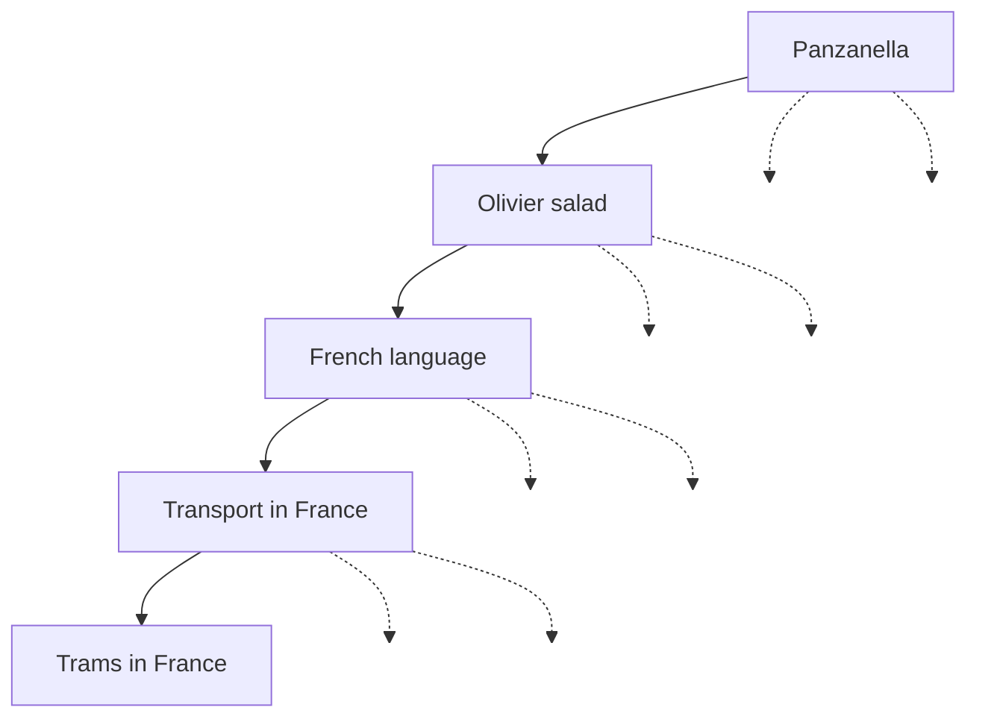
```mermaid
graph TD
    N0["Panzanella"]
    N1["Olivier salad"]
    N2["French language"]
    N3["Transport in France"]
    N4["Trams in France"]
    N0 --> N1
    N0 -.-> D0L
    N0 -.-> D0R
    N1 --> N2
    N1 -.-> D1L
    N1 -.-> D1R
    N2 --> N3
    N2 -.-> D2L
    N2 -.-> D2R
    N3 --> N4
    N3 -.-> D3L
    N3 -.-> D3R
    D0L[ ]
    D0R[ ]
    D1L[ ]
    D1R[ ]
    D2L[ ]
    D2R[ ]
    D3L[ ]
    D3R[ ]

    %% Style dummy nodes as transparent
    style D0L fill:transparent,stroke:transparent
    style D0R fill:transparent,stroke:transparent
    style D1L fill:transparent,stroke:transparent
    style D1R fill:transparent,stroke:transparent
    style D2L fill:transparent,stroke:transparent
    style D2R fill:transparent,stroke:transparent
    style D3L fill:transparent,stroke:transparent
    style D3R fill:transparent,stroke:transparent
```

## Path 21

**4 hops**: Sakacin → ISBN → United_States → College_football → Touchdown

```mermaid
graph TD
    N0["Sakacin"]
    N1["ISBN"]
    N2["United States"]
    N3["College football"]
    N4["Touchdown"]
    N0 --> N1
    N0 -.-> D0L
    N0 -.-> D0R
    N1 --> N2
    N1 -.-> D1L
    N1 -.-> D1R
    N2 --> N3
    N2 -.-> D2L
    N2 -.-> D2R
    N3 --> N4
    N3 -.-> D3L
    N3 -.-> D3R
    D0L[ ]
    D0R[ ]
    D1L[ ]
    D1R[ ]
    D2L[ ]
    D2R[ ]
    D3L[ ]
    D3R[ ]

    %% Style dummy nodes as transparent
    style D0L fill:transparent,stroke:transparent
    style D0R fill:transparent,stroke:transparent
    style D1L fill:transparent,stroke:transparent
    style D1R fill:transparent,stroke:transparent
    style D2L fill:transparent,stroke:transparent
    style D2R fill:transparent,stroke:transparent
    style D3L fill:transparent,stroke:transparent
    style D3R fill:transparent,stroke:transparent
```

## Path 22

**3 hops**: Gal_Mekel → COVID-19_lockdowns_in_Italy → Impact_of_the_COVID-19_pandemic_on_the_music_industry → Notes_on_a_Conditional_Form

```mermaid
graph TD
    N0["Gal Mekel"]
    N1["COVID-19 lockdowns in Italy"]
    N2["Impact of the COVID-19 pandemic on the music industry"]
    N3["Notes on a Conditional Form"]
    N0 --> N1
    N0 -.-> D0L
    N0 -.-> D0R
    N1 --> N2
    N1 -.-> D1L
    N1 -.-> D1R
    N2 --> N3
    N2 -.-> D2L
    N2 -.-> D2R
    D0L[ ]
    D0R[ ]
    D1L[ ]
    D1R[ ]
    D2L[ ]
    D2R[ ]

    %% Style dummy nodes as transparent
    style D0L fill:transparent,stroke:transparent
    style D0R fill:transparent,stroke:transparent
    style D1L fill:transparent,stroke:transparent
    style D1R fill:transparent,stroke:transparent
    style D2L fill:transparent,stroke:transparent
    style D2R fill:transparent,stroke:transparent
```

## Path 23

**3 hops**: Leimbach,_Aargau → Rent-to-own → The_Buffalo_News → Statesville_Record_&_Landmark

```mermaid
graph TD
    N0["Leimbach, Aargau"]
    N1["Rent-to-own"]
    N2["The Buffalo News"]
    N3["Statesville Record & Landmark"]
    N0 --> N1
    N0 -.-> D0L
    N0 -.-> D0R
    N1 --> N2
    N1 -.-> D1L
    N1 -.-> D1R
    N2 --> N3
    N2 -.-> D2L
    N2 -.-> D2R
    D0L[ ]
    D0R[ ]
    D1L[ ]
    D1R[ ]
    D2L[ ]
    D2R[ ]

    %% Style dummy nodes as transparent
    style D0L fill:transparent,stroke:transparent
    style D0R fill:transparent,stroke:transparent
    style D1L fill:transparent,stroke:transparent
    style D1R fill:transparent,stroke:transparent
    style D2L fill:transparent,stroke:transparent
    style D2R fill:transparent,stroke:transparent
```

## Path 24

**5 hops**: Diane_Eshin_Rizzetto → Nyanaponika_Thera → Berlin → List_of_twin_towns_and_sister_cities_in_Germany → Gmina_Gryfice → Rzęsin

```mermaid
graph TD
    N0["Diane Eshin Rizzetto"]
    N1["Nyanaponika Thera"]
    N2["Berlin"]
    N3["List of twin towns and sister cities in Germany"]
    N4["Gmina Gryfice"]
    N5["Rzęsin"]
    N0 --> N1
    N0 -.-> D0L
    N0 -.-> D0R
    N1 --> N2
    N1 -.-> D1L
    N1 -.-> D1R
    N2 --> N3
    N2 -.-> D2L
    N2 -.-> D2R
    N3 --> N4
    N3 -.-> D3L
    N3 -.-> D3R
    N4 --> N5
    N4 -.-> D4L
    N4 -.-> D4R
    D0L[ ]
    D0R[ ]
    D1L[ ]
    D1R[ ]
    D2L[ ]
    D2R[ ]
    D3L[ ]
    D3R[ ]
    D4L[ ]
    D4R[ ]

    %% Style dummy nodes as transparent
    style D0L fill:transparent,stroke:transparent
    style D0R fill:transparent,stroke:transparent
    style D1L fill:transparent,stroke:transparent
    style D1R fill:transparent,stroke:transparent
    style D2L fill:transparent,stroke:transparent
    style D2R fill:transparent,stroke:transparent
    style D3L fill:transparent,stroke:transparent
    style D3R fill:transparent,stroke:transparent
    style D4L fill:transparent,stroke:transparent
    style D4R fill:transparent,stroke:transparent
```

## Path 25

**3 hops**: Joe_Davison_(footballer,_born_1897) → National_service → Norway → Chaldean_Catholic_Church

```mermaid
graph TD
    N0["Joe Davison (footballer, born 1897)"]
    N1["National service"]
    N2["Norway"]
    N3["Chaldean Catholic Church"]
    N0 --> N1
    N0 -.-> D0L
    N0 -.-> D0R
    N1 --> N2
    N1 -.-> D1L
    N1 -.-> D1R
    N2 --> N3
    N2 -.-> D2L
    N2 -.-> D2R
    D0L[ ]
    D0R[ ]
    D1L[ ]
    D1R[ ]
    D2L[ ]
    D2R[ ]

    %% Style dummy nodes as transparent
    style D0L fill:transparent,stroke:transparent
    style D0R fill:transparent,stroke:transparent
    style D1L fill:transparent,stroke:transparent
    style D1R fill:transparent,stroke:transparent
    style D2L fill:transparent,stroke:transparent
    style D2R fill:transparent,stroke:transparent
```

## Path 26

**2 hops**: Tattoo → ISSN → MPEG-1

```mermaid
graph TD
    N0["Tattoo"]
    N1["ISSN"]
    N2["MPEG-1"]
    N0 --> N1
    N0 -.-> D0L
    N0 -.-> D0R
    N1 --> N2
    N1 -.-> D1L
    N1 -.-> D1R
    D0L[ ]
    D0R[ ]
    D1L[ ]
    D1R[ ]

    %% Style dummy nodes as transparent
    style D0L fill:transparent,stroke:transparent
    style D0R fill:transparent,stroke:transparent
    style D1L fill:transparent,stroke:transparent
    style D1R fill:transparent,stroke:transparent
```

## Path 27

**4 hops**: 1,2-Butadiene → Occupational_safety_and_health → Social_class → French_Revolution → Affair_of_the_Diamond_Necklace

```mermaid
graph TD
    N0["1,2-Butadiene"]
    N1["Occupational safety and health"]
    N2["Social class"]
    N3["French Revolution"]
    N4["Affair of the Diamond Necklace"]
    N0 --> N1
    N0 -.-> D0L
    N0 -.-> D0R
    N1 --> N2
    N1 -.-> D1L
    N1 -.-> D1R
    N2 --> N3
    N2 -.-> D2L
    N2 -.-> D2R
    N3 --> N4
    N3 -.-> D3L
    N3 -.-> D3R
    D0L[ ]
    D0R[ ]
    D1L[ ]
    D1R[ ]
    D2L[ ]
    D2R[ ]
    D3L[ ]
    D3R[ ]

    %% Style dummy nodes as transparent
    style D0L fill:transparent,stroke:transparent
    style D0R fill:transparent,stroke:transparent
    style D1L fill:transparent,stroke:transparent
    style D1R fill:transparent,stroke:transparent
    style D2L fill:transparent,stroke:transparent
    style D2R fill:transparent,stroke:transparent
    style D3L fill:transparent,stroke:transparent
    style D3R fill:transparent,stroke:transparent
```

## Path 28

**5 hops**: Jimmy_Reagan → Benny_Leonard → Joe_Louis → List_of_African-American_visual_artists → List_of_American_artists_before_1900 → Paul_R._Schumann

```mermaid
graph TD
    N0["Jimmy Reagan"]
    N1["Benny Leonard"]
    N2["Joe Louis"]
    N3["List of African-American visual artists"]
    N4["List of American artists before 1900"]
    N5["Paul R. Schumann"]
    N0 --> N1
    N0 -.-> D0L
    N0 -.-> D0R
    N1 --> N2
    N1 -.-> D1L
    N1 -.-> D1R
    N2 --> N3
    N2 -.-> D2L
    N2 -.-> D2R
    N3 --> N4
    N3 -.-> D3L
    N3 -.-> D3R
    N4 --> N5
    N4 -.-> D4L
    N4 -.-> D4R
    D0L[ ]
    D0R[ ]
    D1L[ ]
    D1R[ ]
    D2L[ ]
    D2R[ ]
    D3L[ ]
    D3R[ ]
    D4L[ ]
    D4R[ ]

    %% Style dummy nodes as transparent
    style D0L fill:transparent,stroke:transparent
    style D0R fill:transparent,stroke:transparent
    style D1L fill:transparent,stroke:transparent
    style D1R fill:transparent,stroke:transparent
    style D2L fill:transparent,stroke:transparent
    style D2R fill:transparent,stroke:transparent
    style D3L fill:transparent,stroke:transparent
    style D3R fill:transparent,stroke:transparent
    style D4L fill:transparent,stroke:transparent
    style D4R fill:transparent,stroke:transparent
```

## Path 29

**5 hops**: Colin_Grzanna → Medicine → William_Osler → Galápagos_Islands → List_of_animals_in_the_Galápagos_Islands → Pseudalsophis_occidentalis

```mermaid
graph TD
    N0["Colin Grzanna"]
    N1["Medicine"]
    N2["William Osler"]
    N3["Galápagos Islands"]
    N4["List of animals in the Galápagos Islands"]
    N5["Pseudalsophis occidentalis"]
    N0 --> N1
    N0 -.-> D0L
    N0 -.-> D0R
    N1 --> N2
    N1 -.-> D1L
    N1 -.-> D1R
    N2 --> N3
    N2 -.-> D2L
    N2 -.-> D2R
    N3 --> N4
    N3 -.-> D3L
    N3 -.-> D3R
    N4 --> N5
    N4 -.-> D4L
    N4 -.-> D4R
    D0L[ ]
    D0R[ ]
    D1L[ ]
    D1R[ ]
    D2L[ ]
    D2R[ ]
    D3L[ ]
    D3R[ ]
    D4L[ ]
    D4R[ ]

    %% Style dummy nodes as transparent
    style D0L fill:transparent,stroke:transparent
    style D0R fill:transparent,stroke:transparent
    style D1L fill:transparent,stroke:transparent
    style D1R fill:transparent,stroke:transparent
    style D2L fill:transparent,stroke:transparent
    style D2R fill:transparent,stroke:transparent
    style D3L fill:transparent,stroke:transparent
    style D3R fill:transparent,stroke:transparent
    style D4L fill:transparent,stroke:transparent
    style D4R fill:transparent,stroke:transparent
```

## Path 30

**4 hops**: Florence_Alice_Lubega → English_language → BBC → List_of_companies_based_in_London → Chesham_Amalgamations

```mermaid
graph TD
    N0["Florence Alice Lubega"]
    N1["English language"]
    N2["BBC"]
    N3["List of companies based in London"]
    N4["Chesham Amalgamations"]
    N0 --> N1
    N0 -.-> D0L
    N0 -.-> D0R
    N1 --> N2
    N1 -.-> D1L
    N1 -.-> D1R
    N2 --> N3
    N2 -.-> D2L
    N2 -.-> D2R
    N3 --> N4
    N3 -.-> D3L
    N3 -.-> D3R
    D0L[ ]
    D0R[ ]
    D1L[ ]
    D1R[ ]
    D2L[ ]
    D2R[ ]
    D3L[ ]
    D3R[ ]

    %% Style dummy nodes as transparent
    style D0L fill:transparent,stroke:transparent
    style D0R fill:transparent,stroke:transparent
    style D1L fill:transparent,stroke:transparent
    style D1R fill:transparent,stroke:transparent
    style D2L fill:transparent,stroke:transparent
    style D2R fill:transparent,stroke:transparent
    style D3L fill:transparent,stroke:transparent
    style D3R fill:transparent,stroke:transparent
```

## Path 31

**3 hops**: Order-5_hexagonal_tiling_honeycomb → Regular_icosahedron → Absolute_difference → Relative_change

```mermaid
graph TD
    N0["Order-5 hexagonal tiling honeycomb"]
    N1["Regular icosahedron"]
    N2["Absolute difference"]
    N3["Relative change"]
    N0 --> N1
    N0 -.-> D0L
    N0 -.-> D0R
    N1 --> N2
    N1 -.-> D1L
    N1 -.-> D1R
    N2 --> N3
    N2 -.-> D2L
    N2 -.-> D2R
    D0L[ ]
    D0R[ ]
    D1L[ ]
    D1R[ ]
    D2L[ ]
    D2R[ ]

    %% Style dummy nodes as transparent
    style D0L fill:transparent,stroke:transparent
    style D0R fill:transparent,stroke:transparent
    style D1L fill:transparent,stroke:transparent
    style D1R fill:transparent,stroke:transparent
    style D2L fill:transparent,stroke:transparent
    style D2R fill:transparent,stroke:transparent
```

## Path 32

**4 hops**: Little_Miss_Muffet → Chambers_Dictionary → Scrabble → IPod → Samsung_YEPP

```mermaid
graph TD
    N0["Little Miss Muffet"]
    N1["Chambers Dictionary"]
    N2["Scrabble"]
    N3["IPod"]
    N4["Samsung YEPP"]
    N0 --> N1
    N0 -.-> D0L
    N0 -.-> D0R
    N1 --> N2
    N1 -.-> D1L
    N1 -.-> D1R
    N2 --> N3
    N2 -.-> D2L
    N2 -.-> D2R
    N3 --> N4
    N3 -.-> D3L
    N3 -.-> D3R
    D0L[ ]
    D0R[ ]
    D1L[ ]
    D1R[ ]
    D2L[ ]
    D2R[ ]
    D3L[ ]
    D3R[ ]

    %% Style dummy nodes as transparent
    style D0L fill:transparent,stroke:transparent
    style D0R fill:transparent,stroke:transparent
    style D1L fill:transparent,stroke:transparent
    style D1R fill:transparent,stroke:transparent
    style D2L fill:transparent,stroke:transparent
    style D2R fill:transparent,stroke:transparent
    style D3L fill:transparent,stroke:transparent
    style D3R fill:transparent,stroke:transparent
```

## Path 33

**3 hops**: Siener_van_Rensburg → Second_Boer_War → Ireland → Full_breakfast

```mermaid
graph TD
    N0["Siener van Rensburg"]
    N1["Second Boer War"]
    N2["Ireland"]
    N3["Full breakfast"]
    N0 --> N1
    N0 -.-> D0L
    N0 -.-> D0R
    N1 --> N2
    N1 -.-> D1L
    N1 -.-> D1R
    N2 --> N3
    N2 -.-> D2L
    N2 -.-> D2R
    D0L[ ]
    D0R[ ]
    D1L[ ]
    D1R[ ]
    D2L[ ]
    D2R[ ]

    %% Style dummy nodes as transparent
    style D0L fill:transparent,stroke:transparent
    style D0R fill:transparent,stroke:transparent
    style D1L fill:transparent,stroke:transparent
    style D1R fill:transparent,stroke:transparent
    style D2L fill:transparent,stroke:transparent
    style D2R fill:transparent,stroke:transparent
```

## Path 34

**4 hops**: Astrocyte → Shanghai → Romania → FC_Dinamo_București → CS_Dinamo_București_(basketball)

```mermaid
graph TD
    N0["Astrocyte"]
    N1["Shanghai"]
    N2["Romania"]
    N3["FC Dinamo București"]
    N4["CS Dinamo București (basketball)"]
    N0 --> N1
    N0 -.-> D0L
    N0 -.-> D0R
    N1 --> N2
    N1 -.-> D1L
    N1 -.-> D1R
    N2 --> N3
    N2 -.-> D2L
    N2 -.-> D2R
    N3 --> N4
    N3 -.-> D3L
    N3 -.-> D3R
    D0L[ ]
    D0R[ ]
    D1L[ ]
    D1R[ ]
    D2L[ ]
    D2R[ ]
    D3L[ ]
    D3R[ ]

    %% Style dummy nodes as transparent
    style D0L fill:transparent,stroke:transparent
    style D0R fill:transparent,stroke:transparent
    style D1L fill:transparent,stroke:transparent
    style D1R fill:transparent,stroke:transparent
    style D2L fill:transparent,stroke:transparent
    style D2R fill:transparent,stroke:transparent
    style D3L fill:transparent,stroke:transparent
    style D3R fill:transparent,stroke:transparent
```

## Path 35

**4 hops**: Berklee_College_of_Music → Sexual_harassment → Lynching → Western_Highlands_Province → Tambul-Nebilyer_District

```mermaid
graph TD
    N0["Berklee College of Music"]
    N1["Sexual harassment"]
    N2["Lynching"]
    N3["Western Highlands Province"]
    N4["Tambul-Nebilyer District"]
    N0 --> N1
    N0 -.-> D0L
    N0 -.-> D0R
    N1 --> N2
    N1 -.-> D1L
    N1 -.-> D1R
    N2 --> N3
    N2 -.-> D2L
    N2 -.-> D2R
    N3 --> N4
    N3 -.-> D3L
    N3 -.-> D3R
    D0L[ ]
    D0R[ ]
    D1L[ ]
    D1R[ ]
    D2L[ ]
    D2R[ ]
    D3L[ ]
    D3R[ ]

    %% Style dummy nodes as transparent
    style D0L fill:transparent,stroke:transparent
    style D0R fill:transparent,stroke:transparent
    style D1L fill:transparent,stroke:transparent
    style D1R fill:transparent,stroke:transparent
    style D2L fill:transparent,stroke:transparent
    style D2R fill:transparent,stroke:transparent
    style D3L fill:transparent,stroke:transparent
    style D3R fill:transparent,stroke:transparent
```

## Path 36

**4 hops**: Kullu → Female → Legal_status_of_transgender_people → Adrenal_gland → Angiotensin_II_receptor

```mermaid
graph TD
    N0["Kullu"]
    N1["Female"]
    N2["Legal status of transgender people"]
    N3["Adrenal gland"]
    N4["Angiotensin II receptor"]
    N0 --> N1
    N0 -.-> D0L
    N0 -.-> D0R
    N1 --> N2
    N1 -.-> D1L
    N1 -.-> D1R
    N2 --> N3
    N2 -.-> D2L
    N2 -.-> D2R
    N3 --> N4
    N3 -.-> D3L
    N3 -.-> D3R
    D0L[ ]
    D0R[ ]
    D1L[ ]
    D1R[ ]
    D2L[ ]
    D2R[ ]
    D3L[ ]
    D3R[ ]

    %% Style dummy nodes as transparent
    style D0L fill:transparent,stroke:transparent
    style D0R fill:transparent,stroke:transparent
    style D1L fill:transparent,stroke:transparent
    style D1R fill:transparent,stroke:transparent
    style D2L fill:transparent,stroke:transparent
    style D2R fill:transparent,stroke:transparent
    style D3L fill:transparent,stroke:transparent
    style D3R fill:transparent,stroke:transparent
```

## Path 37

**3 hops**: List_of_personal_coats_of_arms_of_presidents_of_the_United_States → Pelican → DDT → Oxymesterone

```mermaid
graph TD
    N0["List of personal coats of arms of presidents of the United States"]
    N1["Pelican"]
    N2["DDT"]
    N3["Oxymesterone"]
    N0 --> N1
    N0 -.-> D0L
    N0 -.-> D0R
    N1 --> N2
    N1 -.-> D1L
    N1 -.-> D1R
    N2 --> N3
    N2 -.-> D2L
    N2 -.-> D2R
    D0L[ ]
    D0R[ ]
    D1L[ ]
    D1R[ ]
    D2L[ ]
    D2R[ ]

    %% Style dummy nodes as transparent
    style D0L fill:transparent,stroke:transparent
    style D0R fill:transparent,stroke:transparent
    style D1L fill:transparent,stroke:transparent
    style D1R fill:transparent,stroke:transparent
    style D2L fill:transparent,stroke:transparent
    style D2R fill:transparent,stroke:transparent
```

## Path 38

**5 hops**: Tatra_National_Park,_Slovakia → Stream → Pennsylvania → Heinz → Echuca → George_Bazeley

```mermaid
graph TD
    N0["Tatra National Park, Slovakia"]
    N1["Stream"]
    N2["Pennsylvania"]
    N3["Heinz"]
    N4["Echuca"]
    N5["George Bazeley"]
    N0 --> N1
    N0 -.-> D0L
    N0 -.-> D0R
    N1 --> N2
    N1 -.-> D1L
    N1 -.-> D1R
    N2 --> N3
    N2 -.-> D2L
    N2 -.-> D2R
    N3 --> N4
    N3 -.-> D3L
    N3 -.-> D3R
    N4 --> N5
    N4 -.-> D4L
    N4 -.-> D4R
    D0L[ ]
    D0R[ ]
    D1L[ ]
    D1R[ ]
    D2L[ ]
    D2R[ ]
    D3L[ ]
    D3R[ ]
    D4L[ ]
    D4R[ ]

    %% Style dummy nodes as transparent
    style D0L fill:transparent,stroke:transparent
    style D0R fill:transparent,stroke:transparent
    style D1L fill:transparent,stroke:transparent
    style D1R fill:transparent,stroke:transparent
    style D2L fill:transparent,stroke:transparent
    style D2R fill:transparent,stroke:transparent
    style D3L fill:transparent,stroke:transparent
    style D3R fill:transparent,stroke:transparent
    style D4L fill:transparent,stroke:transparent
    style D4R fill:transparent,stroke:transparent
```

## Path 39

**3 hops**: List_of_University_of_Massachusetts_Amherst_residence_halls → John_F._Kennedy → Rosa_Parks → Duncan_Campbell_(journalist,_born_1944)

```mermaid
graph TD
    N0["List of University of Massachusetts Amherst residence halls"]
    N1["John F. Kennedy"]
    N2["Rosa Parks"]
    N3["Duncan Campbell (journalist, born 1944)"]
    N0 --> N1
    N0 -.-> D0L
    N0 -.-> D0R
    N1 --> N2
    N1 -.-> D1L
    N1 -.-> D1R
    N2 --> N3
    N2 -.-> D2L
    N2 -.-> D2R
    D0L[ ]
    D0R[ ]
    D1L[ ]
    D1R[ ]
    D2L[ ]
    D2R[ ]

    %% Style dummy nodes as transparent
    style D0L fill:transparent,stroke:transparent
    style D0R fill:transparent,stroke:transparent
    style D1L fill:transparent,stroke:transparent
    style D1R fill:transparent,stroke:transparent
    style D2L fill:transparent,stroke:transparent
    style D2R fill:transparent,stroke:transparent
```

## Path 40

**4 hops**: Cloud_iridescence → Scientific_American → Alan_Alda → Kevin_Spacey → Keyser_Söze

```mermaid
graph TD
    N0["Cloud iridescence"]
    N1["Scientific American"]
    N2["Alan Alda"]
    N3["Kevin Spacey"]
    N4["Keyser Söze"]
    N0 --> N1
    N0 -.-> D0L
    N0 -.-> D0R
    N1 --> N2
    N1 -.-> D1L
    N1 -.-> D1R
    N2 --> N3
    N2 -.-> D2L
    N2 -.-> D2R
    N3 --> N4
    N3 -.-> D3L
    N3 -.-> D3R
    D0L[ ]
    D0R[ ]
    D1L[ ]
    D1R[ ]
    D2L[ ]
    D2R[ ]
    D3L[ ]
    D3R[ ]

    %% Style dummy nodes as transparent
    style D0L fill:transparent,stroke:transparent
    style D0R fill:transparent,stroke:transparent
    style D1L fill:transparent,stroke:transparent
    style D1R fill:transparent,stroke:transparent
    style D2L fill:transparent,stroke:transparent
    style D2R fill:transparent,stroke:transparent
    style D3L fill:transparent,stroke:transparent
    style D3R fill:transparent,stroke:transparent
```

## Path 41

**4 hops**: Krigia_biflora → Taxonomy_(biology) → Rejection_of_evolution_by_religious_groups → C._S._Lewis → Mark_St._Germain

```mermaid
graph TD
    N0["Krigia biflora"]
    N1["Taxonomy (biology)"]
    N2["Rejection of evolution by religious groups"]
    N3["C. S. Lewis"]
    N4["Mark St. Germain"]
    N0 --> N1
    N0 -.-> D0L
    N0 -.-> D0R
    N1 --> N2
    N1 -.-> D1L
    N1 -.-> D1R
    N2 --> N3
    N2 -.-> D2L
    N2 -.-> D2R
    N3 --> N4
    N3 -.-> D3L
    N3 -.-> D3R
    D0L[ ]
    D0R[ ]
    D1L[ ]
    D1R[ ]
    D2L[ ]
    D2R[ ]
    D3L[ ]
    D3R[ ]

    %% Style dummy nodes as transparent
    style D0L fill:transparent,stroke:transparent
    style D0R fill:transparent,stroke:transparent
    style D1L fill:transparent,stroke:transparent
    style D1R fill:transparent,stroke:transparent
    style D2L fill:transparent,stroke:transparent
    style D2R fill:transparent,stroke:transparent
    style D3L fill:transparent,stroke:transparent
    style D3R fill:transparent,stroke:transparent
```

## Path 42

**3 hops**: A-flat_clarinet → Italy → Culture_of_Europe → Panhellenic_sanctuary

```mermaid
graph TD
    N0["A-flat clarinet"]
    N1["Italy"]
    N2["Culture of Europe"]
    N3["Panhellenic sanctuary"]
    N0 --> N1
    N0 -.-> D0L
    N0 -.-> D0R
    N1 --> N2
    N1 -.-> D1L
    N1 -.-> D1R
    N2 --> N3
    N2 -.-> D2L
    N2 -.-> D2R
    D0L[ ]
    D0R[ ]
    D1L[ ]
    D1R[ ]
    D2L[ ]
    D2R[ ]

    %% Style dummy nodes as transparent
    style D0L fill:transparent,stroke:transparent
    style D0R fill:transparent,stroke:transparent
    style D1L fill:transparent,stroke:transparent
    style D1R fill:transparent,stroke:transparent
    style D2L fill:transparent,stroke:transparent
    style D2R fill:transparent,stroke:transparent
```

## Path 43

**4 hops**: Mike_Sember → Hammond,_Indiana → Pontiac,_Michigan → Lenawee_County,_Michigan → Clinton,_Lenawee_County,_Michigan

```mermaid
graph TD
    N0["Mike Sember"]
    N1["Hammond, Indiana"]
    N2["Pontiac, Michigan"]
    N3["Lenawee County, Michigan"]
    N4["Clinton, Lenawee County, Michigan"]
    N0 --> N1
    N0 -.-> D0L
    N0 -.-> D0R
    N1 --> N2
    N1 -.-> D1L
    N1 -.-> D1R
    N2 --> N3
    N2 -.-> D2L
    N2 -.-> D2R
    N3 --> N4
    N3 -.-> D3L
    N3 -.-> D3R
    D0L[ ]
    D0R[ ]
    D1L[ ]
    D1R[ ]
    D2L[ ]
    D2R[ ]
    D3L[ ]
    D3R[ ]

    %% Style dummy nodes as transparent
    style D0L fill:transparent,stroke:transparent
    style D0R fill:transparent,stroke:transparent
    style D1L fill:transparent,stroke:transparent
    style D1R fill:transparent,stroke:transparent
    style D2L fill:transparent,stroke:transparent
    style D2R fill:transparent,stroke:transparent
    style D3L fill:transparent,stroke:transparent
    style D3R fill:transparent,stroke:transparent
```

## Path 44

**4 hops**: Externado_San_José → Greek_alphabet → Pi → Hyperbolic_3-manifold → Hyperbolic_Dehn_surgery

```mermaid
graph TD
    N0["Externado San José"]
    N1["Greek alphabet"]
    N2["Pi"]
    N3["Hyperbolic 3-manifold"]
    N4["Hyperbolic Dehn surgery"]
    N0 --> N1
    N0 -.-> D0L
    N0 -.-> D0R
    N1 --> N2
    N1 -.-> D1L
    N1 -.-> D1R
    N2 --> N3
    N2 -.-> D2L
    N2 -.-> D2R
    N3 --> N4
    N3 -.-> D3L
    N3 -.-> D3R
    D0L[ ]
    D0R[ ]
    D1L[ ]
    D1R[ ]
    D2L[ ]
    D2R[ ]
    D3L[ ]
    D3R[ ]

    %% Style dummy nodes as transparent
    style D0L fill:transparent,stroke:transparent
    style D0R fill:transparent,stroke:transparent
    style D1L fill:transparent,stroke:transparent
    style D1R fill:transparent,stroke:transparent
    style D2L fill:transparent,stroke:transparent
    style D2R fill:transparent,stroke:transparent
    style D3L fill:transparent,stroke:transparent
    style D3R fill:transparent,stroke:transparent
```

## Path 45

**4 hops**: In_It_to_Win_It_(Charlie_Wilson_album) → ITunes_Store → Russian_ruble → Volga_Federal_District → Volzhsky_District

```mermaid
graph TD
    N0["In It to Win It (Charlie Wilson album)"]
    N1["ITunes Store"]
    N2["Russian ruble"]
    N3["Volga Federal District"]
    N4["Volzhsky District"]
    N0 --> N1
    N0 -.-> D0L
    N0 -.-> D0R
    N1 --> N2
    N1 -.-> D1L
    N1 -.-> D1R
    N2 --> N3
    N2 -.-> D2L
    N2 -.-> D2R
    N3 --> N4
    N3 -.-> D3L
    N3 -.-> D3R
    D0L[ ]
    D0R[ ]
    D1L[ ]
    D1R[ ]
    D2L[ ]
    D2R[ ]
    D3L[ ]
    D3R[ ]

    %% Style dummy nodes as transparent
    style D0L fill:transparent,stroke:transparent
    style D0R fill:transparent,stroke:transparent
    style D1L fill:transparent,stroke:transparent
    style D1R fill:transparent,stroke:transparent
    style D2L fill:transparent,stroke:transparent
    style D2R fill:transparent,stroke:transparent
    style D3L fill:transparent,stroke:transparent
    style D3R fill:transparent,stroke:transparent
```

## Path 46

**4 hops**: Tinne_Hoff_Kjeldsen → Denmark → Volbeat → Download_Festival → Makethisrelate

```mermaid
graph TD
    N0["Tinne Hoff Kjeldsen"]
    N1["Denmark"]
    N2["Volbeat"]
    N3["Download Festival"]
    N4["Makethisrelate"]
    N0 --> N1
    N0 -.-> D0L
    N0 -.-> D0R
    N1 --> N2
    N1 -.-> D1L
    N1 -.-> D1R
    N2 --> N3
    N2 -.-> D2L
    N2 -.-> D2R
    N3 --> N4
    N3 -.-> D3L
    N3 -.-> D3R
    D0L[ ]
    D0R[ ]
    D1L[ ]
    D1R[ ]
    D2L[ ]
    D2R[ ]
    D3L[ ]
    D3R[ ]

    %% Style dummy nodes as transparent
    style D0L fill:transparent,stroke:transparent
    style D0R fill:transparent,stroke:transparent
    style D1L fill:transparent,stroke:transparent
    style D1R fill:transparent,stroke:transparent
    style D2L fill:transparent,stroke:transparent
    style D2R fill:transparent,stroke:transparent
    style D3L fill:transparent,stroke:transparent
    style D3R fill:transparent,stroke:transparent
```

## Path 47

**3 hops**: Freedom_of_religion_in_Jordan → Baptists → Windsor,_Ontario → Cleveland

```mermaid
graph TD
    N0["Freedom of religion in Jordan"]
    N1["Baptists"]
    N2["Windsor, Ontario"]
    N3["Cleveland"]
    N0 --> N1
    N0 -.-> D0L
    N0 -.-> D0R
    N1 --> N2
    N1 -.-> D1L
    N1 -.-> D1R
    N2 --> N3
    N2 -.-> D2L
    N2 -.-> D2R
    D0L[ ]
    D0R[ ]
    D1L[ ]
    D1R[ ]
    D2L[ ]
    D2R[ ]

    %% Style dummy nodes as transparent
    style D0L fill:transparent,stroke:transparent
    style D0R fill:transparent,stroke:transparent
    style D1L fill:transparent,stroke:transparent
    style D1R fill:transparent,stroke:transparent
    style D2L fill:transparent,stroke:transparent
    style D2R fill:transparent,stroke:transparent
```

## Path 48

**4 hops**: Lingxia,_Jilin → Inner_Mongolia → Dragon → List_of_dragons_in_popular_culture → The_Legend_of_Dragoon

```mermaid
graph TD
    N0["Lingxia, Jilin"]
    N1["Inner Mongolia"]
    N2["Dragon"]
    N3["List of dragons in popular culture"]
    N4["The Legend of Dragoon"]
    N0 --> N1
    N0 -.-> D0L
    N0 -.-> D0R
    N1 --> N2
    N1 -.-> D1L
    N1 -.-> D1R
    N2 --> N3
    N2 -.-> D2L
    N2 -.-> D2R
    N3 --> N4
    N3 -.-> D3L
    N3 -.-> D3R
    D0L[ ]
    D0R[ ]
    D1L[ ]
    D1R[ ]
    D2L[ ]
    D2R[ ]
    D3L[ ]
    D3R[ ]

    %% Style dummy nodes as transparent
    style D0L fill:transparent,stroke:transparent
    style D0R fill:transparent,stroke:transparent
    style D1L fill:transparent,stroke:transparent
    style D1R fill:transparent,stroke:transparent
    style D2L fill:transparent,stroke:transparent
    style D2R fill:transparent,stroke:transparent
    style D3L fill:transparent,stroke:transparent
    style D3R fill:transparent,stroke:transparent
```

## Path 49

**5 hops**: Salama_ibn_al-Akwa' → Islam → Vanderbilt_University → James_Madison_University → MasterChef → MasterChef_Thailand_season_2

```mermaid
graph TD
    N0["Salama ibn al-Akwa'"]
    N1["Islam"]
    N2["Vanderbilt University"]
    N3["James Madison University"]
    N4["MasterChef"]
    N5["MasterChef Thailand season 2"]
    N0 --> N1
    N0 -.-> D0L
    N0 -.-> D0R
    N1 --> N2
    N1 -.-> D1L
    N1 -.-> D1R
    N2 --> N3
    N2 -.-> D2L
    N2 -.-> D2R
    N3 --> N4
    N3 -.-> D3L
    N3 -.-> D3R
    N4 --> N5
    N4 -.-> D4L
    N4 -.-> D4R
    D0L[ ]
    D0R[ ]
    D1L[ ]
    D1R[ ]
    D2L[ ]
    D2R[ ]
    D3L[ ]
    D3R[ ]
    D4L[ ]
    D4R[ ]

    %% Style dummy nodes as transparent
    style D0L fill:transparent,stroke:transparent
    style D0R fill:transparent,stroke:transparent
    style D1L fill:transparent,stroke:transparent
    style D1R fill:transparent,stroke:transparent
    style D2L fill:transparent,stroke:transparent
    style D2R fill:transparent,stroke:transparent
    style D3L fill:transparent,stroke:transparent
    style D3R fill:transparent,stroke:transparent
    style D4L fill:transparent,stroke:transparent
    style D4R fill:transparent,stroke:transparent
```

## Path 50

**4 hops**: Table_of_years_in_literature → 1767_in_literature → November_26 → Vreni_Schneider → Alpine_skiing_at_the_1992_Winter_Olympics_–_Women's_super-G

```mermaid
graph TD
    N0["Table of years in literature"]
    N1["1767 in literature"]
    N2["November 26"]
    N3["Vreni Schneider"]
    N4["Alpine skiing at the 1992 Winter Olympics – Women's super-G"]
    N0 --> N1
    N0 -.-> D0L
    N0 -.-> D0R
    N1 --> N2
    N1 -.-> D1L
    N1 -.-> D1R
    N2 --> N3
    N2 -.-> D2L
    N2 -.-> D2R
    N3 --> N4
    N3 -.-> D3L
    N3 -.-> D3R
    D0L[ ]
    D0R[ ]
    D1L[ ]
    D1R[ ]
    D2L[ ]
    D2R[ ]
    D3L[ ]
    D3R[ ]

    %% Style dummy nodes as transparent
    style D0L fill:transparent,stroke:transparent
    style D0R fill:transparent,stroke:transparent
    style D1L fill:transparent,stroke:transparent
    style D1R fill:transparent,stroke:transparent
    style D2L fill:transparent,stroke:transparent
    style D2R fill:transparent,stroke:transparent
    style D3L fill:transparent,stroke:transparent
    style D3R fill:transparent,stroke:transparent
```

## Path 51

**5 hops**: Van_Buren_Township,_Brown_County,_Indiana → Brown_County,_Indiana → Presbyterianism → Otago → Lawrence,_New_Zealand → Isaac_Richards_(bishop)

```mermaid
graph TD
    N0["Van Buren Township, Brown County, Indiana"]
    N1["Brown County, Indiana"]
    N2["Presbyterianism"]
    N3["Otago"]
    N4["Lawrence, New Zealand"]
    N5["Isaac Richards (bishop)"]
    N0 --> N1
    N0 -.-> D0L
    N0 -.-> D0R
    N1 --> N2
    N1 -.-> D1L
    N1 -.-> D1R
    N2 --> N3
    N2 -.-> D2L
    N2 -.-> D2R
    N3 --> N4
    N3 -.-> D3L
    N3 -.-> D3R
    N4 --> N5
    N4 -.-> D4L
    N4 -.-> D4R
    D0L[ ]
    D0R[ ]
    D1L[ ]
    D1R[ ]
    D2L[ ]
    D2R[ ]
    D3L[ ]
    D3R[ ]
    D4L[ ]
    D4R[ ]

    %% Style dummy nodes as transparent
    style D0L fill:transparent,stroke:transparent
    style D0R fill:transparent,stroke:transparent
    style D1L fill:transparent,stroke:transparent
    style D1R fill:transparent,stroke:transparent
    style D2L fill:transparent,stroke:transparent
    style D2R fill:transparent,stroke:transparent
    style D3L fill:transparent,stroke:transparent
    style D3R fill:transparent,stroke:transparent
    style D4L fill:transparent,stroke:transparent
    style D4R fill:transparent,stroke:transparent
```

## Path 52

**5 hops**: Parti_des_déshérités_de_Madagascar → Malagasy_Uprising → Death_flights → Lists_of_deaths_by_year → Deaths_in_June_1986 → Archie_Wood

```mermaid
graph TD
    N0["Parti des déshérités de Madagascar"]
    N1["Malagasy Uprising"]
    N2["Death flights"]
    N3["Lists of deaths by year"]
    N4["Deaths in June 1986"]
    N5["Archie Wood"]
    N0 --> N1
    N0 -.-> D0L
    N0 -.-> D0R
    N1 --> N2
    N1 -.-> D1L
    N1 -.-> D1R
    N2 --> N3
    N2 -.-> D2L
    N2 -.-> D2R
    N3 --> N4
    N3 -.-> D3L
    N3 -.-> D3R
    N4 --> N5
    N4 -.-> D4L
    N4 -.-> D4R
    D0L[ ]
    D0R[ ]
    D1L[ ]
    D1R[ ]
    D2L[ ]
    D2R[ ]
    D3L[ ]
    D3R[ ]
    D4L[ ]
    D4R[ ]

    %% Style dummy nodes as transparent
    style D0L fill:transparent,stroke:transparent
    style D0R fill:transparent,stroke:transparent
    style D1L fill:transparent,stroke:transparent
    style D1R fill:transparent,stroke:transparent
    style D2L fill:transparent,stroke:transparent
    style D2R fill:transparent,stroke:transparent
    style D3L fill:transparent,stroke:transparent
    style D3R fill:transparent,stroke:transparent
    style D4L fill:transparent,stroke:transparent
    style D4R fill:transparent,stroke:transparent
```

## Path 53

**5 hops**: Fairchild_C-119_Flying_Boxcar → Norway → Baptism → List_of_most_popular_given_names → Vega_(name) → Veiga_(disambiguation)

```mermaid
graph TD
    N0["Fairchild C-119 Flying Boxcar"]
    N1["Norway"]
    N2["Baptism"]
    N3["List of most popular given names"]
    N4["Vega (name)"]
    N5["Veiga (disambiguation)"]
    N0 --> N1
    N0 -.-> D0L
    N0 -.-> D0R
    N1 --> N2
    N1 -.-> D1L
    N1 -.-> D1R
    N2 --> N3
    N2 -.-> D2L
    N2 -.-> D2R
    N3 --> N4
    N3 -.-> D3L
    N3 -.-> D3R
    N4 --> N5
    N4 -.-> D4L
    N4 -.-> D4R
    D0L[ ]
    D0R[ ]
    D1L[ ]
    D1R[ ]
    D2L[ ]
    D2R[ ]
    D3L[ ]
    D3R[ ]
    D4L[ ]
    D4R[ ]

    %% Style dummy nodes as transparent
    style D0L fill:transparent,stroke:transparent
    style D0R fill:transparent,stroke:transparent
    style D1L fill:transparent,stroke:transparent
    style D1R fill:transparent,stroke:transparent
    style D2L fill:transparent,stroke:transparent
    style D2R fill:transparent,stroke:transparent
    style D3L fill:transparent,stroke:transparent
    style D3R fill:transparent,stroke:transparent
    style D4L fill:transparent,stroke:transparent
    style D4R fill:transparent,stroke:transparent
```

## Path 54

**5 hops**: Snowboard_(meteorology) → Rain_gauge → England → Runcorn → Jimmy_McNulty_(footballer) → Stephen_Roberts_(footballer,_born_1980)

```mermaid
graph TD
    N0["Snowboard (meteorology)"]
    N1["Rain gauge"]
    N2["England"]
    N3["Runcorn"]
    N4["Jimmy McNulty (footballer)"]
    N5["Stephen Roberts (footballer, born 1980)"]
    N0 --> N1
    N0 -.-> D0L
    N0 -.-> D0R
    N1 --> N2
    N1 -.-> D1L
    N1 -.-> D1R
    N2 --> N3
    N2 -.-> D2L
    N2 -.-> D2R
    N3 --> N4
    N3 -.-> D3L
    N3 -.-> D3R
    N4 --> N5
    N4 -.-> D4L
    N4 -.-> D4R
    D0L[ ]
    D0R[ ]
    D1L[ ]
    D1R[ ]
    D2L[ ]
    D2R[ ]
    D3L[ ]
    D3R[ ]
    D4L[ ]
    D4R[ ]

    %% Style dummy nodes as transparent
    style D0L fill:transparent,stroke:transparent
    style D0R fill:transparent,stroke:transparent
    style D1L fill:transparent,stroke:transparent
    style D1R fill:transparent,stroke:transparent
    style D2L fill:transparent,stroke:transparent
    style D2R fill:transparent,stroke:transparent
    style D3L fill:transparent,stroke:transparent
    style D3R fill:transparent,stroke:transparent
    style D4L fill:transparent,stroke:transparent
    style D4R fill:transparent,stroke:transparent
```

## Path 55

**4 hops**: Mount_Roskill → Suburb → Milwaukee → Sheboygan_County,_Wisconsin → Cascade,_Wisconsin

```mermaid
graph TD
    N0["Mount Roskill"]
    N1["Suburb"]
    N2["Milwaukee"]
    N3["Sheboygan County, Wisconsin"]
    N4["Cascade, Wisconsin"]
    N0 --> N1
    N0 -.-> D0L
    N0 -.-> D0R
    N1 --> N2
    N1 -.-> D1L
    N1 -.-> D1R
    N2 --> N3
    N2 -.-> D2L
    N2 -.-> D2R
    N3 --> N4
    N3 -.-> D3L
    N3 -.-> D3R
    D0L[ ]
    D0R[ ]
    D1L[ ]
    D1R[ ]
    D2L[ ]
    D2R[ ]
    D3L[ ]
    D3R[ ]

    %% Style dummy nodes as transparent
    style D0L fill:transparent,stroke:transparent
    style D0R fill:transparent,stroke:transparent
    style D1L fill:transparent,stroke:transparent
    style D1R fill:transparent,stroke:transparent
    style D2L fill:transparent,stroke:transparent
    style D2R fill:transparent,stroke:transparent
    style D3L fill:transparent,stroke:transparent
    style D3R fill:transparent,stroke:transparent
```

## Path 56

**4 hops**: Protected_areas_of_Quebec → Quebec → Cultural_assimilation → Islamic_culture → Mokkar_Boli_Khela

```mermaid
graph TD
    N0["Protected areas of Quebec"]
    N1["Quebec"]
    N2["Cultural assimilation"]
    N3["Islamic culture"]
    N4["Mokkar Boli Khela"]
    N0 --> N1
    N0 -.-> D0L
    N0 -.-> D0R
    N1 --> N2
    N1 -.-> D1L
    N1 -.-> D1R
    N2 --> N3
    N2 -.-> D2L
    N2 -.-> D2R
    N3 --> N4
    N3 -.-> D3L
    N3 -.-> D3R
    D0L[ ]
    D0R[ ]
    D1L[ ]
    D1R[ ]
    D2L[ ]
    D2R[ ]
    D3L[ ]
    D3R[ ]

    %% Style dummy nodes as transparent
    style D0L fill:transparent,stroke:transparent
    style D0R fill:transparent,stroke:transparent
    style D1L fill:transparent,stroke:transparent
    style D1R fill:transparent,stroke:transparent
    style D2L fill:transparent,stroke:transparent
    style D2R fill:transparent,stroke:transparent
    style D3L fill:transparent,stroke:transparent
    style D3R fill:transparent,stroke:transparent
```

## Path 57

**4 hops**: Zachary_Taylor → List_of_unsolved_deaths → Milan → Olimpia_Milano → 1992–93_FIBA_Korać_Cup

```mermaid
graph TD
    N0["Zachary Taylor"]
    N1["List of unsolved deaths"]
    N2["Milan"]
    N3["Olimpia Milano"]
    N4["1992–93 FIBA Korać Cup"]
    N0 --> N1
    N0 -.-> D0L
    N0 -.-> D0R
    N1 --> N2
    N1 -.-> D1L
    N1 -.-> D1R
    N2 --> N3
    N2 -.-> D2L
    N2 -.-> D2R
    N3 --> N4
    N3 -.-> D3L
    N3 -.-> D3R
    D0L[ ]
    D0R[ ]
    D1L[ ]
    D1R[ ]
    D2L[ ]
    D2R[ ]
    D3L[ ]
    D3R[ ]

    %% Style dummy nodes as transparent
    style D0L fill:transparent,stroke:transparent
    style D0R fill:transparent,stroke:transparent
    style D1L fill:transparent,stroke:transparent
    style D1R fill:transparent,stroke:transparent
    style D2L fill:transparent,stroke:transparent
    style D2R fill:transparent,stroke:transparent
    style D3L fill:transparent,stroke:transparent
    style D3R fill:transparent,stroke:transparent
```

## Path 58

**4 hops**: List_of_former_primary_state_highways_in_Virginia_(Culpeper_and_Northern_Virginia_Districts) → Byte → Romanian_language → Inna → Vocea_României_season_1

```mermaid
graph TD
    N0["List of former primary state highways in Virginia (Culpeper and Northern Virginia Districts)"]
    N1["Byte"]
    N2["Romanian language"]
    N3["Inna"]
    N4["Vocea României season 1"]
    N0 --> N1
    N0 -.-> D0L
    N0 -.-> D0R
    N1 --> N2
    N1 -.-> D1L
    N1 -.-> D1R
    N2 --> N3
    N2 -.-> D2L
    N2 -.-> D2R
    N3 --> N4
    N3 -.-> D3L
    N3 -.-> D3R
    D0L[ ]
    D0R[ ]
    D1L[ ]
    D1R[ ]
    D2L[ ]
    D2R[ ]
    D3L[ ]
    D3R[ ]

    %% Style dummy nodes as transparent
    style D0L fill:transparent,stroke:transparent
    style D0R fill:transparent,stroke:transparent
    style D1L fill:transparent,stroke:transparent
    style D1R fill:transparent,stroke:transparent
    style D2L fill:transparent,stroke:transparent
    style D2R fill:transparent,stroke:transparent
    style D3L fill:transparent,stroke:transparent
    style D3R fill:transparent,stroke:transparent
```

## Path 59

**4 hops**: Lyoluminescence → Spice → Angelica_archangelica → 12th_century → List_of_state_leaders_in_the_11th_century

```mermaid
graph TD
    N0["Lyoluminescence"]
    N1["Spice"]
    N2["Angelica archangelica"]
    N3["12th century"]
    N4["List of state leaders in the 11th century"]
    N0 --> N1
    N0 -.-> D0L
    N0 -.-> D0R
    N1 --> N2
    N1 -.-> D1L
    N1 -.-> D1R
    N2 --> N3
    N2 -.-> D2L
    N2 -.-> D2R
    N3 --> N4
    N3 -.-> D3L
    N3 -.-> D3R
    D0L[ ]
    D0R[ ]
    D1L[ ]
    D1R[ ]
    D2L[ ]
    D2R[ ]
    D3L[ ]
    D3R[ ]

    %% Style dummy nodes as transparent
    style D0L fill:transparent,stroke:transparent
    style D0R fill:transparent,stroke:transparent
    style D1L fill:transparent,stroke:transparent
    style D1R fill:transparent,stroke:transparent
    style D2L fill:transparent,stroke:transparent
    style D2R fill:transparent,stroke:transparent
    style D3L fill:transparent,stroke:transparent
    style D3R fill:transparent,stroke:transparent
```

## Path 60

**3 hops**: Bell,_Book_and_Candle → Christmas_Eve → Easter → Modern_award

```mermaid
graph TD
    N0["Bell, Book and Candle"]
    N1["Christmas Eve"]
    N2["Easter"]
    N3["Modern award"]
    N0 --> N1
    N0 -.-> D0L
    N0 -.-> D0R
    N1 --> N2
    N1 -.-> D1L
    N1 -.-> D1R
    N2 --> N3
    N2 -.-> D2L
    N2 -.-> D2R
    D0L[ ]
    D0R[ ]
    D1L[ ]
    D1R[ ]
    D2L[ ]
    D2R[ ]

    %% Style dummy nodes as transparent
    style D0L fill:transparent,stroke:transparent
    style D0R fill:transparent,stroke:transparent
    style D1L fill:transparent,stroke:transparent
    style D1R fill:transparent,stroke:transparent
    style D2L fill:transparent,stroke:transparent
    style D2R fill:transparent,stroke:transparent
```

## Path 61

**4 hops**: David_Gay_(British_Army_officer) → Italian_campaign_(World_War_II) → Vienna → Neubau → Mariahilfer_Straße

```mermaid
graph TD
    N0["David Gay (British Army officer)"]
    N1["Italian campaign (World War II)"]
    N2["Vienna"]
    N3["Neubau"]
    N4["Mariahilfer Straße"]
    N0 --> N1
    N0 -.-> D0L
    N0 -.-> D0R
    N1 --> N2
    N1 -.-> D1L
    N1 -.-> D1R
    N2 --> N3
    N2 -.-> D2L
    N2 -.-> D2R
    N3 --> N4
    N3 -.-> D3L
    N3 -.-> D3R
    D0L[ ]
    D0R[ ]
    D1L[ ]
    D1R[ ]
    D2L[ ]
    D2R[ ]
    D3L[ ]
    D3R[ ]

    %% Style dummy nodes as transparent
    style D0L fill:transparent,stroke:transparent
    style D0R fill:transparent,stroke:transparent
    style D1L fill:transparent,stroke:transparent
    style D1R fill:transparent,stroke:transparent
    style D2L fill:transparent,stroke:transparent
    style D2R fill:transparent,stroke:transparent
    style D3L fill:transparent,stroke:transparent
    style D3R fill:transparent,stroke:transparent
```

## Path 62

**4 hops**: H._Carl_Andersen → United_States_House_of_Representatives → History_of_the_United_States → History_of_Luxembourg → 1st_Panzer_Division_(Wehrmacht)

```mermaid
graph TD
    N0["H. Carl Andersen"]
    N1["United States House of Representatives"]
    N2["History of the United States"]
    N3["History of Luxembourg"]
    N4["1st Panzer Division (Wehrmacht)"]
    N0 --> N1
    N0 -.-> D0L
    N0 -.-> D0R
    N1 --> N2
    N1 -.-> D1L
    N1 -.-> D1R
    N2 --> N3
    N2 -.-> D2L
    N2 -.-> D2R
    N3 --> N4
    N3 -.-> D3L
    N3 -.-> D3R
    D0L[ ]
    D0R[ ]
    D1L[ ]
    D1R[ ]
    D2L[ ]
    D2R[ ]
    D3L[ ]
    D3R[ ]

    %% Style dummy nodes as transparent
    style D0L fill:transparent,stroke:transparent
    style D0R fill:transparent,stroke:transparent
    style D1L fill:transparent,stroke:transparent
    style D1R fill:transparent,stroke:transparent
    style D2L fill:transparent,stroke:transparent
    style D2R fill:transparent,stroke:transparent
    style D3L fill:transparent,stroke:transparent
    style D3R fill:transparent,stroke:transparent
```

## Path 63

**4 hops**: Conway_chained_arrow_notation → Carl_Sagan → El_Paso,_Texas → Mobile,_Alabama → Hayneville,_Alabama

```mermaid
graph TD
    N0["Conway chained arrow notation"]
    N1["Carl Sagan"]
    N2["El Paso, Texas"]
    N3["Mobile, Alabama"]
    N4["Hayneville, Alabama"]
    N0 --> N1
    N0 -.-> D0L
    N0 -.-> D0R
    N1 --> N2
    N1 -.-> D1L
    N1 -.-> D1R
    N2 --> N3
    N2 -.-> D2L
    N2 -.-> D2R
    N3 --> N4
    N3 -.-> D3L
    N3 -.-> D3R
    D0L[ ]
    D0R[ ]
    D1L[ ]
    D1R[ ]
    D2L[ ]
    D2R[ ]
    D3L[ ]
    D3R[ ]

    %% Style dummy nodes as transparent
    style D0L fill:transparent,stroke:transparent
    style D0R fill:transparent,stroke:transparent
    style D1L fill:transparent,stroke:transparent
    style D1R fill:transparent,stroke:transparent
    style D2L fill:transparent,stroke:transparent
    style D2R fill:transparent,stroke:transparent
    style D3L fill:transparent,stroke:transparent
    style D3R fill:transparent,stroke:transparent
```

## Path 64

**5 hops**: 25th_Luna_Awards → Eddie_Garcia → Shooting_sports → Drexel_University → Moravian_University → Edmund_Alexander_de_Schweinitz

```mermaid
graph TD
    N0["25th Luna Awards"]
    N1["Eddie Garcia"]
    N2["Shooting sports"]
    N3["Drexel University"]
    N4["Moravian University"]
    N5["Edmund Alexander de Schweinitz"]
    N0 --> N1
    N0 -.-> D0L
    N0 -.-> D0R
    N1 --> N2
    N1 -.-> D1L
    N1 -.-> D1R
    N2 --> N3
    N2 -.-> D2L
    N2 -.-> D2R
    N3 --> N4
    N3 -.-> D3L
    N3 -.-> D3R
    N4 --> N5
    N4 -.-> D4L
    N4 -.-> D4R
    D0L[ ]
    D0R[ ]
    D1L[ ]
    D1R[ ]
    D2L[ ]
    D2R[ ]
    D3L[ ]
    D3R[ ]
    D4L[ ]
    D4R[ ]

    %% Style dummy nodes as transparent
    style D0L fill:transparent,stroke:transparent
    style D0R fill:transparent,stroke:transparent
    style D1L fill:transparent,stroke:transparent
    style D1R fill:transparent,stroke:transparent
    style D2L fill:transparent,stroke:transparent
    style D2R fill:transparent,stroke:transparent
    style D3L fill:transparent,stroke:transparent
    style D3R fill:transparent,stroke:transparent
    style D4L fill:transparent,stroke:transparent
    style D4R fill:transparent,stroke:transparent
```

## Path 65

**5 hops**: Sentinel_surveillance → Public_health → England → Guy_Fawkes → Robert_Keyes → Robert_Keyes_(disambiguation)

```mermaid
graph TD
    N0["Sentinel surveillance"]
    N1["Public health"]
    N2["England"]
    N3["Guy Fawkes"]
    N4["Robert Keyes"]
    N5["Robert Keyes (disambiguation)"]
    N0 --> N1
    N0 -.-> D0L
    N0 -.-> D0R
    N1 --> N2
    N1 -.-> D1L
    N1 -.-> D1R
    N2 --> N3
    N2 -.-> D2L
    N2 -.-> D2R
    N3 --> N4
    N3 -.-> D3L
    N3 -.-> D3R
    N4 --> N5
    N4 -.-> D4L
    N4 -.-> D4R
    D0L[ ]
    D0R[ ]
    D1L[ ]
    D1R[ ]
    D2L[ ]
    D2R[ ]
    D3L[ ]
    D3R[ ]
    D4L[ ]
    D4R[ ]

    %% Style dummy nodes as transparent
    style D0L fill:transparent,stroke:transparent
    style D0R fill:transparent,stroke:transparent
    style D1L fill:transparent,stroke:transparent
    style D1R fill:transparent,stroke:transparent
    style D2L fill:transparent,stroke:transparent
    style D2R fill:transparent,stroke:transparent
    style D3L fill:transparent,stroke:transparent
    style D3R fill:transparent,stroke:transparent
    style D4L fill:transparent,stroke:transparent
    style D4R fill:transparent,stroke:transparent
```

## Path 66

**4 hops**: Municipality_of_Loška_Dolina → Slovenia → Minestrone → Ramen → Jjolmyeon

```mermaid
graph TD
    N0["Municipality of Loška Dolina"]
    N1["Slovenia"]
    N2["Minestrone"]
    N3["Ramen"]
    N4["Jjolmyeon"]
    N0 --> N1
    N0 -.-> D0L
    N0 -.-> D0R
    N1 --> N2
    N1 -.-> D1L
    N1 -.-> D1R
    N2 --> N3
    N2 -.-> D2L
    N2 -.-> D2R
    N3 --> N4
    N3 -.-> D3L
    N3 -.-> D3R
    D0L[ ]
    D0R[ ]
    D1L[ ]
    D1R[ ]
    D2L[ ]
    D2R[ ]
    D3L[ ]
    D3R[ ]

    %% Style dummy nodes as transparent
    style D0L fill:transparent,stroke:transparent
    style D0R fill:transparent,stroke:transparent
    style D1L fill:transparent,stroke:transparent
    style D1R fill:transparent,stroke:transparent
    style D2L fill:transparent,stroke:transparent
    style D2R fill:transparent,stroke:transparent
    style D3L fill:transparent,stroke:transparent
    style D3R fill:transparent,stroke:transparent
```

## Path 67

**4 hops**: Department_of_Cajamarca → Geography → Glossary_of_botanical_terms → Eucomis → Eucomis_amaryllidifolia

```mermaid
graph TD
    N0["Department of Cajamarca"]
    N1["Geography"]
    N2["Glossary of botanical terms"]
    N3["Eucomis"]
    N4["Eucomis amaryllidifolia"]
    N0 --> N1
    N0 -.-> D0L
    N0 -.-> D0R
    N1 --> N2
    N1 -.-> D1L
    N1 -.-> D1R
    N2 --> N3
    N2 -.-> D2L
    N2 -.-> D2R
    N3 --> N4
    N3 -.-> D3L
    N3 -.-> D3R
    D0L[ ]
    D0R[ ]
    D1L[ ]
    D1R[ ]
    D2L[ ]
    D2R[ ]
    D3L[ ]
    D3R[ ]

    %% Style dummy nodes as transparent
    style D0L fill:transparent,stroke:transparent
    style D0R fill:transparent,stroke:transparent
    style D1L fill:transparent,stroke:transparent
    style D1R fill:transparent,stroke:transparent
    style D2L fill:transparent,stroke:transparent
    style D2R fill:transparent,stroke:transparent
    style D3L fill:transparent,stroke:transparent
    style D3R fill:transparent,stroke:transparent
```

## Path 68

**3 hops**: Horror_(Garo) → Leatherface → Dissociative_identity_disorder → Obsessive–compulsive_disorder

```mermaid
graph TD
    N0["Horror (Garo)"]
    N1["Leatherface"]
    N2["Dissociative identity disorder"]
    N3["Obsessive–compulsive disorder"]
    N0 --> N1
    N0 -.-> D0L
    N0 -.-> D0R
    N1 --> N2
    N1 -.-> D1L
    N1 -.-> D1R
    N2 --> N3
    N2 -.-> D2L
    N2 -.-> D2R
    D0L[ ]
    D0R[ ]
    D1L[ ]
    D1R[ ]
    D2L[ ]
    D2R[ ]

    %% Style dummy nodes as transparent
    style D0L fill:transparent,stroke:transparent
    style D0R fill:transparent,stroke:transparent
    style D1L fill:transparent,stroke:transparent
    style D1R fill:transparent,stroke:transparent
    style D2L fill:transparent,stroke:transparent
    style D2R fill:transparent,stroke:transparent
```

## Path 69

**5 hops**: José_Manuel_Yanguas → Spain → Spanish–American_War → Cruiser → Portuguese_ironclad_Vasco_da_Gama → NRP_Douro_(1913)

```mermaid
graph TD
    N0["José Manuel Yanguas"]
    N1["Spain"]
    N2["Spanish–American War"]
    N3["Cruiser"]
    N4["Portuguese ironclad Vasco da Gama"]
    N5["NRP Douro (1913)"]
    N0 --> N1
    N0 -.-> D0L
    N0 -.-> D0R
    N1 --> N2
    N1 -.-> D1L
    N1 -.-> D1R
    N2 --> N3
    N2 -.-> D2L
    N2 -.-> D2R
    N3 --> N4
    N3 -.-> D3L
    N3 -.-> D3R
    N4 --> N5
    N4 -.-> D4L
    N4 -.-> D4R
    D0L[ ]
    D0R[ ]
    D1L[ ]
    D1R[ ]
    D2L[ ]
    D2R[ ]
    D3L[ ]
    D3R[ ]
    D4L[ ]
    D4R[ ]

    %% Style dummy nodes as transparent
    style D0L fill:transparent,stroke:transparent
    style D0R fill:transparent,stroke:transparent
    style D1L fill:transparent,stroke:transparent
    style D1R fill:transparent,stroke:transparent
    style D2L fill:transparent,stroke:transparent
    style D2R fill:transparent,stroke:transparent
    style D3L fill:transparent,stroke:transparent
    style D3R fill:transparent,stroke:transparent
    style D4L fill:transparent,stroke:transparent
    style D4R fill:transparent,stroke:transparent
```

## Path 70

**4 hops**: Lichens_(musician) → Sound_art → Art_Deco → Democratic_Republic_of_the_Congo → Nduma_Defense_of_Congo-Renovated

```mermaid
graph TD
    N0["Lichens (musician)"]
    N1["Sound art"]
    N2["Art Deco"]
    N3["Democratic Republic of the Congo"]
    N4["Nduma Defense of Congo-Renovated"]
    N0 --> N1
    N0 -.-> D0L
    N0 -.-> D0R
    N1 --> N2
    N1 -.-> D1L
    N1 -.-> D1R
    N2 --> N3
    N2 -.-> D2L
    N2 -.-> D2R
    N3 --> N4
    N3 -.-> D3L
    N3 -.-> D3R
    D0L[ ]
    D0R[ ]
    D1L[ ]
    D1R[ ]
    D2L[ ]
    D2R[ ]
    D3L[ ]
    D3R[ ]

    %% Style dummy nodes as transparent
    style D0L fill:transparent,stroke:transparent
    style D0R fill:transparent,stroke:transparent
    style D1L fill:transparent,stroke:transparent
    style D1R fill:transparent,stroke:transparent
    style D2L fill:transparent,stroke:transparent
    style D2R fill:transparent,stroke:transparent
    style D3L fill:transparent,stroke:transparent
    style D3R fill:transparent,stroke:transparent
```

## Path 71

**5 hops**: Minister_for_Industrial_Relations_(Victoria) → Minister_for_Treaty_and_First_Peoples → Indigenous_rock → Brazilian_rock → Violeta_de_Outono → The_Early_Years_(Violeta_de_Outono_album)

```mermaid
graph TD
    N0["Minister for Industrial Relations (Victoria)"]
    N1["Minister for Treaty and First Peoples"]
    N2["Indigenous rock"]
    N3["Brazilian rock"]
    N4["Violeta de Outono"]
    N5["The Early Years (Violeta de Outono album)"]
    N0 --> N1
    N0 -.-> D0L
    N0 -.-> D0R
    N1 --> N2
    N1 -.-> D1L
    N1 -.-> D1R
    N2 --> N3
    N2 -.-> D2L
    N2 -.-> D2R
    N3 --> N4
    N3 -.-> D3L
    N3 -.-> D3R
    N4 --> N5
    N4 -.-> D4L
    N4 -.-> D4R
    D0L[ ]
    D0R[ ]
    D1L[ ]
    D1R[ ]
    D2L[ ]
    D2R[ ]
    D3L[ ]
    D3R[ ]
    D4L[ ]
    D4R[ ]

    %% Style dummy nodes as transparent
    style D0L fill:transparent,stroke:transparent
    style D0R fill:transparent,stroke:transparent
    style D1L fill:transparent,stroke:transparent
    style D1R fill:transparent,stroke:transparent
    style D2L fill:transparent,stroke:transparent
    style D2R fill:transparent,stroke:transparent
    style D3L fill:transparent,stroke:transparent
    style D3R fill:transparent,stroke:transparent
    style D4L fill:transparent,stroke:transparent
    style D4R fill:transparent,stroke:transparent
```

## Path 72

**5 hops**: Forever_(Diddy_album) → Music_genre → Lyrics → Henry_Howard,_Earl_of_Surrey → Thetford_Priory → John_Bramis

```mermaid
graph TD
    N0["Forever (Diddy album)"]
    N1["Music genre"]
    N2["Lyrics"]
    N3["Henry Howard, Earl of Surrey"]
    N4["Thetford Priory"]
    N5["John Bramis"]
    N0 --> N1
    N0 -.-> D0L
    N0 -.-> D0R
    N1 --> N2
    N1 -.-> D1L
    N1 -.-> D1R
    N2 --> N3
    N2 -.-> D2L
    N2 -.-> D2R
    N3 --> N4
    N3 -.-> D3L
    N3 -.-> D3R
    N4 --> N5
    N4 -.-> D4L
    N4 -.-> D4R
    D0L[ ]
    D0R[ ]
    D1L[ ]
    D1R[ ]
    D2L[ ]
    D2R[ ]
    D3L[ ]
    D3R[ ]
    D4L[ ]
    D4R[ ]

    %% Style dummy nodes as transparent
    style D0L fill:transparent,stroke:transparent
    style D0R fill:transparent,stroke:transparent
    style D1L fill:transparent,stroke:transparent
    style D1R fill:transparent,stroke:transparent
    style D2L fill:transparent,stroke:transparent
    style D2R fill:transparent,stroke:transparent
    style D3L fill:transparent,stroke:transparent
    style D3R fill:transparent,stroke:transparent
    style D4L fill:transparent,stroke:transparent
    style D4R fill:transparent,stroke:transparent
```

## Path 73

**5 hops**: Acad._Open_Appl._Environ._Sci._Res._J. → ISO_4 → ISO_20121 → Sebastian_Coe → Stanley_Park → Babine_Lake_Marine_Provincial_Park

```mermaid
graph TD
    N0["Acad. Open Appl. Environ. Sci. Res. J."]
    N1["ISO 4"]
    N2["ISO 20121"]
    N3["Sebastian Coe"]
    N4["Stanley Park"]
    N5["Babine Lake Marine Provincial Park"]
    N0 --> N1
    N0 -.-> D0L
    N0 -.-> D0R
    N1 --> N2
    N1 -.-> D1L
    N1 -.-> D1R
    N2 --> N3
    N2 -.-> D2L
    N2 -.-> D2R
    N3 --> N4
    N3 -.-> D3L
    N3 -.-> D3R
    N4 --> N5
    N4 -.-> D4L
    N4 -.-> D4R
    D0L[ ]
    D0R[ ]
    D1L[ ]
    D1R[ ]
    D2L[ ]
    D2R[ ]
    D3L[ ]
    D3R[ ]
    D4L[ ]
    D4R[ ]

    %% Style dummy nodes as transparent
    style D0L fill:transparent,stroke:transparent
    style D0R fill:transparent,stroke:transparent
    style D1L fill:transparent,stroke:transparent
    style D1R fill:transparent,stroke:transparent
    style D2L fill:transparent,stroke:transparent
    style D2R fill:transparent,stroke:transparent
    style D3L fill:transparent,stroke:transparent
    style D3R fill:transparent,stroke:transparent
    style D4L fill:transparent,stroke:transparent
    style D4R fill:transparent,stroke:transparent
```

## Path 74

**4 hops**: Pakistan_People's_Party → Durrani_Empire → Herat → List_of_highways_numbered_1 → List_of_highways_numbered_757

```mermaid
graph TD
    N0["Pakistan People's Party"]
    N1["Durrani Empire"]
    N2["Herat"]
    N3["List of highways numbered 1"]
    N4["List of highways numbered 757"]
    N0 --> N1
    N0 -.-> D0L
    N0 -.-> D0R
    N1 --> N2
    N1 -.-> D1L
    N1 -.-> D1R
    N2 --> N3
    N2 -.-> D2L
    N2 -.-> D2R
    N3 --> N4
    N3 -.-> D3L
    N3 -.-> D3R
    D0L[ ]
    D0R[ ]
    D1L[ ]
    D1R[ ]
    D2L[ ]
    D2R[ ]
    D3L[ ]
    D3R[ ]

    %% Style dummy nodes as transparent
    style D0L fill:transparent,stroke:transparent
    style D0R fill:transparent,stroke:transparent
    style D1L fill:transparent,stroke:transparent
    style D1R fill:transparent,stroke:transparent
    style D2L fill:transparent,stroke:transparent
    style D2R fill:transparent,stroke:transparent
    style D3L fill:transparent,stroke:transparent
    style D3R fill:transparent,stroke:transparent
```

## Path 75

**4 hops**: Dark_ambient → Brian_Eno → Neverwhere → Gardner_Dozois → Aliens_Among_Us

```mermaid
graph TD
    N0["Dark ambient"]
    N1["Brian Eno"]
    N2["Neverwhere"]
    N3["Gardner Dozois"]
    N4["Aliens Among Us"]
    N0 --> N1
    N0 -.-> D0L
    N0 -.-> D0R
    N1 --> N2
    N1 -.-> D1L
    N1 -.-> D1R
    N2 --> N3
    N2 -.-> D2L
    N2 -.-> D2R
    N3 --> N4
    N3 -.-> D3L
    N3 -.-> D3R
    D0L[ ]
    D0R[ ]
    D1L[ ]
    D1R[ ]
    D2L[ ]
    D2R[ ]
    D3L[ ]
    D3R[ ]

    %% Style dummy nodes as transparent
    style D0L fill:transparent,stroke:transparent
    style D0R fill:transparent,stroke:transparent
    style D1L fill:transparent,stroke:transparent
    style D1R fill:transparent,stroke:transparent
    style D2L fill:transparent,stroke:transparent
    style D2R fill:transparent,stroke:transparent
    style D3L fill:transparent,stroke:transparent
    style D3R fill:transparent,stroke:transparent
```

## Path 76

**3 hops**: Joshua → Catholic_Total_Abstinence_Union_Fountain → John_Carroll_(archbishop_of_Baltimore) → Peter_Henry_Lemke

```mermaid
graph TD
    N0["Joshua"]
    N1["Catholic Total Abstinence Union Fountain"]
    N2["John Carroll (archbishop of Baltimore)"]
    N3["Peter Henry Lemke"]
    N0 --> N1
    N0 -.-> D0L
    N0 -.-> D0R
    N1 --> N2
    N1 -.-> D1L
    N1 -.-> D1R
    N2 --> N3
    N2 -.-> D2L
    N2 -.-> D2R
    D0L[ ]
    D0R[ ]
    D1L[ ]
    D1R[ ]
    D2L[ ]
    D2R[ ]

    %% Style dummy nodes as transparent
    style D0L fill:transparent,stroke:transparent
    style D0R fill:transparent,stroke:transparent
    style D1L fill:transparent,stroke:transparent
    style D1R fill:transparent,stroke:transparent
    style D2L fill:transparent,stroke:transparent
    style D2R fill:transparent,stroke:transparent
```

## Path 77

**4 hops**: Cycling_at_the_1970_Asian_Games → Cycle_sport → Outline_of_bicycles → Frank_Zappa → Joe's_Garage

```mermaid
graph TD
    N0["Cycling at the 1970 Asian Games"]
    N1["Cycle sport"]
    N2["Outline of bicycles"]
    N3["Frank Zappa"]
    N4["Joe's Garage"]
    N0 --> N1
    N0 -.-> D0L
    N0 -.-> D0R
    N1 --> N2
    N1 -.-> D1L
    N1 -.-> D1R
    N2 --> N3
    N2 -.-> D2L
    N2 -.-> D2R
    N3 --> N4
    N3 -.-> D3L
    N3 -.-> D3R
    D0L[ ]
    D0R[ ]
    D1L[ ]
    D1R[ ]
    D2L[ ]
    D2R[ ]
    D3L[ ]
    D3R[ ]

    %% Style dummy nodes as transparent
    style D0L fill:transparent,stroke:transparent
    style D0R fill:transparent,stroke:transparent
    style D1L fill:transparent,stroke:transparent
    style D1R fill:transparent,stroke:transparent
    style D2L fill:transparent,stroke:transparent
    style D2R fill:transparent,stroke:transparent
    style D3L fill:transparent,stroke:transparent
    style D3R fill:transparent,stroke:transparent
```

## Path 78

**5 hops**: John_Phiri_(politician) → Ministry_of_Local_Government_(Zambia) → Kenneth_Kaunda → Steve_Biko → Peter_Gabriel → List_of_minor_planets:_24001–25000

```mermaid
graph TD
    N0["John Phiri (politician)"]
    N1["Ministry of Local Government (Zambia)"]
    N2["Kenneth Kaunda"]
    N3["Steve Biko"]
    N4["Peter Gabriel"]
    N5["List of minor planets: 24001–25000"]
    N0 --> N1
    N0 -.-> D0L
    N0 -.-> D0R
    N1 --> N2
    N1 -.-> D1L
    N1 -.-> D1R
    N2 --> N3
    N2 -.-> D2L
    N2 -.-> D2R
    N3 --> N4
    N3 -.-> D3L
    N3 -.-> D3R
    N4 --> N5
    N4 -.-> D4L
    N4 -.-> D4R
    D0L[ ]
    D0R[ ]
    D1L[ ]
    D1R[ ]
    D2L[ ]
    D2R[ ]
    D3L[ ]
    D3R[ ]
    D4L[ ]
    D4R[ ]

    %% Style dummy nodes as transparent
    style D0L fill:transparent,stroke:transparent
    style D0R fill:transparent,stroke:transparent
    style D1L fill:transparent,stroke:transparent
    style D1R fill:transparent,stroke:transparent
    style D2L fill:transparent,stroke:transparent
    style D2R fill:transparent,stroke:transparent
    style D3L fill:transparent,stroke:transparent
    style D3R fill:transparent,stroke:transparent
    style D4L fill:transparent,stroke:transparent
    style D4R fill:transparent,stroke:transparent
```

## Path 79

**5 hops**: Daeseongsan_(Gangwon) → Gangwon_Province,_South_Korea → Seaside_resort → Viña_del_Mar → Santiago_(commune) → Alejandra_Placencia

```mermaid
graph TD
    N0["Daeseongsan (Gangwon)"]
    N1["Gangwon Province, South Korea"]
    N2["Seaside resort"]
    N3["Viña del Mar"]
    N4["Santiago (commune)"]
    N5["Alejandra Placencia"]
    N0 --> N1
    N0 -.-> D0L
    N0 -.-> D0R
    N1 --> N2
    N1 -.-> D1L
    N1 -.-> D1R
    N2 --> N3
    N2 -.-> D2L
    N2 -.-> D2R
    N3 --> N4
    N3 -.-> D3L
    N3 -.-> D3R
    N4 --> N5
    N4 -.-> D4L
    N4 -.-> D4R
    D0L[ ]
    D0R[ ]
    D1L[ ]
    D1R[ ]
    D2L[ ]
    D2R[ ]
    D3L[ ]
    D3R[ ]
    D4L[ ]
    D4R[ ]

    %% Style dummy nodes as transparent
    style D0L fill:transparent,stroke:transparent
    style D0R fill:transparent,stroke:transparent
    style D1L fill:transparent,stroke:transparent
    style D1R fill:transparent,stroke:transparent
    style D2L fill:transparent,stroke:transparent
    style D2R fill:transparent,stroke:transparent
    style D3L fill:transparent,stroke:transparent
    style D3R fill:transparent,stroke:transparent
    style D4L fill:transparent,stroke:transparent
    style D4R fill:transparent,stroke:transparent
```

## Path 80

**4 hops**: Thomas_Souverbie → Pau,_Pyrénées-Atlantiques → Washington,_D.C. → Article_One_of_the_United_States_Constitution → North_American_Co._v._SEC

```mermaid
graph TD
    N0["Thomas Souverbie"]
    N1["Pau, Pyrénées-Atlantiques"]
    N2["Washington, D.C."]
    N3["Article One of the United States Constitution"]
    N4["North American Co. v. SEC"]
    N0 --> N1
    N0 -.-> D0L
    N0 -.-> D0R
    N1 --> N2
    N1 -.-> D1L
    N1 -.-> D1R
    N2 --> N3
    N2 -.-> D2L
    N2 -.-> D2R
    N3 --> N4
    N3 -.-> D3L
    N3 -.-> D3R
    D0L[ ]
    D0R[ ]
    D1L[ ]
    D1R[ ]
    D2L[ ]
    D2R[ ]
    D3L[ ]
    D3R[ ]

    %% Style dummy nodes as transparent
    style D0L fill:transparent,stroke:transparent
    style D0R fill:transparent,stroke:transparent
    style D1L fill:transparent,stroke:transparent
    style D1R fill:transparent,stroke:transparent
    style D2L fill:transparent,stroke:transparent
    style D2R fill:transparent,stroke:transparent
    style D3L fill:transparent,stroke:transparent
    style D3R fill:transparent,stroke:transparent
```

## Path 81

**4 hops**: Château_de_Rayne-Vigneau → Greek_alphabet → Crimea → Crimean_Karaites → Trakai_Kenesa

```mermaid
graph TD
    N0["Château de Rayne-Vigneau"]
    N1["Greek alphabet"]
    N2["Crimea"]
    N3["Crimean Karaites"]
    N4["Trakai Kenesa"]
    N0 --> N1
    N0 -.-> D0L
    N0 -.-> D0R
    N1 --> N2
    N1 -.-> D1L
    N1 -.-> D1R
    N2 --> N3
    N2 -.-> D2L
    N2 -.-> D2R
    N3 --> N4
    N3 -.-> D3L
    N3 -.-> D3R
    D0L[ ]
    D0R[ ]
    D1L[ ]
    D1R[ ]
    D2L[ ]
    D2R[ ]
    D3L[ ]
    D3R[ ]

    %% Style dummy nodes as transparent
    style D0L fill:transparent,stroke:transparent
    style D0R fill:transparent,stroke:transparent
    style D1L fill:transparent,stroke:transparent
    style D1R fill:transparent,stroke:transparent
    style D2L fill:transparent,stroke:transparent
    style D2R fill:transparent,stroke:transparent
    style D3L fill:transparent,stroke:transparent
    style D3R fill:transparent,stroke:transparent
```

## Path 82

**4 hops**: Honesty_Day → Google → Tokyo → Junichiro_Koizumi → Chikage_Oogi

```mermaid
graph TD
    N0["Honesty Day"]
    N1["Google"]
    N2["Tokyo"]
    N3["Junichiro Koizumi"]
    N4["Chikage Oogi"]
    N0 --> N1
    N0 -.-> D0L
    N0 -.-> D0R
    N1 --> N2
    N1 -.-> D1L
    N1 -.-> D1R
    N2 --> N3
    N2 -.-> D2L
    N2 -.-> D2R
    N3 --> N4
    N3 -.-> D3L
    N3 -.-> D3R
    D0L[ ]
    D0R[ ]
    D1L[ ]
    D1R[ ]
    D2L[ ]
    D2R[ ]
    D3L[ ]
    D3R[ ]

    %% Style dummy nodes as transparent
    style D0L fill:transparent,stroke:transparent
    style D0R fill:transparent,stroke:transparent
    style D1L fill:transparent,stroke:transparent
    style D1R fill:transparent,stroke:transparent
    style D2L fill:transparent,stroke:transparent
    style D2R fill:transparent,stroke:transparent
    style D3L fill:transparent,stroke:transparent
    style D3R fill:transparent,stroke:transparent
```

## Path 83

**3 hops**: Air_Tractor_AT-500_family → United_States → Hamburger → Processed_cheese

```mermaid
graph TD
    N0["Air Tractor AT-500 family"]
    N1["United States"]
    N2["Hamburger"]
    N3["Processed cheese"]
    N0 --> N1
    N0 -.-> D0L
    N0 -.-> D0R
    N1 --> N2
    N1 -.-> D1L
    N1 -.-> D1R
    N2 --> N3
    N2 -.-> D2L
    N2 -.-> D2R
    D0L[ ]
    D0R[ ]
    D1L[ ]
    D1R[ ]
    D2L[ ]
    D2R[ ]

    %% Style dummy nodes as transparent
    style D0L fill:transparent,stroke:transparent
    style D0R fill:transparent,stroke:transparent
    style D1L fill:transparent,stroke:transparent
    style D1R fill:transparent,stroke:transparent
    style D2L fill:transparent,stroke:transparent
    style D2R fill:transparent,stroke:transparent
```

## Path 84

**4 hops**: History_of_the_Jews_in_Taiwan → History_of_the_Jews_in_Egypt → Egypt_in_World_War_II → Juno_Beach → Courseulles-sur-Mer

```mermaid
graph TD
    N0["History of the Jews in Taiwan"]
    N1["History of the Jews in Egypt"]
    N2["Egypt in World War II"]
    N3["Juno Beach"]
    N4["Courseulles-sur-Mer"]
    N0 --> N1
    N0 -.-> D0L
    N0 -.-> D0R
    N1 --> N2
    N1 -.-> D1L
    N1 -.-> D1R
    N2 --> N3
    N2 -.-> D2L
    N2 -.-> D2R
    N3 --> N4
    N3 -.-> D3L
    N3 -.-> D3R
    D0L[ ]
    D0R[ ]
    D1L[ ]
    D1R[ ]
    D2L[ ]
    D2R[ ]
    D3L[ ]
    D3R[ ]

    %% Style dummy nodes as transparent
    style D0L fill:transparent,stroke:transparent
    style D0R fill:transparent,stroke:transparent
    style D1L fill:transparent,stroke:transparent
    style D1R fill:transparent,stroke:transparent
    style D2L fill:transparent,stroke:transparent
    style D2R fill:transparent,stroke:transparent
    style D3L fill:transparent,stroke:transparent
    style D3R fill:transparent,stroke:transparent
```

## Path 85

**5 hops**: Swimming_at_the_1990_Asian_Games → China → List_of_countries_by_total_fertility_rate → Demographics_of_Iran → Fereydunshahr → Poshtkuh-e_Mugui_Rural_District

```mermaid
graph TD
    N0["Swimming at the 1990 Asian Games"]
    N1["China"]
    N2["List of countries by total fertility rate"]
    N3["Demographics of Iran"]
    N4["Fereydunshahr"]
    N5["Poshtkuh-e Mugui Rural District"]
    N0 --> N1
    N0 -.-> D0L
    N0 -.-> D0R
    N1 --> N2
    N1 -.-> D1L
    N1 -.-> D1R
    N2 --> N3
    N2 -.-> D2L
    N2 -.-> D2R
    N3 --> N4
    N3 -.-> D3L
    N3 -.-> D3R
    N4 --> N5
    N4 -.-> D4L
    N4 -.-> D4R
    D0L[ ]
    D0R[ ]
    D1L[ ]
    D1R[ ]
    D2L[ ]
    D2R[ ]
    D3L[ ]
    D3R[ ]
    D4L[ ]
    D4R[ ]

    %% Style dummy nodes as transparent
    style D0L fill:transparent,stroke:transparent
    style D0R fill:transparent,stroke:transparent
    style D1L fill:transparent,stroke:transparent
    style D1R fill:transparent,stroke:transparent
    style D2L fill:transparent,stroke:transparent
    style D2R fill:transparent,stroke:transparent
    style D3L fill:transparent,stroke:transparent
    style D3R fill:transparent,stroke:transparent
    style D4L fill:transparent,stroke:transparent
    style D4R fill:transparent,stroke:transparent
```

## Path 86

**5 hops**: Chhajjian → Urdu → Greek_language → Transport_in_Greece → Katakolo → Katakolo_railway_station

```mermaid
graph TD
    N0["Chhajjian"]
    N1["Urdu"]
    N2["Greek language"]
    N3["Transport in Greece"]
    N4["Katakolo"]
    N5["Katakolo railway station"]
    N0 --> N1
    N0 -.-> D0L
    N0 -.-> D0R
    N1 --> N2
    N1 -.-> D1L
    N1 -.-> D1R
    N2 --> N3
    N2 -.-> D2L
    N2 -.-> D2R
    N3 --> N4
    N3 -.-> D3L
    N3 -.-> D3R
    N4 --> N5
    N4 -.-> D4L
    N4 -.-> D4R
    D0L[ ]
    D0R[ ]
    D1L[ ]
    D1R[ ]
    D2L[ ]
    D2R[ ]
    D3L[ ]
    D3R[ ]
    D4L[ ]
    D4R[ ]

    %% Style dummy nodes as transparent
    style D0L fill:transparent,stroke:transparent
    style D0R fill:transparent,stroke:transparent
    style D1L fill:transparent,stroke:transparent
    style D1R fill:transparent,stroke:transparent
    style D2L fill:transparent,stroke:transparent
    style D2R fill:transparent,stroke:transparent
    style D3L fill:transparent,stroke:transparent
    style D3R fill:transparent,stroke:transparent
    style D4L fill:transparent,stroke:transparent
    style D4R fill:transparent,stroke:transparent
```

## Path 87

**4 hops**: Dilshan_Vitharana → Cricket → World_War_II → Yazidism → Nasirdîn

```mermaid
graph TD
    N0["Dilshan Vitharana"]
    N1["Cricket"]
    N2["World War II"]
    N3["Yazidism"]
    N4["Nasirdîn"]
    N0 --> N1
    N0 -.-> D0L
    N0 -.-> D0R
    N1 --> N2
    N1 -.-> D1L
    N1 -.-> D1R
    N2 --> N3
    N2 -.-> D2L
    N2 -.-> D2R
    N3 --> N4
    N3 -.-> D3L
    N3 -.-> D3R
    D0L[ ]
    D0R[ ]
    D1L[ ]
    D1R[ ]
    D2L[ ]
    D2R[ ]
    D3L[ ]
    D3R[ ]

    %% Style dummy nodes as transparent
    style D0L fill:transparent,stroke:transparent
    style D0R fill:transparent,stroke:transparent
    style D1L fill:transparent,stroke:transparent
    style D1R fill:transparent,stroke:transparent
    style D2L fill:transparent,stroke:transparent
    style D2R fill:transparent,stroke:transparent
    style D3L fill:transparent,stroke:transparent
    style D3R fill:transparent,stroke:transparent
```

## Path 88

**4 hops**: Fintan_of_Clonenagh → Monk → Kalaripayattu → Cinema_of_India → Krish_Jagarlamudi

```mermaid
graph TD
    N0["Fintan of Clonenagh"]
    N1["Monk"]
    N2["Kalaripayattu"]
    N3["Cinema of India"]
    N4["Krish Jagarlamudi"]
    N0 --> N1
    N0 -.-> D0L
    N0 -.-> D0R
    N1 --> N2
    N1 -.-> D1L
    N1 -.-> D1R
    N2 --> N3
    N2 -.-> D2L
    N2 -.-> D2R
    N3 --> N4
    N3 -.-> D3L
    N3 -.-> D3R
    D0L[ ]
    D0R[ ]
    D1L[ ]
    D1R[ ]
    D2L[ ]
    D2R[ ]
    D3L[ ]
    D3R[ ]

    %% Style dummy nodes as transparent
    style D0L fill:transparent,stroke:transparent
    style D0R fill:transparent,stroke:transparent
    style D1L fill:transparent,stroke:transparent
    style D1R fill:transparent,stroke:transparent
    style D2L fill:transparent,stroke:transparent
    style D2R fill:transparent,stroke:transparent
    style D3L fill:transparent,stroke:transparent
    style D3R fill:transparent,stroke:transparent
```

## Path 89

**4 hops**: Nérée_Arsenault → Canadians → Catholic_Church → Pope_Agapetus_II → Roman_Catholic_Diocese_of_Termoli-Larino

```mermaid
graph TD
    N0["Nérée Arsenault"]
    N1["Canadians"]
    N2["Catholic Church"]
    N3["Pope Agapetus II"]
    N4["Roman Catholic Diocese of Termoli-Larino"]
    N0 --> N1
    N0 -.-> D0L
    N0 -.-> D0R
    N1 --> N2
    N1 -.-> D1L
    N1 -.-> D1R
    N2 --> N3
    N2 -.-> D2L
    N2 -.-> D2R
    N3 --> N4
    N3 -.-> D3L
    N3 -.-> D3R
    D0L[ ]
    D0R[ ]
    D1L[ ]
    D1R[ ]
    D2L[ ]
    D2R[ ]
    D3L[ ]
    D3R[ ]

    %% Style dummy nodes as transparent
    style D0L fill:transparent,stroke:transparent
    style D0R fill:transparent,stroke:transparent
    style D1L fill:transparent,stroke:transparent
    style D1R fill:transparent,stroke:transparent
    style D2L fill:transparent,stroke:transparent
    style D2R fill:transparent,stroke:transparent
    style D3L fill:transparent,stroke:transparent
    style D3R fill:transparent,stroke:transparent
```

## Path 90

**5 hops**: Mayfield_(village),_New_York → Marriage → Baptism → De_Wit_(surname) → Blanchard → William_Isaac_Blanchard

```mermaid
graph TD
    N0["Mayfield (village), New York"]
    N1["Marriage"]
    N2["Baptism"]
    N3["De Wit (surname)"]
    N4["Blanchard"]
    N5["William Isaac Blanchard"]
    N0 --> N1
    N0 -.-> D0L
    N0 -.-> D0R
    N1 --> N2
    N1 -.-> D1L
    N1 -.-> D1R
    N2 --> N3
    N2 -.-> D2L
    N2 -.-> D2R
    N3 --> N4
    N3 -.-> D3L
    N3 -.-> D3R
    N4 --> N5
    N4 -.-> D4L
    N4 -.-> D4R
    D0L[ ]
    D0R[ ]
    D1L[ ]
    D1R[ ]
    D2L[ ]
    D2R[ ]
    D3L[ ]
    D3R[ ]
    D4L[ ]
    D4R[ ]

    %% Style dummy nodes as transparent
    style D0L fill:transparent,stroke:transparent
    style D0R fill:transparent,stroke:transparent
    style D1L fill:transparent,stroke:transparent
    style D1R fill:transparent,stroke:transparent
    style D2L fill:transparent,stroke:transparent
    style D2R fill:transparent,stroke:transparent
    style D3L fill:transparent,stroke:transparent
    style D3R fill:transparent,stroke:transparent
    style D4L fill:transparent,stroke:transparent
    style D4R fill:transparent,stroke:transparent
```

## Path 91

**3 hops**: Prince_of_Persia:_The_Two_Thrones → Corey_May → Batman → List_of_Marvel_Comics_characters:_C

```mermaid
graph TD
    N0["Prince of Persia: The Two Thrones"]
    N1["Corey May"]
    N2["Batman"]
    N3["List of Marvel Comics characters: C"]
    N0 --> N1
    N0 -.-> D0L
    N0 -.-> D0R
    N1 --> N2
    N1 -.-> D1L
    N1 -.-> D1R
    N2 --> N3
    N2 -.-> D2L
    N2 -.-> D2R
    D0L[ ]
    D0R[ ]
    D1L[ ]
    D1R[ ]
    D2L[ ]
    D2R[ ]

    %% Style dummy nodes as transparent
    style D0L fill:transparent,stroke:transparent
    style D0R fill:transparent,stroke:transparent
    style D1L fill:transparent,stroke:transparent
    style D1R fill:transparent,stroke:transparent
    style D2L fill:transparent,stroke:transparent
    style D2R fill:transparent,stroke:transparent
```

## Path 92

**5 hops**: List_of_Utah_State_Routes_deleted_in_1969 → Arizona → Native_Americans_in_the_United_States → House_of_Burgesses → List_of_members_of_the_Virginia_House_of_Burgesses → Roger_Delk

```mermaid
graph TD
    N0["List of Utah State Routes deleted in 1969"]
    N1["Arizona"]
    N2["Native Americans in the United States"]
    N3["House of Burgesses"]
    N4["List of members of the Virginia House of Burgesses"]
    N5["Roger Delk"]
    N0 --> N1
    N0 -.-> D0L
    N0 -.-> D0R
    N1 --> N2
    N1 -.-> D1L
    N1 -.-> D1R
    N2 --> N3
    N2 -.-> D2L
    N2 -.-> D2R
    N3 --> N4
    N3 -.-> D3L
    N3 -.-> D3R
    N4 --> N5
    N4 -.-> D4L
    N4 -.-> D4R
    D0L[ ]
    D0R[ ]
    D1L[ ]
    D1R[ ]
    D2L[ ]
    D2R[ ]
    D3L[ ]
    D3R[ ]
    D4L[ ]
    D4R[ ]

    %% Style dummy nodes as transparent
    style D0L fill:transparent,stroke:transparent
    style D0R fill:transparent,stroke:transparent
    style D1L fill:transparent,stroke:transparent
    style D1R fill:transparent,stroke:transparent
    style D2L fill:transparent,stroke:transparent
    style D2R fill:transparent,stroke:transparent
    style D3L fill:transparent,stroke:transparent
    style D3R fill:transparent,stroke:transparent
    style D4L fill:transparent,stroke:transparent
    style D4R fill:transparent,stroke:transparent
```

## Path 93

**4 hops**: My_Six_Loves → Cliff_Robertson → World_Trade_Center_(1973–2001) → Suning_Plaza,_Zhenjiang → Kaitai_Bridge

```mermaid
graph TD
    N0["My Six Loves"]
    N1["Cliff Robertson"]
    N2["World Trade Center (1973–2001)"]
    N3["Suning Plaza, Zhenjiang"]
    N4["Kaitai Bridge"]
    N0 --> N1
    N0 -.-> D0L
    N0 -.-> D0R
    N1 --> N2
    N1 -.-> D1L
    N1 -.-> D1R
    N2 --> N3
    N2 -.-> D2L
    N2 -.-> D2R
    N3 --> N4
    N3 -.-> D3L
    N3 -.-> D3R
    D0L[ ]
    D0R[ ]
    D1L[ ]
    D1R[ ]
    D2L[ ]
    D2R[ ]
    D3L[ ]
    D3R[ ]

    %% Style dummy nodes as transparent
    style D0L fill:transparent,stroke:transparent
    style D0R fill:transparent,stroke:transparent
    style D1L fill:transparent,stroke:transparent
    style D1R fill:transparent,stroke:transparent
    style D2L fill:transparent,stroke:transparent
    style D2R fill:transparent,stroke:transparent
    style D3L fill:transparent,stroke:transparent
    style D3R fill:transparent,stroke:transparent
```

## Path 94

**3 hops**: Tulsa_Riverside_Airport → United_States_Geological_Survey → United_States_Congress → 47th_United_States_Congress

```mermaid
graph TD
    N0["Tulsa Riverside Airport"]
    N1["United States Geological Survey"]
    N2["United States Congress"]
    N3["47th United States Congress"]
    N0 --> N1
    N0 -.-> D0L
    N0 -.-> D0R
    N1 --> N2
    N1 -.-> D1L
    N1 -.-> D1R
    N2 --> N3
    N2 -.-> D2L
    N2 -.-> D2R
    D0L[ ]
    D0R[ ]
    D1L[ ]
    D1R[ ]
    D2L[ ]
    D2R[ ]

    %% Style dummy nodes as transparent
    style D0L fill:transparent,stroke:transparent
    style D0R fill:transparent,stroke:transparent
    style D1L fill:transparent,stroke:transparent
    style D1R fill:transparent,stroke:transparent
    style D2L fill:transparent,stroke:transparent
    style D2R fill:transparent,stroke:transparent
```

## Path 95

**5 hops**: Pierre_Jean_Robiquet → Egypt → 1964_Summer_Olympics → 1956_Summer_Olympics → Iran_at_the_1956_Summer_Olympics → Lee_Sang-gyun

```mermaid
graph TD
    N0["Pierre Jean Robiquet"]
    N1["Egypt"]
    N2["1964 Summer Olympics"]
    N3["1956 Summer Olympics"]
    N4["Iran at the 1956 Summer Olympics"]
    N5["Lee Sang-gyun"]
    N0 --> N1
    N0 -.-> D0L
    N0 -.-> D0R
    N1 --> N2
    N1 -.-> D1L
    N1 -.-> D1R
    N2 --> N3
    N2 -.-> D2L
    N2 -.-> D2R
    N3 --> N4
    N3 -.-> D3L
    N3 -.-> D3R
    N4 --> N5
    N4 -.-> D4L
    N4 -.-> D4R
    D0L[ ]
    D0R[ ]
    D1L[ ]
    D1R[ ]
    D2L[ ]
    D2R[ ]
    D3L[ ]
    D3R[ ]
    D4L[ ]
    D4R[ ]

    %% Style dummy nodes as transparent
    style D0L fill:transparent,stroke:transparent
    style D0R fill:transparent,stroke:transparent
    style D1L fill:transparent,stroke:transparent
    style D1R fill:transparent,stroke:transparent
    style D2L fill:transparent,stroke:transparent
    style D2R fill:transparent,stroke:transparent
    style D3L fill:transparent,stroke:transparent
    style D3R fill:transparent,stroke:transparent
    style D4L fill:transparent,stroke:transparent
    style D4R fill:transparent,stroke:transparent
```

## Path 96

**4 hops**: Giant_guitarfish → Philippines → South_Ossetia → Foreign_relations_of_Georgia → Georgia–Netherlands_relations

```mermaid
graph TD
    N0["Giant guitarfish"]
    N1["Philippines"]
    N2["South Ossetia"]
    N3["Foreign relations of Georgia"]
    N4["Georgia–Netherlands relations"]
    N0 --> N1
    N0 -.-> D0L
    N0 -.-> D0R
    N1 --> N2
    N1 -.-> D1L
    N1 -.-> D1R
    N2 --> N3
    N2 -.-> D2L
    N2 -.-> D2R
    N3 --> N4
    N3 -.-> D3L
    N3 -.-> D3R
    D0L[ ]
    D0R[ ]
    D1L[ ]
    D1R[ ]
    D2L[ ]
    D2R[ ]
    D3L[ ]
    D3R[ ]

    %% Style dummy nodes as transparent
    style D0L fill:transparent,stroke:transparent
    style D0R fill:transparent,stroke:transparent
    style D1L fill:transparent,stroke:transparent
    style D1R fill:transparent,stroke:transparent
    style D2L fill:transparent,stroke:transparent
    style D2R fill:transparent,stroke:transparent
    style D3L fill:transparent,stroke:transparent
    style D3R fill:transparent,stroke:transparent
```

## Path 97

**5 hops**: Missouri_Fur_Company → Indigenous_peoples_of_the_Americas → List_of_contemporary_ethnic_groups → Arunachal_Pradesh → Upper_Subansiri_district → Nacho_Assembly_constituency

```mermaid
graph TD
    N0["Missouri Fur Company"]
    N1["Indigenous peoples of the Americas"]
    N2["List of contemporary ethnic groups"]
    N3["Arunachal Pradesh"]
    N4["Upper Subansiri district"]
    N5["Nacho Assembly constituency"]
    N0 --> N1
    N0 -.-> D0L
    N0 -.-> D0R
    N1 --> N2
    N1 -.-> D1L
    N1 -.-> D1R
    N2 --> N3
    N2 -.-> D2L
    N2 -.-> D2R
    N3 --> N4
    N3 -.-> D3L
    N3 -.-> D3R
    N4 --> N5
    N4 -.-> D4L
    N4 -.-> D4R
    D0L[ ]
    D0R[ ]
    D1L[ ]
    D1R[ ]
    D2L[ ]
    D2R[ ]
    D3L[ ]
    D3R[ ]
    D4L[ ]
    D4R[ ]

    %% Style dummy nodes as transparent
    style D0L fill:transparent,stroke:transparent
    style D0R fill:transparent,stroke:transparent
    style D1L fill:transparent,stroke:transparent
    style D1R fill:transparent,stroke:transparent
    style D2L fill:transparent,stroke:transparent
    style D2R fill:transparent,stroke:transparent
    style D3L fill:transparent,stroke:transparent
    style D3R fill:transparent,stroke:transparent
    style D4L fill:transparent,stroke:transparent
    style D4R fill:transparent,stroke:transparent
```

## Path 98

**4 hops**: Grote_(publisher) → Publishing → Star_Wars → The_X-Files_(franchise) → Siren_(Millennium)

```mermaid
graph TD
    N0["Grote (publisher)"]
    N1["Publishing"]
    N2["Star Wars"]
    N3["The X-Files (franchise)"]
    N4["Siren (Millennium)"]
    N0 --> N1
    N0 -.-> D0L
    N0 -.-> D0R
    N1 --> N2
    N1 -.-> D1L
    N1 -.-> D1R
    N2 --> N3
    N2 -.-> D2L
    N2 -.-> D2R
    N3 --> N4
    N3 -.-> D3L
    N3 -.-> D3R
    D0L[ ]
    D0R[ ]
    D1L[ ]
    D1R[ ]
    D2L[ ]
    D2R[ ]
    D3L[ ]
    D3R[ ]

    %% Style dummy nodes as transparent
    style D0L fill:transparent,stroke:transparent
    style D0R fill:transparent,stroke:transparent
    style D1L fill:transparent,stroke:transparent
    style D1R fill:transparent,stroke:transparent
    style D2L fill:transparent,stroke:transparent
    style D2R fill:transparent,stroke:transparent
    style D3L fill:transparent,stroke:transparent
    style D3R fill:transparent,stroke:transparent
```

## Path 99

**4 hops**: 2016_Alaska_Senate_election → Independent_politician → Aston_Villa_F.C. → Olympique_Lyonnais → Lyon-La_Duchère

```mermaid
graph TD
    N0["2016 Alaska Senate election"]
    N1["Independent politician"]
    N2["Aston Villa F.C."]
    N3["Olympique Lyonnais"]
    N4["Lyon-La Duchère"]
    N0 --> N1
    N0 -.-> D0L
    N0 -.-> D0R
    N1 --> N2
    N1 -.-> D1L
    N1 -.-> D1R
    N2 --> N3
    N2 -.-> D2L
    N2 -.-> D2R
    N3 --> N4
    N3 -.-> D3L
    N3 -.-> D3R
    D0L[ ]
    D0R[ ]
    D1L[ ]
    D1R[ ]
    D2L[ ]
    D2R[ ]
    D3L[ ]
    D3R[ ]

    %% Style dummy nodes as transparent
    style D0L fill:transparent,stroke:transparent
    style D0R fill:transparent,stroke:transparent
    style D1L fill:transparent,stroke:transparent
    style D1R fill:transparent,stroke:transparent
    style D2L fill:transparent,stroke:transparent
    style D2R fill:transparent,stroke:transparent
    style D3L fill:transparent,stroke:transparent
    style D3R fill:transparent,stroke:transparent
```

## Path 100

**5 hops**: List_of_United_States_Supreme_Court_cases,_volume_422 → Supreme_Court_of_the_United_States → American_English → Singapore_English → New_Ways_of_Analyzing_Variation → New_Ways_of_Analyzing_Variation_Asia-Pacific

```mermaid
graph TD
    N0["List of United States Supreme Court cases, volume 422"]
    N1["Supreme Court of the United States"]
    N2["American English"]
    N3["Singapore English"]
    N4["New Ways of Analyzing Variation"]
    N5["New Ways of Analyzing Variation Asia-Pacific"]
    N0 --> N1
    N0 -.-> D0L
    N0 -.-> D0R
    N1 --> N2
    N1 -.-> D1L
    N1 -.-> D1R
    N2 --> N3
    N2 -.-> D2L
    N2 -.-> D2R
    N3 --> N4
    N3 -.-> D3L
    N3 -.-> D3R
    N4 --> N5
    N4 -.-> D4L
    N4 -.-> D4R
    D0L[ ]
    D0R[ ]
    D1L[ ]
    D1R[ ]
    D2L[ ]
    D2R[ ]
    D3L[ ]
    D3R[ ]
    D4L[ ]
    D4R[ ]

    %% Style dummy nodes as transparent
    style D0L fill:transparent,stroke:transparent
    style D0R fill:transparent,stroke:transparent
    style D1L fill:transparent,stroke:transparent
    style D1R fill:transparent,stroke:transparent
    style D2L fill:transparent,stroke:transparent
    style D2R fill:transparent,stroke:transparent
    style D3L fill:transparent,stroke:transparent
    style D3R fill:transparent,stroke:transparent
    style D4L fill:transparent,stroke:transparent
    style D4R fill:transparent,stroke:transparent
```

## Path 101

**4 hops**: High_Violet → BBC_Sport → 1988_Summer_Olympics → Kristin_Otto → Svetlana_Chimrova

```mermaid
graph TD
    N0["High Violet"]
    N1["BBC Sport"]
    N2["1988 Summer Olympics"]
    N3["Kristin Otto"]
    N4["Svetlana Chimrova"]
    N0 --> N1
    N0 -.-> D0L
    N0 -.-> D0R
    N1 --> N2
    N1 -.-> D1L
    N1 -.-> D1R
    N2 --> N3
    N2 -.-> D2L
    N2 -.-> D2R
    N3 --> N4
    N3 -.-> D3L
    N3 -.-> D3R
    D0L[ ]
    D0R[ ]
    D1L[ ]
    D1R[ ]
    D2L[ ]
    D2R[ ]
    D3L[ ]
    D3R[ ]

    %% Style dummy nodes as transparent
    style D0L fill:transparent,stroke:transparent
    style D0R fill:transparent,stroke:transparent
    style D1L fill:transparent,stroke:transparent
    style D1R fill:transparent,stroke:transparent
    style D2L fill:transparent,stroke:transparent
    style D2R fill:transparent,stroke:transparent
    style D3L fill:transparent,stroke:transparent
    style D3R fill:transparent,stroke:transparent
```

## Path 102

**3 hops**: List_of_Lost_Tapes_episodes → Baltic_Sea → Viking_Line → Star_Pisces

```mermaid
graph TD
    N0["List of Lost Tapes episodes"]
    N1["Baltic Sea"]
    N2["Viking Line"]
    N3["Star Pisces"]
    N0 --> N1
    N0 -.-> D0L
    N0 -.-> D0R
    N1 --> N2
    N1 -.-> D1L
    N1 -.-> D1R
    N2 --> N3
    N2 -.-> D2L
    N2 -.-> D2R
    D0L[ ]
    D0R[ ]
    D1L[ ]
    D1R[ ]
    D2L[ ]
    D2R[ ]

    %% Style dummy nodes as transparent
    style D0L fill:transparent,stroke:transparent
    style D0R fill:transparent,stroke:transparent
    style D1L fill:transparent,stroke:transparent
    style D1R fill:transparent,stroke:transparent
    style D2L fill:transparent,stroke:transparent
    style D2R fill:transparent,stroke:transparent
```

## Path 103

**5 hops**: Grushino → Time_zone → United_Kingdom → Paul_Oakenfold → Not_Over_Yet_(Grace_song) → Twin_Flames_(song)

```mermaid
graph TD
    N0["Grushino"]
    N1["Time zone"]
    N2["United Kingdom"]
    N3["Paul Oakenfold"]
    N4["Not Over Yet (Grace song)"]
    N5["Twin Flames (song)"]
    N0 --> N1
    N0 -.-> D0L
    N0 -.-> D0R
    N1 --> N2
    N1 -.-> D1L
    N1 -.-> D1R
    N2 --> N3
    N2 -.-> D2L
    N2 -.-> D2R
    N3 --> N4
    N3 -.-> D3L
    N3 -.-> D3R
    N4 --> N5
    N4 -.-> D4L
    N4 -.-> D4R
    D0L[ ]
    D0R[ ]
    D1L[ ]
    D1R[ ]
    D2L[ ]
    D2R[ ]
    D3L[ ]
    D3R[ ]
    D4L[ ]
    D4R[ ]

    %% Style dummy nodes as transparent
    style D0L fill:transparent,stroke:transparent
    style D0R fill:transparent,stroke:transparent
    style D1L fill:transparent,stroke:transparent
    style D1R fill:transparent,stroke:transparent
    style D2L fill:transparent,stroke:transparent
    style D2R fill:transparent,stroke:transparent
    style D3L fill:transparent,stroke:transparent
    style D3R fill:transparent,stroke:transparent
    style D4L fill:transparent,stroke:transparent
    style D4R fill:transparent,stroke:transparent
```

## Path 104

**5 hops**: Terrence_Lanni → MGM_Resorts_International → Bristol → Bristol_City_F.C. → Women's_FA_Cup → Lynda_Hale

```mermaid
graph TD
    N0["Terrence Lanni"]
    N1["MGM Resorts International"]
    N2["Bristol"]
    N3["Bristol City F.C."]
    N4["Women's FA Cup"]
    N5["Lynda Hale"]
    N0 --> N1
    N0 -.-> D0L
    N0 -.-> D0R
    N1 --> N2
    N1 -.-> D1L
    N1 -.-> D1R
    N2 --> N3
    N2 -.-> D2L
    N2 -.-> D2R
    N3 --> N4
    N3 -.-> D3L
    N3 -.-> D3R
    N4 --> N5
    N4 -.-> D4L
    N4 -.-> D4R
    D0L[ ]
    D0R[ ]
    D1L[ ]
    D1R[ ]
    D2L[ ]
    D2R[ ]
    D3L[ ]
    D3R[ ]
    D4L[ ]
    D4R[ ]

    %% Style dummy nodes as transparent
    style D0L fill:transparent,stroke:transparent
    style D0R fill:transparent,stroke:transparent
    style D1L fill:transparent,stroke:transparent
    style D1R fill:transparent,stroke:transparent
    style D2L fill:transparent,stroke:transparent
    style D2R fill:transparent,stroke:transparent
    style D3L fill:transparent,stroke:transparent
    style D3R fill:transparent,stroke:transparent
    style D4L fill:transparent,stroke:transparent
    style D4R fill:transparent,stroke:transparent
```

## Path 105

**4 hops**: Poleth_Méndes → 2024_Summer_Paralympics → Namibian_Broadcasting_Corporation → Barney_&_Friends → Bob_West

```mermaid
graph TD
    N0["Poleth Méndes"]
    N1["2024 Summer Paralympics"]
    N2["Namibian Broadcasting Corporation"]
    N3["Barney & Friends"]
    N4["Bob West"]
    N0 --> N1
    N0 -.-> D0L
    N0 -.-> D0R
    N1 --> N2
    N1 -.-> D1L
    N1 -.-> D1R
    N2 --> N3
    N2 -.-> D2L
    N2 -.-> D2R
    N3 --> N4
    N3 -.-> D3L
    N3 -.-> D3R
    D0L[ ]
    D0R[ ]
    D1L[ ]
    D1R[ ]
    D2L[ ]
    D2R[ ]
    D3L[ ]
    D3R[ ]

    %% Style dummy nodes as transparent
    style D0L fill:transparent,stroke:transparent
    style D0R fill:transparent,stroke:transparent
    style D1L fill:transparent,stroke:transparent
    style D1R fill:transparent,stroke:transparent
    style D2L fill:transparent,stroke:transparent
    style D2R fill:transparent,stroke:transparent
    style D3L fill:transparent,stroke:transparent
    style D3R fill:transparent,stroke:transparent
```

## Path 106

**4 hops**: Robert_James_Lees → Etta_Wriedt → Glasgow → St_Mary's_Cathedral,_Glasgow → Algernon_Seymour_(priest)

```mermaid
graph TD
    N0["Robert James Lees"]
    N1["Etta Wriedt"]
    N2["Glasgow"]
    N3["St Mary's Cathedral, Glasgow"]
    N4["Algernon Seymour (priest)"]
    N0 --> N1
    N0 -.-> D0L
    N0 -.-> D0R
    N1 --> N2
    N1 -.-> D1L
    N1 -.-> D1R
    N2 --> N3
    N2 -.-> D2L
    N2 -.-> D2R
    N3 --> N4
    N3 -.-> D3L
    N3 -.-> D3R
    D0L[ ]
    D0R[ ]
    D1L[ ]
    D1R[ ]
    D2L[ ]
    D2R[ ]
    D3L[ ]
    D3R[ ]

    %% Style dummy nodes as transparent
    style D0L fill:transparent,stroke:transparent
    style D0R fill:transparent,stroke:transparent
    style D1L fill:transparent,stroke:transparent
    style D1R fill:transparent,stroke:transparent
    style D2L fill:transparent,stroke:transparent
    style D2R fill:transparent,stroke:transparent
    style D3L fill:transparent,stroke:transparent
    style D3R fill:transparent,stroke:transparent
```

## Path 107

**4 hops**: List_of_postal_codes_of_Canada:_R → University_of_Manitoba → Theology → Paganism → Enji_(deity)

```mermaid
graph TD
    N0["List of postal codes of Canada: R"]
    N1["University of Manitoba"]
    N2["Theology"]
    N3["Paganism"]
    N4["Enji (deity)"]
    N0 --> N1
    N0 -.-> D0L
    N0 -.-> D0R
    N1 --> N2
    N1 -.-> D1L
    N1 -.-> D1R
    N2 --> N3
    N2 -.-> D2L
    N2 -.-> D2R
    N3 --> N4
    N3 -.-> D3L
    N3 -.-> D3R
    D0L[ ]
    D0R[ ]
    D1L[ ]
    D1R[ ]
    D2L[ ]
    D2R[ ]
    D3L[ ]
    D3R[ ]

    %% Style dummy nodes as transparent
    style D0L fill:transparent,stroke:transparent
    style D0R fill:transparent,stroke:transparent
    style D1L fill:transparent,stroke:transparent
    style D1R fill:transparent,stroke:transparent
    style D2L fill:transparent,stroke:transparent
    style D2R fill:transparent,stroke:transparent
    style D3L fill:transparent,stroke:transparent
    style D3R fill:transparent,stroke:transparent
```

## Path 108

**4 hops**: Ga'aton_River → Beersheba → Wrestling → Mil_Máscaras → Mr._Wrestling_II

```mermaid
graph TD
    N0["Ga'aton River"]
    N1["Beersheba"]
    N2["Wrestling"]
    N3["Mil Máscaras"]
    N4["Mr. Wrestling II"]
    N0 --> N1
    N0 -.-> D0L
    N0 -.-> D0R
    N1 --> N2
    N1 -.-> D1L
    N1 -.-> D1R
    N2 --> N3
    N2 -.-> D2L
    N2 -.-> D2R
    N3 --> N4
    N3 -.-> D3L
    N3 -.-> D3R
    D0L[ ]
    D0R[ ]
    D1L[ ]
    D1R[ ]
    D2L[ ]
    D2R[ ]
    D3L[ ]
    D3R[ ]

    %% Style dummy nodes as transparent
    style D0L fill:transparent,stroke:transparent
    style D0R fill:transparent,stroke:transparent
    style D1L fill:transparent,stroke:transparent
    style D1R fill:transparent,stroke:transparent
    style D2L fill:transparent,stroke:transparent
    style D2R fill:transparent,stroke:transparent
    style D3L fill:transparent,stroke:transparent
    style D3R fill:transparent,stroke:transparent
```

## Path 109

**6 hops**: Ella_Havelka → Swan_Lake → Loom_(video_game) → Virtual_machine → Comparison_of_platform_virtualization_software → SVISTA → TwoOStwo

```mermaid
graph TD
    N0["Ella Havelka"]
    N1["Swan Lake"]
    N2["Loom (video game)"]
    N3["Virtual machine"]
    N4["Comparison of platform virtualization software"]
    N5["SVISTA"]
    N6["TwoOStwo"]
    N0 --> N1
    N0 -.-> D0L
    N0 -.-> D0R
    N1 --> N2
    N1 -.-> D1L
    N1 -.-> D1R
    N2 --> N3
    N2 -.-> D2L
    N2 -.-> D2R
    N3 --> N4
    N3 -.-> D3L
    N3 -.-> D3R
    N4 --> N5
    N4 -.-> D4L
    N4 -.-> D4R
    N5 --> N6
    N5 -.-> D5L
    N5 -.-> D5R
    D0L[ ]
    D0R[ ]
    D1L[ ]
    D1R[ ]
    D2L[ ]
    D2R[ ]
    D3L[ ]
    D3R[ ]
    D4L[ ]
    D4R[ ]
    D5L[ ]
    D5R[ ]

    %% Style dummy nodes as transparent
    style D0L fill:transparent,stroke:transparent
    style D0R fill:transparent,stroke:transparent
    style D1L fill:transparent,stroke:transparent
    style D1R fill:transparent,stroke:transparent
    style D2L fill:transparent,stroke:transparent
    style D2R fill:transparent,stroke:transparent
    style D3L fill:transparent,stroke:transparent
    style D3R fill:transparent,stroke:transparent
    style D4L fill:transparent,stroke:transparent
    style D4R fill:transparent,stroke:transparent
    style D5L fill:transparent,stroke:transparent
    style D5R fill:transparent,stroke:transparent
```

## Path 110

**7 hops**: The_Fear,_the_Fear,_the_Fear → Violin → Acoustic_resonance → Ultrasound → Arctiinae → List_of_arctiine_genera:_A–M → Eilema → Eilema_phaeocraspis

```mermaid
graph TD
    N0["The Fear, the Fear, the Fear"]
    N1["Violin"]
    N2["Acoustic resonance"]
    N3["Ultrasound"]
    N4["Arctiinae"]
    N5["List of arctiine genera: A–M"]
    N6["Eilema"]
    N7["Eilema phaeocraspis"]
    N0 --> N1
    N0 -.-> D0L
    N0 -.-> D0R
    N1 --> N2
    N1 -.-> D1L
    N1 -.-> D1R
    N2 --> N3
    N2 -.-> D2L
    N2 -.-> D2R
    N3 --> N4
    N3 -.-> D3L
    N3 -.-> D3R
    N4 --> N5
    N4 -.-> D4L
    N4 -.-> D4R
    N5 --> N6
    N5 -.-> D5L
    N5 -.-> D5R
    N6 --> N7
    N6 -.-> D6L
    N6 -.-> D6R
    D0L[ ]
    D0R[ ]
    D1L[ ]
    D1R[ ]
    D2L[ ]
    D2R[ ]
    D3L[ ]
    D3R[ ]
    D4L[ ]
    D4R[ ]
    D5L[ ]
    D5R[ ]
    D6L[ ]
    D6R[ ]

    %% Style dummy nodes as transparent
    style D0L fill:transparent,stroke:transparent
    style D0R fill:transparent,stroke:transparent
    style D1L fill:transparent,stroke:transparent
    style D1R fill:transparent,stroke:transparent
    style D2L fill:transparent,stroke:transparent
    style D2R fill:transparent,stroke:transparent
    style D3L fill:transparent,stroke:transparent
    style D3R fill:transparent,stroke:transparent
    style D4L fill:transparent,stroke:transparent
    style D4R fill:transparent,stroke:transparent
    style D5L fill:transparent,stroke:transparent
    style D5R fill:transparent,stroke:transparent
    style D6L fill:transparent,stroke:transparent
    style D6R fill:transparent,stroke:transparent
```

## Path 111

**5 hops**: Sparx_(American_band) → United_States → Electoral_college → 1994_South_African_general_election → List_of_National_Assembly_members_of_the_22nd_Parliament_of_South_Africa → Nomasonto_Phakathi

```mermaid
graph TD
    N0["Sparx (American band)"]
    N1["United States"]
    N2["Electoral college"]
    N3["1994 South African general election"]
    N4["List of National Assembly members of the 22nd Parliament of South Africa"]
    N5["Nomasonto Phakathi"]
    N0 --> N1
    N0 -.-> D0L
    N0 -.-> D0R
    N1 --> N2
    N1 -.-> D1L
    N1 -.-> D1R
    N2 --> N3
    N2 -.-> D2L
    N2 -.-> D2R
    N3 --> N4
    N3 -.-> D3L
    N3 -.-> D3R
    N4 --> N5
    N4 -.-> D4L
    N4 -.-> D4R
    D0L[ ]
    D0R[ ]
    D1L[ ]
    D1R[ ]
    D2L[ ]
    D2R[ ]
    D3L[ ]
    D3R[ ]
    D4L[ ]
    D4R[ ]

    %% Style dummy nodes as transparent
    style D0L fill:transparent,stroke:transparent
    style D0R fill:transparent,stroke:transparent
    style D1L fill:transparent,stroke:transparent
    style D1R fill:transparent,stroke:transparent
    style D2L fill:transparent,stroke:transparent
    style D2R fill:transparent,stroke:transparent
    style D3L fill:transparent,stroke:transparent
    style D3R fill:transparent,stroke:transparent
    style D4L fill:transparent,stroke:transparent
    style D4R fill:transparent,stroke:transparent
```

## Path 112

**4 hops**: Drum_Corps_Europe → United_Kingdom → Mauritius → Mass_media_in_Mauritius → List_of_magazines_in_Mauritius

```mermaid
graph TD
    N0["Drum Corps Europe"]
    N1["United Kingdom"]
    N2["Mauritius"]
    N3["Mass media in Mauritius"]
    N4["List of magazines in Mauritius"]
    N0 --> N1
    N0 -.-> D0L
    N0 -.-> D0R
    N1 --> N2
    N1 -.-> D1L
    N1 -.-> D1R
    N2 --> N3
    N2 -.-> D2L
    N2 -.-> D2R
    N3 --> N4
    N3 -.-> D3L
    N3 -.-> D3R
    D0L[ ]
    D0R[ ]
    D1L[ ]
    D1R[ ]
    D2L[ ]
    D2R[ ]
    D3L[ ]
    D3R[ ]

    %% Style dummy nodes as transparent
    style D0L fill:transparent,stroke:transparent
    style D0R fill:transparent,stroke:transparent
    style D1L fill:transparent,stroke:transparent
    style D1R fill:transparent,stroke:transparent
    style D2L fill:transparent,stroke:transparent
    style D2R fill:transparent,stroke:transparent
    style D3L fill:transparent,stroke:transparent
    style D3R fill:transparent,stroke:transparent
```

## Path 113

**4 hops**: 1984_Alpine_Skiing_World_Cup_–_Women's_giant_slalom_and_super-G → Italy → 2006_Winter_Olympics → RAI → Fuoriclasse

```mermaid
graph TD
    N0["1984 Alpine Skiing World Cup – Women's giant slalom and super-G"]
    N1["Italy"]
    N2["2006 Winter Olympics"]
    N3["RAI"]
    N4["Fuoriclasse"]
    N0 --> N1
    N0 -.-> D0L
    N0 -.-> D0R
    N1 --> N2
    N1 -.-> D1L
    N1 -.-> D1R
    N2 --> N3
    N2 -.-> D2L
    N2 -.-> D2R
    N3 --> N4
    N3 -.-> D3L
    N3 -.-> D3R
    D0L[ ]
    D0R[ ]
    D1L[ ]
    D1R[ ]
    D2L[ ]
    D2R[ ]
    D3L[ ]
    D3R[ ]

    %% Style dummy nodes as transparent
    style D0L fill:transparent,stroke:transparent
    style D0R fill:transparent,stroke:transparent
    style D1L fill:transparent,stroke:transparent
    style D1R fill:transparent,stroke:transparent
    style D2L fill:transparent,stroke:transparent
    style D2R fill:transparent,stroke:transparent
    style D3L fill:transparent,stroke:transparent
    style D3R fill:transparent,stroke:transparent
```

## Path 114

**4 hops**: Homestead_Records_(1920s) → United_States → Elvis_Presley → Patsy_Cline → Country_Music_(miniseries)

```mermaid
graph TD
    N0["Homestead Records (1920s)"]
    N1["United States"]
    N2["Elvis Presley"]
    N3["Patsy Cline"]
    N4["Country Music (miniseries)"]
    N0 --> N1
    N0 -.-> D0L
    N0 -.-> D0R
    N1 --> N2
    N1 -.-> D1L
    N1 -.-> D1R
    N2 --> N3
    N2 -.-> D2L
    N2 -.-> D2R
    N3 --> N4
    N3 -.-> D3L
    N3 -.-> D3R
    D0L[ ]
    D0R[ ]
    D1L[ ]
    D1R[ ]
    D2L[ ]
    D2R[ ]
    D3L[ ]
    D3R[ ]

    %% Style dummy nodes as transparent
    style D0L fill:transparent,stroke:transparent
    style D0R fill:transparent,stroke:transparent
    style D1L fill:transparent,stroke:transparent
    style D1R fill:transparent,stroke:transparent
    style D2L fill:transparent,stroke:transparent
    style D2R fill:transparent,stroke:transparent
    style D3L fill:transparent,stroke:transparent
    style D3R fill:transparent,stroke:transparent
```
